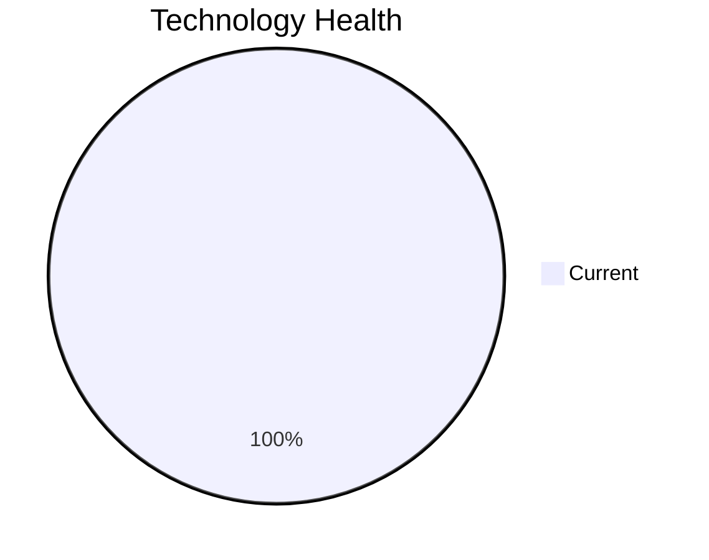

<!-- generated by AI in Github cloud -->
# NotificationApp-028 (app028)

## Application Overview

| Attribute | Value |
|-----------|-------|
| **App ID** | app028 |
| **Name** | NotificationApp-028 |
| **Status** | Production |
| **Criticality** | Medium |
| **Solution Type** | 3rd party software |
| **Deployment** | AWS |
| **Containerized** | Yes |
| **Architecture** | unknown |
| **Business Unit** | IT |
| **External Interfaces** | 25 |
| **Servers** | 2 |
| **Environments** | 3 |

## Technology Stack

| Component | Type | Version | Status | EOL Date |
|-----------|------|---------|--------|----------|
| Windows | os | Server 2019 | 🟢 CURRENT | 2029-01-09 |
| Java 17 | programming_language | 17 | 🟢 CURRENT | 2029-09-30 |
| Microsoft IIS 10.0 | application_server | 10.0 | 🟢 CURRENT | N/A |
| Oracle 19c | database | 19c | 🟢 CURRENT | 2027-04-30 |

## Complexity Assessment

**Score: 5/10 (MEDIUM)**

Technology age score 2 (0 EOL, 0 outdated components). Integration score 9 (25 external interfaces). Infrastructure score 6 (2 servers, 3 environments). Criticality score 5 (Medium). Architecture score 3. Data score 8. Weighted final: 5.2 → 5 (MEDIUM).

| Factor | Value |
|--------|-------|
| Number Of Servers | 2 |
| Number Of Databases | 1 |
| Number Of Environments | 3 |
| Number Of Interfaces | 25 |
| Business Criticality | Medium |
| Number Of Outdated Technologies | 0 |
| Number Of Eol Technologies | 0 |
| Number Of Dependencies | 0 |
| Ci Cd Present | Yes |
| Containerized | Yes |

## Applicable Modernization Scenarios

_No applicable scenarios._

## Other Scenarios

| Scenario | Status | Reason |
|----------|--------|--------|
| os_update_security_patch | FULFILLED | OS 'Windows Server 2019' is current and receiving security patches. |
| switch_to_standard_linux_os | NOT_APPLICABLE | OS 'Windows Server 2019' is Windows; switching to Linux is not applicable. |
| switch_to_arm_cpu | LACK_OF_DATA | No explicit CPU architecture data (x86 vs ARM) is available in the application m... |
| application_server_replacement | BLOCKED | Application is 3rd party software; app server replacement depends on vendor. |
| app_deployment_to_cloud | FULFILLED | Application is already deployed to cloud (AWS). |
| app_containerization | FULFILLED | Application is already containerized. |
| app_refactor_decoupling | NOT_APPLICABLE | 3rd party application; refactoring is not applicable. |
| upgrade_legacy_databases | FULFILLED | Database 'Oracle 19c' is current. |
| switch_db_engine_open_source | NOT_APPLICABLE | 3rd party application; database engine change depends on vendor. |
| update_outdated_components | FULFILLED | All components are current. |

## Financial Summary

_No financial data available for applicable scenarios._
