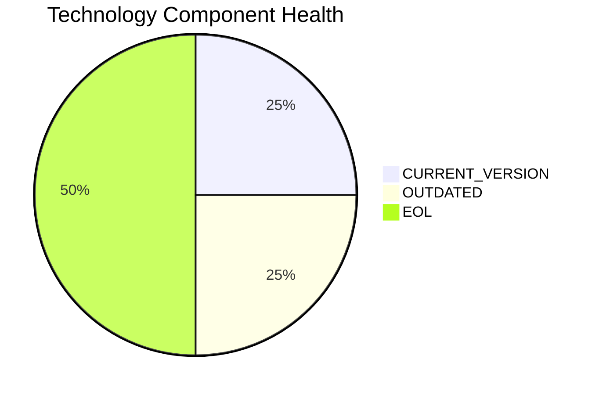

# APIGatewayApp-030 — Application Modernization Report

> **Application ID:** app030  
> **Business Unit:** IT  
> **Criticality:** High

## Application Overview

| Attribute | Value |
|-----------|-------|
| Application ID | app030 |
| Name | APIGatewayApp-030 |
| Business Unit | IT |
| Criticality | High |
| Status | Production |
| Deployment Type | AWS |
| Architecture | 3-Tier |
| Containerized | Yes |
| CI/CD | Yes |
| Users | 1,800 |
| Environments | 4 |
| External Interfaces | 30 |
| Servers | sv44, sv45 |
| DB Storage (GB) | 80 |
| DB License Required | No |

## Technology Stack Assessment

| Component | Name | Status |
|-----------|------|--------|
| Operating System | RHEL 8 | 🟢 CURRENT_VERSION |
| Database | MySQL 5.7 | 🔴 EOL |
| Programming Language | Go 1.19 | 🟡 OUTDATED |
| Application Server | Glassfish 3.0 | 🔴 EOL |

### Technology Health Distribution

## Complexity Assessment

**Overall Complexity:** 🔴 **HIGH** (Score: 7/10)

| Factor | Score | Weight |
|--------|-------|--------|
| Technology Age | 8 | 25% |
| Integration Complexity | 9 | 20% |
| Infrastructure | 7 | 15% |
| Business Criticality | 7 | 15% |
| Architecture | 3 | 15% |
| Data Complexity | 8 | 10% |

## Modernization Scenarios

### Applicable Scenarios

| Scenario | Reasoning |
|----------|-----------|
| Switch to ARM CPU | Cloud deployment can leverage ARM-based instances (e.g., AWS Graviton) for cost savings. |
| App Server Replacement | Application server Glassfish 3.0 is EOL and must be replaced. |
| Upgrade Legacy DB | Database MySQL 5.7 is EOL and must be upgraded. |
| Update Outdated Components | Outdated/EOL components detected: MySQL 5.7, Go 1.19, Glassfish 3.0. Updates required. |
| Switch to Managed DB | Database could be migrated to a fully managed cloud database service for reduced operational overhead. |
| Managed ARM DB | Database can be evaluated for ARM-based managed service deployment. |
| Serverless DB Migration | Database can be migrated to a serverless database solution to reduce operational overhead. |
| Switch to PostgreSQL | Migrating from MySQL 5.7 to PostgreSQL would provide a more feature-rich open-source database. |

### All Scenario Statuses

| Scenario | Status |
|----------|--------|
| OS Security Patch | 🔵 FULFILLED |
| Switch to Standard Linux | 🔵 FULFILLED |
| Switch to ARM CPU | ✅ APPLICABLE |
| App Server Replacement | ✅ APPLICABLE |
| Cloud Deployment | 🔵 FULFILLED |
| Containerization | 🔵 FULFILLED |
| Refactor & Decouple | 🔵 FULFILLED |
| Upgrade Legacy DB | ✅ APPLICABLE |
| Switch to OSS DB | 🔵 FULFILLED |
| Update Outdated Components | ✅ APPLICABLE |
| Switch to Managed DB | ✅ APPLICABLE |
| Managed ARM DB | ✅ APPLICABLE |
| Serverless DB Migration | ✅ APPLICABLE |
| Switch to PostgreSQL | ✅ APPLICABLE |

## Financial Summary

| Metric | Value |
|--------|-------|
| Total Estimated Implementation Cost | $86,450.65 |
| Total Estimated Annual Savings | $65,600.00 |
| Estimated ROI Payback Period | 1.3 years |

### Cost/Savings Breakdown by Scenario

| Scenario | Est. Cost | Est. Annual Savings | ROI (years) |
|----------|-----------|---------------------|-------------|
| Switch to ARM CPU | $6,650.05 | $1,000.00 | 6.65 |
| App Server Replacement | $13,300.10 | $9,600.00 | 1.39 |
| Upgrade Legacy DB | $13,300.10 | $10,000.00 | 1.33 |
| Update Outdated Components | N/A | N/A | N/A |
| Switch to Managed DB | $6,650.05 | $10,000.00 | 0.67 |
| Managed ARM DB | $6,650.05 | $5,000.00 | 1.33 |
| Serverless DB Migration | $6,650.05 | $15,000.00 | 0.44 |
| Switch to PostgreSQL | $33,250.25 | $15,000.00 | 2.22 |
