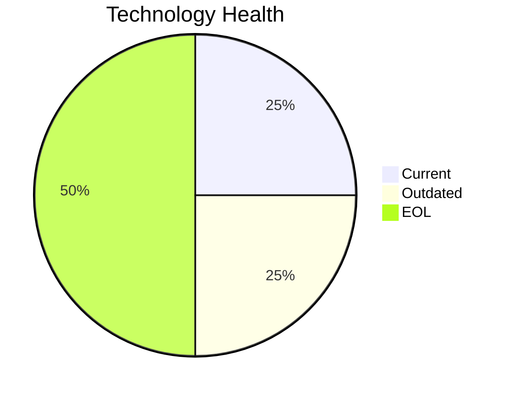

<!-- generated by AI in Github cloud -->
# APIGatewayApp-030 (app030)

## Application Overview

| Attribute | Value |
|-----------|-------|
| **App ID** | app030 |
| **Name** | APIGatewayApp-030 |
| **Status** | Production |
| **Criticality** | High |
| **Solution Type** | Open Source |
| **Deployment** | AWS |
| **Containerized** | Yes |
| **Architecture** | 3-Tier |
| **Business Unit** | IT |
| **External Interfaces** | 30 |
| **Servers** | 2 |
| **Environments** | 4 |

## Technology Stack

| Component | Type | Version | Status | EOL Date |
|-----------|------|---------|--------|----------|
| RHEL | os | 8 | 🟢 CURRENT | 2029-05-31 |
| Go 1.19 | programming_language | 1.19 | 🟡 OUTDATED | N/A |
| Glassfish 3.0 | application_server | 3.0 | 🔴 EOL | 2013-12-31 |
| MySQL 5.7 | database | 5.7 | 🔴 EOL | 2023-10-31 |

## Complexity Assessment

**Score: 7/10 (HIGH)**

Technology age score 8 (2 EOL, 1 outdated components). Integration score 9 (30 external interfaces). Infrastructure score 8 (2 servers, 4 environments). Criticality score 7 (High). Architecture score 3. Data score 4. Weighted final: 6.9 → 7 (HIGH).

| Factor | Value |
|--------|-------|
| Number Of Servers | 2 |
| Number Of Databases | 1 |
| Number Of Environments | 4 |
| Number Of Interfaces | 30 |
| Business Criticality | High |
| Number Of Outdated Technologies | 1 |
| Number Of Eol Technologies | 2 |
| Number Of Dependencies | 0 |
| Ci Cd Present | Yes |
| Containerized | Yes |

## Applicable Modernization Scenarios

### Application Server Replacement
- **Status**: APPLICABLE
- **Reason**: Application server 'Glassfish 3.0' is EOL and must be replaced.
- **Confidence**: 8/10

### App Refactor Decoupling
- **Status**: APPLICABLE
- **Reason**: Application may benefit from refactoring and de-coupling.
- **Confidence**: 8/10

### Upgrade Legacy Databases
- **Status**: APPLICABLE
- **Reason**: Database 'MySQL 5.7' is EOL; upgrade is required.
- **Confidence**: 8/10

### Update Outdated Components
- **Status**: APPLICABLE
- **Reason**: Outdated/EOL components found: Go 1.19, Glassfish 3.0, MySQL 5.7. Updates required.
- **Confidence**: 8/10

## Other Scenarios

| Scenario | Status | Reason |
|----------|--------|--------|
| os_update_security_patch | FULFILLED | OS 'RHEL 8' is current and receiving security patches. |
| switch_to_standard_linux_os | FULFILLED | OS 'RHEL 8' is already a standard Linux distribution. |
| switch_to_arm_cpu | LACK_OF_DATA | No explicit CPU architecture data (x86 vs ARM) is available in the application m... |
| app_deployment_to_cloud | FULFILLED | Application is already deployed to cloud (AWS). |
| app_containerization | FULFILLED | Application is already containerized. |
| switch_db_engine_open_source | FULFILLED | Database 'MySQL 5.7' is already open-source or managed open-source. |

## Financial Summary

| Scenario | Cost (USD) | Annual Savings (USD) | ROI 3yr % | Payback (yrs) |
|----------|-----------|---------------------|-----------|---------------|
| application_server_replacement | $13,300 | $9,600 | 116.5% | 1.4 |
| app_refactor_decoupling | $332,502 | $120,000 | 8.3% | 2.8 |
| upgrade_legacy_databases | $13,300 | $10,000 | 125.6% | 1.3 |
| **TOTAL** | **$359,103** | **$139,600** | | |
