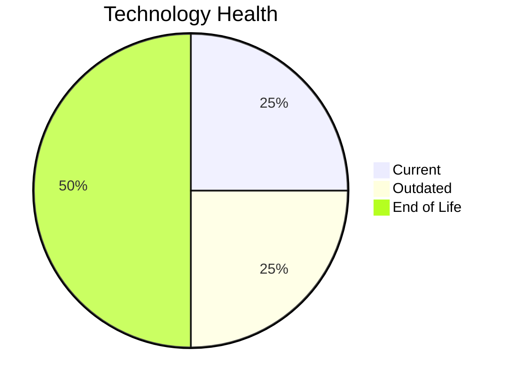

# Application Report: APIGatewayApp-030

**ID:** app030  
**Generated:** 2026-05-13

## Overview

| Attribute | Value |
|-----------|-------|
| Business Unit | IT |
| Solution Type | Open Source |
| Deployment Type | AWS |
| Business Criticality | High |
| Users | 1800 |
| Servers | sv44, sv45 |
| Environments | 4 |
| External Interfaces | 30 |
| Containerized | Yes |
| CI/CD Present | Yes |
| Architecture | 3-Tier |
| Data Classification | Internal |

## Technology Stack

| Component | Technology | Version | Status |
|-----------|-----------|---------|--------|
| Operating System | RHEL 8 | RHEL 8 | 🟢 Current |
| Database | MySQL 5.7 | MySQL 5.7 | 🔴 EOL |
| Programming Language | Go 1.19 | Go 1.19 | 🟡 Outdated |
| Application Server | GlassFish 3.x | GlassFish 3.x | 🔴 EOL |

## Complexity Assessment

**Score:** 7/10 — **HIGH**  
**Confidence:** 8/10

> Technology age score 9/10: Multiple EOL components detected. Integration score 9/10: 30 external interfaces. Infrastructure score 4/10: 2 server(s), 4 environment(s). Business criticality score 7/10: High criticality application. Architecture score 3/10: 3-Tier architecture, containerized, CI/CD present. Data score 6/10: EOL database components present.

| Factor | Value |
|--------|-------|
| Servers | 2 |
| Environments | 4 |
| External Interfaces | 30 |
| EOL Technologies | 2 |
| Outdated Technologies | 1 |
| Business Criticality | High |
| CI/CD Present | Yes |
| Containerized | Yes |

## Modernization Scenarios

### ✅ Applicable Scenarios

#### Switch to ARM-based CPU

- **Priority:** Medium
- **Effort:** Medium
- **Effects:** cost, sustainability
- **One-Time Cost:** €6,650
- **Annual Savings:** €800/year
- **Reasoning:** Application is containerized and runs on standard OS, making ARM migration feasible.

#### Application Server Replacement

- **Priority:** Medium
- **Effort:** Medium
- **Effects:** agility, cost
- **One-Time Cost:** €13,300
- **Annual Savings:** €9,600/year
- **Reasoning:** Application server (Glassfish 3.0) is EOL and requires replacement.

#### Upgrade Legacy Databases

- **Priority:** High
- **Effort:** Medium
- **Effects:** security, agility
- **One-Time Cost:** €13,300
- **Annual Savings:** €10,000/year
- **Reasoning:** Database (MySQL 5.7) is EOL and requires urgent upgrade.

#### Update Outdated Components

- **Priority:** High
- **Effort:** High
- **Effects:** security, agility, cost
- **Cost:** No financial data available
- **Reasoning:** Outdated or EOL components detected: MySQL 5.7, GlassFish 3.x, Go 1.19. Updates required to maintain security and supportability.

### Other Scenarios

| Scenario | Status | Reason |
|----------|--------|--------|
| Operating System Update | ✔️ Fulfilled | OS (RHEL 8) is on a current supported version. |
| Switch to Standard Linux OS | ✔️ Fulfilled | Application already runs on standard Linux OS (RHEL 8). |
| Application Migration to Cloud (Lift & Shift) | ✔️ Fulfilled | Application is already hosted on cloud infrastructure (AWS). |
| Application Containerization | ✔️ Fulfilled | Application is already containerized. |
| Application Refactoring and De-coupling | 🔶 Partial | Application architecture (3-Tier) suggests some coupling. Partial refactoring may benefit the applic... |
| Switch DB Engine to Open-Source | ✔️ Fulfilled | Database (MySQL 5.7) is already an open-source database engine. |
| Switch to Managed Database Service | ❌ N/A | Database is already cloud-hosted or scenario not applicable. |
| Managed ARM Database | ❌ N/A | Database is not on a managed cloud service; ARM database migration not applicable. |
| Serverless Database Migration | ❌ N/A | Application deployment pattern does not support serverless database migration at this time. |
| Switch DB Engine to PostgreSQL | ❌ N/A | Database (MySQL 5.7) is already open-source/managed; PostgreSQL migration not prioritized. |

## Financial Summary

| Metric | Value |
|--------|-------|
| Total One-Time Investment | €33,250 |
| Total Annual Savings | €20,400 |
| Break-Even | 1.6 years |
