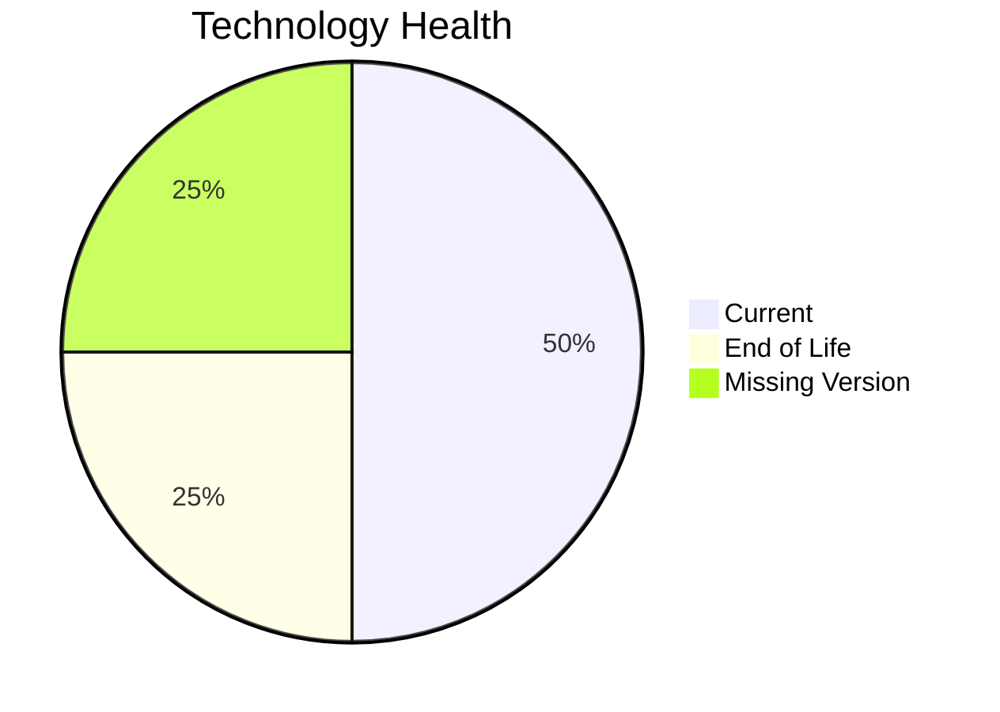

# Application Report: APIGatewayApp-030

**ID:** app030  
**Generated:** 2026-05-11

## Overview

| Attribute | Value |
|-----------|-------|
| Business Unit | IT |
| Solution Type | Open Source |
| Deployment Type | AWS |
| Business Criticality | High |
| Users | 1800 |
| Servers | 2 |
| Architecture | 3-Tier |
| Containerized | Yes |
| CI/CD | Yes |
| Data Classification | Internal |

## Technology Stack

| Component | Technology | Status |
|-----------|-----------|--------|
| Os | RHEL 8 | 🟢 CURRENT_VERSION |
| Database | MySQL 5.7 | 🔴 EOL |
| Language | Go 1.19 | 🟢 CURRENT_VERSION |
| Application Server | Glassfish 3.0 | ⚪ NO_KNOWLEDGE |

## Complexity Assessment

**Score:** 7/10 — **HIGH**  
**Confidence:** 7

> Score 7/10 (HIGH): 1 EOL component(s), 0 outdated, 30 external interfaces, 2 server(s), criticality=High, architecture=3-Tier.

| Factor | Value |
|--------|-------|
| Servers | 2 |
| Interfaces | 30 |
| Environments | 4 |
| EOL Technologies | 1 |
| Outdated Technologies | 0 |
| CI/CD Present | Yes |
| Containerized | Yes |

## Modernization Scenarios

### Applicable Scenarios

#### ✅ Switch to ARM-based CPU

- **Priority:** Medium
- **Effort:** Medium
- **Effects:** cost, sustainability
- **Cost:** €6,650 (one-time)
- **Annual Savings:** €1,000/year
- **Reasoning:** Application runs on cloud and could benefit from ARM-based instances (e.g., AWS Graviton).

#### ✅ Upgrade Legacy Databases

- **Priority:** High
- **Effort:** Medium
- **Effects:** security, agility
- **Cost:** €13,300 (one-time)
- **Annual Savings:** €10,000/year
- **Reasoning:** Database (MySQL 5.7) is EOL and requires upgrade.

#### ✅ Update outdated components

- **Priority:** High
- **Effort:** High
- **Effects:** security, agility, cost
- **Reasoning:** EOL components found: MySQL 5.7. Update required.

### Other Scenarios

| Scenario | Status | Reason |
|----------|--------|--------|
| Operating System Update | ✔️ FULFILLED | Operating system is on a current, supported version. |
| Switch to standard Linux Operating System | ✔️ FULFILLED | Application already runs on standard Linux (RHEL 8). |
| Applications Server replacement | ✔️ FULFILLED | Application server appears to be on a supported version. |
| Application Migration to Cloud Infrastructure (Lift & Shift) | ✔️ FULFILLED | Application is already deployed on cloud (AWS). |
| Application Containerization | ✔️ FULFILLED | Application is already containerized. |
| Application Refactoring and De-coupling | 🔶 PARTIALLY_FULFILLED | 3-Tier architecture provides some decoupling; further microservice decomposition may be beneficial. |
| Switch DB Engine to open-source database solution | ✔️ FULFILLED | Database (MySQL 5.7) is already an open-source solution. |

## Financial Summary

| Metric | Value |
|--------|-------|
| Total One-Time Cost | €19,950 |
| Total Yearly Savings | €11,000 |
| Break-Even | 1.8 years |
