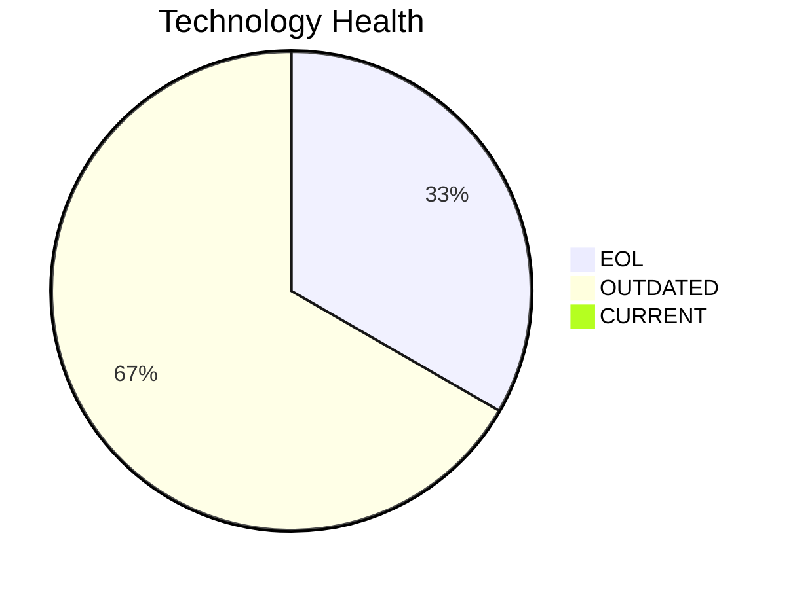
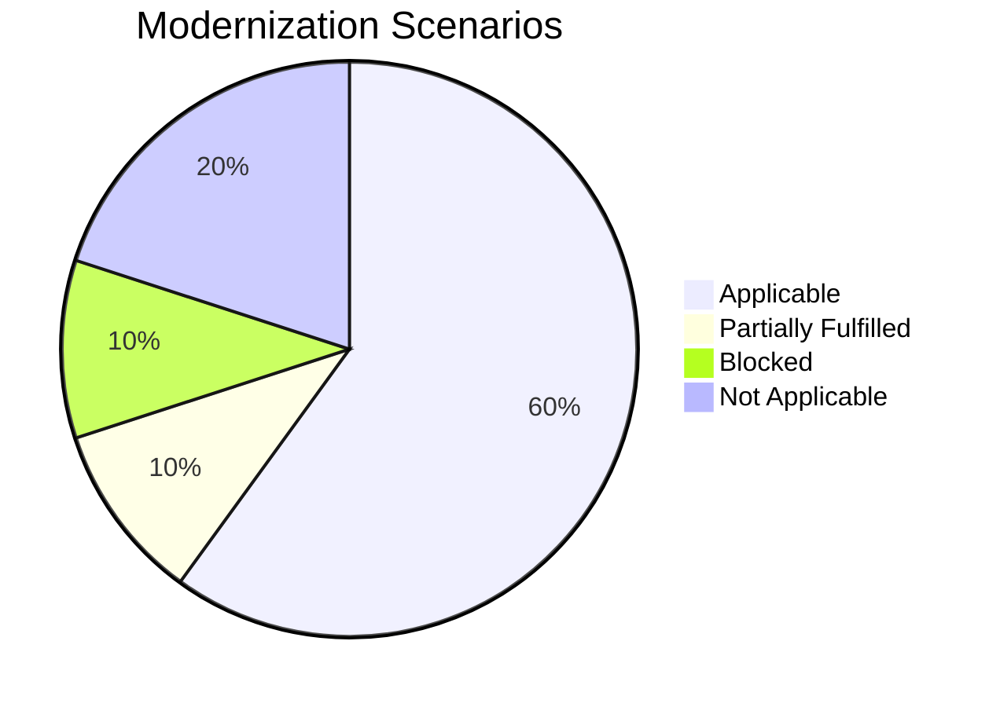
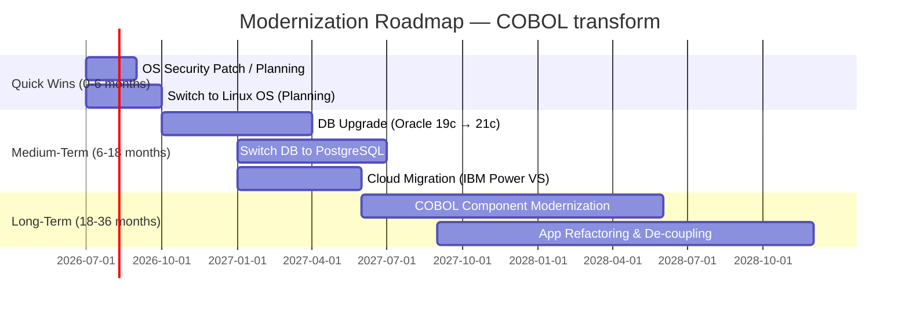

# Application Report - COBOL transform

**Application ID:** scenarioa-test-transform  
**Business Unit:** Finance  
**Criticality:** High  
**Status:** Production  
**Analysis Date:** 2026-06-25

This application is a core ERP system handling financial transactions, general ledger, and regulatory reporting. It is a custom-made COBOL application deployed on IBM AIX with Oracle Database — representing a classic legacy mainframe-class workload that carries significant modernization opportunity and risk.

## Application Overview

| Attribute | Value |
|-----------|-------|
| Solution Type | Custom made |
| Deployment Type | On-Premise |
| Architecture | 1-Tier (Monolith) |
| Containerized | No |
| CI/CD Pipeline | No |
| Users | 350 |
| Environments | 2 |
| Servers | sv01, sv02 |
| CPU Cores | 4 |
| Memory | 16 GB |
| API Endpoints | 0 |
| External Interfaces | 5 |
| Data Classification | Confidential |
| Decommission Date | 2027 |

## Technology Assessment

| Component | Type | Version | Status | EOL Date | Notes |
|-----------|------|---------|--------|----------|-------|
| IBM AIX | Operating System | 7.2 | 🔴 EOL | 2023-04-30 | Standard support ended April 2023; proprietary UNIX, no container support |
| COBOL | Programming Language | 2014 | 🟡 OUTDATED | — | Legacy language standard; scarce developer talent; superseded by COBOL 2023 |
| Oracle Database | Database | 19c | 🟡 OUTDATED | 2027-01-31 | In Extended Support (Premier ended Jan 2024); commercial license at extra cost |

## Complexity Assessment

**Complexity Score: 7 / 10 (High)**  
**Cost Multiplier: 1.4×**

| Factor | Impact |
|--------|--------|
| Legacy COBOL language | High — scarce talent, limited tooling |
| IBM AIX proprietary OS | High — no cloud/container support |
| 1-Tier monolithic architecture | High — tight coupling, hard to decompose |
| Oracle 1TB database + license | Medium — data migration risk, license cost |
| No CI/CD pipeline | Medium — deployment automation needed |
| High criticality / Finance | Medium — testing, compliance overhead |

## Scenario Applicability

| Scenario | Status | Priority | Effort |
|----------|--------|----------|--------|
| Operating System Update | ✅ APPLICABLE | High | Low |
| Switch to Standard Linux OS | ✅ APPLICABLE | Medium | Medium |
| Switch to ARM CPU | ⚪ NOT_APPLICABLE | Medium | Medium |
| Application Server Replacement | ⚪ NOT_APPLICABLE | Medium | Medium |
| Cloud Migration (Lift & Shift) | 🔶 PARTIALLY_FULFILLED | High | Low |
| Application Containerization | 🚫 BLOCKED | High | High |
| Application Refactoring & De-coupling | ✅ APPLICABLE | High | High |
| Upgrade Legacy Databases | ✅ APPLICABLE | High | Medium |
| Switch DB to Open-Source | ✅ APPLICABLE | High | Medium |
| Update Outdated Components | ✅ APPLICABLE | High | High |

### Key Scenario Details

**Operating System Update** — AIX 7.2 standard support has ended (April 2023). The OS must be upgraded or replaced to maintain security patching and compliance.

**Switch to Standard Linux OS** — IBM AIX is a proprietary system that increases operational cost and limits cloud portability. Migration to RHEL or Ubuntu LTS would align with enterprise standards.

**Cloud Migration (Lift & Shift)** — Partially applicable. Mainstream cloud providers (AWS/Azure/GCP) do not offer AIX. IBM Power Virtual Server (IBM Cloud) provides an AIX-compatible lift-and-shift path.

**Application Containerization** — Blocked. AIX does not support standard OCI containers. Full OS migration and application modernization must precede containerization.

**Application Refactoring & De-coupling** — The 1-Tier COBOL monolith is the primary candidate for architecture decomposition. Breaking it into services would enable independent scalability and technology modernization.

**Upgrade Legacy Databases** — Oracle 19c enters Extended Support through 2027. Upgrading to a current Oracle LTS version removes extended support fees.

**Switch DB to Open-Source** — Migrating from Oracle (licensed) to PostgreSQL would eliminate substantial annual license costs for a 1TB database.

**Update Outdated Components** — COBOL-2014 represents a significant talent and maintenance risk. A COBOL modernization or rewrite in Java/Go is recommended.

## Business Case (3-Year Horizon)

| Scenario | Migration Cost | Annual Savings | 3-Yr Net |
|----------|---------------|----------------|----------|
| OS Update | $1,400 | $500 | $100 |
| Switch to Linux OS | $420 | $400 | $780 |
| Cloud Migration | $7,000 | $3,000 | $2,000 |
| App Refactoring | $350,000 | $150,000 | $100,000 |
| DB Upgrade | $14,000 | $10,000 | $16,000 |
| Switch to Open-Source DB | $35,000 | $15,000 | $10,000 |
| **Total** | **$407,820** | **$178,900/yr** | **$128,880** |

> Costs adjusted with complexity multiplier 1.4×. "Update Outdated Components" excluded from business case — requires bespoke COBOL modernization scoping.

## Modernization Roadmap

### Recommended Priority Order

1. **Immediate:** OS security patch plan and evaluation of AIX extended support contract
2. **Short-term:** Linux OS migration (RHEL) to remove AIX dependency
3. **Medium-term:** Oracle DB upgrade and/or PostgreSQL migration to reduce license cost
4. **Medium-term:** Cloud migration to IBM Power Virtual Server
5. **Long-term:** COBOL modernization and application refactoring

