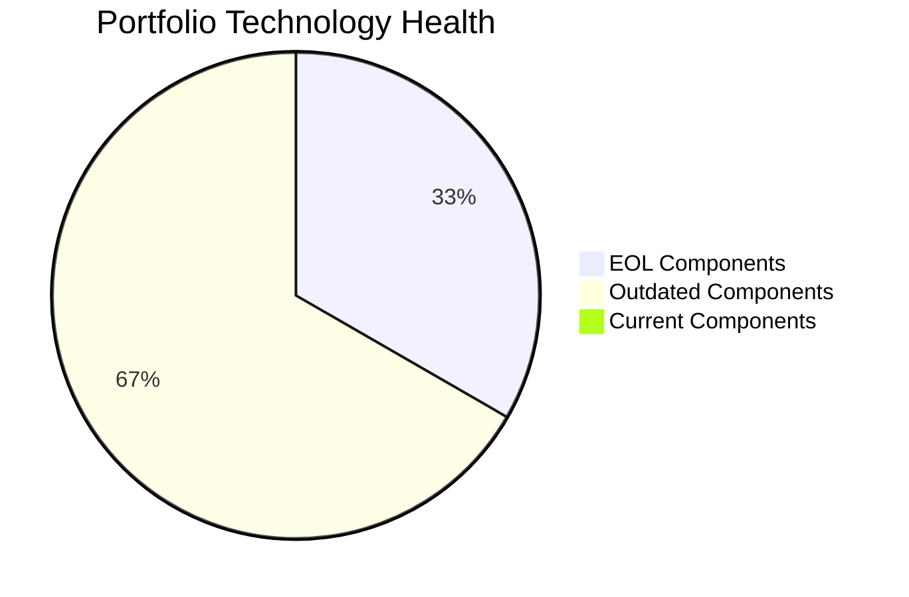
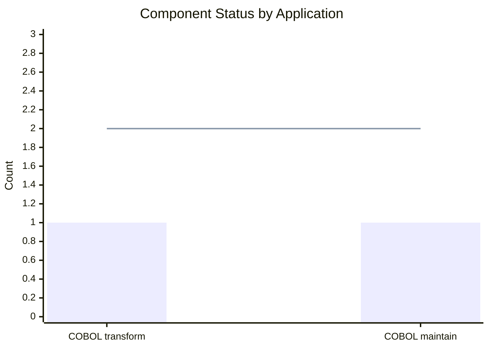
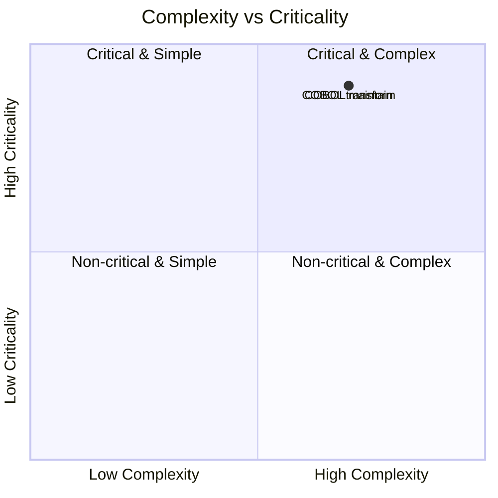
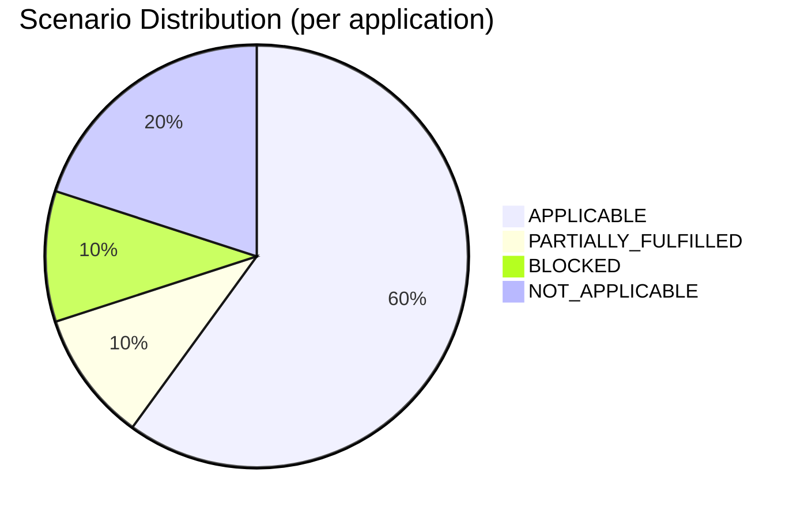
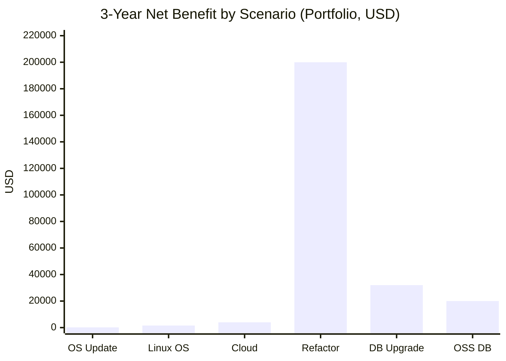
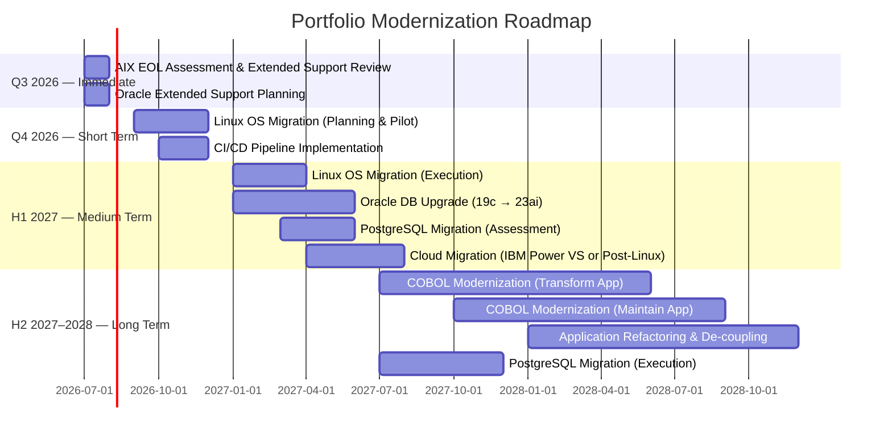

# Portfolio Modernization Report

**Customer:** Finance Division  
**Analysis Date:** 2026-06-25  
**Total Applications Assessed:** 2  
**In-Scope Applications:** 2  
**Generated by:** GenDiscover — Agentic AI powered by Capgemini GenSuite

---

## Executive Summary

This report presents the modernization assessment of a 2-application portfolio in the Finance business unit. Both applications are legacy COBOL systems running on IBM AIX 7.2 with Oracle Database 19c — representing a classic **high-risk legacy stack** with EOL operating system, outdated language, and expensive proprietary database licensing.

**Key findings:**
- **100%** of applications have at least one EOL technology component
- **100%** of applications have outdated components requiring action
- **Average complexity score:** 7 / 10 (High)
- **6 modernization scenarios** are applicable across both applications
- **Estimated 3-year net benefit:** $257,760 across the portfolio
- **Estimated total migration investment:** $815,640 (adjusted for complexity)

## Portfolio Overview

| Application | Criticality | Status | OS | Language | Database | Complexity |
|-------------|-------------|--------|-----|----------|----------|------------|
| COBOL transform | High | Production | AIX 7.2 🔴 | COBOL-2014 🟡 | Oracle 19c 🟡 | 7/10 |
| COBOL maintain | High | Production | AIX 7.2 🔴 | COBOL-2014 🟡 | Oracle 19c 🟡 | 7/10 |

## Technology Health Summary

| Component | Status | Affected Applications |
|-----------|--------|-----------------------|
| IBM AIX 7.2 | 🔴 EOL | COBOL transform, COBOL maintain |
| COBOL-2014 | 🟡 OUTDATED | COBOL transform, COBOL maintain |
| Oracle 19c | 🟡 OUTDATED | COBOL transform, COBOL maintain |

### Technology Risk Summary

- **IBM AIX 7.2** — Standard support ended April 30, 2023. Both applications are running on an unsupported proprietary operating system. This is the highest-urgency risk in the portfolio.
- **COBOL-2014** — Legacy language with minimal developer talent pipeline. Every year without modernization increases succession risk and maintenance cost.
- **Oracle 19c** — In Oracle Extended Support through January 2027. Extended support carries additional license fees; Premier Support ended January 2024.

## Complexity Assessment

Both applications score **7/10 complexity** — placing them in the **Critical & Complex** quadrant. Key drivers:
- Legacy COBOL with no modern tooling
- Proprietary AIX OS with no container/cloud path
- 1-Tier monolithic architecture
- 1 TB Oracle database with paid license
- No CI/CD, no logging, no monitoring

## Scenario Analysis Summary

| Scenario | Status | Priority | Effort | Both Apps |
|----------|--------|----------|--------|-----------|
| Operating System Update | ✅ APPLICABLE | High | Low | ✓ |
| Switch to Standard Linux OS | ✅ APPLICABLE | Medium | Medium | ✓ |
| Switch to ARM CPU | ⚪ NOT_APPLICABLE | — | — | ✓ |
| Application Server Replacement | ⚪ NOT_APPLICABLE | — | — | ✓ |
| Cloud Migration (Lift & Shift) | 🔶 PARTIALLY_FULFILLED | High | Low | ✓ |
| Application Containerization | 🚫 BLOCKED | High | High | ✓ |
| Application Refactoring & De-coupling | ✅ APPLICABLE | High | High | ✓ |
| Upgrade Legacy Databases | ✅ APPLICABLE | High | Medium | ✓ |
| Switch DB to Open-Source | ✅ APPLICABLE | High | Medium | ✓ |
| Update Outdated Components | ✅ APPLICABLE | High | High | ✓ |

## Business Case Summary

| Scenario | Total Migration Cost | Annual Savings | 3-Yr Net Benefit |
|----------|---------------------|----------------|-----------------|
| OS Update (×2 apps) | $2,800 | $1,000/yr | $200 |
| Switch to Linux OS (×2) | $840 | $800/yr | $1,560 |
| Cloud Migration (×2) | $14,000 | $6,000/yr | $4,000 |
| App Refactoring (×2) | $700,000 | $300,000/yr | $200,000 |
| DB Upgrade (×2) | $28,000 | $20,000/yr | $32,000 |
| Switch to Open-Source DB (×2) | $70,000 | $30,000/yr | $20,000 |
| **Portfolio Total** | **$815,640** | **$357,800/yr** | **$257,760** |

> All costs include a **1.4× complexity multiplier** applied to the base finance model values.  
> "Update Outdated Components" (COBOL modernization) excluded — requires bespoke scoping.

### Portfolio ROI

- **Total 3-year investment:** $815,640
- **Total 3-year savings:** $1,073,400
- **Net 3-year benefit:** $257,760
- **Portfolio ROI (3 years):** ~31.6%
- **Biggest opportunity:** Application Refactoring & De-coupling ($200,000 net benefit over 3 years)

## Modernization Opportunities

### Priority 1 — Address EOL Operating System (Immediate)
Both applications run on IBM AIX 7.2, which reached end of standard support in April 2023. This is an active security risk. Recommended actions:
- Evaluate existing IBM extended support contract status
- Plan migration to RHEL or Ubuntu LTS on x86/cloud infrastructure
- This is a **prerequisite** for containerization and mainstream cloud migration

### Priority 2 — Database Modernization (Short to Medium Term)
Oracle 19c with 1TB of data and required licensing presents both a cost and risk concern:
- Upgrade to Oracle 21c or 23ai to remain on a supported version
- Or migrate to PostgreSQL to eliminate Oracle license costs (~$10,000/year savings per app)
- **Note:** Database migration complexity is high with a 1TB Oracle schema; plan for thorough testing

### Priority 3 — COBOL Modernization & Refactoring (Long Term)
The core modernization opportunity is replacing COBOL-2014 with a modern language:
- Consider automated COBOL-to-Java/COBOL-to-.NET conversion tools
- Refactor from 1-Tier to microservices to enable cloud-native deployment
- Given 2027 decommission targets, fast-tracking this work is critical

### Priority 4 — Cloud Migration (Medium Term, Post-OS Fix)
After OS migration to Linux:
- Standard lift-and-shift to AWS/Azure/GCP becomes feasible
- Container-based deployment (Kubernetes) becomes available
- Operational savings of $3,000/year per application achievable

## Portfolio Roadmap

## Application Reports

- [COBOL transform — Full Report](apps/app_report_scenarioa-test-transform.md)
- [COBOL maintain — Full Report](apps/app_report_scenarioa-test-maintain.md)

---

*Generated by GenDiscover — Application modernization with Agentic AI powered by Capgemini GenSuite*  
*Analysis ID: DISC-2026-0625-001 | Timestamp: 2026-06-25T00:00:00Z*

