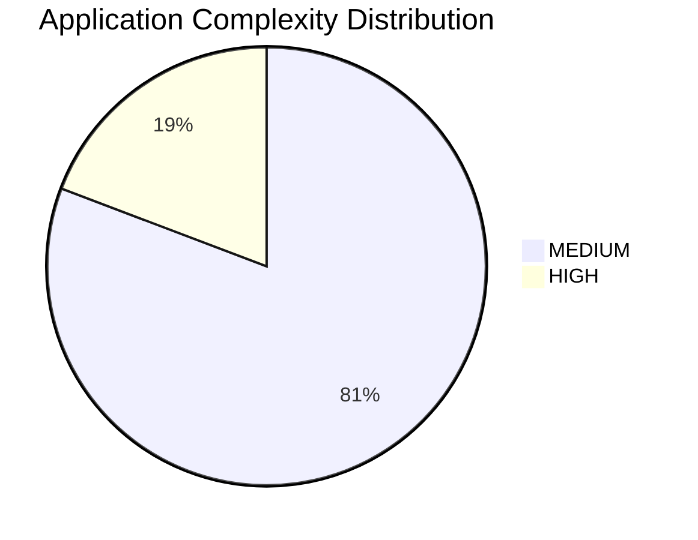
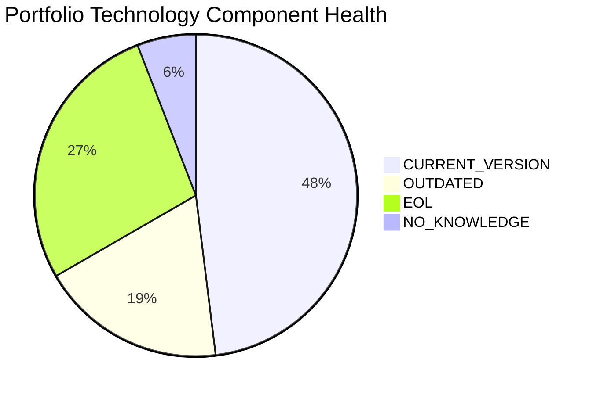
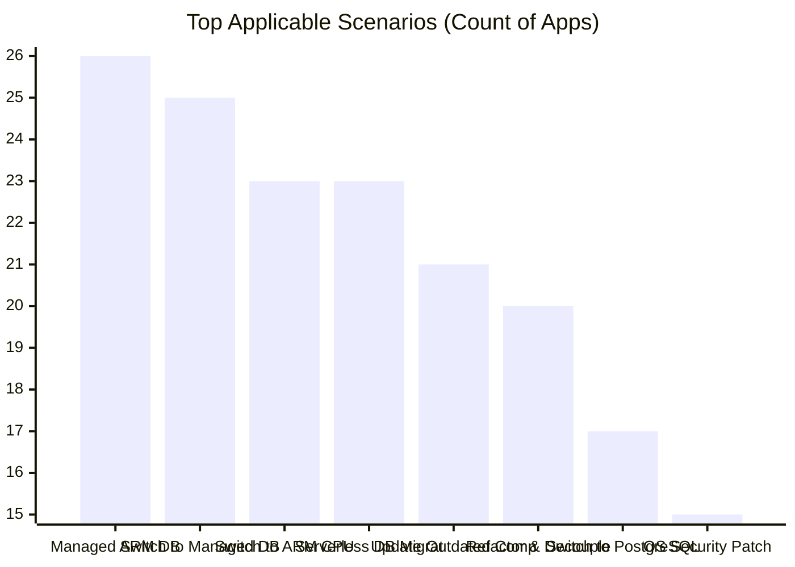

# Application Portfolio Modernization Report

> Comprehensive analysis of the application portfolio modernization opportunities.

## Executive Summary

This report covers a portfolio of **30 applications**, of which **26 are in-scope** for modernization analysis. 4 applications are retired and excluded from assessment.

| Portfolio Metric | Value |
|------------------|-------|
| Total Applications | 30 |
| In-Scope Applications | 26 |
| Retired / Out-of-Scope | 4 |
| Total Estimated Modernization Cost | $8,804,867.79 |
| Total Estimated Annual Savings | $5,201,700.00 |
| Portfolio ROI Payback | 1.7 years |

## Complexity Distribution

| Complexity Level | Count | Description |
|-----------------|-------|-------------|
| 🟢 LOW (1-3) | 0 | Minimal modernization effort required |
| 🟡 MEDIUM (4-6) | 21 | Moderate effort with clear modernization path |
| 🔴 HIGH (7-10) | 5 | Significant effort, legacy components |

## Portfolio Technology Health

Total technology components assessed: **102** across 26 applications.

| Status | Count | Percentage |
|--------|-------|-----------|
| 🟢 CURRENT_VERSION | 49 | 48.0% |
| 🟡 OUTDATED | 19 | 18.6% |
| 🔴 EOL | 28 | 27.5% |
| ⚪ NO_KNOWLEDGE | 6 | 5.9% |

## Top Modernization Scenarios

| Scenario | Applicable Apps | Description |
|----------|----------------|-------------|
| Managed ARM DB | 26 | — |
| Switch to Managed DB | 25 | — |
| Switch to ARM CPU | 23 | — |
| Serverless DB Migration | 23 | — |
| Update Outdated Components | 21 | — |
| Refactor & Decouple | 20 | — |
| Switch to PostgreSQL | 17 | — |
| OS Security Patch | 15 | — |
| Switch to Standard Linux | 13 | — |
| App Server Replacement | 13 | — |
| Containerization | 13 | — |
| Switch to OSS DB | 12 | — |
| Cloud Deployment | 8 | — |
| Upgrade Legacy DB | 8 | — |

## Scenario Applicability Matrix

| App ID | OS Security Patch | Switch to Standard | Switch to ARM CPU | App Server Replace | Cloud Deployment | Containerization | Refactor & Decoupl |
|--------|---|---|---|---|---|---|---|
| app001 | ✅ | ✅ | 🚫 | ⬜ | ✅ | 🚫 | ✅ |
| app002 | ✅ | ✅ | ✅ | ✅ | 🔵 | ✅ | ✅ |
| app003 | ✅ | ✅ | ✅ | ✅ | 🔵 | 🔵 | 🔵 |
| app004 | ✅ | ⬜ | ✅ | ✅ | 🔷 | 🔵 | ✅ |
| app006 | ✅ | ✅ | ✅ | ✅ | 🔵 | ✅ | ✅ |
| app008 | ✅ | ✅ | 🚫 | ✅ | ✅ | 🚫 | ✅ |
| app010 | 🔵 | ⬜ | ✅ | 🔵 | 🔵 | ✅ | ✅ |
| app011 | ✅ | ✅ | ✅ | ✅ | 🔵 | 🔵 | 🔵 |
| app012 | 🔵 | ⬜ | ✅ | 🔵 | 🔵 | 🔵 | ✅ |
| app013 | ✅ | ✅ | ✅ | ✅ | ✅ | ✅ | ✅ |
| app014 | 🔵 | ⬜ | ✅ | 🔵 | 🔵 | ✅ | ✅ |
| app015 | 🔵 | ⬜ | ✅ | 🔵 | 🔵 | ✅ | ✅ |
| app016 | ✅ | ✅ | ✅ | ✅ | 🔵 | 🔵 | 🔵 |
| app017 | ✅ | ✅ | ✅ | ✅ | ✅ | ✅ | ✅ |
| app018 | ✅ | ✅ | ✅ | ✅ | ✅ | ✅ | ✅ |
| app019 | 🔵 | 🔵 | ✅ | 🔵 | 🔷 | ✅ | ✅ |
| app020 | ✅ | ⬜ | ✅ | ✅ | 🔵 | ✅ | ✅ |
| app021 | 🔵 | ⬜ | ✅ | 🔵 | ✅ | ✅ | ✅ |
| app022 | ✅ | ✅ | ✅ | 🔵 | 🔷 | 🔵 | 🔵 |
| app023 | 🔵 | 🔵 | ✅ | 🔵 | 🔵 | 🔵 | 🔵 |
| app024 | 🔵 | ⬜ | ✅ | 🔵 | ✅ | ✅ | ✅ |
| app025 | 🔵 | ⬜ | ✅ | 🔵 | 🔵 | 🔵 | ✅ |
| app026 | ✅ | ✅ | 🚫 | ⬜ | ✅ | 🚫 | ✅ |
| app027 | ✅ | ✅ | ✅ | ✅ | 🔷 | ✅ | ✅ |
| app028 | 🔵 | ⬜ | ✅ | 🔵 | 🔵 | 🔵 | ✅ |
| app030 | 🔵 | 🔵 | ✅ | ✅ | 🔵 | 🔵 | 🔵 |

| App ID | Upgrade Legacy DB | Switch to OSS DB | Update Outdated Co | Switch to Managed  | Managed ARM DB | Serverless DB Migr | Switch to PostgreS |
|--------|---|---|---|---|---|---|---|
| app001 | 🔵 | ✅ | ✅ | ✅ | ✅ | 🚫 | ✅ |
| app002 | 🔵 | 🔵 | ✅ | 🔵 | ✅ | ✅ | ✅ |
| app003 | ✅ | 🔵 | ✅ | ✅ | ✅ | ✅ | 🔵 |
| app004 | 🔵 | ✅ | ✅ | ✅ | ✅ | ✅ | ✅ |
| app006 | ✅ | 🔵 | ✅ | ✅ | ✅ | ✅ | 🔵 |
| app008 | 🔵 | ✅ | ✅ | ✅ | ✅ | 🚫 | ✅ |
| app010 | 🔵 | 🔵 | ✅ | ✅ | ✅ | ✅ | ✅ |
| app011 | 🔵 | 🔵 | ✅ | ✅ | ✅ | ✅ | 🔵 |
| app012 | 🔵 | 🔵 | 🔵 | ✅ | ✅ | ✅ | 🔵 |
| app013 | 🔵 | ✅ | ✅ | ✅ | ✅ | ✅ | ✅ |
| app014 | 🔵 | 🔵 | ✅ | ✅ | ✅ | ✅ | ✅ |
| app015 | ❓ | 🔵 | 🔵 | ✅ | ✅ | ✅ | ⬜ |
| app016 | 🔵 | ✅ | ✅ | ✅ | ✅ | ✅ | ✅ |
| app017 | ✅ | ✅ | ✅ | ✅ | ✅ | ✅ | ✅ |
| app018 | ✅ | 🔵 | ✅ | ✅ | ✅ | ✅ | 🔵 |
| app019 | 🔵 | 🔵 | ✅ | ✅ | ✅ | ✅ | ✅ |
| app020 | ✅ | ✅ | ✅ | ✅ | ✅ | ✅ | ✅ |
| app021 | ✅ | ✅ | ✅ | ✅ | ✅ | ✅ | ✅ |
| app022 | 🔵 | 🔵 | ✅ | ✅ | ✅ | ✅ | 🔵 |
| app023 | ❓ | 🔵 | 🔵 | ✅ | ✅ | ✅ | ⬜ |
| app024 | ✅ | ✅ | ✅ | ✅ | ✅ | ✅ | ✅ |
| app025 | 🔵 | 🔵 | 🔵 | ✅ | ✅ | ✅ | 🔵 |
| app026 | ❓ | ✅ | ✅ | ✅ | ✅ | 🚫 | ✅ |
| app027 | 🔵 | ✅ | ✅ | ✅ | ✅ | ✅ | ✅ |
| app028 | 🔵 | ✅ | 🔵 | ✅ | ✅ | ✅ | ✅ |
| app030 | ✅ | 🔵 | ✅ | ✅ | ✅ | ✅ | ✅ |

**Legend:** ✅ APPLICABLE | 🔵 FULFILLED | ⬜ NOT_APPLICABLE | 🚫 BLOCKED | 🔷 PARTIALLY_FULFILLED | ❓ LACK_OF_DATA

## Portfolio Financial Summary

| Application | Name | Complexity | Est. Cost | Est. Annual Savings | ROI (yrs) |
|-------------|------|-----------|-----------|---------------------|-----------|
| app001 | ERPApp-001 | MEDIUM | $365,811 | $183,600 | 2.0 |
| app002 | CRMApp-002 | MEDIUM | $464,116 | $272,700 | 1.7 |
| app003 | AnalyticsApp-003 | MEDIUM | $41,535 | $52,700 | 0.8 |
| app004 | HRApp-004 | MEDIUM | $382,812 | $207,300 | 1.8 |
| app006 | SupportApp-006 | MEDIUM | $452,550 | $277,700 | 1.6 |
| app008 | InventoryApp-008 | MEDIUM | $377,376 | $194,400 | 1.9 |
| app010 | PayrollApp-010 | MEDIUM | $397,243 | $271,000 | 1.5 |
| app011 | RouteOptApp-011 | MEDIUM | $31,478 | $42,700 | 0.7 |
| app012 | IoTSensorApp-012 | MEDIUM | $236,116 | $166,000 | 1.4 |
| app013 | SecurityApp-013 | HIGH | $580,283 | $273,900 | 2.1 |
| app014 | DocumentApp-014 | MEDIUM | $397,243 | $271,000 | 1.5 |
| app015 | ReportingApp-015 | MEDIUM | $323,566 | $256,000 | 1.3 |
| app016 | MobileApp-016 | MEDIUM | $94,026 | $72,700 | 1.3 |
| app017 | BackupApp-017 | HIGH | $593,583 | $283,900 | 2.1 |
| app018 | VendorApp-018 | HIGH | $527,083 | $253,900 | 2.1 |
| app019 | QualityApp-019 | MEDIUM | $397,243 | $271,000 | 1.5 |
| app020 | TrainingApp-020 | MEDIUM | $510,030 | $307,300 | 1.7 |
| app021 | FleetApp-021 | MEDIUM | $503,091 | $298,700 | 1.7 |
| app022 | ComplianceApp-022 | MEDIUM | $24,634 | $31,900 | 0.8 |
| app023 | ChatbotApp-023 | MEDIUM | $17,490 | $31,000 | 0.6 |
| app024 | AuditApp-024 | HIGH | $578,554 | $273,400 | 2.1 |
| app025 | PortalApp-025 | MEDIUM | $236,116 | $166,000 | 1.4 |
| app026 | LegacyFinApp-026 | MEDIUM | $365,811 | $183,600 | 2.0 |
| app027 | DataWarehouseApp-027 | MEDIUM | $498,812 | $297,700 | 1.7 |
| app028 | NotificationApp-028 | MEDIUM | $321,817 | $196,000 | 1.6 |
| app030 | APIGatewayApp-030 | HIGH | $86,451 | $65,600 | 1.3 |

**Portfolio Total:** $8,804,867.79 implementation cost | $5,201,700.00 annual savings | 1.7 years payback

## Application Complexity Details

| App ID | Name | OS Status | DB Status | Lang Status | Score | Level |
|--------|------|-----------|-----------|-------------|-------|-------|
| app001 | ERPApp-001 | 🟡 | 🟢 | 🟡 | 6 | 🟡 MEDIUM |
| app002 | CRMApp-002 | 🔴 | 🟢 | 🟢 | 6 | 🟡 MEDIUM |
| app003 | AnalyticsApp-003 | 🔴 | 🟡 | 🟡 | 5 | 🟡 MEDIUM |
| app004 | HRApp-004 | 🔴 | 🟢 | 🟢 | 6 | 🟡 MEDIUM |
| app006 | SupportApp-006 | 🔴 | 🟡 | 🟢 | 6 | 🟡 MEDIUM |
| app008 | InventoryApp-008 | 🔴 | 🟢 | 🟡 | 6 | 🟡 MEDIUM |
| app010 | PayrollApp-010 | 🟢 | 🟢 | 🔴 | 5 | 🟡 MEDIUM |
| app011 | RouteOptApp-011 | 🔴 | 🟢 | 🟢 | 5 | 🟡 MEDIUM |
| app012 | IoTSensorApp-012 | 🟢 | 🟢 | 🟢 | 4 | 🟡 MEDIUM |
| app013 | SecurityApp-013 | 🔴 | 🟢 | 🟢 | 7 | 🔴 HIGH |
| app014 | DocumentApp-014 | 🟢 | 🟢 | 🟡 | 5 | 🟡 MEDIUM |
| app015 | ReportingApp-015 | 🟢 | ⚪ | 🟢 | 4 | 🟡 MEDIUM |
| app016 | MobileApp-016 | 🔴 | 🟢 | ⚪ | 6 | 🟡 MEDIUM |
| app017 | BackupApp-017 | 🔴 | 🔴 | 🟢 | 7 | 🔴 HIGH |
| app018 | VendorApp-018 | 🔴 | 🟡 | 🔴 | 7 | 🔴 HIGH |
| app019 | QualityApp-019 | 🟢 | 🟢 | 🔴 | 5 | 🟡 MEDIUM |
| app020 | TrainingApp-020 | 🔴 | 🟡 | 🟡 | 6 | 🟡 MEDIUM |
| app021 | FleetApp-021 | 🟢 | 🔴 | 🟢 | 6 | 🟡 MEDIUM |
| app022 | ComplianceApp-022 | 🔴 | 🟢 | 🟢 | 6 | 🟡 MEDIUM |
| app023 | ChatbotApp-023 | 🟢 | ⚪ | 🟢 | 4 | 🟡 MEDIUM |
| app024 | AuditApp-024 | 🟢 | 🔴 | 🟡 | 7 | 🔴 HIGH |
| app025 | PortalApp-025 | 🟢 | 🟢 | 🟢 | 4 | 🟡 MEDIUM |
| app026 | LegacyFinApp-026 | 🟡 | ⚪ | 🟡 | 6 | 🟡 MEDIUM |
| app027 | DataWarehouseApp-027 | 🔴 | 🟢 | 🟢 | 6 | 🟡 MEDIUM |
| app028 | NotificationApp-028 | 🟢 | 🟢 | 🟢 | 5 | 🟡 MEDIUM |
| app030 | APIGatewayApp-030 | 🟢 | 🔴 | 🟡 | 7 | 🔴 HIGH |
