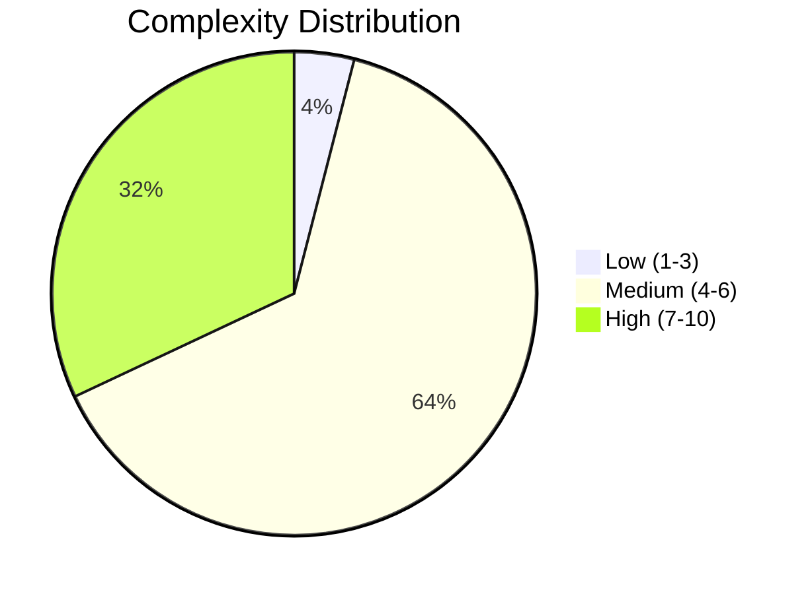
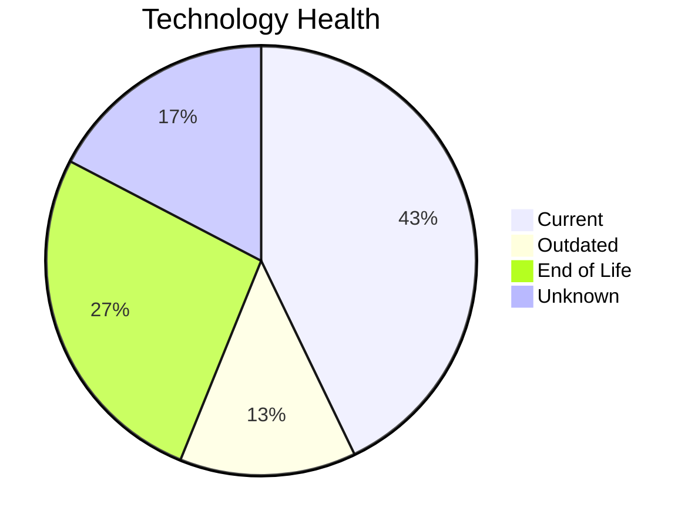
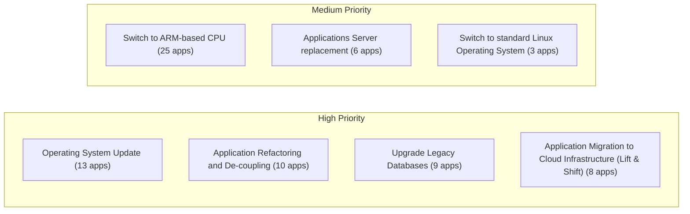
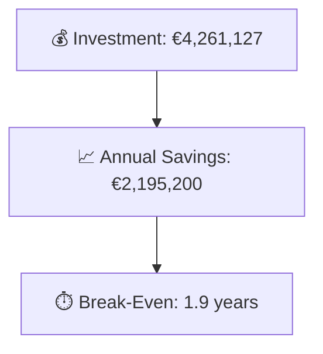

# Portfolio Modernization Report

**Generated:** 2026-05-11  
**Applications Analyzed:** 25 in-scope (30 total, 5 out-of-scope)

## Executive Summary

This portfolio analysis covers 25 in-scope applications across multiple business units. Technology assessment reveals significant modernization needs: 26 EOL components and 13 outdated components were identified. 8 applications scored HIGH complexity and 16 scored MEDIUM, indicating substantial transformation effort is required. A total of 115 modernization scenarios are applicable across the portfolio, with an estimated total investment of €4,261,127 yielding annual savings of €2,195,200 and a portfolio break-even of 1.9 years.

## Portfolio Overview

## Top Modernization Opportunities

| Scenario | Applicable Apps | Priority | Total Cost | Yearly Savings | ROI |
|----------|----------------|----------|------------|---------------|-----|
| Switch to ARM-based CPU | 25 | Medium | €145,343 | €25,000 | 5.8y |
| Operating System Update | 13 | High | €15,804 | €6,500 | 2.4y |
| Application Refactoring and De-coupling | 10 | High | €2,864,929 | €1,320,000 | 2.2y |
| Upgrade Legacy Databases | 9 | High | €114,982 | €90,000 | 1.3y |
| Application Migration to Cloud Infrastructure (Lift & Shift) | 8 | High | €50,842 | €20,100 | 2.5y |
| Application Containerization | 8 | High | €996,879 | €670,000 | 1.5y |
| Applications Server replacement | 6 | Medium | €71,352 | €62,400 | 1.1y |
| Switch to standard Linux Operating System | 3 | Medium | €996 | €1,200 | 0.8y |

## Scenario Applicability Matrix

| Application | Switch to ARM-based  | Operating System Upd | Application Refactor | Upgrade Legacy Datab | Application Migratio | Application Containe |
|-------------|:---:|:---:|:---:|:---:|:---:|:---:|
| ERPApp-001 | ✅ | ✅ | ✅ | ✔️ | ✅ | 🚫 |
| CRMApp-002 | ✅ | ✅ | ❌ | ❓ | ✔️ | ❌ |
| HRApp-004 | ✅ | ✅ | ✅ | ✔️ | ✔️ | ✔️ |
| SupportApp-006 | ✅ | ✅ | ❌ | ✅ | ✔️ | ❌ |
| InventoryApp-008 | ✅ | ✅ | ✅ | ✔️ | ✅ | 🚫 |
| PayrollApp-010 | ✅ | ✔️ | ❌ | ✔️ | ✔️ | ❌ |
| RouteOptApp-011 | ✅ | ❓ | 🔶 | ✔️ | ✔️ | ✔️ |
| IoTSensorApp-012 | ✅ | ✔️ | ✅ | ✔️ | ✔️ | ✔️ |
| SecurityApp-013 | ✅ | ✅ | 🔶 | ✔️ | ✅ | ✅ |
| DocumentApp-014 | ✅ | ✔️ | ✅ | ✔️ | ✔️ | ✅ |
| ReportingApp-015 | ✅ | ✔️ | ✅ | ✅ | ✔️ | ✅ |
| MobileApp-016 | ✅ | ✅ | 🔶 | ✔️ | ✔️ | ✔️ |
| BackupApp-017 | ✅ | ✅ | ❌ | ✅ | ✅ | ❌ |
| VendorApp-018 | ✅ | ✅ | 🔶 | ✅ | ✅ | ✅ |
| QualityApp-019 | ✅ | ✔️ | 🔶 | ✔️ | ✔️ | ✅ |
| TrainingApp-020 | ✅ | ✅ | ❌ | ✅ | ✔️ | ❌ |
| FleetApp-021 | ✅ | ✔️ | ✅ | ✅ | ✅ | ✅ |
| ComplianceApp-022 | ✅ | ✅ | 🔶 | ✔️ | ✔️ | ✔️ |
| ChatbotApp-023 | ✅ | ✔️ | 🔶 | ✅ | ✔️ | ✔️ |
| AuditApp-024 | ✅ | ✔️ | ✅ | ✅ | ✅ | ✅ |
| PortalApp-025 | ✅ | ✔️ | ✅ | ✔️ | ✔️ | ✔️ |
| LegacyFinApp-026 | ✅ | ✅ | ✅ | ❓ | ✅ | 🚫 |
| DataWarehouseApp-027 | ✅ | ✅ | 🔶 | ✔️ | ✔️ | ✅ |
| NotificationApp-028 | ✅ | ✔️ | ❌ | ✔️ | ✔️ | ✔️ |
| APIGatewayApp-030 | ✅ | ✔️ | 🔶 | ✅ | ✔️ | ✔️ |

Legend: ✅ Applicable | ❌ Not Applicable | ✔️ Fulfilled | 🔶 Partially Fulfilled | 🚫 Blocked | ❓ Unknown

## Financial Summary

| Metric | Value |
|--------|-------|
| Total One-Time Investment | €4,261,127 |
| Total Annual Savings | €2,195,200 |
| Portfolio Break-Even | 1.9 years |
| Applications with Opportunities | 25 / 25 |
| Total Applicable Scenarios | 115 |

## Risk Applications

| Application | Complexity | EOL Components | Applicable Scenarios |
|-------------|-----------|---------------|---------------------|
| BackupApp-017 | 8/10 (HIGH) | 2 | 6 |
| SecurityApp-013 | 7/10 (HIGH) | 1 | 7 |
| VendorApp-018 | 7/10 (HIGH) | 2 | 6 |
| TrainingApp-020 | 7/10 (HIGH) | 2 | 5 |
| FleetApp-021 | 7/10 (HIGH) | 1 | 7 |
| AuditApp-024 | 7/10 (HIGH) | 2 | 7 |
| DataWarehouseApp-027 | 7/10 (HIGH) | 1 | 6 |
| APIGatewayApp-030 | 7/10 (HIGH) | 1 | 3 |
| ERPApp-001 | 6/10 (MEDIUM) | 1 | 7 |
| CRMApp-002 | 6/10 (MEDIUM) | 1 | 4 |

## Per-Application Reports

| Application | ID | Complexity | Report |
|-------------|-----|-----------|--------|
| ERPApp-001 | app001 | 6/10 (MEDIUM) | [View Report](apps/app001_report.md) |
| CRMApp-002 | app002 | 6/10 (MEDIUM) | [View Report](apps/app002_report.md) |
| HRApp-004 | app004 | 6/10 (MEDIUM) | [View Report](apps/app004_report.md) |
| SupportApp-006 | app006 | 5/10 (MEDIUM) | [View Report](apps/app006_report.md) |
| InventoryApp-008 | app008 | 5/10 (MEDIUM) | [View Report](apps/app008_report.md) |
| PayrollApp-010 | app010 | 4/10 (MEDIUM) | [View Report](apps/app010_report.md) |
| RouteOptApp-011 | app011 | 3/10 (LOW) | [View Report](apps/app011_report.md) |
| IoTSensorApp-012 | app012 | 5/10 (MEDIUM) | [View Report](apps/app012_report.md) |
| SecurityApp-013 | app013 | 7/10 (HIGH) | [View Report](apps/app013_report.md) |
| DocumentApp-014 | app014 | 5/10 (MEDIUM) | [View Report](apps/app014_report.md) |
| ReportingApp-015 | app015 | 6/10 (MEDIUM) | [View Report](apps/app015_report.md) |
| MobileApp-016 | app016 | 6/10 (MEDIUM) | [View Report](apps/app016_report.md) |
| BackupApp-017 | app017 | 8/10 (HIGH) | [View Report](apps/app017_report.md) |
| VendorApp-018 | app018 | 7/10 (HIGH) | [View Report](apps/app018_report.md) |
| QualityApp-019 | app019 | 6/10 (MEDIUM) | [View Report](apps/app019_report.md) |
| TrainingApp-020 | app020 | 7/10 (HIGH) | [View Report](apps/app020_report.md) |
| FleetApp-021 | app021 | 7/10 (HIGH) | [View Report](apps/app021_report.md) |
| ComplianceApp-022 | app022 | 6/10 (MEDIUM) | [View Report](apps/app022_report.md) |
| ChatbotApp-023 | app023 | 6/10 (MEDIUM) | [View Report](apps/app023_report.md) |
| AuditApp-024 | app024 | 7/10 (HIGH) | [View Report](apps/app024_report.md) |
| PortalApp-025 | app025 | 6/10 (MEDIUM) | [View Report](apps/app025_report.md) |
| LegacyFinApp-026 | app026 | 6/10 (MEDIUM) | [View Report](apps/app026_report.md) |
| DataWarehouseApp-027 | app027 | 7/10 (HIGH) | [View Report](apps/app027_report.md) |
| NotificationApp-028 | app028 | 5/10 (MEDIUM) | [View Report](apps/app028_report.md) |
| APIGatewayApp-030 | app030 | 7/10 (HIGH) | [View Report](apps/app030_report.md) |