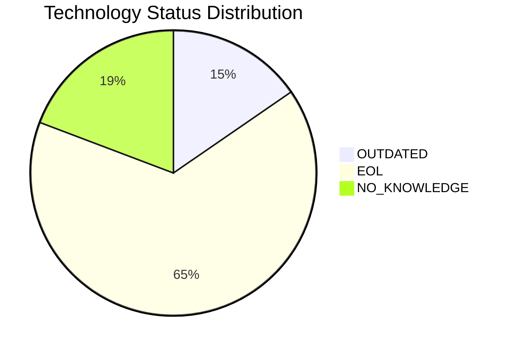
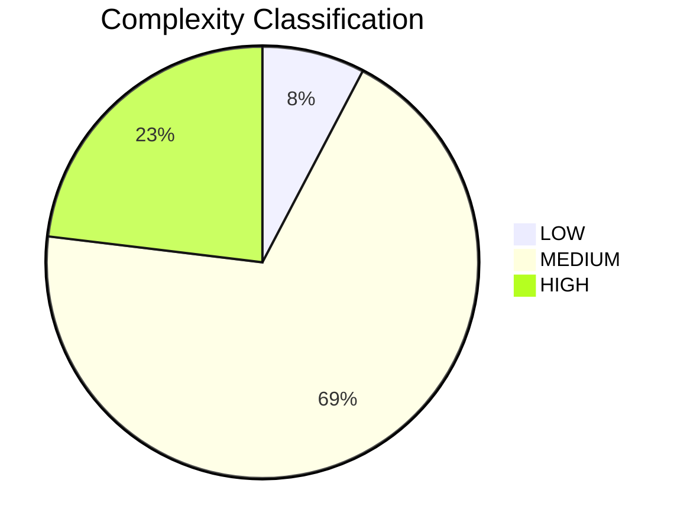

# Portfolio Modernization Report

## Executive Summary

This report covers the modernization analysis of **30 applications** across the enterprise portfolio.
Of these, **4 are out-of-scope** (Retired), leaving **26 applications** for detailed assessment.

| Metric | Value |
|--------|-------|
| Total Applications | 30 |
| In-Scope Applications | 26 |
| Out-of-Scope (Retired) | 4 |
| Average Complexity Score | 5.6/10 |
| Total Portfolio Implementation Cost | $5,854,992.48 |
| Total Annual Savings | $2,946,310.00 |
| Portfolio 3-Year ROI | 51.0% |

## Technology Health Overview

| Status | Count |
|--------|-------|
| ✅ CURRENT_VERSION | 0 |
| ⚠️ OUTDATED | 4 |
| 🔴 EOL | 17 |
| ❓ NO_KNOWLEDGE | 5 |

## Complexity Distribution

| Classification | Count |
|----------------|-------|
| LOW | 2 |
| MEDIUM | 18 |
| HIGH | 6 |

## Application Portfolio Overview

| App ID | Name | Status | Criticality | OS Tech | Complexity | Impl. Cost | Annual Savings |
|--------|------|--------|-------------|---------|------------|------------|----------------|
| app001 | ERPApp-001 | Production | High | ⚠️ OUTDATED | 6/10 (MEDIUM) | $331,115 | $135,920 |
| app002 | CRMApp-002 | Production | Medium | 🔴 EOL | 6/10 (MEDIUM) | $18,504 | $13,950 |
| app003 | AnalyticsApp-003 | Production | Low | 🔴 EOL | 4/10 (MEDIUM) | $27,110 | $26,500 |
| app004 | HRApp-004 | Production | High | 🔴 EOL | 6/10 (MEDIUM) | $342,680 | $145,520 |
| app005 | EComApp-005 | ⚫ Retired | Critical | — | — | — | — |
| app006 | SupportApp-006 | Production | Medium | 🔴 EOL | 5/10 (MEDIUM) | $26,148 | $22,950 |
| app007 | FinanceApp-007 | ⚫ Retired | High | — | — | — | — |
| app008 | InventoryApp-008 | Production | High | 🔴 EOL | 7/10 (HIGH) | $394,082 | $145,520 |
| app009 | MarketingApp-009 | ⚫ Retired | Low | — | — | — | — |
| app010 | PayrollApp-010 | Production | Medium | ✅ CURRENT_VERSION | 5/10 (MEDIUM) | $15,085 | $13,500 |
| app011 | RouteOptApp-011 | Production | Medium | 🔴 EOL | 5/10 (MEDIUM) | $21,119 | $14,850 |
| app012 | IoTSensorApp-012 | Production | High | ✅ CURRENT_VERSION | 4/10 (MEDIUM) | $236,378 | $133,120 |
| app013 | SecurityApp-013 | Production | Critical | 🔴 EOL | 7/10 (HIGH) | $520,034 | $222,800 |
| app014 | DocumentApp-014 | Production | Medium | ✅ CURRENT_VERSION | 5/10 (MEDIUM) | $372,403 | $239,760 |
| app015 | ReportingApp-015 | Production | Low | ✅ CURRENT_VERSION | 3/10 (LOW) | $281,590 | $266,400 |
| app016 | MobileApp-016 | Production | Medium | 🔴 EOL | 6/10 (MEDIUM) | $53,200 | $28,350 |
| app017 | BackupApp-017 | Production | High | 🔴 EOL | 7/10 (HIGH) | $34,580 | $20,400 |
| app018 | VendorApp-018 | Production | Medium | 🔴 EOL | 6/10 (MEDIUM) | $151,505 | $113,850 |
| app019 | QualityApp-019 | Production | High | ✅ CURRENT_VERSION | 5/10 (MEDIUM) | $120,681 | $92,800 |
| app020 | TrainingApp-020 | Production | Low | 🔴 EOL | 6/10 (MEDIUM) | $30,070 | $25,500 |
| app021 | FleetApp-021 | Production | High | ✅ CURRENT_VERSION | 6/10 (MEDIUM) | $468,742 | $233,120 |
| app022 | ComplianceApp-022 | Production | Critical | 🔴 EOL | 7/10 (HIGH) | $353,783 | $130,800 |
| app023 | ChatbotApp-023 | Production | Medium | ✅ CURRENT_VERSION | 3/10 (LOW) | $15,209 | $14,400 |
| app024 | AuditApp-024 | Production | High | ✅ CURRENT_VERSION | 6/10 (MEDIUM) | $468,742 | $233,120 |
| app025 | PortalApp-025 | Production | Medium | ✅ CURRENT_VERSION | 4/10 (MEDIUM) | $236,378 | $149,760 |
| app026 | LegacyFinApp-026 | Production | Critical | ⚠️ OUTDATED | 6/10 (MEDIUM) | $342,680 | $143,920 |
| app027 | DataWarehouseApp-027 | Production | High | 🔴 EOL | 8/10 (HIGH) | $605,687 | $225,200 |
| app028 | NotificationApp-028 | Production | Medium | ✅ CURRENT_VERSION | 5/10 (MEDIUM) | $15,085 | $13,500 |
| app029 | ConfigApp-029 | ⚫ Retired | Low | — | — | — | — |
| app030 | APIGatewayApp-030 | Production | High | ✅ CURRENT_VERSION | 7/10 (HIGH) | $372,403 | $140,800 |

## Top Modernization Scenarios by Portfolio Impact

| Scenario | Apps | Total Cost | Annual Savings | 3-Yr Net Value |
|----------|------|------------|----------------|----------------|
| Refactoring & Decoupling | 14 | $4,036,831 | $1,740,000 | $1,183,169 |
| Containerization | 8 | $910,091 | $680,000 | $1,129,909 |
| Application Server Replacement | 24 | $264,537 | $249,600 | $484,263 |
| Upgrade Legacy Databases | 9 | $103,229 | $78,000 | $130,771 |
| Cloud Migration (Lift & Shift) | 24 | $130,534 | $62,400 | $56,666 |
| Switch to Open Source DB | 9 | $278,218 | $109,500 | $50,282 |
| Switch to Standard Linux OS | 10 | $3,188 | $3,360 | $6,892 |
| OS Update / Security Patch | 15 | $17,831 | $6,450 | $1,519 |
| Switch to ARM CPU | 20 | $110,533 | $17,000 | $-59,533 |

## Out-of-Scope Applications

| App ID | Name | Reason |
|--------|------|--------|
| app005 | EComApp-005 | Retired |
| app007 | FinanceApp-007 | Retired |
| app009 | MarketingApp-009 | Retired |
| app029 | ConfigApp-029 | Retired |

## Recommendations

1. **Prioritize EOL OS remediation**: Multiple applications run on EOL operating systems (AIX 6, Debian 6/7, Windows Server 2012, CentOS 7). Immediate patching or migration is required.
2. **Database upgrades**: Oracle 11g/12c and MySQL 5.7 are EOL; SQL Server 2014 reached EOL. These databases require urgent upgrades.
3. **Containerization**: Containerizing eligible custom applications will enable cloud portability and reduce infrastructure costs.
4. **Cloud migration**: Lift-and-shift cloud migration offers a positive ROI for most applications and reduces on-premise infrastructure burden.
5. **Legacy language modernization**: COBOL, FORTRAN, and other legacy language applications (app001, app008, app026) require long-term modernization roadmaps.
