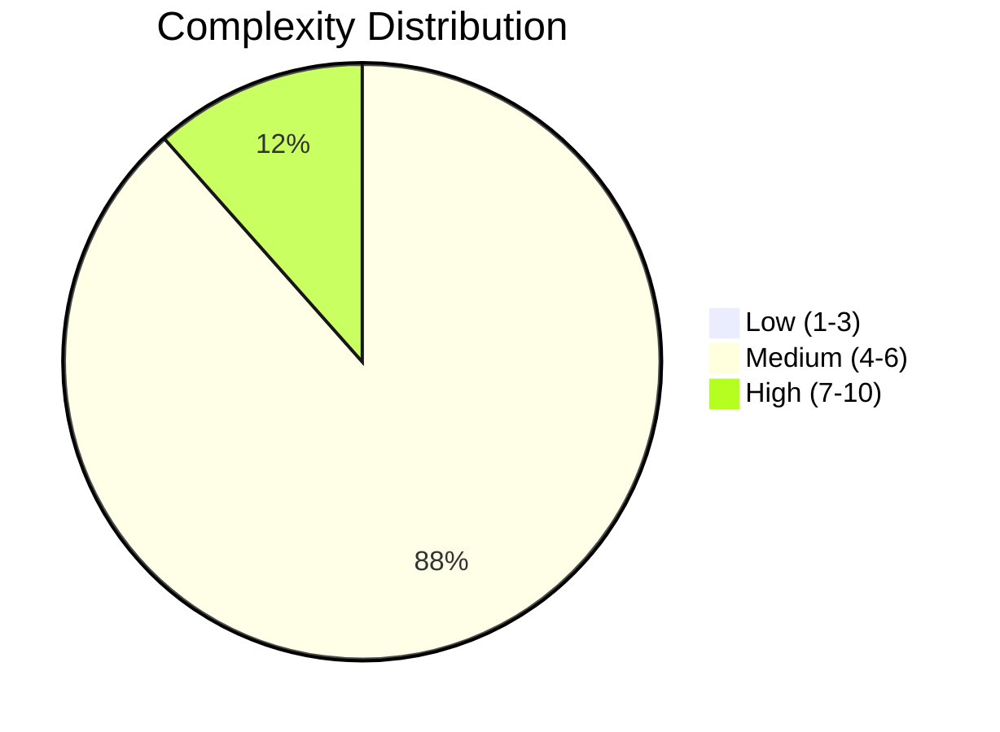
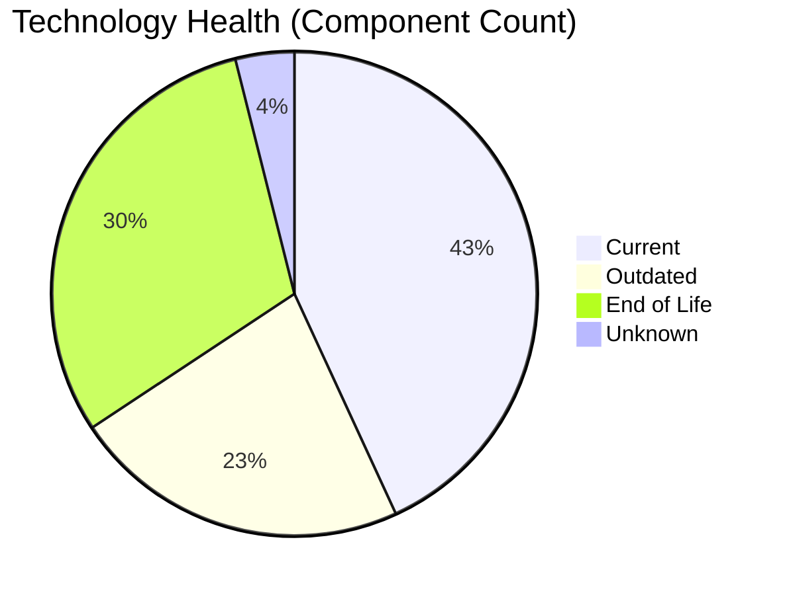
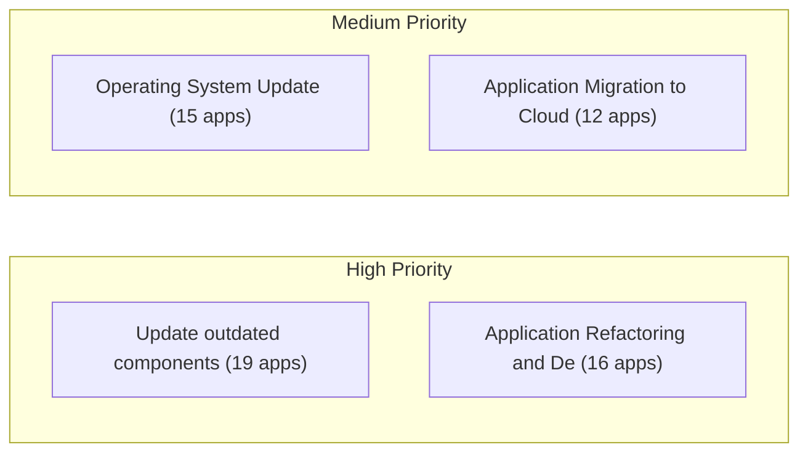
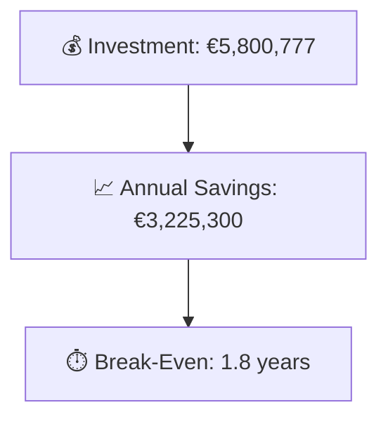

# Portfolio Modernization Report

**Generated:** 2026-05-11
**Applications Analyzed:** 26 (in-scope) of 30 total

## Executive Summary

The portfolio analysis covered 26 in-scope production applications out of 30 total (4 retired apps excluded). The assessment identified significant modernization opportunities across the portfolio: 3 applications are classified as HIGH complexity, 23 as MEDIUM, and 0 as LOW. Technology debt is considerable, with 31 End-of-Life and 23 outdated technology components detected. The top modernization opportunity is application containerization and cloud migration, with a combined total portfolio investment of €5,800,777 yielding estimated annual savings of €3,225,300 and a break-even of approximately 1.8 years.

## Portfolio Overview

## Top Modernization Opportunities

| Scenario | Applicable Apps | Total Cost | Yearly Savings | Break-Even |
|----------|----------------|------------|---------------|------------|
| Update outdated components | 19 | — | — | — |
| Application Refactoring and De-coupling | 16 | €4,302,200 | €2,145,000 | 2.0y |
| Operating System Update | 15 | €16,809 | €7,500 | 2.2y |
| Application Migration to Cloud Infrastructure (Lift & Shift) | 12 | €68,864 | €31,800 | 2.2y |
| Switch to ARM-based CPU | 10 | €54,478 | €10,000 | 5.4y |
| Applications Server replacement | 9 | €101,720 | €94,800 | 1.1y |
| Upgrade Legacy Databases | 9 | €103,229 | €90,000 | 1.1y |
| Switch DB Engine to open-source database solution | 9 | €253,242 | €135,000 | 1.9y |
| Application Containerization | 8 | €899,284 | €710,000 | 1.3y |
| Switch to standard Linux Operating System | 3 | €950 | €1,200 | 0.8y |

## Scenario Applicability Matrix

| Application | Operating System Upd | Switch to standard L | Switch to ARM-based  | Applications Server  | Application Migratio | Application Containe | Application Refactor | Upgrade Legacy Datab | Switch DB Engine to  | Update outdated comp |
|-------------|:---:|:---:|:---:|:---:|:---:|:---:|:---:|:---:|:---:|:---:|
| ERPApp-001 | ✅ | ✅ | 🚫 | ❌ | ✅ | 🚫 | ✅ | ✔️ | ✅ | ✅ |
| CRMApp-002 | ✅ | ✔️ | 🚫 | 🚫 | ✔️ | 🚫 | ❌ | ✔️ | ✔️ | 🚫 |
| AnalyticsApp-003 | ✅ | ✔️ | ✅ | ✅ | ✔️ | ✔️ | ❌ | ✅ | ✔️ | ✅ |
| HRApp-004 | ✅ | ❌ | 🚫 | ✅ | ✅ | ✔️ | ✅ | ✔️ | ✅ | ✅ |
| SupportApp-006 | ✅ | ✔️ | 🚫 | 🚫 | ✔️ | 🚫 | ❌ | ✅ | ✔️ | 🚫 |
| InventoryApp-008 | ✅ | ✅ | 🚫 | ✅ | ✅ | 🚫 | ✅ | ✔️ | ✅ | ✅ |
| PayrollApp-010 | ✔️ | ❌ | 🚫 | 🚫 | ✔️ | 🚫 | ❌ | ✔️ | ✔️ | 🚫 |
| RouteOptApp-011 | ✅ | ✔️ | ✅ | ✅ | ✔️ | ✔️ | ✅ | ✔️ | ✔️ | ✅ |
| IoTSensorApp-012 | ✔️ | ❌ | 🚫 | ✔️ | ✔️ | ✔️ | ✅ | ✔️ | ✔️ | ✅ |
| SecurityApp-013 | ✅ | ✔️ | ✅ | ✅ | ✅ | ✅ | ✅ | ✔️ | ✅ | ✅ |
| DocumentApp-014 | ✔️ | ❌ | 🚫 | ✔️ | ✔️ | ✅ | ❌ | ✔️ | ✔️ | ✅ |
| ReportingApp-015 | ✔️ | ❌ | 🚫 | ✔️ | ✔️ | ✅ | ✅ | ✔️ | ✔️ | ✅ |
| MobileApp-016 | ✅ | ✔️ | ✅ | ✅ | ✔️ | ✔️ | ✅ | ✔️ | ✅ | ✅ |
| BackupApp-017 | ✅ | ✔️ | 🚫 | 🚫 | ✅ | 🚫 | ❌ | ✅ | 🚫 | 🚫 |
| VendorApp-018 | ✅ | ✔️ | ✅ | ✅ | ✅ | ✅ | ✅ | ✅ | ✔️ | ✅ |
| QualityApp-019 | ✔️ | ✔️ | ✅ | ❌ | ✅ | ✅ | ✅ | ✔️ | ✔️ | ✅ |
| TrainingApp-020 | ✅ | ❌ | 🚫 | 🚫 | ✔️ | 🚫 | ❌ | ✅ | 🚫 | 🚫 |
| FleetApp-021 | ✔️ | ❌ | 🚫 | ✔️ | ✅ | ✅ | ✅ | ✅ | ✅ | ✅ |
| ComplianceApp-022 | ✅ | ✔️ | ✅ | ✔️ | ✅ | ✔️ | ✅ | ✔️ | ✔️ | ✅ |
| ChatbotApp-023 | ✔️ | ✔️ | ✅ | ❌ | ✔️ | ✔️ | ❌ | ✔️ | ✔️ | ✅ |
| AuditApp-024 | ✔️ | ❌ | 🚫 | ✔️ | ✅ | ✅ | ✅ | ✅ | ✅ | ✅ |
| PortalApp-025 | ✔️ | ❌ | 🚫 | ✔️ | ✔️ | ✔️ | ✅ | ✔️ | ✔️ | ✔️ |
| LegacyFinApp-026 | ✅ | ✅ | 🚫 | ❌ | ✅ | 🚫 | ✅ | ✅ | ✅ | ✅ |
| DataWarehouseApp-027 | ✅ | ✔️ | ✅ | ✅ | ✅ | ✅ | ✅ | ✔️ | ✅ | ✅ |
| NotificationApp-028 | ✔️ | ❌ | 🚫 | 🚫 | ✔️ | ✔️ | ❌ | ✔️ | 🚫 | 🚫 |
| APIGatewayApp-030 | ✔️ | ✔️ | ✅ | ✅ | ✔️ | ✔️ | ❌ | ✅ | ✔️ | ✅ |

**Legend:** ✅ Applicable | ❌ Not Applicable | ✔️ Fulfilled | 🚫 Blocked | ❓ Unknown

## Financial Summary

| Metric | Value |
|--------|-------|
| Total One-Time Investment | €5,800,777 |
| Total Annual Savings | €3,225,300 |
| Portfolio Break-Even | 1.8 years |

## Risk Applications (Highest Complexity)

| Application | Complexity | EOL Components | Applicable Scenarios |
|-------------|-----------|---------------|---------------------|
| SecurityApp-013 | 7/10 (HIGH) | 2 | 8 |
| BackupApp-017 | 7/10 (HIGH) | 2 | 3 |
| APIGatewayApp-030 | 7/10 (HIGH) | 2 | 4 |
| CRMApp-002 | 6/10 (MEDIUM) | 2 | 1 |
| HRApp-004 | 6/10 (MEDIUM) | 2 | 6 |
| SupportApp-006 | 6/10 (MEDIUM) | 2 | 2 |
| InventoryApp-008 | 6/10 (MEDIUM) | 2 | 7 |
| DocumentApp-014 | 6/10 (MEDIUM) | 1 | 2 |
| VendorApp-018 | 6/10 (MEDIUM) | 2 | 8 |
| TrainingApp-020 | 6/10 (MEDIUM) | 2 | 2 |

## Per-Application Reports

| Application | Complexity | Report |
|-------------|-----------|--------|
| ERPApp-001 | 5/10 (MEDIUM) | [View Report](apps/app001.md) |
| CRMApp-002 | 6/10 (MEDIUM) | [View Report](apps/app002.md) |
| AnalyticsApp-003 | 4/10 (MEDIUM) | [View Report](apps/app003.md) |
| HRApp-004 | 6/10 (MEDIUM) | [View Report](apps/app004.md) |
| SupportApp-006 | 6/10 (MEDIUM) | [View Report](apps/app006.md) |
| InventoryApp-008 | 6/10 (MEDIUM) | [View Report](apps/app008.md) |
| PayrollApp-010 | 5/10 (MEDIUM) | [View Report](apps/app010.md) |
| RouteOptApp-011 | 5/10 (MEDIUM) | [View Report](apps/app011.md) |
| IoTSensorApp-012 | 5/10 (MEDIUM) | [View Report](apps/app012.md) |
| SecurityApp-013 | 7/10 (HIGH) | [View Report](apps/app013.md) |
| DocumentApp-014 | 6/10 (MEDIUM) | [View Report](apps/app014.md) |
| ReportingApp-015 | 4/10 (MEDIUM) | [View Report](apps/app015.md) |
| MobileApp-016 | 5/10 (MEDIUM) | [View Report](apps/app016.md) |
| BackupApp-017 | 7/10 (HIGH) | [View Report](apps/app017.md) |
| VendorApp-018 | 6/10 (MEDIUM) | [View Report](apps/app018.md) |
| QualityApp-019 | 5/10 (MEDIUM) | [View Report](apps/app019.md) |
| TrainingApp-020 | 6/10 (MEDIUM) | [View Report](apps/app020.md) |
| FleetApp-021 | 6/10 (MEDIUM) | [View Report](apps/app021.md) |
| ComplianceApp-022 | 6/10 (MEDIUM) | [View Report](apps/app022.md) |
| ChatbotApp-023 | 4/10 (MEDIUM) | [View Report](apps/app023.md) |
| AuditApp-024 | 6/10 (MEDIUM) | [View Report](apps/app024.md) |
| PortalApp-025 | 4/10 (MEDIUM) | [View Report](apps/app025.md) |
| LegacyFinApp-026 | 5/10 (MEDIUM) | [View Report](apps/app026.md) |
| DataWarehouseApp-027 | 6/10 (MEDIUM) | [View Report](apps/app027.md) |
| NotificationApp-028 | 5/10 (MEDIUM) | [View Report](apps/app028.md) |
| APIGatewayApp-030 | 7/10 (HIGH) | [View Report](apps/app030.md) |

