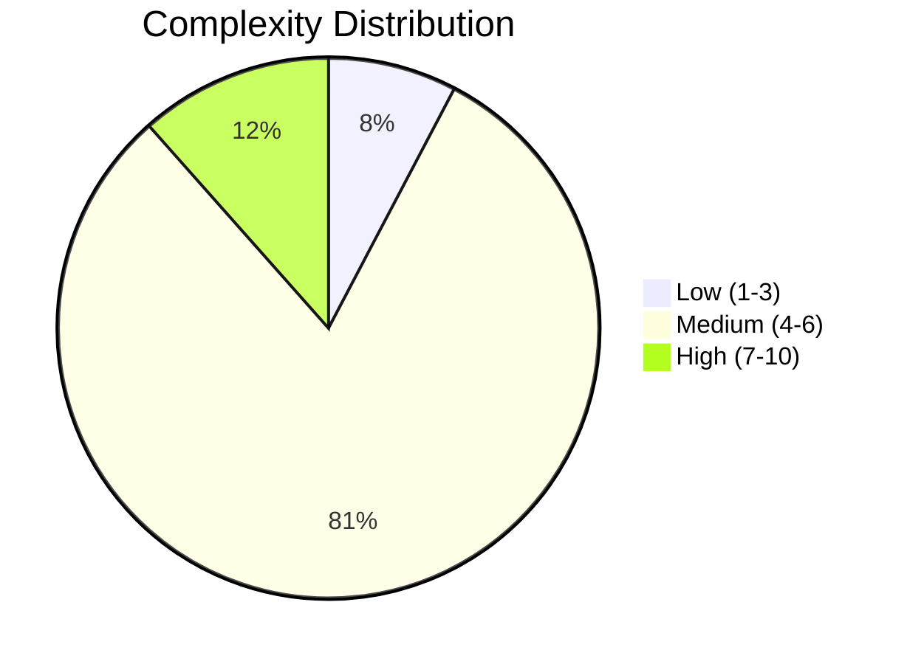
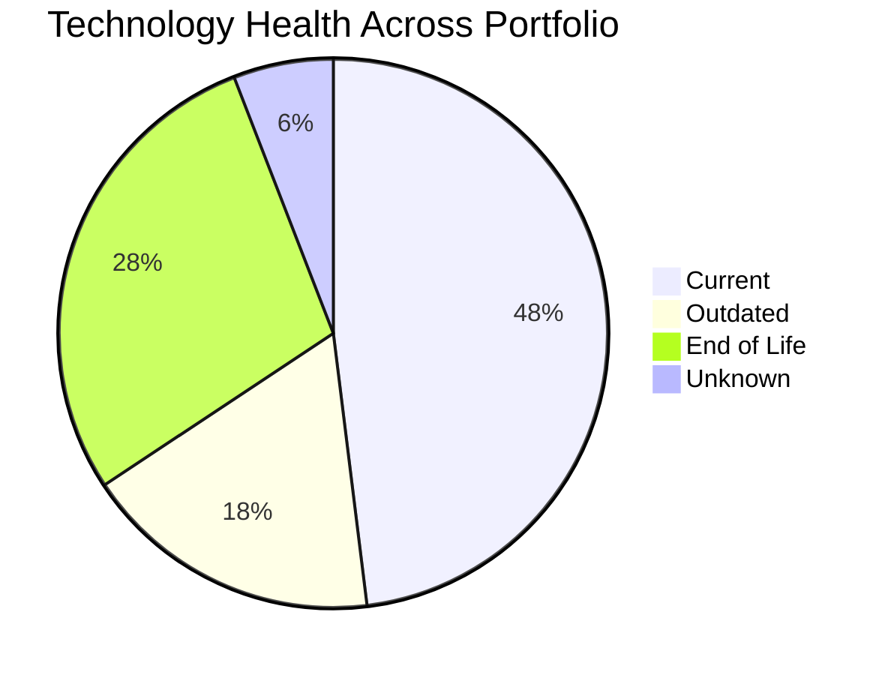
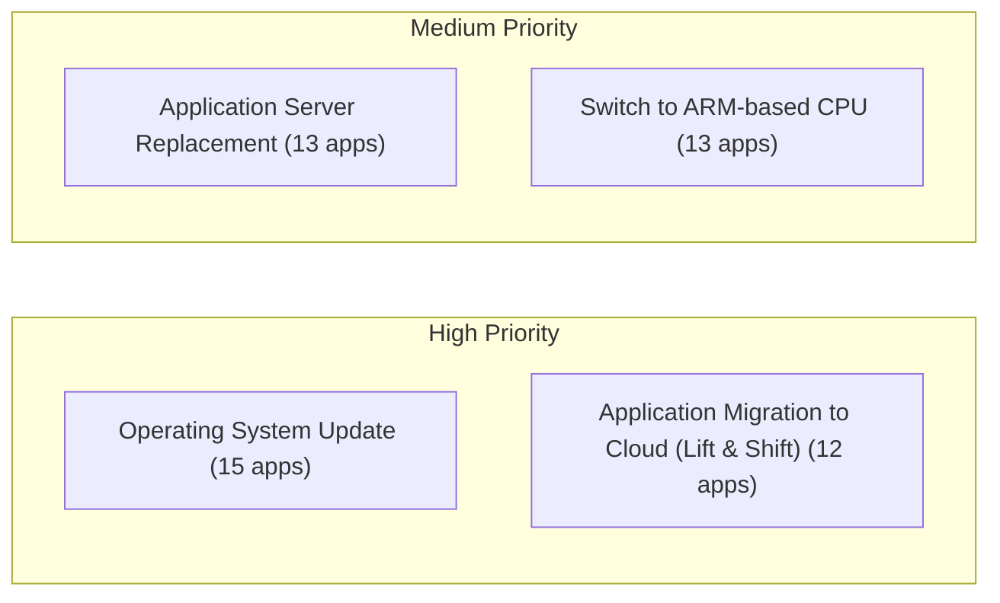
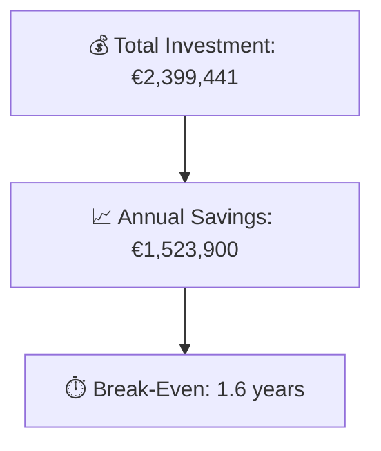

# Portfolio Modernization Report

**Generated:** 2026-05-13  
**Applications Analyzed:** 26 (out of 30 total, 4 retired/out-of-scope)

## Executive Summary

This portfolio modernization analysis covers **26 active applications** across multiple business units. Out of 26 applications, **3** are classified as HIGH complexity, **21** as MEDIUM, and **2** as LOW. Technology health analysis reveals **29 EOL components** and **18 outdated components** across the portfolio, indicating significant modernization urgency particularly in operating systems (RHEL 7, CentOS 7, Debian 6/7, Windows Server 2012) and legacy application servers. The top modernization opportunities are OS updates (15 apps), application server replacement (13 apps), and cloud deployment (12 apps). The estimated portfolio investment is **€2,399,441** with **€1,523,900** in annual savings, yielding a break-even of approximately **1.6 years**.

## Portfolio Overview

## Top Modernization Opportunities

| Scenario | Applicable Apps | Priority | Total Cost | Yearly Savings | ROI |
|----------|----------------|----------|------------|---------------|-----|
| Operating System Update | 15 | High | €17,097 | €7,500 | 2.3y |
| Application Server Replacement | 13 | Medium | €151,026 | €136,800 | 1.1y |
| Switch to ARM-based CPU | 13 | Medium | €69,847 | €11,600 | 6.0y |
| Application Migration to Cloud (Lift & Shift) | 12 | High | €69,620 | €31,800 | 2.2y |
| Switch to Managed Database Service | 12 | Medium | €69,620 | €120,000 | 0.6y |
| Switch DB Engine to Open-Source | 9 | High | €260,783 | €135,000 | 1.9y |
| Switch DB Engine to PostgreSQL | 9 | High | €260,783 | €135,000 | 1.9y |
| Upgrade Legacy Databases | 8 | High | €92,974 | €80,000 | 1.2y |
| Application Containerization | 5 | High | €565,443 | €440,000 | 1.3y |
| Switch to Standard Linux OS | 3 | Medium | €996 | €1,200 | 0.8y |

## Scenario Applicability Matrix

| Application | Operating Syste | Application Ser | Switch to ARM-b | Application Mig | Switch to Manag | Switch DB Engin | Switch DB Engin | Upgrade Legacy  |
|-------------|:---:|:---:|:---:|:---:|:---:|:---:|:---:|:---:|
| ERPApp-001 | ✅ | ❌ | 🚫 | ✅ | ✅ | ✅ | ✅ | ✔️ |
| CRMApp-002 | ✅ | ✅ | 🚫 | ✔️ | ✔️ | ✔️ | ❌ | ✔️ |
| AnalyticsApp-003 | ✅ | ✅ | ✅ | ✔️ | ❌ | ✔️ | ✔️ | ✅ |
| HRApp-004 | ✅ | ✅ | ✅ | ✅ | ✅ | ✅ | ✅ | ✔️ |
| SupportApp-006 | ✅ | ✅ | 🚫 | ✔️ | ❌ | ✔️ | ✔️ | ✅ |
| InventoryApp-008 | ✅ | ✅ | 🚫 | ✅ | ✅ | ✅ | ✅ | ✔️ |
| PayrollApp-010 | ✔️ | ✔️ | 🚫 | ✔️ | ❌ | ✔️ | ❌ | ✔️ |
| RouteOptApp-011 | ✅ | ✅ | ✅ | ✔️ | ❌ | ✔️ | ✔️ | ✔️ |
| IoTSensorApp-012 | ✔️ | ✔️ | ✅ | ✔️ | ❌ | ✔️ | ✔️ | ✔️ |
| SecurityApp-013 | ✅ | ✅ | ✅ | ✅ | ✅ | ✅ | ✅ | ✔️ |
| DocumentApp-014 | ✔️ | ✔️ | ❓ | ✔️ | ❌ | ✔️ | ❌ | ✔️ |
| ReportingApp-015 | ✔️ | ✔️ | ❓ | ✔️ | ❌ | ✔️ | ❌ | ✔️ |
| MobileApp-016 | ✅ | ✅ | ✅ | ✔️ | ❌ | ✅ | ✅ | ✔️ |
| BackupApp-017 | ✅ | ✅ | 🚫 | ✅ | ✅ | 🚫 | 🚫 | ✅ |
| VendorApp-018 | ✅ | ✅ | ✅ | ✅ | ✅ | ✔️ | ✔️ | ✅ |
| QualityApp-019 | ✔️ | ✔️ | ✅ | ✅ | ✅ | ✔️ | ❌ | ✔️ |
| TrainingApp-020 | ✅ | ✅ | 🚫 | ✔️ | ❌ | 🚫 | 🚫 | ✅ |
| FleetApp-021 | ✔️ | ✔️ | ❓ | ✅ | ✅ | ✅ | ✅ | ✅ |
| ComplianceApp-022 | ✅ | ✔️ | ✅ | ✅ | ✅ | ✔️ | ✔️ | ✔️ |
| ChatbotApp-023 | ✔️ | ✔️ | ✅ | ✔️ | ❌ | ✔️ | ❌ | ✔️ |
| AuditApp-024 | ✔️ | ✔️ | ❓ | ✅ | ✅ | ✅ | ✅ | ✅ |
| PortalApp-025 | ✔️ | ✔️ | ✅ | ✔️ | ❌ | ✔️ | ✔️ | ✔️ |
| LegacyFinApp-026 | ✅ | ❌ | 🚫 | ✅ | ✅ | ✅ | ✅ | ✔️ |
| DataWarehouseApp-027 | ✅ | ✅ | ✅ | ✅ | ✅ | ✅ | ✅ | ✔️ |
| NotificationApp-028 | ✔️ | ✔️ | 🚫 | ✔️ | ❌ | 🚫 | 🚫 | ✔️ |
| APIGatewayApp-030 | ✔️ | ✅ | ✅ | ✔️ | ❌ | ✔️ | ❌ | ✅ |

_Legend: ✅ Applicable | ❌ Not Applicable | ✔️ Already Fulfilled | 🚫 Blocked | 🔶 Partially Fulfilled | ❓ Lack of Data_

## Financial Summary

| Metric | Value |
|--------|-------|
| Total One-Time Investment | €2,399,441 |
| Total Annual Savings | €1,523,900 |
| Portfolio Break-Even | 1.6 years |
| Applications with Opportunities | 23 / 26 |
| Total Applicable Scenarios | 104 |

## Risk Applications

Applications with highest modernization complexity or most EOL components:

| Application | ID | Complexity | EOL Components | Applicable Scenarios |
|-------------|-----|-----------|---------------|---------------------|
| SecurityApp-013 | app013 | 7/10 (HIGH) | 2 | 9 |
| BackupApp-017 | app017 | 7/10 (HIGH) | 2 | 5 |
| APIGatewayApp-030 | app030 | 7/10 (HIGH) | 2 | 4 |
| CRMApp-002 | app002 | 6/10 (MEDIUM) | 2 | 4 |
| HRApp-004 | app004 | 6/10 (MEDIUM) | 2 | 8 |
| InventoryApp-008 | app008 | 6/10 (MEDIUM) | 2 | 9 |
| MobileApp-016 | app016 | 6/10 (MEDIUM) | 2 | 6 |
| VendorApp-018 | app018 | 6/10 (MEDIUM) | 2 | 8 |
| TrainingApp-020 | app020 | 6/10 (MEDIUM) | 2 | 3 |
| FleetApp-021 | app021 | 6/10 (MEDIUM) | 1 | 6 |

## Per-Application Reports

| Application | ID | Complexity | Report |
|-------------|-----|-----------|--------|
| ERPApp-001 | app001 | 6/10 (MEDIUM) | [View Report](apps/app001.md) |
| CRMApp-002 | app002 | 6/10 (MEDIUM) | [View Report](apps/app002.md) |
| AnalyticsApp-003 | app003 | 5/10 (MEDIUM) | [View Report](apps/app003.md) |
| HRApp-004 | app004 | 6/10 (MEDIUM) | [View Report](apps/app004.md) |
| SupportApp-006 | app006 | 5/10 (MEDIUM) | [View Report](apps/app006.md) |
| InventoryApp-008 | app008 | 6/10 (MEDIUM) | [View Report](apps/app008.md) |
| PayrollApp-010 | app010 | 5/10 (MEDIUM) | [View Report](apps/app010.md) |
| RouteOptApp-011 | app011 | 5/10 (MEDIUM) | [View Report](apps/app011.md) |
| IoTSensorApp-012 | app012 | 4/10 (MEDIUM) | [View Report](apps/app012.md) |
| SecurityApp-013 | app013 | 7/10 (HIGH) | [View Report](apps/app013.md) |
| DocumentApp-014 | app014 | 5/10 (MEDIUM) | [View Report](apps/app014.md) |
| ReportingApp-015 | app015 | 3/10 (LOW) | [View Report](apps/app015.md) |
| MobileApp-016 | app016 | 6/10 (MEDIUM) | [View Report](apps/app016.md) |
| BackupApp-017 | app017 | 7/10 (HIGH) | [View Report](apps/app017.md) |
| VendorApp-018 | app018 | 6/10 (MEDIUM) | [View Report](apps/app018.md) |
| QualityApp-019 | app019 | 5/10 (MEDIUM) | [View Report](apps/app019.md) |
| TrainingApp-020 | app020 | 6/10 (MEDIUM) | [View Report](apps/app020.md) |
| FleetApp-021 | app021 | 6/10 (MEDIUM) | [View Report](apps/app021.md) |
| ComplianceApp-022 | app022 | 6/10 (MEDIUM) | [View Report](apps/app022.md) |
| ChatbotApp-023 | app023 | 3/10 (LOW) | [View Report](apps/app023.md) |
| AuditApp-024 | app024 | 6/10 (MEDIUM) | [View Report](apps/app024.md) |
| PortalApp-025 | app025 | 4/10 (MEDIUM) | [View Report](apps/app025.md) |
| LegacyFinApp-026 | app026 | 5/10 (MEDIUM) | [View Report](apps/app026.md) |
| DataWarehouseApp-027 | app027 | 6/10 (MEDIUM) | [View Report](apps/app027.md) |
| NotificationApp-028 | app028 | 5/10 (MEDIUM) | [View Report](apps/app028.md) |
| APIGatewayApp-030 | app030 | 7/10 (HIGH) | [View Report](apps/app030.md) |
