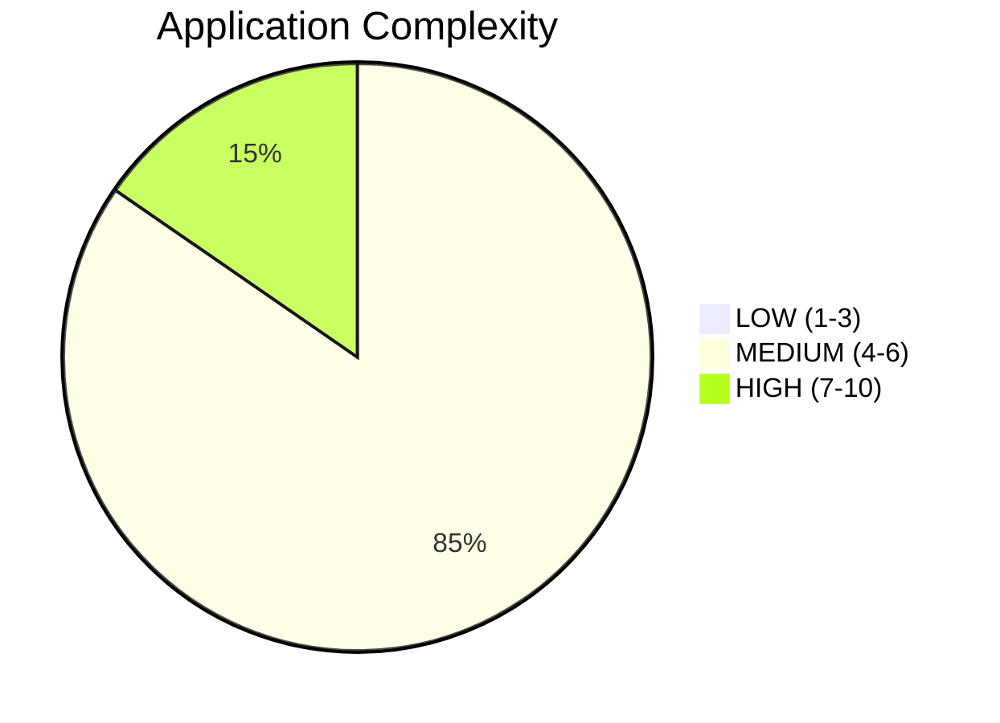
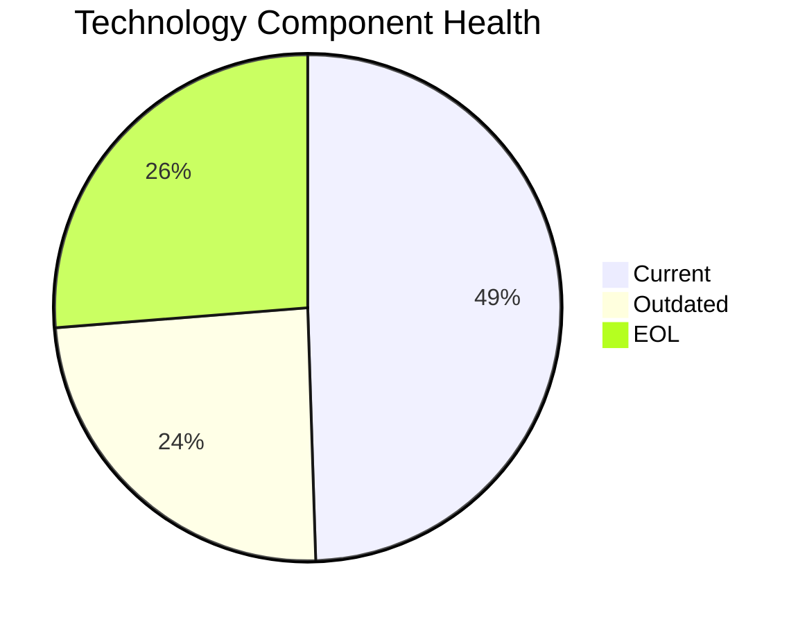

<!-- generated by AI in Github cloud -->
# Portfolio Modernization Report

## Executive Summary

The portfolio consists of **26 in-scope applications** (4 retired/out-of-scope). Technology health analysis reveals significant modernization needs: 26 EOL component instances and 24 outdated component instances across the portfolio. Complexity distribution shows 4 HIGH, 22 MEDIUM, and 0 LOW complexity applications. Estimated total modernization investment: **$7,222,434** with **$3,983,800** annual savings potential.

## Complexity Distribution



## Technology Health Overview



## Scenario Applicability Matrix

| Scenario | Applicable | Fulfilled | Not Applicable | Blocked | Lack of Data |
|----------|-----------|-----------|---------------|---------|--------------|
| os_update_security_patch | 15 | 11 | 0 | 0 | 0 |
| switch_to_standard_linux_os | 3 | 13 | 10 | 0 | 0 |
| switch_to_arm_cpu | 0 | 0 | 0 | 0 | 26 |
| application_server_replacement | 9 | 7 | 2 | 6 | 2 |
| app_deployment_to_cloud | 12 | 14 | 0 | 0 | 0 |
| app_containerization | 11 | 10 | 0 | 5 | 0 |
| app_refactor_decoupling | 20 | 0 | 6 | 0 | 0 |
| upgrade_legacy_databases | 9 | 17 | 0 | 0 | 0 |
| switch_db_engine_open_source | 9 | 11 | 6 | 0 | 0 |
| update_outdated_components | 21 | 5 | 0 | 0 | 0 |

## Top Modernization Opportunities

```mermaid
bar
    title Applicable Scenarios Count
    "os_update_security_patch" : 15
    "switch_to_standard_linux_os" : 3
    "application_server_replacement" : 9
    "app_deployment_to_cloud" : 12
    "app_containerization" : 11
    "app_refactor_decoupling" : 20
    "upgrade_legacy_databases" : 9
    "switch_db_engine_open_source" : 9
    "update_outdated_components" : 21
```

## Financial Summary

| Scenario | Applicable Apps | Total Cost (USD) | Annual Savings (USD) | Portfolio ROI 3yr % |
|----------|----------------|-----------------|---------------------|---------------------|
| os_update_security_patch | 15 | $17,285 | $7,500 | 30.2% |
| switch_to_standard_linux_os | 3 | $1,041 | $1,200 | 245.9% |
| app_deployment_to_cloud | 12 | $69,830 | $31,500 | 35.3% |
| app_containerization | 11 | $1,220,304 | $970,000 | 138.5% |
| app_refactor_decoupling | 20 | $5,442,170 | $2,655,000 | 46.4% |
| switch_db_engine_open_source | 9 | $265,122 | $135,000 | 52.8% |
| application_server_replacement | 9 | $104,963 | $93,600 | 167.5% |
| upgrade_legacy_databases | 9 | $101,720 | $90,000 | 165.4% |
| **TOTAL** | | **$7,222,434** | **$3,983,800** | |

## Risk Applications

| App ID | Name | Criticality | Complexity | EOL Components | Outdated Components |
|--------|------|------------|------------|---------------|---------------------|
| app002 | CRMApp-002 | Medium | 6 (MEDIUM) | 2 | 0 |
| app003 | AnalyticsApp-003 | Low | 4 (MEDIUM) | 2 | 2 |
| app004 | HRApp-004 | High | 6 (MEDIUM) | 2 | 0 |
| app006 | SupportApp-006 | Medium | 5 (MEDIUM) | 1 | 2 |
| app008 | InventoryApp-008 | High | 6 (MEDIUM) | 2 | 1 |
| app010 | PayrollApp-010 | Medium | 5 (MEDIUM) | 1 | 0 |
| app011 | RouteOptApp-011 | Medium | 5 (MEDIUM) | 2 | 0 |
| app013 | SecurityApp-013 | Critical | 7 (HIGH) | 1 | 1 |
| app016 | MobileApp-016 | Medium | 6 (MEDIUM) | 2 | 0 |
| app017 | BackupApp-017 | High | 7 (HIGH) | 1 | 3 |
| app018 | VendorApp-018 | Medium | 6 (MEDIUM) | 2 | 2 |
| app020 | TrainingApp-020 | Low | 6 (MEDIUM) | 2 | 2 |
| app021 | FleetApp-021 | High | 6 (MEDIUM) | 1 | 0 |
| app022 | ComplianceApp-022 | Critical | 6 (MEDIUM) | 1 | 1 |
| app024 | AuditApp-024 | High | 5 (MEDIUM) | 1 | 1 |
| app027 | DataWarehouseApp-027 | High | 7 (HIGH) | 1 | 1 |
| app030 | APIGatewayApp-030 | High | 7 (HIGH) | 2 | 1 |

## Application Reports

| App ID | Name | Complexity | Tech Health |
|--------|------|------------|-------------|
| [app001](apps/app001.md) | ERPApp-001 | 6 (MEDIUM) | 🔴 0 EOL / 🟡 2 Outdated |
| [app002](apps/app002.md) | CRMApp-002 | 6 (MEDIUM) | 🔴 2 EOL / 🟡 0 Outdated |
| [app003](apps/app003.md) | AnalyticsApp-003 | 4 (MEDIUM) | 🔴 2 EOL / 🟡 2 Outdated |
| [app004](apps/app004.md) | HRApp-004 | 6 (MEDIUM) | 🔴 2 EOL / 🟡 0 Outdated |
| [app006](apps/app006.md) | SupportApp-006 | 5 (MEDIUM) | 🔴 1 EOL / 🟡 2 Outdated |
| [app008](apps/app008.md) | InventoryApp-008 | 6 (MEDIUM) | 🔴 2 EOL / 🟡 1 Outdated |
| [app010](apps/app010.md) | PayrollApp-010 | 5 (MEDIUM) | 🔴 1 EOL / 🟡 0 Outdated |
| [app011](apps/app011.md) | RouteOptApp-011 | 5 (MEDIUM) | 🔴 2 EOL / 🟡 0 Outdated |
| [app012](apps/app012.md) | IoTSensorApp-012 | 5 (MEDIUM) | 🔴 0 EOL / 🟡 0 Outdated |
| [app013](apps/app013.md) | SecurityApp-013 | 7 (HIGH) | 🔴 1 EOL / 🟡 1 Outdated |
| [app014](apps/app014.md) | DocumentApp-014 | 5 (MEDIUM) | 🔴 0 EOL / 🟡 1 Outdated |
| [app015](apps/app015.md) | ReportingApp-015 | 4 (MEDIUM) | 🔴 0 EOL / 🟡 0 Outdated |
| [app016](apps/app016.md) | MobileApp-016 | 6 (MEDIUM) | 🔴 2 EOL / 🟡 0 Outdated |
| [app017](apps/app017.md) | BackupApp-017 | 7 (HIGH) | 🔴 1 EOL / 🟡 3 Outdated |
| [app018](apps/app018.md) | VendorApp-018 | 6 (MEDIUM) | 🔴 2 EOL / 🟡 2 Outdated |
| [app019](apps/app019.md) | QualityApp-019 | 4 (MEDIUM) | 🔴 0 EOL / 🟡 1 Outdated |
| [app020](apps/app020.md) | TrainingApp-020 | 6 (MEDIUM) | 🔴 2 EOL / 🟡 2 Outdated |
| [app021](apps/app021.md) | FleetApp-021 | 6 (MEDIUM) | 🔴 1 EOL / 🟡 0 Outdated |
| [app022](apps/app022.md) | ComplianceApp-022 | 6 (MEDIUM) | 🔴 1 EOL / 🟡 1 Outdated |
| [app023](apps/app023.md) | ChatbotApp-023 | 4 (MEDIUM) | 🔴 0 EOL / 🟡 0 Outdated |
| [app024](apps/app024.md) | AuditApp-024 | 5 (MEDIUM) | 🔴 1 EOL / 🟡 1 Outdated |
| [app025](apps/app025.md) | PortalApp-025 | 5 (MEDIUM) | 🔴 0 EOL / 🟡 0 Outdated |
| [app026](apps/app026.md) | LegacyFinApp-026 | 6 (MEDIUM) | 🔴 0 EOL / 🟡 3 Outdated |
| [app027](apps/app027.md) | DataWarehouseApp-027 | 7 (HIGH) | 🔴 1 EOL / 🟡 1 Outdated |
| [app028](apps/app028.md) | NotificationApp-028 | 5 (MEDIUM) | 🔴 0 EOL / 🟡 0 Outdated |
| [app030](apps/app030.md) | APIGatewayApp-030 | 7 (HIGH) | 🔴 2 EOL / 🟡 1 Outdated |