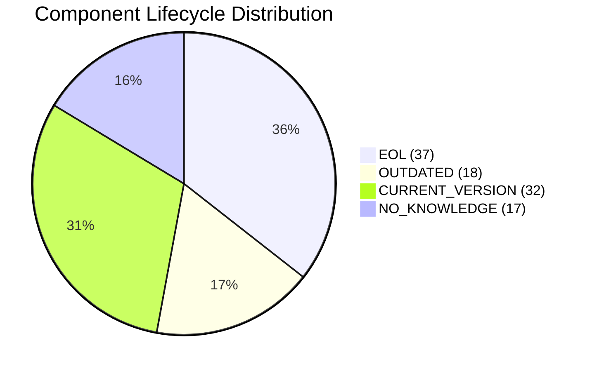

# Portfolio Modernization Report

## Portfolio Summary
- Total applications: **30**
- In scope: **26**
- Out of scope: **4** (`app005`, `app007`, `app009`, `app029` – retired)
- In-scope apps with at least one EOL component: **21 / 26**
- Average modernization complexity: **8.04 / 10**

## Technology Status (in-scope component-level)
- EOL: **37**
- OUTDATED: **18**
- CURRENT_VERSION: **32**
- NO_KNOWLEDGE: **17**

## Highest-Complexity Applications
- app004, app012, app013, app016, app022, app027, app030 (**10/10**)
- app002, app017, app023 (**9/10**)

## Scenario Applicability (in-scope)
- `update_outdated_components`: 25 APPLICABLE, 1 LACK_OF_DATA
- `app_refactor_decoupling`: 23 APPLICABLE, 3 PARTIALLY_FULFILLED
- `app_containerization`: 16 APPLICABLE, 10 FULFILLED
- `application_server_replacement`: 14 APPLICABLE, 9 FULFILLED, 3 NOT_APPLICABLE
- `upgrade_legacy_databases`: 13 APPLICABLE, 9 FULFILLED, 4 LACK_OF_DATA
- `switch_db_engine_open_source`: 12 APPLICABLE, 14 FULFILLED
- `app_deployment_to_cloud`: 8 APPLICABLE, 4 PARTIALLY_FULFILLED, 14 FULFILLED

## 3-Year Business Case (portfolio-level, complexity-adjusted)
| Scenario | Eligible Apps | Est. One-time Cost | Est. Yearly Savings | 3y ROI |
|---|---:|---:|---:|---:|
| switch_to_standard_linux_os | 3 | 1,080 | 1,200 | **2.33** |
| application_server_replacement | 14 | 200,000 | 168,000 | **1.52** |
| app_containerization | 16 | 2,050,000 | 1,600,000 | **1.34** |
| upgrade_legacy_databases | 13 | 172,000 | 130,000 | **1.27** |
| app_refactor_decoupling | 26 | 8,825,000 | 3,900,000 | 0.33 |
| app_deployment_to_cloud | 12 | 82,500 | 36,000 | 0.31 |
| switch_db_engine_open_source | 12 | 412,500 | 180,000 | 0.31 |
| os_update_security_patch | 15 | 20,700 | 7,500 | 0.09 |
| switch_to_arm_cpu | 10 | 72,500 | 10,000 | -0.59 |

## Recommended Execution Order
1. **application_server_replacement** (high risk reduction + strong ROI)
2. **upgrade_legacy_databases** (address EOL DB exposure)
3. **app_containerization** (high savings, but high execution effort)
4. **update_outdated_components** (broad hygiene program across 25 apps)
