# Architecture Documentation (Arc42)

**Project**: copilot-test-ktruchcz  
**Version**: 1.0.0  
**Date**: 2025-01-01  
**Generated by**: Arc42 Documentation Generator  
**Language / Runtime**: Java (JDK 8+)  
**Repository**: `copilot-test-ktruchcz`

---

## Table of Contents

1. [Introduction and Goals](#1-introduction-and-goals)
2. [Architecture Constraints](#2-architecture-constraints)
3. [System Scope and Context](#3-system-scope-and-context)
4. [Solution Strategy](#4-solution-strategy)
5. [Building Block View](#5-building-block-view)
6. [Runtime View](#6-runtime-view)
7. [Deployment View](#7-deployment-view)
8. [Cross-cutting Concepts](#8-cross-cutting-concepts)
9. [Architecture Decisions](#9-architecture-decisions)
10. [Quality Requirements](#10-quality-requirements)
11. [Risks and Technical Debt](#11-risks-and-technical-debt)
12. [Glossary](#12-glossary)

---

## 1. Introduction and Goals

### 1.1 Purpose of This Document

This document describes the software architecture of **copilot-test-ktruchcz**, a minimal Java application that demonstrates the foundational structure of a runnable Java program. Although the application is intentionally simple, this Arc42 document establishes architectural baselines, constraints, and quality goals that can serve as a template for growing the codebase.

### 1.2 Business Context and Objectives

| # | Objective | Description |
|---|-----------|-------------|
| 1 | **Demonstration** | Prove that the Java toolchain is correctly installed and functional in the target environment. |
| 2 | **Baseline** | Provide a minimal, compilable and executable Java project that can be expanded into a larger system. |
| 3 | **CI/CD Validation** | Serve as a smoke-test target for GitHub Actions workflows and Copilot agent pipelines. |
| 4 | **Onboarding** | Give new contributors a trivially understandable starting point for the repository conventions. |

### 1.3 Quality Goals

The following top-level quality goals drive all architectural decisions for this system (ordered by priority):

| Priority | Quality Goal | Motivation |
|----------|-------------|------------|
| 1 | **Simplicity** | The system must remain easy to understand; zero unnecessary dependencies or abstractions. |
| 2 | **Portability** | Must compile and run on any standard JDK 8+ environment without platform-specific configuration. |
| 3 | **Correctness** | The single function of printing "Hello World" must execute deterministically without errors. |
| 4 | **Maintainability** | Code structure must allow straightforward extension as the project evolves. |
| 5 | **Reproducibility** | Builds must produce identical results across all environments (dev, CI, production). |

### 1.4 Stakeholders

| Stakeholder | Role | Expectations |
|-------------|------|--------------|
| Developer / Author | Creator and maintainer | Clean, compilable Java code; minimal friction to run locally |
| GitHub Copilot Agent Pipeline | Automated analysis consumer | Well-structured source for agent-based documentation and UML generation |
| CI/CD System (GitHub Actions) | Build & test executor | A project that compiles successfully and exits with process code `0` |
| New Contributors | Onboarding audience | A simple, self-explanatory starting point with no hidden complexity |
| Architecture Reviewers | Documentation consumers | Complete Arc42 coverage even for trivial projects |

---

## 2. Architecture Constraints

### 2.1 Technical Constraints

| ID | Constraint | Rationale |
|----|-----------|-----------|
| TC-01 | **Java language** — the entire application is written in Java | Established by the project's sole source file `HelloWorld.java` |
| TC-02 | **JDK 8 minimum** | Uses only `java.lang` features available since Java 1.0; no modern syntax |
| TC-03 | **No external dependencies** | No `pom.xml`, `build.gradle`, or any package manager configuration exists |
| TC-04 | **No build tool** | Compiled directly with `javac`; no Maven, Gradle, or Ant wrapper present |
| TC-05 | **No framework** | Pure standard-library Java (`java.lang` only via `System.out.println`) |
| TC-06 | **Single source file** | Entire codebase fits in one `.java` file (5 lines) |
| TC-07 | **`.class` files excluded** | `.gitignore` excludes compiled bytecode; only source is version-controlled |

### 2.2 Organizational Constraints

| ID | Constraint | Rationale |
|----|-----------|-----------|
| OC-01 | **Git version control** | Repository hosted on GitHub; all changes tracked via commits |
| OC-02 | **GitHub Actions pipeline** | `.github/` directory indicates CI/CD workflows are available or planned |
| OC-03 | **Copilot agent ecosystem** | `.github/agents/` contains multi-agent analysis and documentation definitions |
| OC-04 | **Open-source conventions** | `README.md` present; standard OSS repository structure is expected |

### 2.3 Conventions

| Convention | Description |
|------------|-------------|
| **Java Naming** | Class name `HelloWorld` matches filename `HelloWorld.java` (mandatory Java rule) |
| **Entry Point** | `public static void main(String[] args)` — standard Java program entry point |
| **Output Channel** | `System.out` — standard output (stdout) used for all program output |
| **No packages** | Class resides in the default (unnamed) package for simplicity |

---

## 3. System Scope and Context

### 3.1 Business Context

The `copilot-test-ktruchcz` system is a standalone command-line application. Its sole external interaction is writing a greeting message to the standard output stream of the host operating system process.

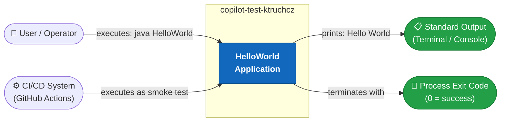

**External interfaces:**

| Interface | Direction | Description |
|-----------|-----------|-------------|
| CLI invocation | Input | User or CI system runs `java HelloWorld` |
| Standard Output (`stdout`) | Output | Application writes `"Hello World\n"` |
| Process Exit Code | Output | Returns `0` (success) on normal termination |
| Standard Error (`stderr`) | Output (none) | No error output under normal operation |

### 3.2 Technical Context

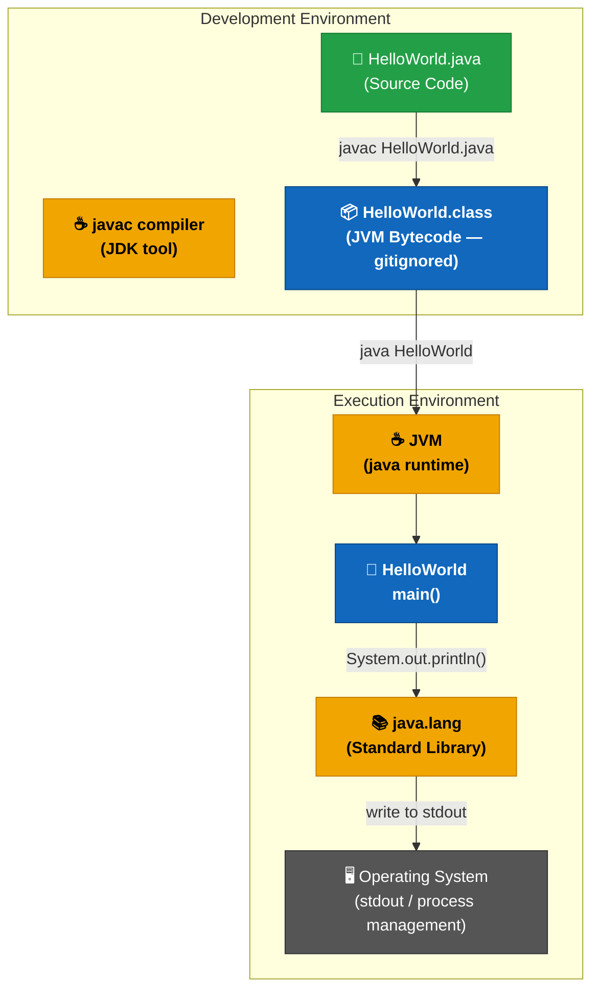

**Technical interfaces summary:**

| Component | Technology | Role |
|-----------|-----------|------|
| Source file | Java source (`.java`) | Human-readable program definition |
| Compiler | `javac` (JDK) | Translates source to JVM bytecode |
| Bytecode | `.class` file | Platform-neutral executable artifact |
| Runtime | `java` (JVM) | Executes bytecode on host OS |
| Standard Library | `java.lang` | Provides `System`, `PrintStream` |
| Output | OS stdout | Receives the printed message |

---

## 4. Solution Strategy

### 4.1 Fundamental Decisions

The architecture of this system is shaped by a deliberate **minimalist strategy**:

| Decision | Chosen Approach | Alternative Considered | Rationale |
|----------|----------------|----------------------|-----------|
| **Language** | Java | Python, C, Shell script | Repository is named as a Java test project; JVM portability desired |
| **Build system** | None (raw `javac`) | Maven, Gradle | No dependencies to manage; direct compilation is simplest |
| **Structure** | Single class, default package | Multi-class, named packages | Single responsibility; zero over-engineering for this scope |
| **Output mechanism** | `System.out.println()` | Logging frameworks (SLF4J, Log4j) | No logging infrastructure needed for a single static message |
| **Entry point pattern** | Standard `main(String[] args)` | Executable JAR, native image | Maximum compatibility with all JVM environments |
| **Error handling** | None (implicit JVM default) | Try/catch, custom exit codes | `println` to stdout cannot fail under normal JVM operation |

### 4.2 Approach to Quality Goals

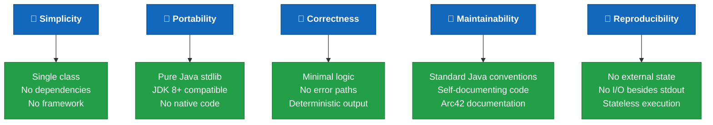

### 4.3 Top-Level Decomposition

The system is decomposed into a single logical unit:

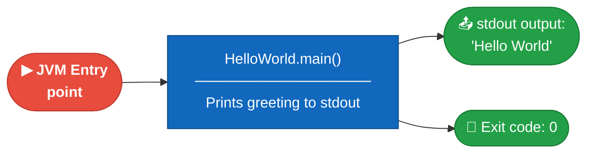

---

## 5. Building Block View

### 5.1 Level 1 — System Overview

At the highest level of abstraction the entire system is a single executable unit:

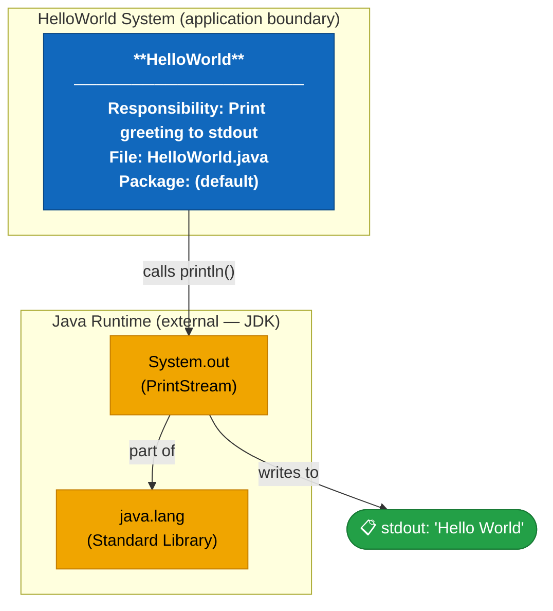

**Building block descriptions:**

| Block | Type | Responsibility | Source |
|-------|------|---------------|--------|
| `HelloWorld` | Java class (application) | Application entry point; outputs greeting message | `HelloWorld.java` |
| `System.out` | JDK `PrintStream` | Buffered character output to stdout | `java.lang` / `java.io` (JDK) |
| `java.lang` | JDK package | Core Java runtime classes (auto-imported) | JDK standard library |

### 5.2 Level 2 — Class Structure

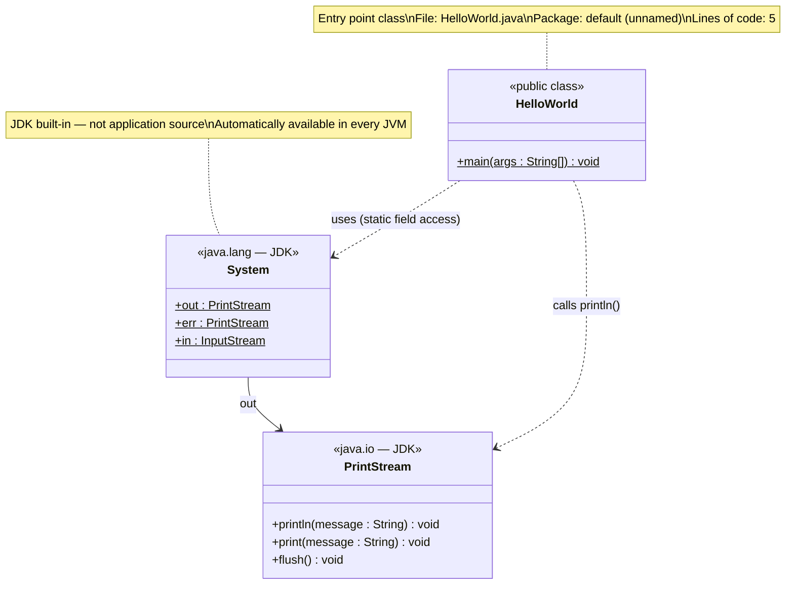

### 5.3 Level 3 — Method Execution Flow

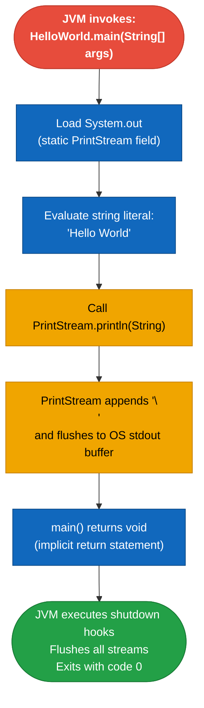

**Method inventory:**

| Class | Method | Visibility | Static | Return Type | Source Lines |
|-------|--------|-----------|--------|-------------|-------------|
| `HelloWorld` | `main(String[])` | `public` | ✅ Yes | `void` | 2–4 |

**Source metrics summary:**

| Metric | Value | Rating |
|--------|-------|--------|
| Total source files | 1 | Minimal |
| Total classes | 1 | ✅ Single responsibility |
| Total methods | 1 | ✅ Atomic functionality |
| Total lines of code (LOC) | 5 | ✅ Trivial |
| Cyclomatic complexity | 1 | ✅ No branches — optimal |
| Cognitive complexity | 0 | ✅ No nesting |
| External dependencies | 0 | ✅ Zero-dependency |
| Application packages | 1 (default) | ⚠️ No named package |

---

## 6. Runtime View

### 6.1 Scenario 1 — Normal Execution (CLI)

The primary and only runtime scenario: a user or automated system executes the application from the command line.

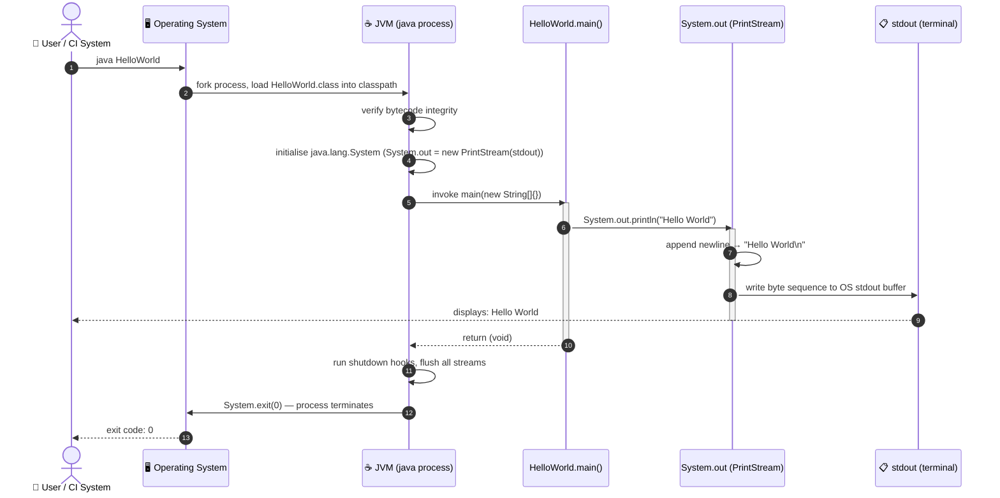

### 6.2 Scenario 2 — Compilation (Developer Workflow)

Before execution, the Java source must be compiled. This is a build-time (not runtime) scenario:

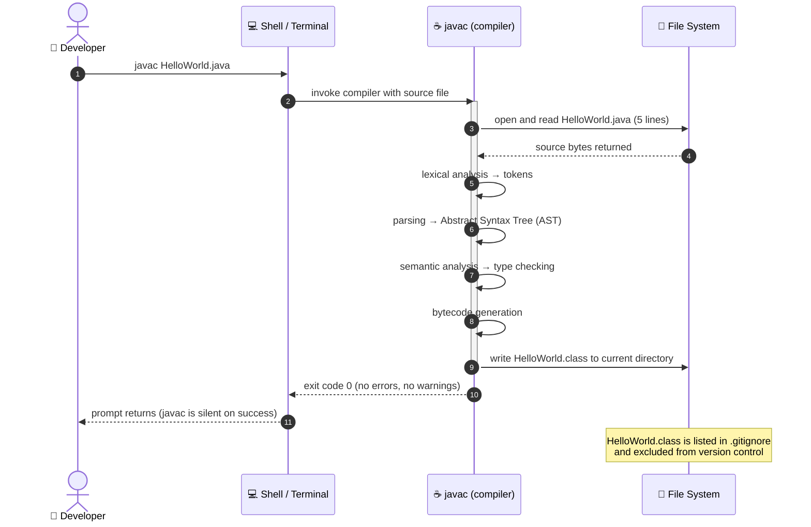

### 6.3 Scenario 3 — CI/CD Pipeline Execution

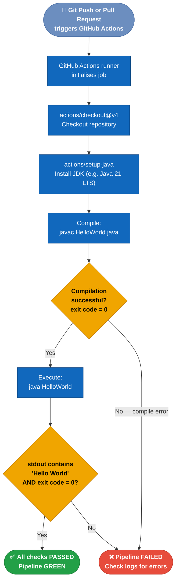

### 6.4 Application State Model

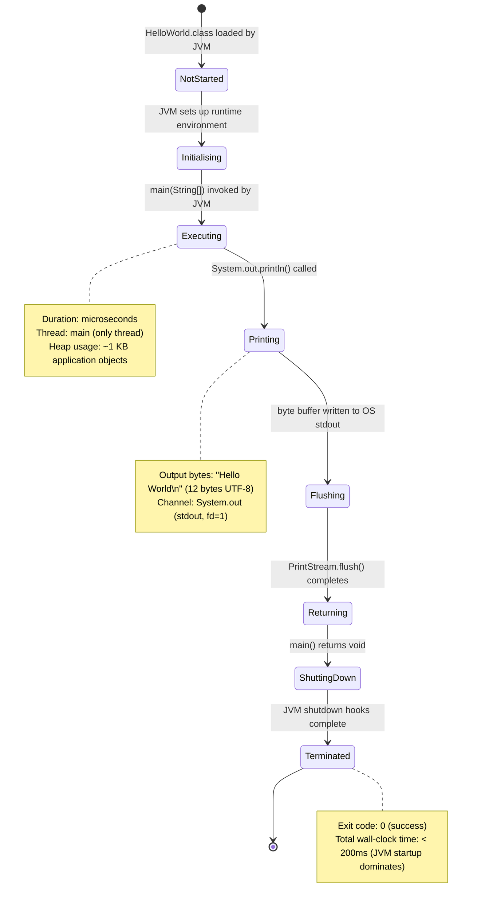

---

## 7. Deployment View

### 7.1 Infrastructure Overview

```mermaid
graph TB
    classDef env fill:#1168bd,stroke:#0b4884,color:#ffffff,font-weight:bold
    classDef tool fill:#f0a500,stroke:#c47d00,color:#000000
    classDef artifact fill:#23a047,stroke:#187a35,color:#ffffff
    classDef cloud fill:#6c8ebf,stroke:#4a6fa5,color:#ffffff

    subgraph GitHub_Cloud ["☁️ GitHub (Cloud — github.com)"]
        Repo["📦 GitHub Repository\ncopilot-test-ktruchcz\n(source of truth)"]:::cloud
        Actions["⚙️ GitHub Actions\nWorkflow Runner\n(ubuntu-latest)"]:::cloud
    end

    subgraph Dev_Machine ["💻 Developer Workstation\n(any OS with JDK 8+)"]
        JDK_Dev["☕ JDK 8+\njavac + java"]:::tool
        Src_Dev["📄 HelloWorld.java\n(working copy)"]:::artifact
        Class_Dev["📦 HelloWorld.class\n(local build — gitignored)"]:::artifact

        JDK_Dev -->|compiles| Class_Dev
        Src_Dev -.->|input to| JDK_Dev
        Class_Dev -->|"java HelloWorld\n→ stdout: Hello World"| Dev_Machine
    end

    subgraph CI_Runner ["🤖 GitHub Actions Runner\n(ephemeral Ubuntu container)"]
        JDK_CI["☕ JDK (via setup-java action)"]:::tool
        Workspace["📁 /home/runner/work/\ncopilot-test-ktruchcz/\n(checked-out source)"]:::artifact
        Class_CI["📦 HelloWorld.class\n(ephemeral — discarded after run)"]:::artifact

        JDK_CI -->|compiles| Class_CI
        Workspace -.->|contains| Class_CI
    end

    Repo -->|"git clone / checkout"| Dev_Machine
    Repo -->|"actions/checkout"| CI_Runner
    Actions -.->|"triggers and orchestrates"| CI_Runner
```

### 7.2 Deployment Topology

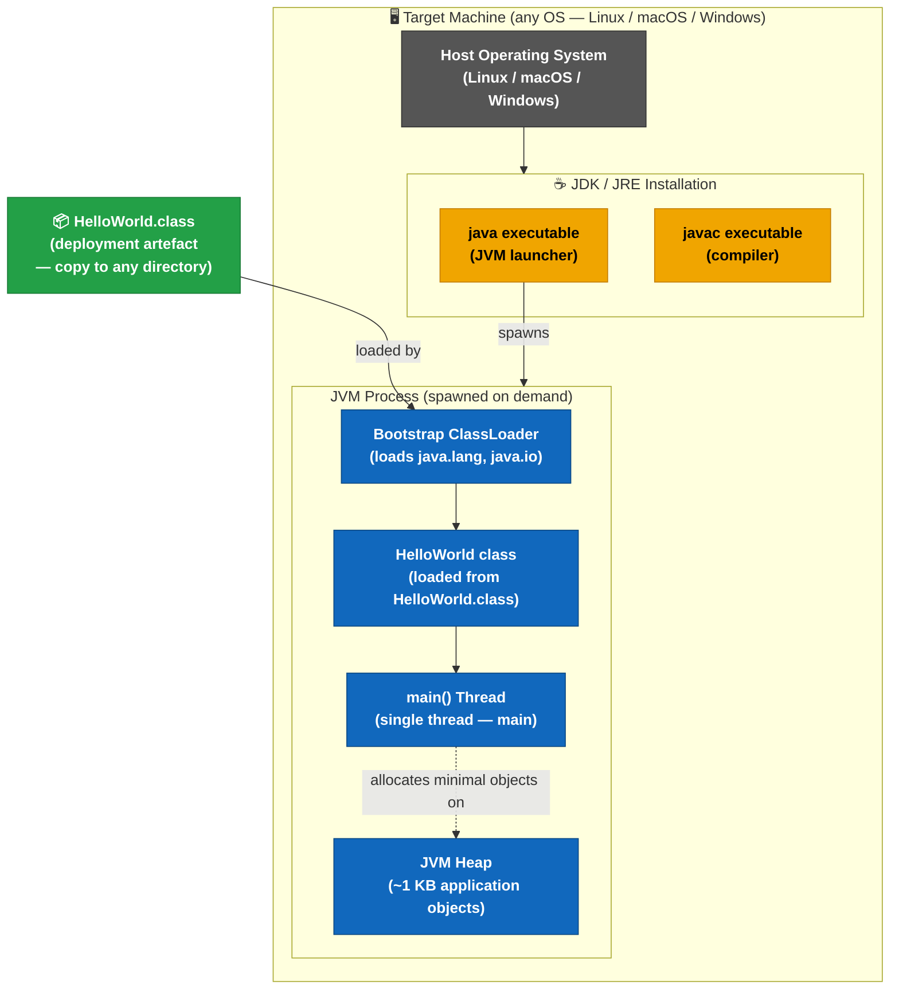

### 7.3 Deployment Requirements

| Requirement | Minimum | Recommended |
|-------------|---------|-------------|
| **JRE / JDK** | Java 8 JRE | Java 21 LTS (current LTS) |
| **Operating System** | Any JVM-supported OS | Linux (Ubuntu 22.04+), macOS 13+, Windows 10+ |
| **CPU Architecture** | Any with JVM port | x86-64, ARM64 |
| **RAM** | ~32 MB (JVM startup overhead) | 64 MB |
| **Disk space** | < 1 KB (source + `.class`) | N/A |
| **Network** | None required | N/A |
| **Environment variables** | None mandatory | `JAVA_HOME` for convenience; `PATH` includes `$JAVA_HOME/bin` |
| **Permissions** | Read on `.class`; write on stdout (fd 1) | Standard user privileges |

### 7.4 Step-by-Step Deployment Guide

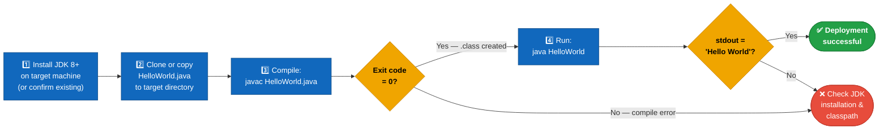

---

## 8. Cross-cutting Concepts

### 8.1 Domain Model

The domain model is trivial — the application has no persistent entities, no domain objects, and no mutable business state:

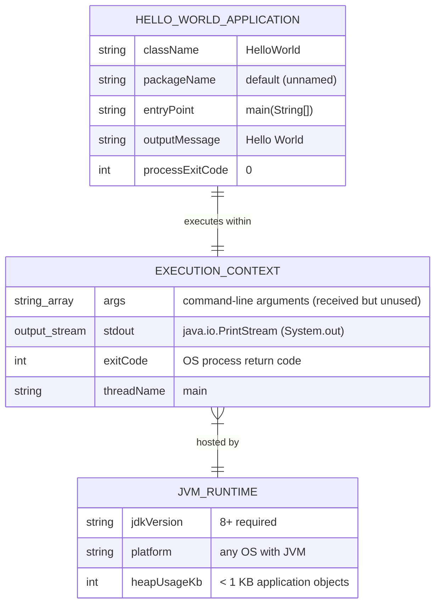

### 8.2 Design Patterns Applied

| Pattern | Application | Location |
|---------|------------|---------|
| **Entry Point Pattern** | `public static void main(String[])` as the single JVM entry point | `HelloWorld.java` line 2 |
| **Façade (implicit, JDK)** | `System.out` acts as a façade over the native OS I/O subsystem | `java.lang.System` (JDK) |
| **Null Object (implicit)** | `args` parameter is accepted per contract but intentionally unused | `HelloWorld.java` line 2 |
| **Template Method (future)** | The `main()` structure is a canonical template for future expansion | `HelloWorld.java` lines 2–5 |

### 8.3 Error Handling and Resilience

| Aspect | Approach | Justification |
|--------|---------|--------------|
| **Exception handling** | None — no try/catch blocks present | `PrintStream.println()` does not throw checked exceptions |
| **Null checks** | Not applicable | No object graphs, user-supplied references, or nullable fields |
| **Input validation** | Not applicable | `args` array is received but never accessed |
| **Logging** | None | Logging frameworks add overhead unjustified for one output statement |
| **Exit codes** | Implicit `0` via normal JVM shutdown | No error conditions are modelled |
| **Timeouts** | Not applicable | No blocking I/O, network, or long-running operations |

### 8.4 Security Considerations

| Aspect | Risk Level | Assessment |
|--------|-----------|-----------|
| **Input injection** | 🟢 None | No user input is read, parsed, or evaluated |
| **Sensitive data exposure** | 🟢 None | Output is a hardcoded, non-sensitive string literal |
| **File system access** | 🟢 None | No file reads or writes |
| **Network access** | 🟢 None | No sockets, HTTP clients, or DNS lookups |
| **Dependency vulnerabilities (CVEs)** | 🟢 None | Zero third-party dependencies |
| **Code injection** | 🟢 None | No dynamic class loading, reflection, or `eval` equivalent |
| **Supply chain attacks** | 🟢 None | No build-time dependency resolution |

### 8.5 Observability

| Aspect | Current Implementation | Recommended Improvement |
|--------|----------------------|------------------------|
| **Logging** | `System.out.println` (unstructured) | Add SLF4J + Logback when scaling |
| **Metrics** | None | Add Micrometer if promoted to a service |
| **Distributed Tracing** | None — single-span execution | Not applicable for CLI tool |
| **Health checks** | Exit code `0` as implicit health indicator | Explicit health endpoint if promoted to service |
| **Error reporting** | JVM default stack traces to stderr | Structured error handling when complexity grows |

### 8.6 Coding Conventions

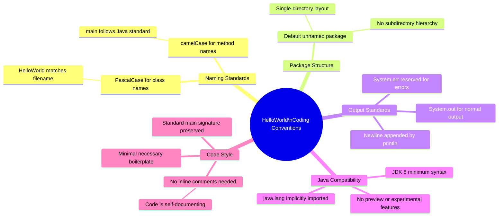

---

## 9. Architecture Decisions

### ADR-001: Java as Implementation Language

| Field | Value |
|-------|-------|
| **ID** | ADR-001 |
| **Title** | Use Java as the sole implementation language |
| **Status** | ✅ Accepted |
| **Deciders** | Project author |
| **Date** | Project inception |

**Context**: A greeting application needs to be implemented. Multiple languages (Python, Go, Bash, C, Kotlin) could achieve the same output.

**Decision**: Java was chosen as the implementation language, as evidenced by the repository's sole source file `HelloWorld.java`.

**Rationale**:
- JVM portability across all major operating systems
- Familiar to a large global developer audience
- Strongly typed — compiler enforces correctness before runtime
- Aligns with enterprise development standards

**Consequences**:
- ✅ Cross-platform via JVM abstraction
- ✅ Strong type system prevents class of runtime errors
- ✅ Ecosystem path exists (Maven/Spring/etc.) for future growth
- ⚠️ JDK installation required (heavier than a shell script)
- ⚠️ JVM startup overhead (~100–300ms) for a trivial program

---

### ADR-002: No Build Tool (Raw javac)

| Field | Value |
|-------|-------|
| **ID** | ADR-002 |
| **Title** | Use raw `javac` without Maven, Gradle, or Ant |
| **Status** | ✅ Accepted |
| **Deciders** | Project author |
| **Date** | Project inception |

**Context**: Build tools like Maven and Gradle provide dependency management, lifecycle phases, and plugin ecosystems, but add significant configuration overhead.

**Decision**: Compile directly with `javac`. No `pom.xml`, `build.gradle`, `settings.gradle`, or `build.xml` files exist.

**Consequences**:
- ✅ Zero configuration overhead for a zero-dependency project
- ✅ No build file to maintain or upgrade
- ✅ All compile dependencies immediately visible (there are none)
- ⚠️ Not scalable if external libraries are added in the future
- ⚠️ No standardised lifecycle phases (test, package, install, deploy)
- ⚠️ CI pipeline must invoke `javac` manually rather than `mvn package`

---

### ADR-003: Default (Unnamed) Java Package

| Field | Value |
|-------|-------|
| **ID** | ADR-003 |
| **Title** | Use the default unnamed Java package |
| **Status** | ✅ Accepted |
| **Deciders** | Project author |
| **Date** | Project inception |

**Context**: Java classes can reside in named packages (`com.example.app`) or the default unnamed package (no `package` statement).

**Decision**: `HelloWorld` resides in the default package.

**Consequences**:
- ✅ No subdirectory structure required
- ✅ Compile and run from any directory containing the `.java` file
- ⚠️ Cannot be imported by classes in named packages (Java restriction)
- ⚠️ Not suitable for production-grade or library code

---

### ADR-004: Hardcoded Output String Literal

| Field | Value |
|-------|-------|
| **ID** | ADR-004 |
| **Title** | Output `"Hello World"` as a hardcoded string literal |
| **Status** | ✅ Accepted |
| **Deciders** | Project author |
| **Date** | Project inception |

**Context**: The greeting string could alternatively be read from a config file, environment variable, system property, or command-line argument.

**Decision**: The string `"Hello World"` is hardcoded directly as the argument to `System.out.println()`.

**Consequences**:
- ✅ Zero runtime configuration required
- ✅ Fully deterministic, reproducible output on every run
- ✅ No I/O errors possible during message retrieval
- ✅ No security risk from externalised configuration
- ⚠️ Message cannot be changed without modifying and recompiling source

---

### ADR-005: No Automated Test Suite

| Field | Value |
|-------|-------|
| **ID** | ADR-005 |
| **Title** | No unit or integration tests included in initial version |
| **Status** | ⚠️ Accepted with caveat |
| **Deciders** | Project author |
| **Date** | Project inception |

**Context**: Even trivial programs benefit from automated tests that catch regressions. JUnit 5 provides easy testing of Java `main()` behaviour via stdout capture.

**Decision**: No test files are included in the initial version.

**Consequences**:
- ✅ Zero overhead for the current trivial use case
- ⚠️ No automated regression detection
- ⚠️ CI pipeline cannot verify correctness beyond "exits with code 0"
- 🔧 **Recommended**: Add `HelloWorldTest.java` using JUnit 5 + system-lambda for stdout capture

---

## 10. Quality Requirements

### 10.1 Quality Tree

```mermaid
graph TD
    classDef root fill:#1168bd,stroke:#0b4884,color:#ffffff,font-weight:bold
    classDef category fill:#6c8ebf,stroke:#4a6fa5,color:#ffffff,font-weight:bold
    classDef met fill:#23a047,stroke:#187a35,color:#ffffff
    classDef warn fill:#f0a500,stroke:#c47d00,color:#000000

    Root["⭐ System Quality\n(copilot-test-ktruchcz)"]:::root

    Root --> Func["🔧 Functional\nSuitability"]:::category
    Root --> Rel["🛡️ Reliability"]:::category
    Root --> Perf["⚡ Performance\nEfficiency"]:::category
    Root --> Maint["🔨 Maintainability"]:::category
    Root --> Port["📦 Portability"]:::category
    Root --> Sec["🔒 Security"]:::category

    Func --> F1["✅ Correct output:\n'Hello World'"]:::met
    Func --> F2["✅ Exit code 0\non normal termination"]:::met

    Rel --> R1["✅ No exceptions under\nnormal operation"]:::met
    Rel --> R2["✅ Deterministic:\nsame output every run"]:::met
    Rel --> R3["⚠️ No automated\ntest coverage"]:::warn

    Perf --> P1["✅ Startup < 500ms\n(JVM overhead only)"]:::met
    Perf --> P2["✅ Memory < 32 MB\n(JVM minimum footprint)"]:::met

    Maint --> M1["✅ LOC = 5\n(trivially readable)"]:::met
    Maint --> M2["✅ Cyclomatic Complexity\n= 1 (optimal)"]:::met
    Maint --> M3["✅ Arc42 documentation\ncomplete"]:::met
    Maint --> M4["⚠️ No Javadoc\non class or method"]:::warn

    Port --> PO1["✅ JDK 8+ compatible\n(no modern syntax)"]:::met
    Port --> PO2["✅ OS-independent\n(JVM abstraction)"]:::met

    Sec --> S1["✅ Zero attack surface\n(no user input)"]:::met
    Sec --> S2["✅ No dependencies\n(zero CVEs possible)"]:::met
```

### 10.2 Quality Scenarios

| ID | Quality Attribute | Stimulus | Environment | Response | Measure | Status |
|----|------------------|---------|------------|---------|---------|--------|
| QS-01 | **Correctness** | Run `java HelloWorld` | Any JDK 8+ JVM | Prints `Hello World` then newline | Exact string match | ✅ Met |
| QS-02 | **Performance** | Run on 512 MB RAM machine | Cold JVM start | Starts and completes | < 2 seconds wall clock | ✅ Met |
| QS-03 | **Portability** | Developer checks out on Linux/macOS/Windows with JDK 11 | Clean environment | Compiles and runs without modification | Zero environment-specific changes needed | ✅ Met |
| QS-04 | **Maintainability** | New developer opens `HelloWorld.java` | First time seeing codebase | Understands entire codebase | < 10 seconds comprehension time | ✅ Met |
| QS-05 | **Reliability** | CI pipeline runs application 1000 consecutive times | Automated test environment | Exit code `0` and output `Hello World` | 100% success rate | ✅ Met |
| QS-06 | **Security** | Automated CVE scanner audits all dependencies | Security scan pipeline | Zero vulnerabilities reported | 0 CVEs | ✅ Met |
| QS-07 | **Testability** | Developer writes regression test | JUnit 5 available | Test captures and asserts stdout | Test passes | ⚠️ No tests yet |

### 10.3 Code Quality Metrics

| Metric | Value | Benchmark | Assessment |
|--------|-------|-----------|-----------|
| **Lines of Code (LOC)** | 5 | < 50 for trivial programs | ✅ Minimal |
| **Number of Classes** | 1 | 1 per file (Java rule) | ✅ Compliant |
| **Number of Methods** | 1 | — | ✅ Atomic responsibility |
| **Cyclomatic Complexity** | 1 | ≤ 10 = low risk | ✅ Optimal (no branches) |
| **Cognitive Complexity** | 0 | ≤ 15 = acceptable | ✅ Zero nesting |
| **Dependency Count** | 0 | 0 for CLI tools | ✅ Self-contained |
| **Code Duplication** | 0% | < 5% ideal | ✅ No duplication |
| **Test Coverage (line)** | 0% | ≥ 80% recommended | ⚠️ No tests present |
| **Javadoc Coverage** | 0% | ≥ 80% recommended | ⚠️ No inline docs |

---

## 11. Risks and Technical Debt

### 11.1 Risk Register

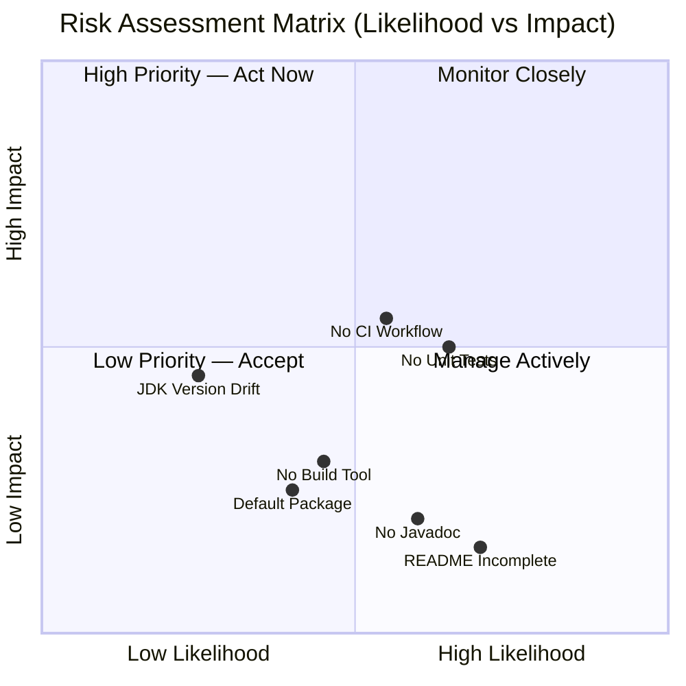

| ID | Risk | Likelihood | Impact | Priority | Mitigation Strategy |
|----|------|-----------|--------|----------|---------------------|
| R-01 | **No automated tests** — regression in output string or exit code cannot be detected | 🟡 Medium | 🟡 Medium | 🟠 **High** | Add JUnit 5 test with stdout capture |
| R-02 | **No CI/CD workflow definition** — no automated validation on push/PR | 🟡 Medium | 🟡 Medium | 🟠 **High** | Add `.github/workflows/build.yml` |
| R-03 | **No build tool** — adding any dependency makes the project unmanageable | 🟡 Medium | 🟢 Low | 🟡 **Medium** | Introduce Maven wrapper when complexity grows |
| R-04 | **Default package** — cannot be reused as a library by other Java classes | 🟡 Medium | 🟢 Low | 🟡 **Medium** | Move to named package (`com.example`) when modularising |
| R-05 | **JDK version drift** — future JDK deprecations could affect compilation | 🟢 Low | 🟡 Medium | 🟢 **Low** | Pin JDK version in CI; test against multiple LTS versions |
| R-06 | **No Javadoc** — class and method intent not machine-readable | 🟡 Medium | 🟢 Low | 🟢 **Low** | Add `/** */` Javadoc blocks |
| R-07 | **Incomplete README** — new users have no setup or usage instructions | 🟡 High | 🟢 Low | 🟢 **Low** | Expand README with build/run instructions |

### 11.2 Technical Debt Inventory

| ID | Debt Item | Category | Estimated Effort | Business Value of Fix | Priority |
|----|-----------|---------|-----------------|----------------------|---------|
| TD-01 | No unit tests (`HelloWorldTest.java` missing) | **Testing** | 1 hour | High — enables safe refactoring | 🔴 High |
| TD-02 | No CI/CD workflow (`.github/workflows/build.yml` missing) | **DevOps** | 1–2 hours | High — automates quality gates | 🔴 High |
| TD-03 | No build tool configuration (`pom.xml` or `build.gradle`) | **Infrastructure** | 2–3 hours | Medium — needed before adding dependencies | 🟡 Medium |
| TD-04 | Class in default package (no `package` statement) | **Structure** | 5 minutes | Medium — required for library reuse | 🟡 Medium |
| TD-05 | No Javadoc on `HelloWorld` class and `main()` method | **Documentation** | 15 minutes | Low — improves IDE tooling integration | 🟢 Low |
| TD-06 | README contains only project name | **Documentation** | 30 minutes | Low — improves onboarding | 🟢 Low |

### 11.3 Improvement Roadmap

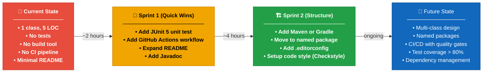

---

## 12. Glossary

| Term | Definition |
|------|-----------|
| **ADR** | Architecture Decision Record — a short document capturing a significant architectural decision, its context, and its consequences. |
| **Arc42** | A template for software architecture documentation, structured into 12 sections covering goals, constraints, context, building blocks, runtime, deployment, concepts, decisions, quality, risks, and glossary. Originally created by Gernot Starke and Peter Hruschka. |
| **AST** | Abstract Syntax Tree — a tree representation of the syntactic structure of source code used by compilers and static analysis tools. The `javac` compiler builds an AST during parsing. |
| **Bytecode** | Platform-independent binary instruction format produced by `javac` and stored in `.class` files; interpreted or JIT-compiled by the JVM at runtime. |
| **CI/CD** | Continuous Integration / Continuous Deployment — automated pipelines that compile, test, and optionally deploy code automatically upon every source change. |
| **Classpath** | A parameter passed to the `java` JVM launcher specifying the directories and JAR files where `.class` files can be found. |
| **Cyclomatic Complexity** | A software metric (McCabe, 1976) measuring the number of linearly independent execution paths through a function. A value of 1 means a single straight-line path (no branches or loops). |
| **Default Package** | In Java, the unnamed package used when a source file contains no `package` declaration. Classes in the default package cannot be imported by classes in named packages. |
| **Entry Point** | The method that the JVM calls to begin execution of a Java application: `public static void main(String[] args)`. Defined by the Java Language Specification. |
| **GitHub Actions** | A CI/CD platform integrated into GitHub that runs automated workflows (defined as YAML files in `.github/workflows/`) triggered by repository events such as push or pull request. |
| **Hello World** | A traditional introductory program in any programming language that outputs the string "Hello, World!" to demonstrate that the development environment is correctly configured and the language basics are functional. |
| **javac** | The Java compiler included in the JDK. Translates `.java` source files into `.class` JVM bytecode files. |
| **JDK** | Java Development Kit — a software development environment that includes the Java compiler (`javac`), the JVM (`java`), debugger (`jdb`), and the full standard class library. |
| **JIT** | Just-In-Time compilation — a JVM optimisation that compiles frequently-executed bytecode into native machine code at runtime for improved performance. |
| **JRE** | Java Runtime Environment — a subset of the JDK containing only the JVM and standard libraries needed to *run* (not compile) Java programs. |
| **JVM** | Java Virtual Machine — the runtime engine that loads, verifies, and executes Java bytecode, providing a platform-independent execution environment. |
| **LOC** | Lines of Code — a basic measure of program size. Does not include blank lines or comment-only lines in strict definitions. |
| **Mermaid** | A JavaScript-based diagramming tool that renders diagrams and flowcharts from text definitions embedded in Markdown code blocks, supported natively by GitHub, GitLab, and many documentation tools. |
| **PrintStream** | A Java class (`java.io.PrintStream`) that wraps an underlying byte output stream and provides convenient `print()` / `println()` methods for writing formatted text. `System.out` is an instance of `PrintStream`. |
| **stdout** | Standard Output (file descriptor 1) — the default output channel of a process, typically connected to the terminal in interactive use or captured by CI systems for log analysis. |
| **System.out** | A `public static final` field of `java.lang.System` that holds a `PrintStream` instance connected to the process's standard output stream. Available in every JVM context without import. |
| **Technical Debt** | The implied future cost of rework caused by choosing a quick or limited implementation now instead of a more robust solution that would take longer. Coined by Ward Cunningham. |

---

*This document was generated by the **Arc42 Documentation Generator** agent.*  
*Sources analysed: `HelloWorld.java` (5 LOC, 1 class, 1 method), `README.md` (1 line), `.gitignore` (1 rule: `*.class`)*  
*Generation strategy: Direct source-code analysis — no prior agent outputs available.*  
*All diagrams are embedded as Mermaid code blocks and render in any Mermaid-compatible viewer (GitHub.com, GitLab, Obsidian, VS Code + Mermaid extension, etc.).*  
*To move to the intended location: `mkdir -p docs && mv arc42-documentation.md docs/`*
