# Architecture Documentation (Arc42)

**Project**: copilot-test-ktruchcz — HelloWorld  
**Version**: 1.0.0  
**Date**: 2025-01-01  
**Generated by**: Arc42 Documentation Generator  
**Language**: Java  
**Source files analysed**: `HelloWorld.java`, `README.md`

---

## Table of Contents

1. [Introduction and Goals](#1-introduction-and-goals)
2. [Constraints](#2-constraints)
3. [Context and Scope](#3-context-and-scope)
4. [Solution Strategy](#4-solution-strategy)
5. [Building Block View](#5-building-block-view)
6. [Runtime View](#6-runtime-view)
7. [Deployment View](#7-deployment-view)
8. [Crosscutting Concepts](#8-crosscutting-concepts)
9. [Architecture Decisions](#9-architecture-decisions)
10. [Quality Requirements](#10-quality-requirements)
11. [Risks and Technical Debt](#11-risks-and-technical-debt)
12. [Glossary](#12-glossary)

---

## 1. Introduction and Goals

### 1.1 Purpose and Business Context

**copilot-test-ktruchcz** is a minimal Java console application whose sole purpose is to print the string `"Hello World"` to standard output. It serves as a canonical "getting-started" program that demonstrates the most fundamental structure of a valid, compilable, and runnable Java application.

While trivial in functional scope, this project fulfils several important secondary objectives:

| Objective | Description |
|-----------|-------------|
| **Developer Onboarding** | Validates that a developer's local JDK installation, `PATH`, and `CLASSPATH` configuration are correct |
| **CI/CD Bootstrapping** | Provides a minimal but complete project to verify GitHub Actions or other pipeline scaffolding |
| **Copilot Integration Testing** | Acts as a target repository for testing GitHub Copilot tooling (as indicated by the repository name prefix `copilot-test-`) |
| **Teaching Reference** | Demonstrates the required boilerplate structure of a Java class containing a `main` method |

### 1.2 Quality Goals

The top quality goals for this system, ranked by priority:

| Priority | Quality Goal | Motivation |
|----------|-------------|------------|
| 1 | **Correctness** | The application must compile without errors and produce exactly `"Hello World\n"` on stdout |
| 2 | **Simplicity** | The source must remain as simple as possible — one file, no dependencies, no configuration |
| 3 | **Portability** | Must run on any platform that provides a compatible JDK/JRE (Windows, macOS, Linux) |
| 4 | **Readability** | Code must be immediately understandable by anyone familiar with any C-style language |

### 1.3 Stakeholders

| Stakeholder | Role | Expectation |
|-------------|------|-------------|
| **Developer / Author** | Creator and primary user | A working local Java environment confirmed by a successful run |
| **CI/CD Pipeline** | Automated consumer | Successful compile and execute steps in a GitHub Actions workflow |
| **GitHub Copilot Agent** | Automated code analysis tool | A well-formed repository with analysable Java source |
| **Instructor / Reviewer** | Educational reviewer | A correct, readable example of a Java entry-point class |

---

## 2. Constraints

### 2.1 Technical Constraints

| ID | Constraint | Rationale |
|----|-----------|-----------|
| TC-01 | **Java language** — the application is written in Java | The repository contains a `.java` source file; the entire ecosystem (compilation, execution) is Java-based |
| TC-02 | **JDK required for compilation** — `javac` must be available | There is no pre-compiled bytecode or JAR file committed to the repository |
| TC-03 | **JRE required for execution** — `java` runtime must be available | The application produces no native binary; it runs on the JVM |
| TC-04 | **No external dependencies** | There is no `pom.xml`, `build.gradle`, or any dependency manifest — the standard library (`java.lang`) is the only import |
| TC-05 | **No build tool** | Compilation must be performed manually via `javac` or via a pipeline step |
| TC-06 | **Single source file** | The entire application lives in `HelloWorld.java`; there is no multi-file structure to maintain |
| TC-07 | **Default (unnamed) package** | The class is declared without a `package` statement, placing it in the unnamed/default Java package |

### 2.2 Organisational Constraints

| ID | Constraint | Rationale |
|----|-----------|-----------|
| OC-01 | **Hosted on GitHub** | The repository is managed via GitHub; collaboration and CI rely on GitHub tooling |
| OC-02 | **GitHub Actions available** | `.github/` directory is present, indicating pipeline configuration exists or is planned |
| OC-03 | **Minimal documentation policy** | README contains only the project name; documentation is intentionally kept lightweight |

### 2.3 Conventions

| Convention | Description |
|-----------|-------------|
| **Class name matches file name** | `HelloWorld` class is stored in `HelloWorld.java` — required by the Java specification for `public` classes |
| **`main` method signature** | `public static void main(String[] args)` — the standard JVM entry-point contract |
| **`System.out.println`** | Standard Java idiom for console output to stdout |

---

## 3. Context and Scope

### 3.1 Business Context

The HelloWorld application is a **self-contained, standalone system** with no integration with any external business systems, databases, message queues, or APIs. Its entire interaction surface is:

- **Input**: None (command-line arguments `args` are accepted by signature but not consumed)
- **Output**: The string `Hello World` written to standard output (`stdout`)

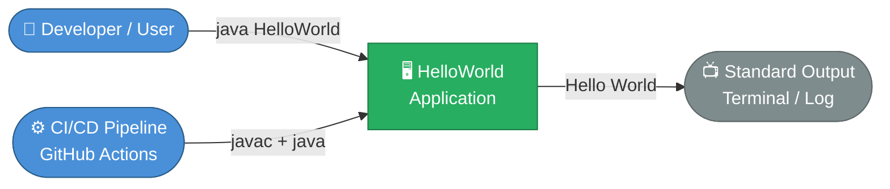

### 3.2 Technical Context

From a technical perspective, the system interacts with the following infrastructure components:

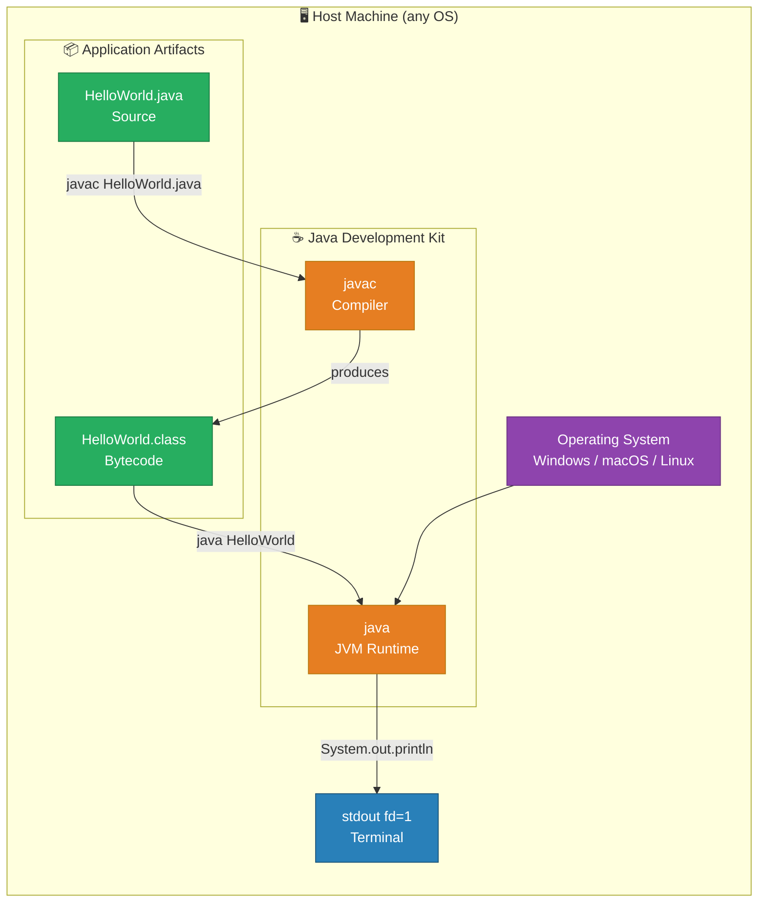

| Channel | Direction | Technology | Description |
|---------|-----------|-----------|-------------|
| Compilation | `HelloWorld.java` → `HelloWorld.class` | `javac` | Java compiler transforms source to JVM bytecode |
| Execution | `HelloWorld.class` → JVM | `java` | JVM loads and executes the bytecode |
| Output | JVM → stdout | `System.out` | PrintStream writes `Hello World` followed by a newline |

### 3.3 Scope Boundaries

**In scope:**
- Compilation of `HelloWorld.java`
- Execution of the `main` method
- Writing `"Hello World"` to stdout

**Out of scope:**
- Network communication
- File I/O (beyond stdout)
- User input handling
- Persistence or databases
- Configuration management
- Error handling or exception management

---

## 4. Solution Strategy

### 4.1 Strategy Overview

The solution follows the **simplest possible Java program structure**, deliberately avoiding any complexity that is not required by the stated goal of printing "Hello World".

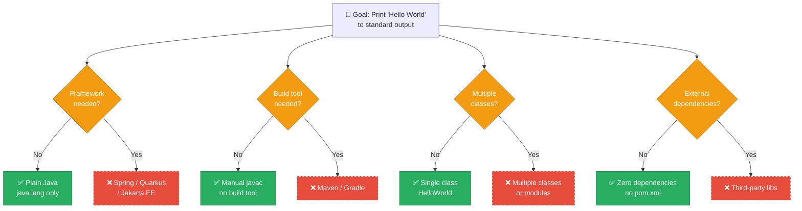

### 4.2 Technology Decisions Summary

| Decision | Choice | Rationale |
|----------|--------|-----------|
| **Language** | Java | Repository is explicitly Java-based |
| **Framework** | None | Zero functional requirements beyond stdout output |
| **Build system** | None — manual `javac` | Single-file project requires no build automation |
| **Dependencies** | None | `java.lang.System` is available without any import statement |
| **Package structure** | Default (unnamed) package | Single class; package hierarchy adds no value |
| **Design pattern** | None | No complexity to manage or abstract |

### 4.3 Approach to Quality Goals

| Quality Goal | Approach |
|-------------|----------|
| **Correctness** | Standard `main` signature ensures JVM entry-point recognition; `println` guarantees newline-terminated output |
| **Simplicity** | One class, one method, one statement — irreducible minimum |
| **Portability** | Pure `java.lang` API available on all Java SE platforms since Java 1.0 |
| **Readability** | Self-documenting code: class name, method, and output string are all semantically transparent |

---

## 5. Building Block View

### 5.1 Level 1 — System Overview

At the highest level of abstraction, the entire application is a single deployable unit with one input trigger and one output channel.

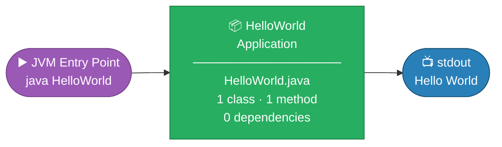

### 5.2 Level 2 — Class Structure

The application consists of exactly one Java class. The class diagram below documents its complete structure.

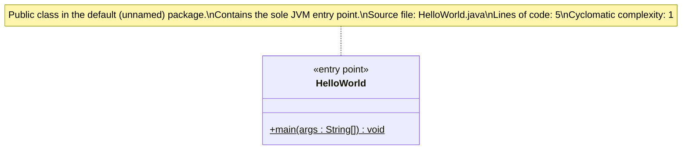

**Class responsibilities:**

| Element | Type | Modifier | Responsibility |
|---------|------|----------|----------------|
| `HelloWorld` | Class | `public` | Container for the application entry point |
| `main(String[])` | Method | `public static` | JVM-invoked entry point; writes `"Hello World"` to stdout |

### 5.3 Level 3 — Method Execution Detail

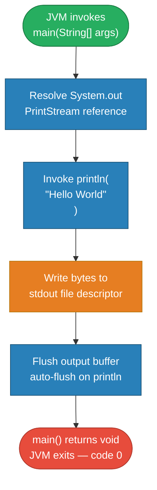

---

## 6. Runtime View

### 6.1 Scenario 1 — Normal Execution (Developer Runs Locally)

This is the primary and only runtime scenario. A developer compiles and executes the application from the command line.

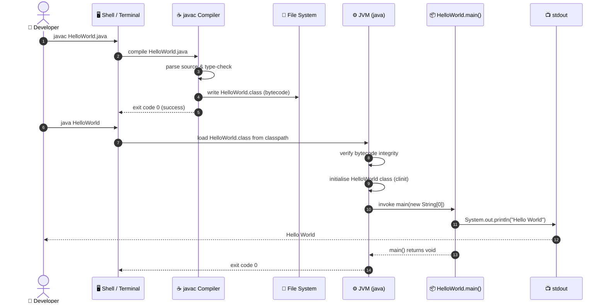

### 6.2 Scenario 2 — CI/CD Pipeline Execution

When executed by an automated pipeline (e.g. GitHub Actions), the flow is structurally identical but triggered by a push event rather than a human command.

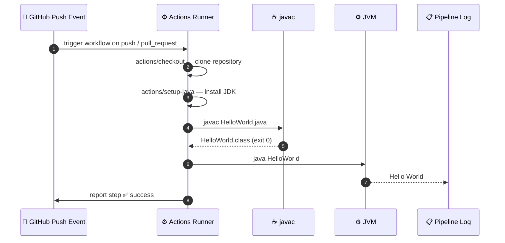

### 6.3 Runtime State Model

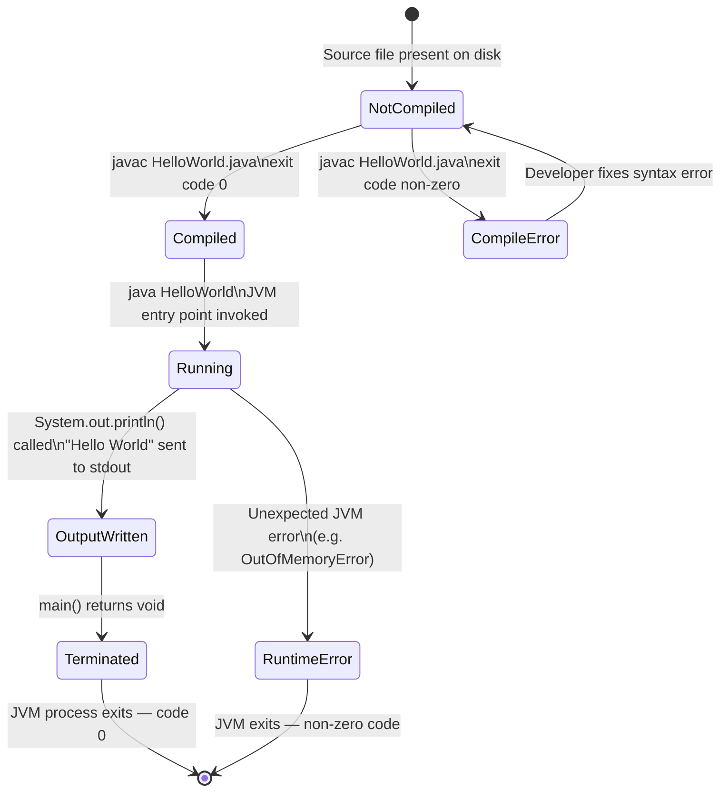

---

## 7. Deployment View

### 7.1 Infrastructure Overview

The HelloWorld application requires no dedicated server, container, or cloud service. It executes entirely within a JVM process on any host machine that satisfies the Java platform requirements.

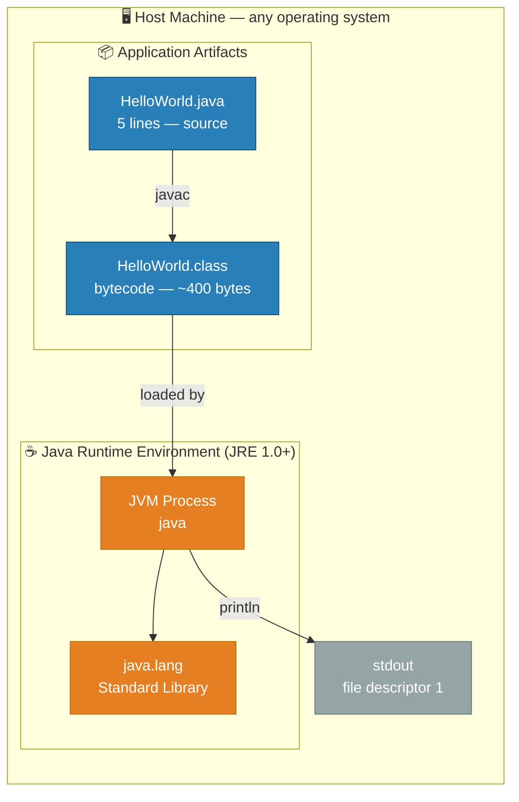

### 7.2 Deployment Environments

| Environment | Host | JDK/JRE Version | How to Run |
|-------------|------|----------------|-----------|
| **Local Development** | Developer workstation | JDK 8+ recommended | `javac HelloWorld.java && java HelloWorld` |
| **GitHub Actions** | Ubuntu runner (GitHub-hosted) | JDK configured in workflow YAML | Automated pipeline step |
| **Linux server** | SSH-accessible host | JRE 1.0+ | `java HelloWorld` (if `.class` is present) |
| **Windows** | Windows workstation | JDK 8+ | Same commands via `cmd` or PowerShell |
| **macOS** | macOS workstation | JDK 8+ (via Homebrew or Oracle installer) | Same commands via Terminal |

### 7.3 Minimum System Requirements

| Requirement | Minimum | Notes |
|-------------|---------|-------|
| **Java version** | Java SE 1.0 | `System.out.println` and `String[] args` exist since Java 1.0 |
| **Disk space (source)** | < 1 KB | `HelloWorld.java` is 5 lines |
| **Disk space (bytecode)** | < 1 KB | Compiled `HelloWorld.class` is approximately 400 bytes |
| **RAM** | ~32 MB | Minimum JVM heap for a minimal program |
| **CPU** | Any | No computation performed |
| **Network** | None required | No network I/O whatsoever |
| **OS** | Any JVM-supported platform | Windows, macOS, Linux, and others |

### 7.4 Build and Deployment Pipeline

---

## 8. Crosscutting Concepts

### 8.1 Output and Logging Concept

The application uses **`System.out`** (Java's standard output `PrintStream`) as its sole output channel. There is no logging framework (e.g. SLF4J, Log4j, `java.util.logging`).

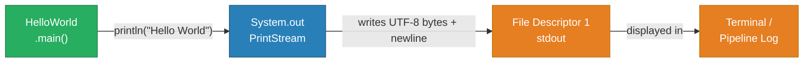

| Aspect | Detail |
|--------|--------|
| **Output stream** | `System.out` — `java.io.PrintStream` |
| **Method used** | `println(String)` — appends platform line separator (`\n` on Unix, `\r\n` on Windows) |
| **Encoding** | JVM default charset (typically UTF-8 on modern systems) |
| **Buffering** | `PrintStream` auto-flushes on every `println` call |
| **Error stream** | `System.err` — not used |

### 8.2 Error Handling Concept

The application performs **no explicit error handling**. There are no `try/catch` blocks, no checked exceptions to handle, and `System.out.println` does not declare any checked exceptions.

| Scenario | Behaviour |
|----------|-----------|
| Normal execution | JVM exits with code `0` |
| `stdout` redirected to `/dev/null` | Bytes are discarded silently; program exits normally |
| stdout is a closed pipe | `PrintStream` may silently swallow `IOException`; exit code still `0` |
| `OutOfMemoryError` | JVM terminates with non-zero exit code (theoretically possible; practically impossible for this program) |

### 8.3 Portability Concept

The application achieves cross-platform portability through exclusive use of:

| Portability Factor | Detail |
|-------------------|--------|
| **`java.lang.System`** | Available in every Java SE distribution on every platform |
| **No native calls** | Zero JNI or platform-specific API calls |
| **No file paths** | No OS-specific path separator dependencies |
| **No encoding assumption** | `println` uses the JVM default charset, which is configurable at launch |
| **Java 1.0 API only** | Maximum backward compatibility across all JDK versions |

### 8.4 Security Concept

| Aspect | Status | Notes |
|--------|--------|-------|
| Input validation | N/A | No user input is consumed |
| Authentication | N/A | Standalone CLI tool |
| Authorisation | N/A | No protected resources |
| Secrets / credentials | ✅ None | No sensitive data in source |
| Network exposure | ✅ None | Zero network I/O |
| File system access | ✅ None | Only stdout (write-only, append-only) |
| **Attack surface** | ✅ Zero | No exploitable entry points |

### 8.5 Testability Concept

Currently, the application has **no automated tests**. The following refactoring improves testability by injecting the output stream as a parameter:

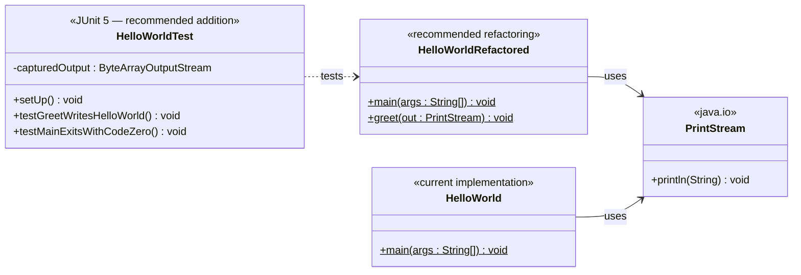

*Note: `HelloWorldRefactored` represents a **recommended future refactoring** to improve testability, not the current implementation.*

---

## 9. Architecture Decisions

### ADR-001: Use Plain Java With No Framework

| Field | Value |
|-------|-------|
| **ID** | ADR-001 |
| **Status** | Accepted |
| **Date** | Project inception |

**Context:**
The sole functional requirement is to print `"Hello World"` to the console. A technology choice must be made for the language and runtime environment.

**Decision:**
Use plain Java SE with no application framework (no Spring, no Quarkus, no Jakarta EE, no Micronaut).

**Rationale:**
- No framework features are needed (no dependency injection, HTTP server, ORM, etc.)
- Zero framework overhead aligns with the simplicity quality goal
- Any Java-aware developer can read and understand the code immediately
- Startup time is minimal with no framework initialisation phase

**Consequences:**

| Outcome | Type |
|---------|------|
| Zero dependencies — no version conflicts, no CVE exposure in transitive deps | ✅ Positive |
| Compiles and runs with nothing but a standard JDK | ✅ Positive |
| Eternal forward-compatibility (`java.lang` API is frozen by Java SE spec) | ✅ Positive |
| No production-grade features (structured logging, metrics, health checks) | ❌ Negative (acceptable) |

---

### ADR-002: No Build Tool — Manual javac

| Field | Value |
|-------|-------|
| **ID** | ADR-002 |
| **Status** | Accepted |
| **Date** | Project inception |

**Context:**
Java projects typically use a build tool (Maven or Gradle) to manage compilation, dependency resolution, and packaging.

**Decision:**
Compile directly with `javac` rather than introducing Maven or Gradle.

**Rationale:**
- Single source file with zero dependencies makes build tools unnecessary overhead
- Reduces repository footprint (no `pom.xml`, `build.gradle`, `gradlew`, wrapper scripts, etc.)
- Eliminates all build tool versioning and compatibility concerns

**Consequences:**

| Outcome | Type |
|---------|------|
| No build tool installation required to compile and run | ✅ Positive |
| Simpler, smaller repository structure | ✅ Positive |
| No dependency management if the project grows beyond one file | ❌ Negative |
| No standard lifecycle phases (compile/test/package/deploy) | ❌ Negative |
| No IDE project import via standard descriptor (`pom.xml`, `.gradle`) | ❌ Negative |

---

### ADR-003: Default (Unnamed) Java Package

| Field | Value |
|-------|-------|
| **ID** | ADR-003 |
| **Status** | Accepted |
| **Date** | Project inception |

**Context:**
Java classes can be placed in named packages (e.g. `com.example.helloworld`) or in the default unnamed package.

**Decision:**
Declare `HelloWorld` in the default package (no `package` statement in the source file).

**Rationale:**
- A single-class application gains nothing from package namespacing
- Default package simplifies both compilation (`javac HelloWorld.java`) and execution (`java HelloWorld`) — no classpath subdirectory path required
- Consistent with the minimal-complexity strategy of this project

**Consequences:**

| Outcome | Type |
|---------|------|
| Simplest possible compile and run commands | ✅ Positive |
| Cannot be imported by classes in named packages | ❌ Negative (irrelevant at this scope) |
| Not suitable as a pattern for production Java applications | ❌ Negative (noted as teaching caveat) |

---

### ADR-004: `System.out.println` for Console Output

| Field | Value |
|-------|-------|
| **ID** | ADR-004 |
| **Status** | Accepted |
| **Date** | Project inception |

**Context:**
Java offers multiple ways to write text to the console: `System.out.println`, `System.out.print`, `System.out.printf`, `PrintWriter`, various logging frameworks, etc.

**Decision:**
Use `System.out.println("Hello World")`.

**Rationale:**
- `println` appends the platform line separator, ensuring correct output on all operating systems
- No import statement is required (`java.lang.System` is auto-imported)
- The most universally recognised Java console output idiom
- Auto-flushes the output buffer, guaranteeing output is visible before the process exits

**Consequences:**

| Outcome | Type |
|---------|------|
| Output is correctly newline-terminated on all platforms | ✅ Positive |
| No import statement needed | ✅ Positive |
| Output goes to stdout only — no log level, timestamp, or structured format | ❌ Negative (acceptable for scope) |

---

## 10. Quality Requirements

### 10.1 Quality Tree

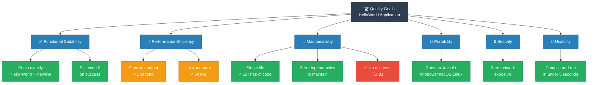

### 10.2 Quality Scenarios

| ID | Quality Attribute | Scenario | Stimulus | Expected Response | Priority |
|----|------------------|----------|---------|-------------------|----------|
| QS-01 | **Correctness** | Developer runs compiled app | `java HelloWorld` | stdout contains exactly `Hello World` followed by a newline | HIGH |
| QS-02 | **Correctness** | Compilation from a clean state | `javac HelloWorld.java` | Produces `HelloWorld.class`, exit code 0, zero compiler warnings | HIGH |
| QS-03 | **Performance** | Developer runs on any machine | `java HelloWorld` | Output appears within 1 second of invocation | MEDIUM |
| QS-04 | **Portability** | Executed on Windows 11 / macOS 14 / Ubuntu 22.04 | `java HelloWorld` | Identical output on all three platforms | HIGH |
| QS-05 | **Maintainability** | New developer views source | Opens `HelloWorld.java` in editor | Understands the full program in under 30 seconds | MEDIUM |
| QS-06 | **Simplicity** | Count external dependencies | Inspect repository for manifests | Zero external dependencies found | HIGH |

### 10.3 Code Metrics

| Metric | Value | Status | Assessment |
|--------|-------|--------|-----------|
| **Lines of Code (total)** | 5 | ✅ | Minimal |
| **Lines of Code (executable logic)** | 1 | ✅ | Single statement |
| **Cyclomatic Complexity** | 1 | ✅ | No branching — minimum possible |
| **Number of Classes** | 1 | ✅ | Minimal |
| **Number of Methods** | 1 | ✅ | Minimal |
| **Number of External Dependencies** | 0 | ✅ | Zero |
| **Automated Test Coverage** | 0% | ⚠️ | No tests exist |
| **Javadoc Coverage** | 0% | ⚠️ | No documentation comments |
| **Compiler Warnings** | 0 | ✅ | Clean compile |

---

## 11. Risks and Technical Debt

### 11.1 Risk Register

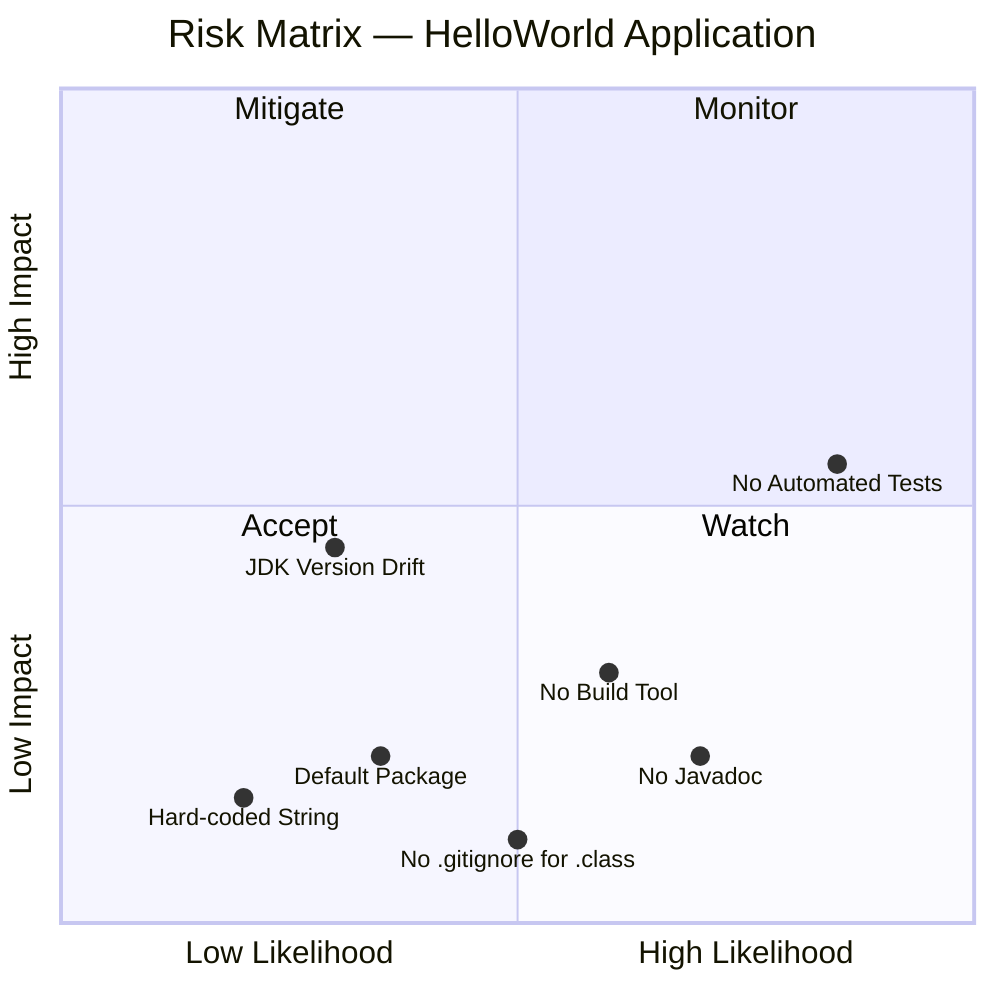

### 11.2 Risk Details

| ID | Risk | Likelihood | Impact | Category | Mitigation Strategy |
|----|------|-----------|--------|----------|-------------------|
| R-01 | **No automated tests** — regressions cannot be detected automatically | High | Medium | Quality | Add `HelloWorldTest.java` using JUnit 5; capture stdout via `ByteArrayOutputStream` |
| R-02 | **No build tool** — inconsistent compilation across developer environments | Medium | Low | Operations | Introduce `pom.xml` or `build.gradle` if project grows beyond a single file |
| R-03 | **JDK version drift** — developer uses incompatible JDK version | Low | Medium | Environment | Pin minimum Java version in `README.md`; add `--release 8` flag to `javac` |
| R-04 | **Hard-coded output string** — changing the message requires recompile | Low | Low | Flexibility | Accept for current scope; externalise to a `.properties` file if needed |
| R-05 | **No Javadoc** — class and method intent not formally documented in source | Medium | Low | Documentation | Add class-level and method-level Javadoc comments |
| R-06 | **Default package** — class cannot be imported from named packages | Low | Low | Design | Acceptable for standalone app; add `package` declaration if used as a library |
| R-07 | **`*.class` not confirmed in `.gitignore`** — compiled bytecode may be accidentally committed | Medium | Low | Hygiene | Verify `.gitignore` includes the `*.class` pattern |

### 11.3 Technical Debt Summary

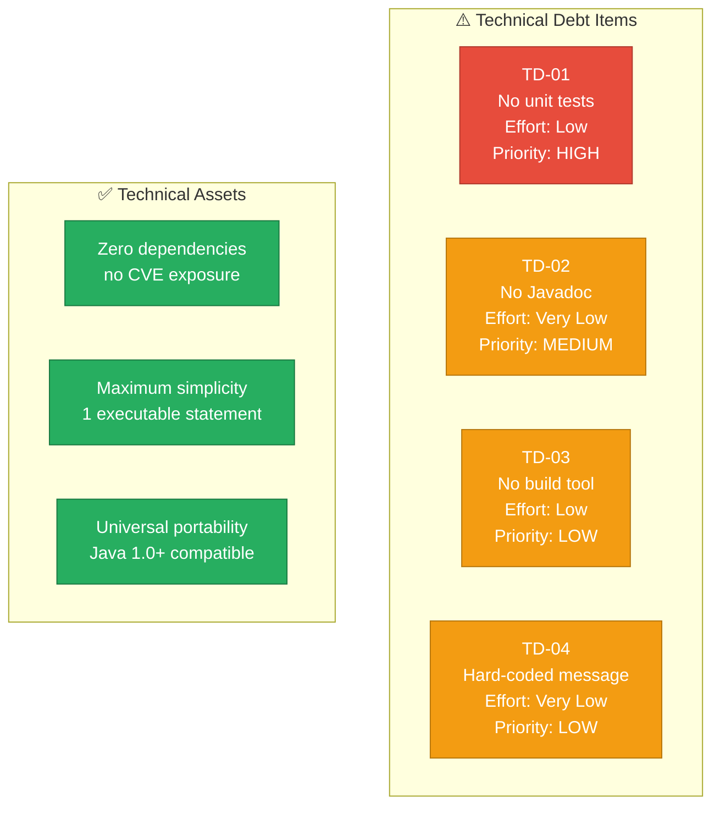

### 11.4 Recommended Improvement Backlog

| Priority | Item | Estimated Effort | Expected Benefit |
|----------|------|-----------------|-----------------|
| 🔴 HIGH | Add `HelloWorldTest.java` with JUnit 5 | 1 hour | Automated correctness verification in CI/CD |
| 🟡 MEDIUM | Add Javadoc to class and `main` method | 15 minutes | Formal in-source API documentation |
| 🟡 MEDIUM | Add `pom.xml` (Maven) or `build.gradle` (Gradle) | 30 minutes | Standardised build lifecycle and IDE project support |
| 🟢 LOW | Externalise `"Hello World"` to a constant or `.properties` file | 15 minutes | Easier message customisation without recompilation |
| 🟢 LOW | Add `package com.example.helloworld` declaration | 5 minutes | Follows Java package naming conventions for real projects |
| 🟢 LOW | Verify `*.class` is in `.gitignore` | 5 minutes | Prevents accidental bytecode commits to the repository |
| 🟢 LOW | Expand `README.md` with build and run instructions | 20 minutes | Improves onboarding experience for new developers |

---

## 12. Glossary

| Term | Definition |
|------|-----------|
| **Arc42** | A lean, practical template for software architecture documentation structured into 12 sections. Designed to be as lightweight or as detailed as the project demands. See [arc42.org](https://arc42.org) |
| **Bytecode** | Platform-independent intermediate representation produced by `javac` from `.java` source files. Stored in `.class` files. Executed by the JVM. Not human-readable but portable across all JVM-supported operating systems |
| **CI/CD** | Continuous Integration / Continuous Delivery. Automated pipelines (here: GitHub Actions) that compile, test, and optionally deploy code on every push or pull request |
| **Classpath** | A list of directories and JAR files that the JVM searches when loading classes at runtime. For this application, the current directory (`.`) is the entire classpath |
| **CLI (Command-Line Interface)** | Interaction model where the user types commands in a terminal or shell. HelloWorld is a pure CLI application with no graphical or web interface |
| **Default package** | The unnamed package in Java. A class without a `package` statement belongs to it. Classes in named packages cannot import classes from the default package |
| **Entry point** | The method where JVM program execution begins. In Java SE, this is always `public static void main(String[] args)` |
| **`HelloWorld`** | The single Java class in this repository. By Java specification, the name of a `public` class must exactly match its source file name |
| **`java`** | The command-line tool that launches the JVM and executes compiled Java bytecode. Usage: `java HelloWorld` |
| **`javac`** | The Java compiler. Transforms `.java` source files into `.class` bytecode files. Usage: `javac HelloWorld.java` |
| **Java SE (Standard Edition)** | The core Java platform specification, defining the language, JVM behaviour, and the standard library (`java.lang`, `java.io`, `java.util`, etc.) |
| **JDK (Java Development Kit)** | The full Java distribution including the compiler (`javac`), runtime (`java`), debugger, and standard library. Required for source compilation |
| **JRE (Java Runtime Environment)** | A subset of the JDK containing only the runtime (`java`) and standard library. Sufficient for executing pre-compiled `.class` files |
| **JVM (Java Virtual Machine)** | The runtime engine that loads, verifies, and executes Java bytecode. Provides the platform abstraction layer that makes Java programs portable |
| **`main` method** | See *Entry point* |
| **Named package** | A Java package declared with a `package` statement (e.g. `package com.example`). Provides namespace organisation for multi-class projects. Not used in this application |
| **`PrintStream`** | `java.io.PrintStream` — the Java class behind `System.out`. Provides `print`, `println`, and `printf` methods for writing text to an output stream |
| **`System.out`** | A `public static final` field of `java.lang.System` of type `PrintStream`, connected to the process's standard output stream (file descriptor 1) |
| **`System.out.println`** | A method call that writes a string argument followed by the platform-native line separator to standard output, then flushes the buffer |
| **stdout (Standard Output)** | The default output channel of a process, typically connected to the terminal. File descriptor 1 in POSIX systems. Text written here is captured by redirects, pipes, and CI/CD log collectors |
| **Unnamed package** | Synonym for *Default package* |

---

*This document was generated by the **Arc42 Documentation Generator** based on direct analysis of the source files `HelloWorld.java` and `README.md` in the `copilot-test-ktruchcz` repository.*

*Last updated: 2025-01-01 · Generator version: 1.0.0 · Arc42 template version: 8.x*
