# Architecture Documentation (Arc42)

**Project**: copilot-test-ktruchcz  
**Version**: 1.0.0  
**Date**: 2025-07-14  
**Generated by**: Arc42 Documentation Generator

---

## Table of Contents

1. [Introduction and Goals](#1-introduction-and-goals)
2. [Architecture Constraints](#2-architecture-constraints)
3. [System Scope and Context](#3-system-scope-and-context)
4. [Solution Strategy](#4-solution-strategy)
5. [Building Block View](#5-building-block-view)
6. [Runtime View](#6-runtime-view)
7. [Deployment View](#7-deployment-view)
8. [Cross-cutting Concepts](#8-cross-cutting-concepts)
9. [Architecture Decisions](#9-architecture-decisions)
10. [Quality Requirements](#10-quality-requirements)
11. [Risks and Technical Debt](#11-risks-and-technical-debt)
12. [Glossary](#12-glossary)

---

## 1. Introduction and Goals

### 1.1 Requirements Overview

`copilot-test-ktruchcz` is a minimal Java application whose sole purpose is to demonstrate a working Java runtime environment by printing the string `"Hello World"` to standard output. It serves as a canonical "getting started" or environment-validation artifact — confirming that:

- A Java Development Kit (JDK) is correctly installed and on the `PATH`.
- The Java compiler (`javac`) can successfully compile source code.
- The Java Virtual Machine (`java`) can successfully execute compiled bytecode.
- The project repository, version control, and GitHub Copilot agent scaffolding are wired together correctly.

| ID | Requirement | Priority |
|----|------------|----------|
| REQ-01 | The program must compile without errors using a standard JDK | High |
| REQ-02 | The program must print `Hello World` to standard output when executed | High |
| REQ-03 | The program must exit cleanly with exit code `0` | Medium |
| REQ-04 | The source code must be tracked in a Git repository | Medium |

### 1.2 Quality Goals

The top quality goals for this system, in priority order:

| Priority | Quality Goal | Motivation |
|----------|-------------|------------|
| 1 | **Correctness** | The output must exactly match the expected string `Hello World` |
| 2 | **Simplicity** | The implementation must be understandable at a glance with zero dependencies |
| 3 | **Portability** | Must run on any platform with a standard JDK (Java SE) |
| 4 | **Reproducibility** | Any developer who clones the repo must be able to compile and run it immediately |

### 1.3 Stakeholders

| Role | Name / Group | Expectations |
|------|-------------|--------------|
| Developer / Owner | Repository owner (`ktruchcz`) | Working scaffold for agent-driven code analysis experiments |
| GitHub Copilot Agents | Automated analysis pipeline (11 defined agents) | A concrete source artefact to analyse, document, and assess |
| New Contributor | Any developer onboarding to the repository | Immediately runnable example confirming environment setup |
| Architect (this document) | Arc42 Documentation Generator agent | Structured architecture documentation of the system |

---

## 2. Architecture Constraints

### 2.1 Technical Constraints

| ID | Constraint | Background / Rationale |
|----|-----------|----------------------|
| TC-01 | **Language: Java (SE)** | The single source file `HelloWorld.java` uses standard Java syntax; the language is fixed |
| TC-02 | **No build tool** | There is no `pom.xml`, `build.gradle`, `Makefile`, or equivalent; compilation relies on bare `javac` |
| TC-03 | **No external dependencies** | The program uses only `java.lang` (implicitly imported); no third-party libraries exist or are needed |
| TC-04 | **Compiled artefacts excluded from VCS** | `.gitignore` excludes `*.class` files; bytecode is not committed |
| TC-05 | **No test framework** | There are no unit tests, no JUnit dependency, no test runner configuration |
| TC-06 | **Single source file** | The entire application is contained in one `.java` file at the repository root |
| TC-07 | **GitHub as VCS host** | The repository is hosted on GitHub; CI/CD capabilities are available via GitHub Actions |

### 2.2 Organisational Constraints

| ID | Constraint | Background / Rationale |
|----|-----------|----------------------|
| OC-01 | **Open-source / public repository** | Repository is on GitHub under a personal account; default visibility applies |
| OC-02 | **GitHub Copilot Agent ecosystem** | The repository is designed to be consumed by 11 specialised Copilot agents defined in `.github/agents/` |
| OC-03 | **No formal release process** | There is no versioning scheme, changelog, or release pipeline defined |

### 2.3 Conventions

| ID | Convention | Source |
|----|-----------|--------|
| CV-01 | Java class name must match filename (`HelloWorld.java` → `class HelloWorld`) | Java Language Specification |
| CV-02 | Entry point must be `public static void main(String[] args)` | Java SE specification |
| CV-03 | Standard output via `System.out.println()` | Java idiomatic convention |

---

## 3. System Scope and Context

### 3.1 Business Context

The system is a standalone command-line utility. It has no external collaborators, databases, message brokers, or APIs. The only interface is the operating system's standard I/O streams.

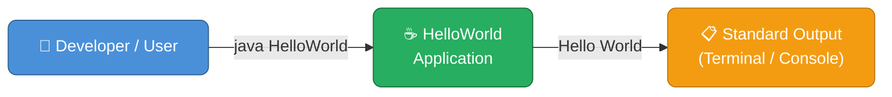

| Neighbour | Direction | Data / Event | Protocol / Medium |
|-----------|-----------|-------------|-------------------|
| Developer / User | → System | Invocation command (`java HelloWorld`) | OS process spawn |
| System → | Standard Output (`stdout`) | String literal `"Hello World\n"` | POSIX `stdout` / `System.out` |

### 3.2 Technical Context

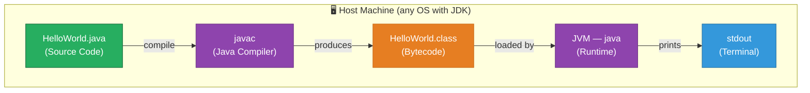

| Channel | Technology | Notes |
|---------|-----------|-------|
| Source → Compiler | `javac HelloWorld.java` | CLI invocation, produces `HelloWorld.class` |
| Bytecode → JVM | `java HelloWorld` | CLI invocation, no classpath flags required |
| JVM → stdout | `System.out.println` | Buffered PrintStream, auto-flushed on `println` |

---

## 4. Solution Strategy

### 4.1 Technology Decisions

| Decision | Choice | Rationale |
|----------|--------|-----------|
| **Programming language** | Java (SE) | Widely known, platform-independent via JVM, no install beyond JDK required |
| **Build tooling** | None (bare `javac`) | Eliminates all toolchain complexity for a single-class program |
| **Dependency management** | None | `java.lang` is auto-imported; zero external dependencies achievable |
| **Output mechanism** | `System.out.println()` | Standard Java idiom for console output; no logging framework overhead |
| **Architecture style** | Single-class procedural | The simplest correct structure for a hello-world artefact |

### 4.2 Top-Level Decomposition

The system decomposes into exactly **one building block**: the `HelloWorld` class, containing one **entry-point method** (`main`).

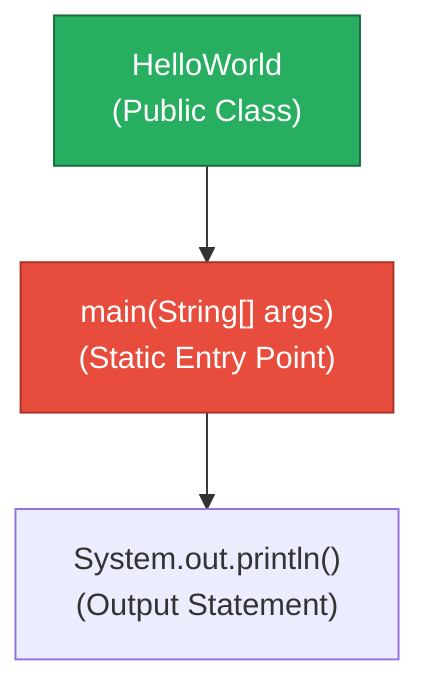

### 4.3 Approach to Quality Goals

| Quality Goal | Strategy |
|-------------|----------|
| **Correctness** | Hard-coded string literal eliminates any runtime variability |
| **Simplicity** | Zero dependencies, single file, five lines of code |
| **Portability** | Pure Java SE; no OS-specific APIs |
| **Reproducibility** | `javac` + `java` are sufficient; no external setup required |

---

## 5. Building Block View

### 5.1 Level 1 — System as Black Box


**Responsibility**: Accept a JVM process invocation, execute the `main` method, write the greeting to stdout, and exit.

**Interfaces**:

| Interface | Type | Description |
|-----------|------|-------------|
| JVM invocation | Input | `java HelloWorld` — standard JVM entry point |
| Standard output | Output | `System.out.println("Hello World")` |
| Exit code | Output | Implicit `0` on normal JVM termination |

### 5.2 Level 2 — Internal Decomposition

The system has a single internal component:

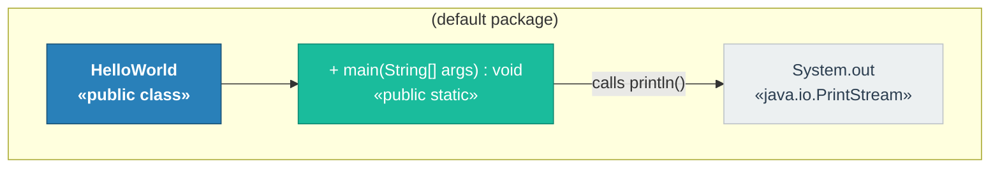

### 5.3 Level 3 — Class Detail

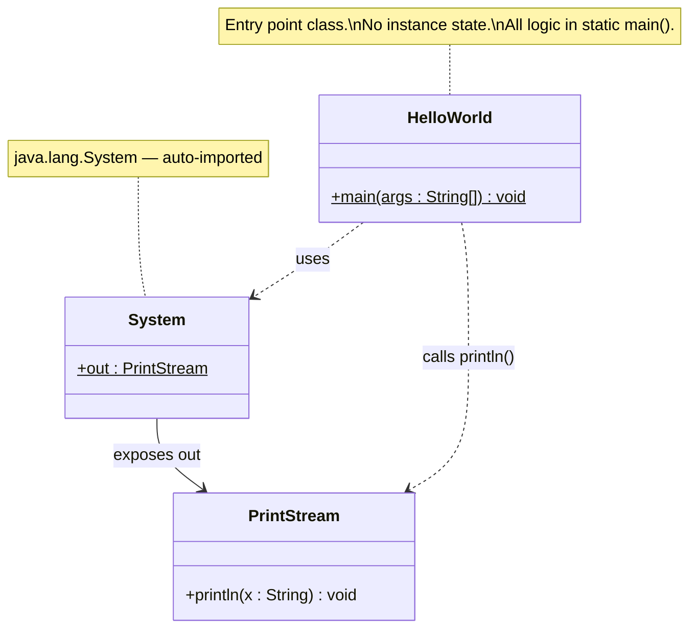

| Building Block | Type | Responsibility |
|---------------|------|----------------|
| `HelloWorld` | `public class` | Container for the application entry point |
| `main(String[])` | `public static void` | Sole method; bootstrapped directly by the JVM |
| `System.out` | `java.io.PrintStream` | JDK-provided output stream (external dependency from JDK) |

---

## 6. Runtime View

### 6.1 Scenario 1 — Successful Execution (Happy Path)

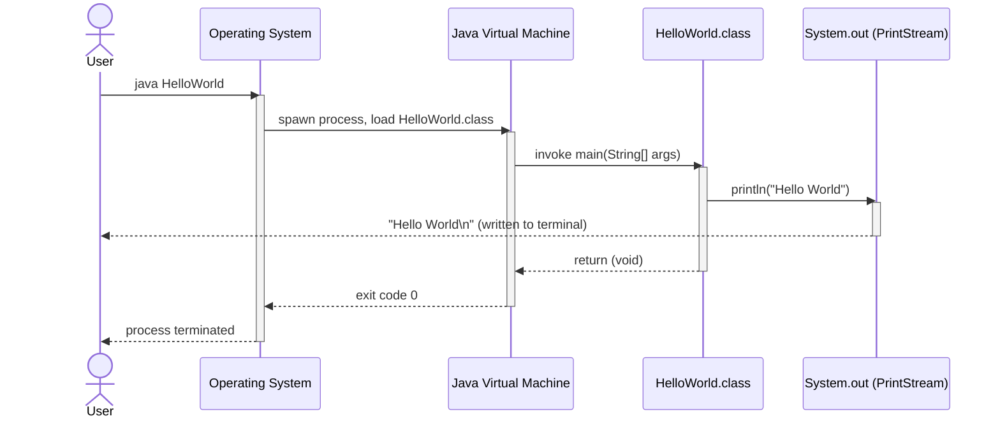

### 6.2 Scenario 2 — Compilation Flow

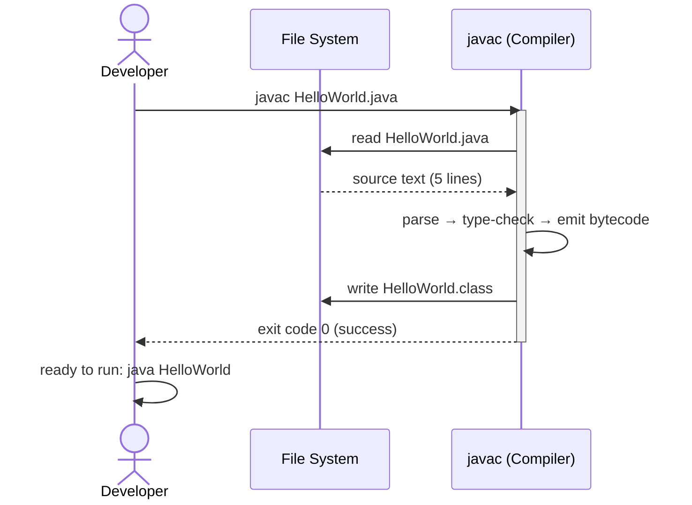

### 6.3 Execution Flowchart

```mermaid
flowchart TD
    classDef start fill:#27AE60,stroke:#1A6B3C,color:#fff
    classDef process fill:#2980B9,stroke:#1A5276,color:#fff
    classDef decision fill:#F39C12,stroke:#B7770D,color:#fff
    classDef output fill:#8E44AD,stroke:#6C3483,color:#fff
    classDef endNode fill:#E74C3C,stroke:#A93226,color:#fff

    A([JVM starts]):::start
    B["Load HelloWorld.class\nfrom classpath"]:::process
    C{Class found?}:::decision
    D["Locate main(String[])"]:::process
    E{main() found?}:::decision
    F["Execute:\nSystem.out.println('Hello World')"]:::process
    G["Write 'Hello World\\n'\nto stdout buffer"]:::output
    H["Flush stdout\n(auto on println)"]:::process
    I["Return from main()"]:::process
    J([JVM exits — code 0]):::endNode
    ERR1(["ClassNotFoundException\n(exit code 1)"]):::endNode
    ERR2(["NoSuchMethodError\n(exit code 1)"]):::endNode

    A --> B --> C
    C -- Yes --> D --> E
    C -- No --> ERR1
    E -- Yes --> F --> G --> H --> I --> J
    E -- No --> ERR2
```

---

## 7. Deployment View

### 7.1 Infrastructure Overview

The application has no server, container, or cloud infrastructure. It deploys as a **local executable** on any machine with a compatible JDK.

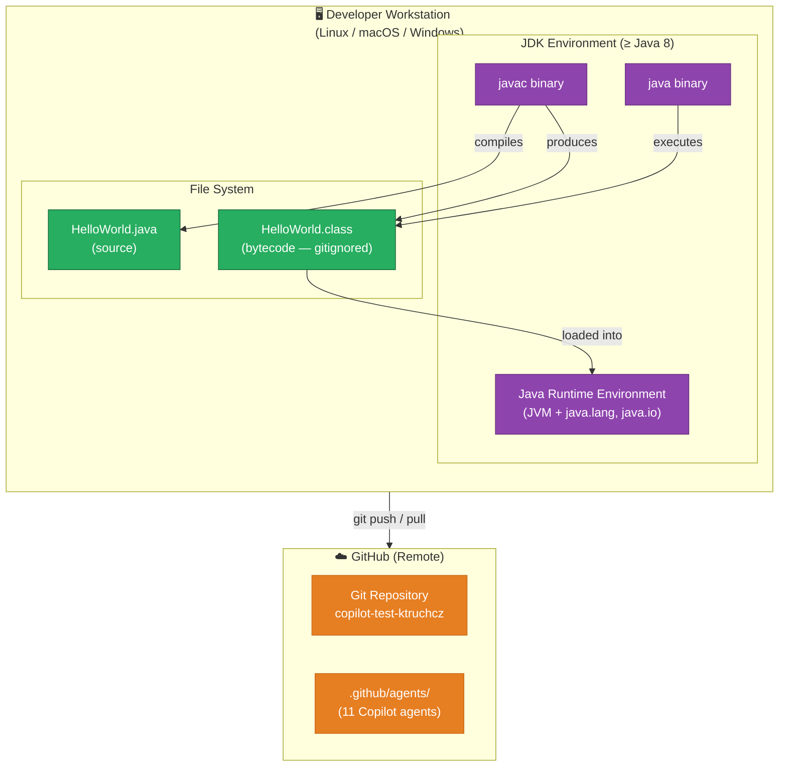

### 7.2 Deployment Steps

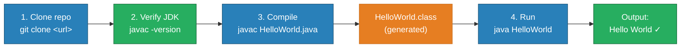

### 7.3 Environment Requirements

| Requirement | Minimum Version | Notes |
|------------|----------------|-------|
| Java Development Kit (JDK) | Java SE 8 | `javac` and `java` must be on PATH |
| Operating System | Any (Linux, macOS, Windows) | JVM provides OS abstraction |
| Disk space | < 1 KB source + < 1 KB bytecode | Negligible |
| Memory | JVM default heap (≥ 8 MB) | No significant allocation |
| Network | None required | Fully offline capable |

---

## 8. Cross-cutting Concepts

### 8.1 Domain Model

```mermaid
erDiagram
    APPLICATION {
        string name "HelloWorld"
        string language "Java"
        string version "1.0"
    }
    SOURCE_FILE {
        string filename "HelloWorld.java"
        int lines 5
        string package "default"
    }
    CLASS {
        string name "HelloWorld"
        string visibility "public"
        bool hasState false
    }
    METHOD {
        string name "main"
        string signature "void main(String[])"
        string visibility "public static"
    }
    OUTPUT {
        string stream "System.out"
        string content "Hello World"
        string type "println"
    }

    APPLICATION ||--|| SOURCE_FILE : "compiled from"
    SOURCE_FILE ||--|| CLASS : "defines"
    CLASS ||--|| METHOD : "contains"
    METHOD ||--|| OUTPUT : "produces"
```

### 8.2 Logging and Observability

| Aspect | Implementation | Notes |
|--------|---------------|-------|
| **Application logging** | None | No SLF4J, Log4j, or java.util.logging used |
| **Output** | `System.out.println()` | Sole observable side-effect |
| **Error handling** | None (implicit JVM default) | Uncaught exceptions propagate to JVM crash handler |
| **Metrics** | None | No instrumentation |
| **Tracing** | None | No distributed tracing |

### 8.3 Error Handling Strategy

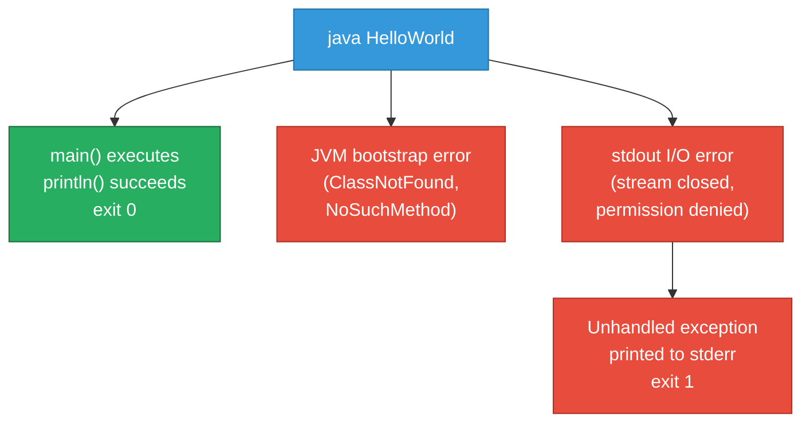

> **Gap**: The application has no explicit `try/catch` block. Errors writing to `System.out` would result in a JVM-level exception printed to `stderr`. For a hello-world program this is acceptable.

### 8.4 Security Concepts

| Concern | Status | Notes |
|---------|--------|-------|
| Input validation | N/A | `args` array is never read |
| Output sanitisation | N/A | Output is a compile-time constant |
| Dependency vulnerabilities | None | Zero third-party dependencies |
| Classpath injection | Minimal risk | Single class, default package |

### 8.5 Design Patterns

| Pattern | Applied? | Location |
|---------|----------|----------|
| Entry-point / Main class | ✅ Yes | `HelloWorld.main()` |
| Singleton | ❌ Not applicable | No instance state |
| Factory / Builder | ❌ Not applicable | No object creation |
| Repository | ❌ Not applicable | No data persistence |

---

## 9. Architecture Decisions

### ADR-001 — Use Java as the Implementation Language

| | |
|--|--|
| **Status** | Accepted |
| **Date** | Project inception |
| **Context** | A simple demonstration program is required that validates JDK installation and provides a concrete artefact for automated code analysis agents. |
| **Decision** | Implement the program in Java. |
| **Consequences** | ✅ Universally understood language; ✅ JVM portability; ✅ Directly analysable by Java-aware Copilot agents; ⚠️ Requires JDK installation (not just a JRE) to compile. |

---

### ADR-002 — No Build Tool

| | |
|--|--|
| **Status** | Accepted |
| **Date** | Project inception |
| **Context** | For a single-class application, introducing Maven, Gradle, or Ant would add hundreds of kilobytes of configuration and toolchain overhead with no benefit. |
| **Decision** | Use bare `javac` and `java` CLI commands. |
| **Consequences** | ✅ Zero configuration overhead; ✅ No version conflicts; ⚠️ Does not scale — any multi-class or dependency-bearing extension would require a build tool; ⚠️ No standard lifecycle phases (test, package, deploy). |

---

### ADR-003 — Single Source File at Repository Root

| | |
|--|--|
| **Status** | Accepted |
| **Date** | Project inception |
| **Context** | Standard Java projects use `src/main/java/` source layouts (Maven) or `src/` layouts. However, for a one-class program that is compiled with a direct `javac` call, placing the file at the root simplifies the compile command to `javac HelloWorld.java`. |
| **Decision** | Place `HelloWorld.java` directly at the repository root. |
| **Consequences** | ✅ Simplest possible compile command; ⚠️ Violates standard Maven/Gradle source layout conventions; ⚠️ Does not scale to multi-class projects. |

---

### ADR-004 — Hard-coded Output String

| | |
|--|--|
| **Status** | Accepted |
| **Date** | Project inception |
| **Context** | The output `"Hello World"` is the sole purpose of the program. It never needs to change or be parameterised. |
| **Decision** | Use a string literal directly in `println()` rather than a named constant, configuration file, or environment variable. |
| **Consequences** | ✅ Zero runtime variability; ✅ Provably correct; ⚠️ Not externalised — changing the message requires recompilation. |

---

### ADR-005 — No Test Framework

| | |
|--|--|
| **Status** | Accepted (with caveat) |
| **Date** | Project inception |
| **Context** | There is no JUnit or other test framework present in the repository. |
| **Decision** | No automated tests are included. |
| **Consequences** | ✅ No test infrastructure to maintain; ⚠️ Correctness can only be verified by manual execution; ⚠️ Not suitable as a pattern for production systems; ⚠️ CI pipeline cannot run automated quality gates. |

---

## 10. Quality Requirements

### 10.1 Quality Tree

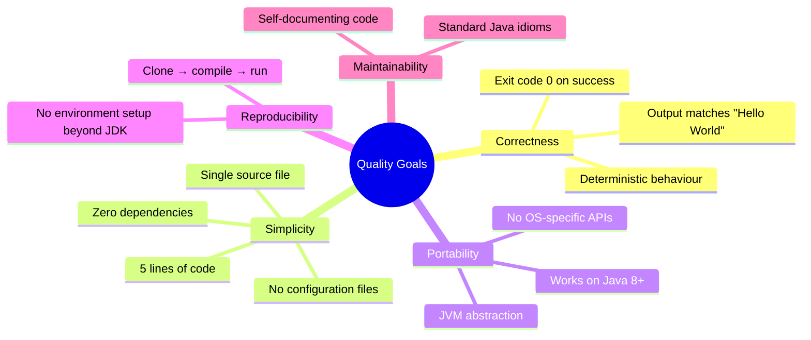

### 10.2 Quality Scenarios

| ID | Quality Attribute | Stimulus | Response | Measure |
|----|------------------|---------|---------|---------|
| QS-01 | Correctness | Execute `java HelloWorld` | `Hello World` written to stdout | Output == `"Hello World\n"` (exact match) |
| QS-02 | Performance | Execute on any modern machine | JVM starts and completes | Total wall-clock time < 2 seconds (JVM startup dominated) |
| QS-03 | Portability | Compile on Linux / macOS / Windows with JDK 8+ | Compiles and runs without modification | Zero platform-specific errors |
| QS-04 | Maintainability | Developer reads the source for the first time | Understands the entire program | Time to full comprehension < 30 seconds |
| QS-05 | Reproducibility | Developer clones repo and has JDK installed | Can compile and run in < 2 commands | `javac HelloWorld.java && java HelloWorld` succeeds |

### 10.3 Code Metrics

| Metric | Value | Assessment |
|--------|-------|------------|
| Lines of Code (LOC) | 5 | Minimal ✅ |
| Classes | 1 | Appropriate ✅ |
| Methods | 1 | Appropriate ✅ |
| Cyclomatic Complexity | 1 (no branches) | Optimal ✅ |
| External Dependencies | 0 | Minimal ✅ |
| Test Coverage | 0% | **Gap** ⚠️ |
| Javadoc Coverage | 0% | **Gap** ⚠️ |
| Build Automation | None | **Gap** ⚠️ |

---

## 11. Risks and Technical Debt

### 11.1 Risk Register

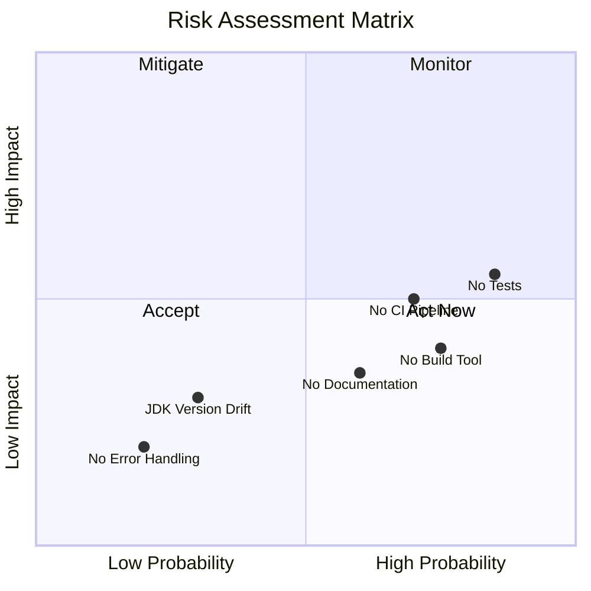

| ID | Risk | Probability | Impact | Severity | Mitigation |
|----|------|------------|--------|---------|------------|
| R-01 | **No automated tests** — defects cannot be detected without manual execution | High | Medium | 🟠 Medium | Add JUnit test asserting stdout output |
| R-02 | **No CI/CD pipeline** — no automated build/test on push | High | Medium | 🟠 Medium | Add GitHub Actions workflow (`.github/workflows/build.yml`) |
| R-03 | **No build tool** — project cannot grow without significant restructuring | High | Medium | 🟠 Medium | Adopt Maven or Gradle if new classes/dependencies added |
| R-04 | **JDK version undocumented** — minimum Java version not specified | Medium | Low | 🟡 Low | Add `README.md` badge and specify minimum JDK version |
| R-05 | **No Javadoc** — API intent undocumented at code level | Medium | Low | 🟡 Low | Add class/method Javadoc comments |
| R-06 | **Default package** — class is in the unnamed package, non-importable | Low | Low | 🟢 Accept | Acceptable for single-class; move to named package if project grows |

### 11.2 Technical Debt Inventory

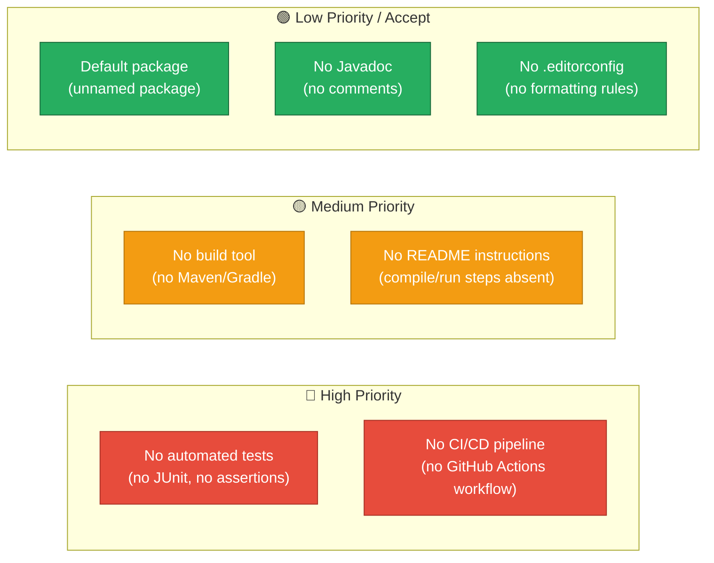

### 11.3 Recommended Remediation (Prioritised)

| Priority | Item | Effort | Value |
|----------|------|--------|-------|
| 1 | Add GitHub Actions CI workflow (`javac` + run + assert output) | Low (< 1 hour) | High |
| 2 | Add JUnit 5 unit test for `HelloWorld` output capture | Low (< 2 hours) | High |
| 3 | Add Maven `pom.xml` with `maven-compiler-plugin` and `maven-surefire-plugin` | Medium (2–4 hours) | Medium |
| 4 | Expand `README.md` with prerequisites, build, and run instructions | Low (< 30 min) | Medium |
| 5 | Add Javadoc to class and `main()` method | Low (< 15 min) | Low |
| 6 | Move class to a named package (e.g., `com.ktruchcz.helloworld`) | Low (< 30 min) | Low |

---

## 12. Glossary

| Term | Definition |
|------|-----------|
| **Arc42** | A template for documenting software architecture, structured into 12 sections. See [arc42.org](https://arc42.org). |
| **ADR** | Architecture Decision Record — a document capturing an architecturally significant decision, its context, and its consequences. |
| **Bytecode** | Platform-independent binary instruction set produced by `javac`, stored in `.class` files, and executed by the JVM. |
| **Classpath** | A JVM parameter specifying where to search for compiled `.class` files and JARs at runtime. |
| **Default package** | The unnamed Java package; classes in this package cannot be imported by classes in named packages. |
| **Entry point** | The `public static void main(String[] args)` method that the JVM calls when starting a Java application. |
| **Hello World** | A traditional introductory program whose only function is to output the text `"Hello World"` — used to verify a working environment. |
| **JAR** | Java ARchive — a ZIP-format bundle of `.class` files and resources used for distributing Java applications or libraries. |
| **javac** | The Java compiler included in the JDK; translates `.java` source files into `.class` bytecode files. |
| **JDK** | Java Development Kit — includes the Java compiler (`javac`), the JRE, and development tools. |
| **JRE** | Java Runtime Environment — includes the JVM and standard class libraries needed to run compiled Java programs. |
| **JVM** | Java Virtual Machine — the runtime engine that loads, verifies, and executes Java bytecode. |
| **LOC** | Lines of Code — a basic software size metric. |
| **stdout** | Standard output stream — the default output channel of a process, typically connected to the terminal. |
| **System.out** | A `java.io.PrintStream` object in the Java standard library representing the standard output stream. |
| **`println()`** | A method on `PrintStream` that writes a string followed by a newline character to the output stream. |
| **Cyclomatic Complexity** | A software metric measuring the number of linearly independent paths through a method's source code. A value of 1 means no branches. |
| **GitHub Copilot Agent** | An AI-powered agent defined in `.github/agents/` that automates a specific analysis or documentation task on the repository. |

---

*Documentation generated by the **Arc42 Documentation Generator** agent.*  
*Source analysis based on direct inspection of repository files: `HelloWorld.java`, `README.md`, `.gitignore`, `.github/agents/`.*
