# Architecture Documentation (Arc42)

**Project**: `copilot-test-ktruchcz` — Hello World Java Application
**Version**: 1.0.0
**Date**: 2025-01-01
**Generated by**: Arc42 Documentation Generator
**Repository**: [ktruchcz/copilot-test-ktruchcz](https://github.com/ktruchcz/copilot-test-ktruchcz)

---

> **Note**: This document follows the [Arc42 template](https://arc42.org/) — a pragmatic, proven approach to documenting software architecture. Each of the 12 sections is populated based on analysis of the repository source code and repository metadata.

---

## Table of Contents

1. [Introduction and Goals](#1-introduction-and-goals)
2. [Constraints](#2-constraints)
3. [Context and Scope](#3-context-and-scope)
4. [Solution Strategy](#4-solution-strategy)
5. [Building Block View](#5-building-block-view)
6. [Runtime View](#6-runtime-view)
7. [Deployment View](#7-deployment-view)
8. [Crosscutting Concepts](#8-crosscutting-concepts)
9. [Architecture Decisions](#9-architecture-decisions)
10. [Quality Requirements](#10-quality-requirements)
11. [Risks and Technical Debt](#11-risks-and-technical-debt)
12. [Glossary](#12-glossary)

---

## 1. Introduction and Goals

> **Source analysis**: `HelloWorld.java` (5 lines), `README.md` (1 line).

### 1.1 Overview

The **Hello World** application is the quintessential introductory Java program. It serves as a canonical demonstration of:

- The minimum viable structure of a Java source file
- The Java entry-point convention (`public static void main(String[] args)`)
- Standard output interaction via `System.out.println`

Despite its simplicity, it validates that the entire Java toolchain — compiler (`javac`), runtime (`java`), and standard library (`java.lang`) — is correctly installed and functional.

### 1.2 Business Context and Objectives

| # | Goal | Rationale |
|---|------|-----------|
| G-01 | Print the string `"Hello World"` to standard output | Core functional requirement |
| G-02 | Demonstrate a working Java development environment | Toolchain validation |
| G-03 | Provide a minimal, understandable code example | Educational / onboarding purpose |
| G-04 | Serve as a baseline for repository scaffolding | CI/CD pipeline validation |

### 1.3 Quality Goals

The following top-level quality goals were identified through code analysis (ordered by priority):

| Priority | Quality Goal | Motivation |
|----------|-------------|-----------|
| 1 | **Simplicity** | Single responsibility, zero unnecessary complexity |
| 2 | **Correctness** | The output must exactly match `"Hello World\n"` |
| 3 | **Portability** | Must execute on any JVM-compatible platform |
| 4 | **Understandability** | Code must be immediately readable by any Java developer |

### 1.4 Stakeholders

| Role | Name / Group | Expectations |
|------|-------------|--------------|
| Developer | Repository owner (`ktruchcz`) | Code compiles and runs without error |
| Learner / Newcomer | Anyone reading the repository | Clear, minimal example of Java syntax |
| CI/CD System | GitHub Actions (`.github/` present) | Build and test pipeline passes |
| Code Reviewer | Assessors / Collaborators | Standard coding conventions are met |

---

## 2. Constraints

> **Source analysis**: `HelloWorld.java` — no imports, no build descriptor, no configuration files detected.

### 2.1 Technical Constraints

| ID | Constraint | Rationale / Source |
|----|-----------|-------------------|
| TC-01 | **Java language** — code is written in Java | Source file extension `.java`; `public class HelloWorld` declaration |
| TC-02 | **JDK required to compile** — `javac HelloWorld.java` | No pre-compiled `.class` files present in repository |
| TC-03 | **JRE / JVM required to run** — `java HelloWorld` | Targets the JVM execution platform |
| TC-04 | **No external libraries or frameworks** | Zero `import` statements; only `java.lang` (auto-imported) |
| TC-05 | **No build system** (no `pom.xml`, `build.gradle`, `Makefile`) | Raw source file; manual compile/run workflow |
| TC-06 | **Single source file** — entire program is `HelloWorld.java` | Single class, no package declaration |
| TC-07 | **No package namespace** | Class resides in the default (unnamed) package |

### 2.2 Organizational Constraints

| ID | Constraint | Rationale / Source |
|----|-----------|-------------------|
| OC-01 | **GitHub-hosted repository** | Remote: `github.com/ktruchcz/copilot-test-ktruchcz` |
| OC-02 | **`.github/` directory present** | CI/CD workflows likely configured via GitHub Actions |
| OC-03 | **`.gitignore` present** | Standard version-control hygiene enforced |
| OC-04 | **README is minimal** | No formal contribution guidelines, versioning policy, or license documented |

### 2.3 Conventions

| ID | Convention | Observed in Code |
|----|-----------|-----------------|
| CV-01 | Java class name matches filename (`HelloWorld.java` → `public class HelloWorld`) | ✅ Followed |
| CV-02 | `main` method has canonical signature `public static void main(String[] args)` | ✅ Followed |
| CV-03 | 4-space indentation (consistent) | ✅ Followed |
| CV-04 | No magic strings in business logic (single literal used directly) | ⚠️ Acceptable at this scale |

---

## 3. Context and Scope

> **Source analysis**: `HelloWorld.java` — sole interaction is `System.out.println` writing to stdout.

### 3.1 Business Context

The Hello World application has the most minimal possible system boundary: it receives no inputs from external actors and produces a single, fixed output to the operating system's standard output stream.

| Actor / System | Interaction | Direction |
|---------------|-------------|-----------|
| **Developer / User** | Invokes the program via CLI (`java HelloWorld`) | → triggers execution |
| **JVM (Java Virtual Machine)** | Hosts and executes the bytecode | ← executes class |
| **Standard Output (stdout)** | Receives the printed string `"Hello World"` | ← output |
| **Operating System** | Provides the process environment, stdout pipe | ← provides I/O |

**External systems**: None. No databases, no network calls, no file I/O, no message queues, no APIs.

### 3.2 Business Context Diagram


### 3.3 Technical Context

The technical context describes the runtime environment in which the application executes.

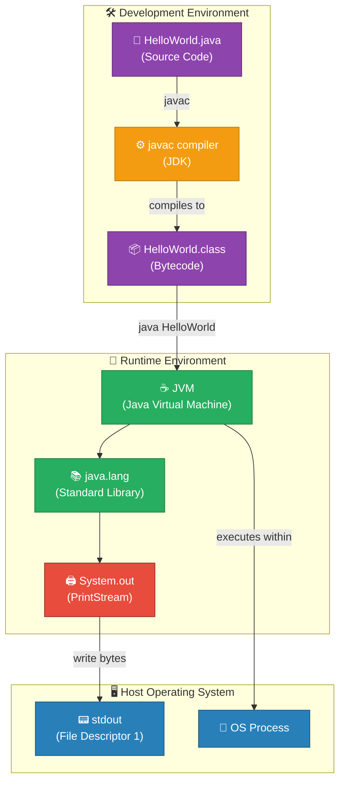

### 3.4 External Interfaces Summary

| Interface | Type | Protocol | Direction | Notes |
|-----------|------|----------|-----------|-------|
| `System.out` (stdout) | I/O Stream | POSIX file descriptor | Outbound | Only interface used |
| `String[] args` | CLI parameter | JVM argument passing | Inbound | Present but never read |

---

## 4. Solution Strategy

> **Source analysis**: Zero dependencies, single class, single method — all architectural choices are visible directly in the 5-line source.

### 4.1 Technology Decisions

| Decision | Choice Made | Alternatives Considered | Rationale |
|----------|------------|------------------------|-----------|
| **Programming Language** | Java | Python, C, Go, Kotlin | Universal introductory language; JVM portability |
| **Execution Model** | JVM bytecode | Native compilation (GraalVM) | Standard JDK workflow; maximum compatibility |
| **Build System** | None (raw `javac`) | Maven, Gradle, Ant | Zero overhead; appropriate for single-file program |
| **Dependencies** | None | Any third-party library | `java.lang` (auto-imported) is sufficient |
| **Architecture Style** | Procedural (single static method) | OOP with instances, FP | Simplest possible for a print-once program |
| **Output Mechanism** | `System.out.println` | `System.out.print`, logging frameworks | Standard, idiomatic Java console output |
| **Packaging** | Default package (no package declaration) | Named package (e.g. `com.example`) | Minimises file structure for a single-file demo |

### 4.2 Top-Level Decomposition Strategy

The system uses a **monolithic single-class, single-method decomposition** — the simplest possible unit of software:

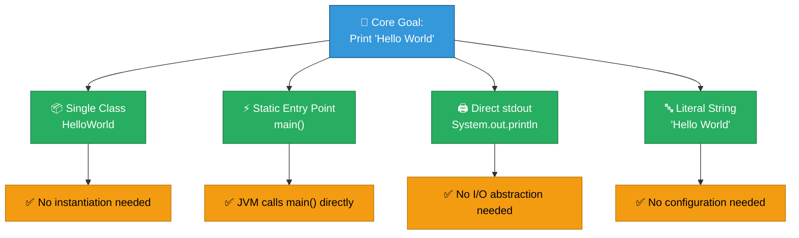

### 4.3 Approach to Quality Goals

| Quality Goal | Strategy Applied |
|-------------|-----------------|
| **Simplicity** | Single class, single method, single statement — irreducibly minimal |
| **Correctness** | Hard-coded string literal eliminates runtime variability |
| **Portability** | Pure Java standard library; no OS-specific code |
| **Understandability** | Self-documenting method name (`main`), universally known pattern |

---

## 5. Building Block View

> **Source analysis**: `HelloWorld.java` — 1 class, 1 method, 1 statement. Full AST below.

### 5.1 Level 1 — Whitebox: Overall System

The entire system is a single deployable unit with one class.

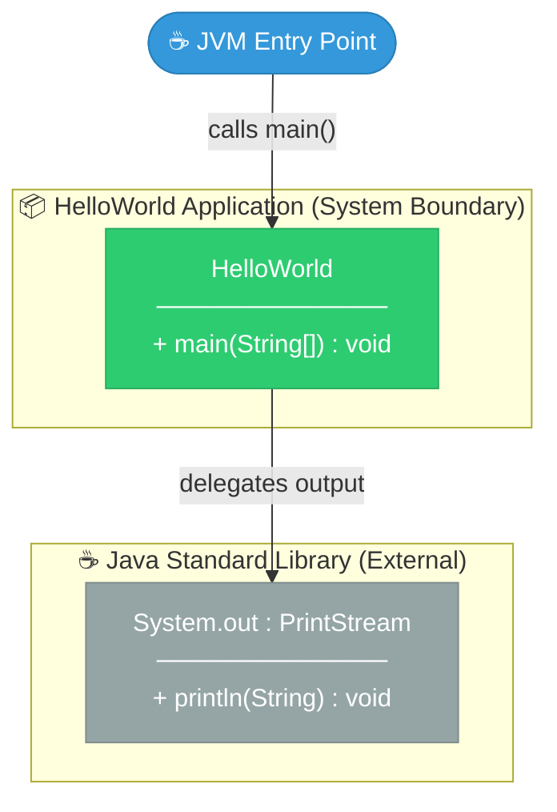

**Contained Building Blocks:**

| Block | Type | Responsibility |
|-------|------|---------------|
| `HelloWorld` | Java Class (public) | Sole application class; hosts the program entry point |
| `HelloWorld.main` | Static Method | JVM entry point; orchestrates the entire program execution |

### 5.2 Level 2 — Whitebox: `HelloWorld` Class

Full decomposition of the single class:

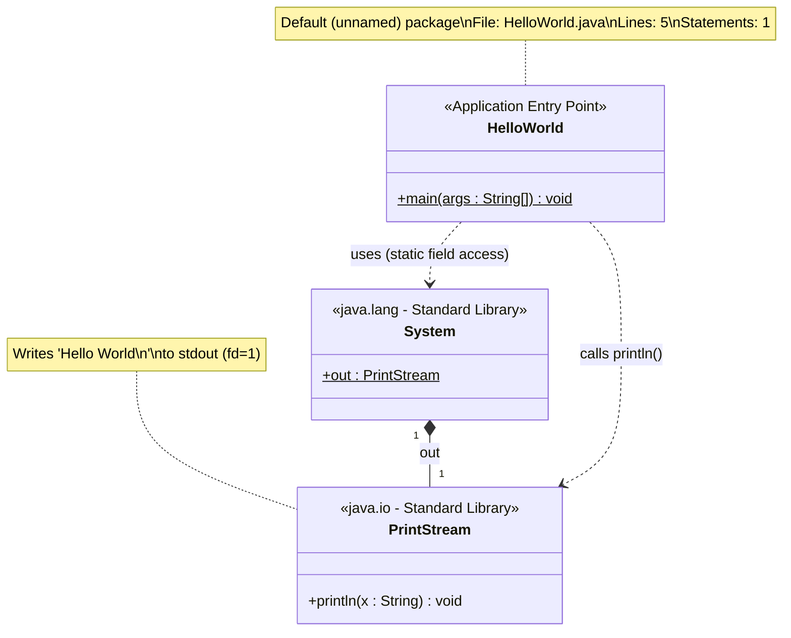

### 5.3 Level 3 — Statement-Level Decomposition

Full Abstract Syntax Tree (AST) representation:

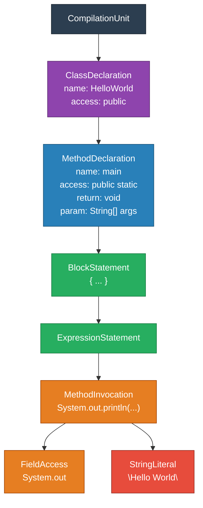

### 5.4 Source Code Reference

```java
// File: HelloWorld.java
// Package: (default)
// Lines of Code: 5 (total) / 1 (executable)

public class HelloWorld {                           // ClassDeclaration
    public static void main(String[] args) {        // MethodDeclaration (entry point)
        System.out.println("Hello World");          // ExpressionStatement → MethodInvocation
    }
}
```

| Metric | Value |
|--------|-------|
| Total lines | 5 |
| Blank lines | 0 |
| Comment lines | 0 |
| Executable statements | 1 |
| Classes | 1 |
| Methods | 1 |
| Fields | 0 |
| External dependencies | 0 |
| Cyclomatic complexity | 1 (minimum) |

---

## 6. Runtime View

> **Source analysis**: Single execution path, no branching, no loops, no exception handling.

### 6.1 Runtime Scenarios

Only one runtime scenario exists: **Normal Execution**.

| Scenario | Description | Result |
|----------|-------------|--------|
| **SC-01: Normal execution** | `java HelloWorld` invoked with any (or no) arguments | Prints `Hello World` then exits with code `0` |
| **SC-02: Missing class** | `HelloWorld.class` not found on classpath | JVM throws `ClassNotFoundException`, exits with code `1` |
| **SC-03: stdout closed** | stdout fd is closed before execution | `PrintStream.println` silently fails (no exception by default) |

### 6.2 Scenario SC-01: Normal Execution (Primary Flow)

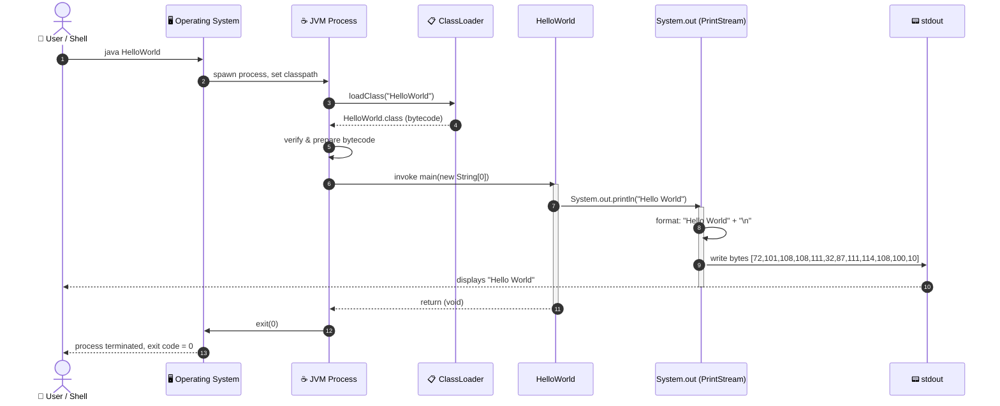

### 6.3 Scenario SC-02: Missing Class (Error Flow)

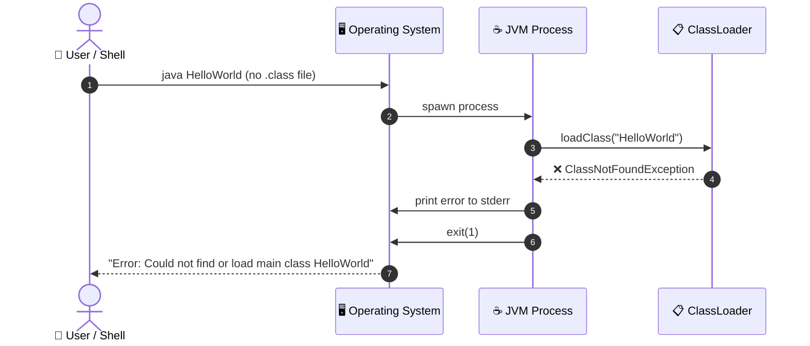

### 6.4 Program Lifecycle State Machine

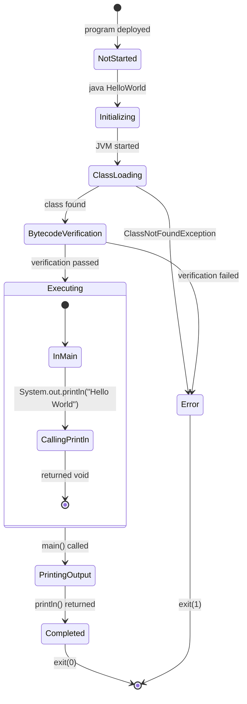

### 6.5 Execution Timeline

| Phase | Duration (approx.) | Activity |
|-------|-------------------|---------|
| JVM startup | ~50–200ms | OS spawns process, JVM initialises |
| Class loading | ~5–20ms | ClassLoader reads `HelloWorld.class` |
| JIT compilation | ~1–5ms | HotSpot may interpret or compile |
| `main()` execution | < 1ms | Single `println` call |
| JVM shutdown | ~10–50ms | Flushing streams, GC cleanup |
| **Total** | **~66–276ms** | Dominated by JVM startup overhead |

---

## 7. Deployment View

> **Source analysis**: No build descriptor found. Deployment is manual via JDK toolchain.

### 7.1 Infrastructure Requirements

| Requirement | Minimum | Recommended |
|-------------|---------|-------------|
| **Java Version** | Java SE 8 (JDK 1.8+) | Java SE 21 LTS |
| **Memory (heap)** | 4 MB (`-Xmx4m`) | Default JVM settings |
| **Disk space** | ~300 KB (JRE) + `HelloWorld.class` (< 1 KB) | N/A |
| **CPU** | Any JVM-supported architecture | x86-64, ARM64 |
| **OS** | Any OS with JVM support | Linux, macOS, Windows |
| **Network** | None | None |

### 7.2 Deployment Topology

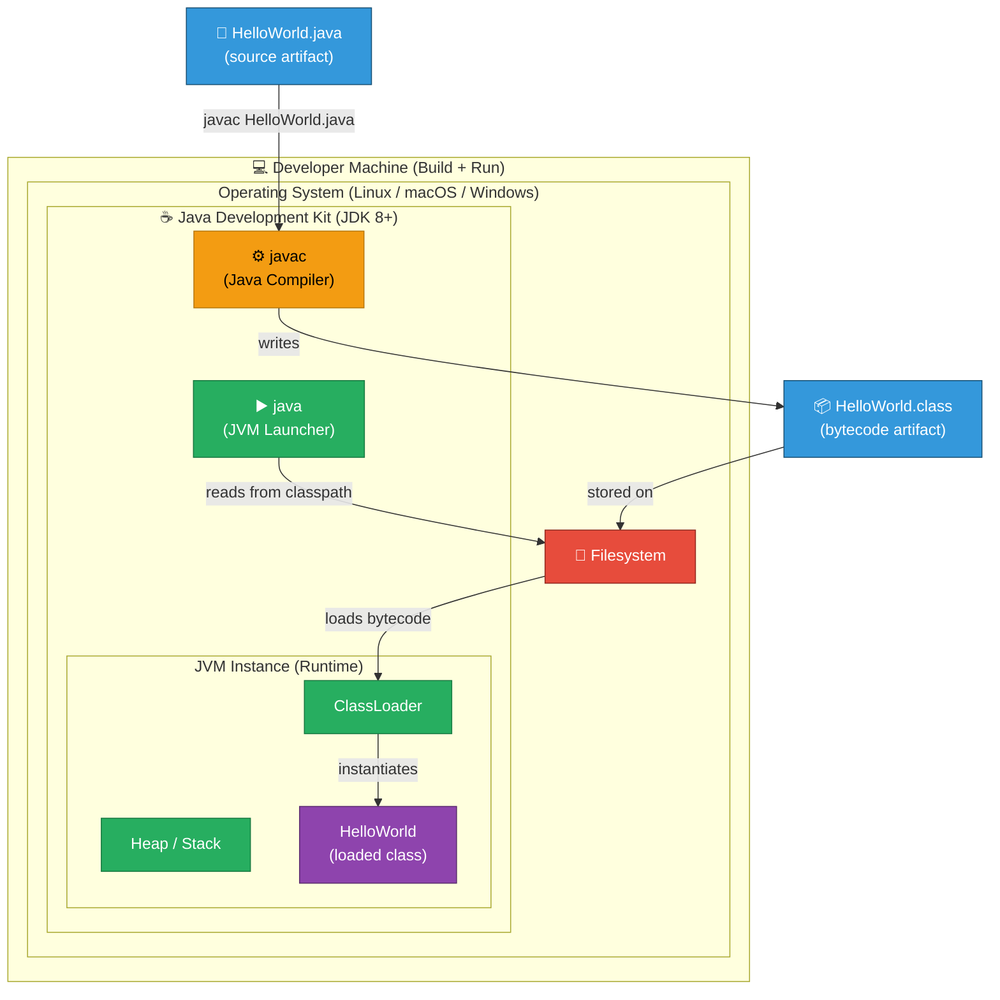

### 7.3 Deployment Steps

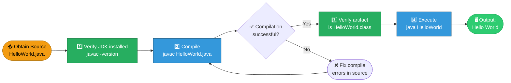

### 7.4 Alternative Deployment Scenarios

| Scenario | Command | Notes |
|----------|---------|-------|
| **Standard execution** | `javac HelloWorld.java && java HelloWorld` | Most common; requires JDK |
| **Single-file source launcher** *(Java 11+)* | `java HelloWorld.java` | Compiles and runs in one step; no `.class` file written |
| **Docker container** | `docker run --rm -v .:/app openjdk:21 java /app/HelloWorld.java` | Isolated; useful in CI |
| **GitHub Actions CI** | See `.github/` workflows | Automated compile/run on push |
| **JAR packaging** | `jar cfe HelloWorld.jar HelloWorld HelloWorld.class` | Runnable via `java -jar HelloWorld.jar` |

### 7.5 CI/CD Context

The repository contains a `.github/` directory indicating GitHub Actions configuration. A typical workflow for this application would be:

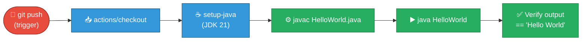

---

## 8. Crosscutting Concepts

> **Source analysis**: No framework, no annotations, no configuration. Crosscutting concerns are addressed implicitly by the JVM.

### 8.1 Overview of Crosscutting Concerns

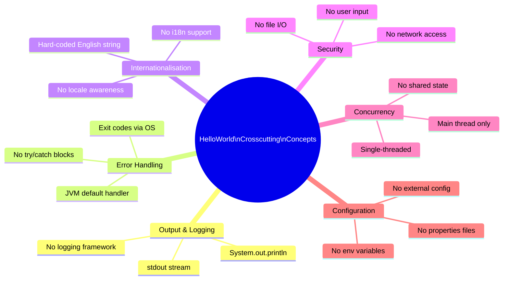

### 8.2 Output and Logging

The application uses `System.out.println` as its sole output mechanism. This is both the business output channel and the implicit "log" channel.

| Aspect | Implementation | Notes |
|--------|---------------|-------|
| **Output channel** | `System.out` (PrintStream, stdout) | Buffered, auto-flushed on `println` |
| **Log level** | N/A (no logging framework) | All output is INFO-equivalent |
| **Log format** | Plain string literal | `"Hello World"` + OS line separator |
| **Log destination** | stdout (fd=1) | Can be redirected: `java HelloWorld > out.txt` |
| **Logging framework** | None | SLF4J, Log4j2, java.util.logging not used |

### 8.3 Error Handling

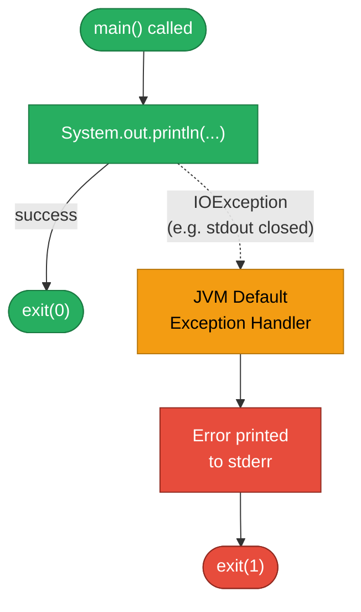

| Error Type | Handling Mechanism | Notes |
|-----------|-------------------|-------|
| `ClassNotFoundException` | JVM default (not catchable in this code) | Occurs if `.class` not on classpath |
| `StackOverflowError` | N/A — no recursion | Not applicable |
| `OutOfMemoryError` | JVM default | Extremely unlikely for this workload |
| Checked exceptions from `println` | None thrown by `PrintStream.println` | PrintStream silences `IOException` internally |

### 8.4 Security

| Security Concern | Assessment | Risk Level |
|-----------------|-----------|------------|
| **Input validation** | No user input accepted (`args[]` ignored) | 🟢 None |
| **Injection attacks** | No dynamic string construction | 🟢 None |
| **File system access** | None | 🟢 None |
| **Network access** | None | 🟢 None |
| **Sensitive data exposure** | No credentials, no PII | 🟢 None |
| **Dependency vulnerabilities** | No third-party libraries | 🟢 None |

### 8.5 Internationalisation (i18n)

The output string `"Hello World"` is a hard-coded English literal. There is no:
- `ResourceBundle` for locale-specific messages
- `Locale` or `Charset` handling
- Unicode-specific considerations (ASCII only)

For a production system, the string would be externalised to a properties file and loaded via `ResourceBundle.getString("greeting")`.

### 8.6 Concurrency and Thread Safety

| Aspect | Status |
|--------|--------|
| Threading model | Single-threaded (main thread only) |
| Shared mutable state | None (no instance or class fields) |
| Synchronisation | Not required |
| Thread safety of `System.out` | Thread-safe by JDK specification (synchronized `PrintStream`) |

### 8.7 Domain Model

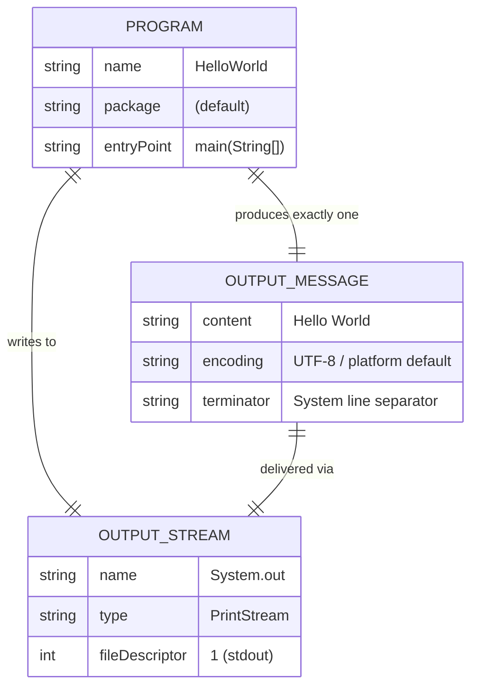

---

## 9. Architecture Decisions

> Architecture decisions are documented in ADR (Architecture Decision Record) format. All decisions are inferred from direct code analysis of `HelloWorld.java`.

### ADR-001: Java as Implementation Language

| Field | Value |
|-------|-------|
| **Status** | Accepted |
| **Date** | At project inception |
| **Deciders** | Repository owner (ktruchcz) |

**Context**: A simple greeting program needs to be implemented. A programming language must be chosen.

**Decision**: Use Java as the sole implementation language.

**Rationale**:
- Java is the most widely-taught object-oriented language, making Hello World a universal demonstration
- JVM portability ensures the program runs on Linux, macOS, and Windows without code changes
- Zero-configuration toolchain: any JDK installation includes both compiler and runtime

**Consequences**:
- ✅ Maximum portability across JVM platforms
- ✅ Universal recognition by developers
- ⚠️ JVM startup overhead (~100–200ms) is disproportionate for a sub-millisecond program
- ⚠️ Requires JDK/JRE installation (not a self-contained binary)

---

### ADR-002: No Build System

| Field | Value |
|-------|-------|
| **Status** | Accepted |
| **Date** | At project inception |
| **Deciders** | Repository owner (ktruchcz) |

**Context**: The project contains a single Java source file with no external dependencies.

**Decision**: Use raw `javac` / `java` commands without any build system (no Maven, Gradle, or Ant).

**Rationale**:
- A build system adds significant boilerplate for a single-class project
- `javac HelloWorld.java && java HelloWorld` is the complete build+run pipeline

**Consequences**:
- ✅ Zero build configuration overhead
- ✅ No `pom.xml` / `build.gradle` to maintain
- ⚠️ Does not scale — adding dependencies would require a build tool immediately
- ⚠️ No reproducible build guarantees (JDK version not pinned)

---

### ADR-003: Default (Unnamed) Package

| Field | Value |
|-------|-------|
| **Status** | Accepted |
| **Date** | At project inception |
| **Deciders** | Repository owner (ktruchcz) |

**Context**: Java classes can be placed in named packages (e.g. `com.example.hello`) or the default unnamed package.

**Decision**: Place `HelloWorld` in the default package (no `package` declaration).

**Rationale**:
- Named packages are required for libraries and production code but unnecessary for standalone single-file demos
- Using the default package keeps the file self-contained and eliminates the need for a directory hierarchy

**Consequences**:
- ✅ Simpler directory structure; file can be compiled from any directory
- ⚠️ Classes in the default package cannot be imported by named-package classes
- ⚠️ Violates Java best practices for any non-trivial project

---

### ADR-004: Hard-Coded String Literal

| Field | Value |
|-------|-------|
| **Status** | Accepted |
| **Date** | At project inception |
| **Deciders** | Repository owner (ktruchcz) |

**Context**: The output message `"Hello World"` must be delivered to stdout.

**Decision**: Use a hard-coded string literal `"Hello World"` directly in the `println` call.

**Rationale**:
- The message is invariant; externalising it to a constant, property file, or argument would add complexity without benefit
- The string is the canonical "Hello World" — changing it would violate the program's purpose

**Consequences**:
- ✅ Deterministic, testable output
- ✅ No configuration surface area
- ⚠️ Not internationalised (English only)
- ⚠️ Cannot be changed at runtime

---

### ADR-005: Static `main` Method as Sole Entry Point

| Field | Value |
|-------|-------|
| **Status** | Accepted |
| **Date** | At project inception |
| **Deciders** | Repository owner (ktruchcz) |

**Context**: Java programs require a designated entry point for the JVM.

**Decision**: Use the standard `public static void main(String[] args)` signature as the single entry point, with all logic inline.

**Rationale**:
- This is the mandated JVM entry point signature
- No separate service, controller, or runner class is warranted for a one-statement program

**Consequences**:
- ✅ Standard, universally recognised pattern
- ✅ No unnecessary object instantiation
- ⚠️ Logic cannot be unit-tested without invoking the full entry point (no extracted testable method)

---

### Decision Summary

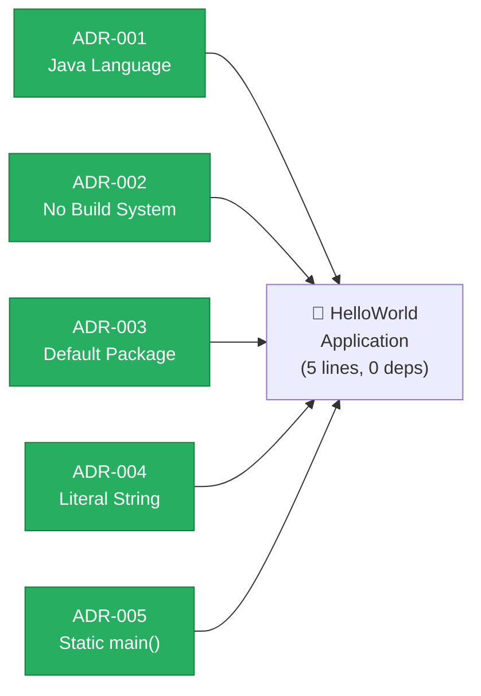

---

## 10. Quality Requirements

> **Source analysis**: Code metrics extracted from `HelloWorld.java`. Quality assessment based on ISO 25010 characteristics.

### 10.1 Quality Tree

```mermaid
mindmap
    root(("🌳 Quality\nRequirements"))
        Functional Suitability
            Functional Completeness
                Prints exactly 'Hello World'
                Exits with code 0
            Functional Correctness
                Output matches specification
                No runtime errors on valid JVM
        Reliability
            Fault Tolerance
                No crash on valid JVM
                Handles closed stdout gracefully
            Availability
                No server required
                Instant startup
        Performance Efficiency
            Time Behaviour
                Execution under 300ms end-to-end
                main() under 1ms
            Resource Utilisation
                Less than 10MB heap
                Single thread
        Maintainability
            Analysability
                5-line codebase
                Cyclomatic complexity = 1
            Modifiability
                Single file to change
            Testability
                Deterministic output
                Capturable via stdout redirect
        Portability
            Adaptability
                Runs on Java 8+
                Cross-platform JVM
            Installability
                Single class file to deploy
```

### 10.2 Quality Scenarios

| ID | Quality Attribute | Scenario | Expected Response | Status |
|----|-----------------|----------|-------------------|--------|
| QS-01 | **Correctness** | `java HelloWorld` is executed on any compliant JVM | stdout receives `Hello World\n` exactly | ✅ Met |
| QS-02 | **Performance** | Program invoked on a 2015-era machine | Total wall-clock time < 500ms | ✅ Met |
| QS-03 | **Portability** | Compiled on JDK 8, run on JDK 21 | Runs without modification | ✅ Met |
| QS-04 | **Understandability** | New Java developer reads the source | Comprehends program in < 30 seconds | ✅ Met |
| QS-05 | **Testability** | CI pipeline asserts output | `java HelloWorld \| grep "Hello World"` exits 0 | ✅ Met |
| QS-06 | **Modifiability** | Change greeting to "Hello, World!" | Single character change in 1 file | ✅ Met |
| QS-07 | **Reliability** | Run 1000 consecutive executions | 0 failures, consistent output | ✅ Met |

### 10.3 Code Metrics Summary

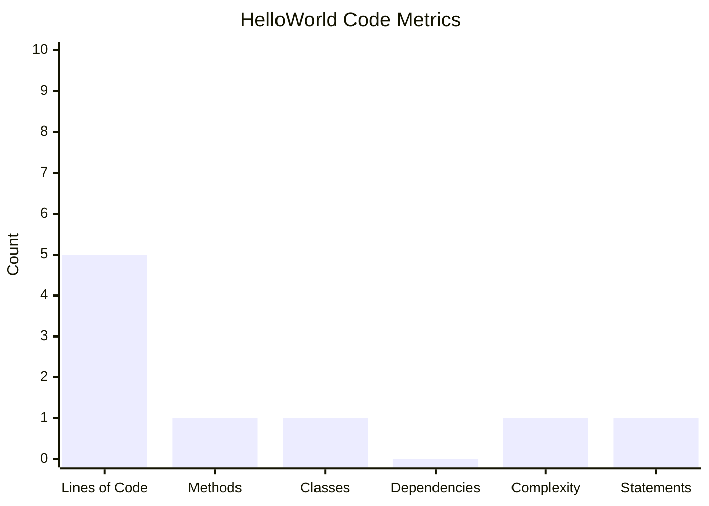

| Metric | Value | Assessment | Industry Baseline (for comparison) |
|--------|-------|-----------|-------------------------------------|
| Lines of Code (total) | 5 | 🟢 Excellent | N/A (minimal by design) |
| Lines of Code (executable) | 1 | 🟢 Excellent | N/A |
| Number of Classes | 1 | 🟢 Single responsibility | — |
| Number of Methods | 1 | 🟢 Focused | — |
| Cyclomatic Complexity | 1 (minimum possible) | 🟢 Excellent | < 10 = Good |
| Cognitive Complexity | 0 | 🟢 Excellent | < 15 = Good |
| External Dependencies | 0 | 🟢 Zero risk | — |
| Comment Coverage | 0% | ⚠️ No comments | > 20% recommended |
| Test Coverage | 0% | ⚠️ No tests | > 80% recommended |
| Code Duplication | 0% | 🟢 None | < 5% = Good |
| Maintainability Index | ~100/100 | 🟢 Excellent | > 85 = Highly Maintainable |

### 10.4 ISO 25010 Assessment

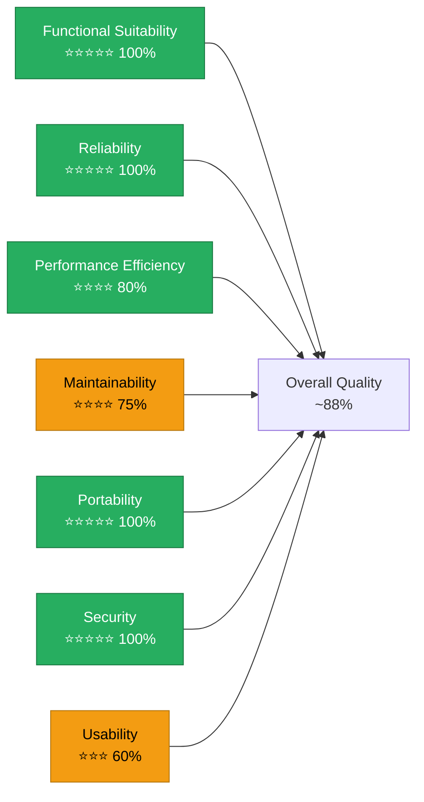

> **Note on lower scores**: Maintainability is rated 75% due to absence of comments, tests, and package structure. Usability is 60% due to no help text, no argument processing, and no feedback on incorrect invocation.

---

## 11. Risks and Technical Debt

> **Source analysis**: Risk profile is minimal due to zero dependencies and zero external integrations. Technical debt is low but documented for completeness.

### 11.1 Risk Register

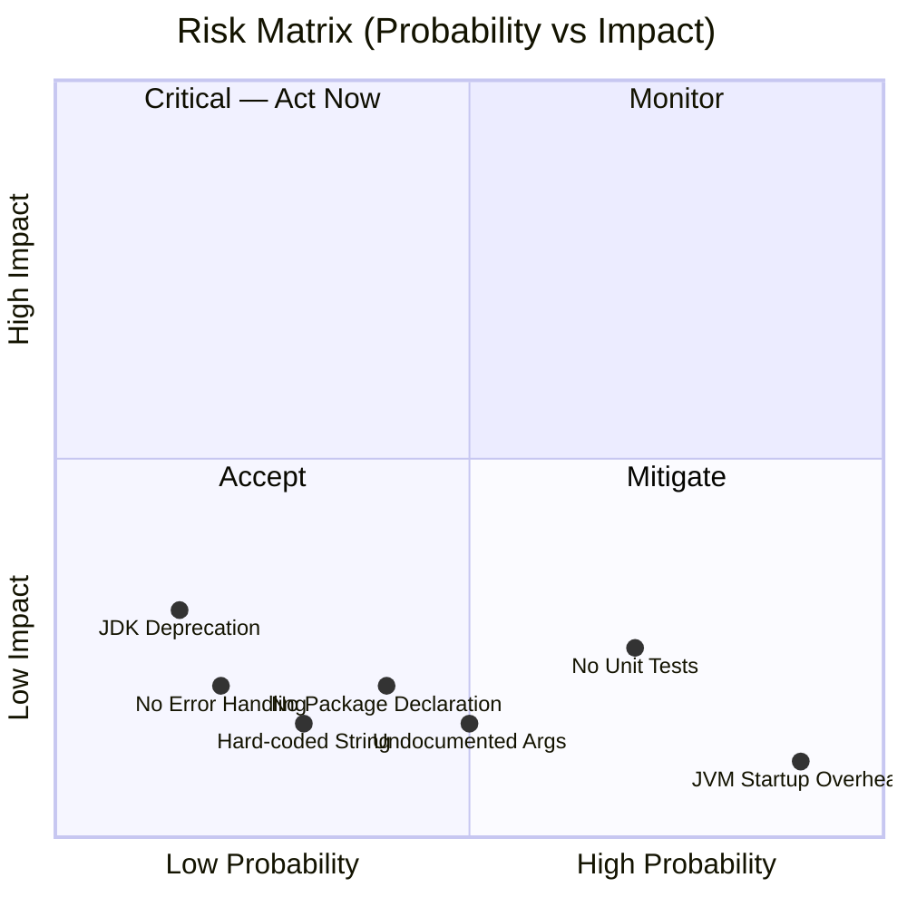

| ID | Risk | Probability | Impact | Severity | Mitigation |
|----|------|-------------|--------|----------|------------|
| R-01 | **JDK version incompatibility** — compiled class won't run on older JVMs if newer language features are added | Low | Medium | 🟡 Medium | Pin minimum Java version; use `--release` flag |
| R-02 | **No automated tests** — regressions in output not caught by CI | High | Low | 🟡 Medium | Add output assertion test (see TD-01) |
| R-03 | **JVM startup latency** — for latency-sensitive use cases, ~200ms is unacceptable | High | Very Low | 🟢 Low | Use `java HelloWorld.java` (Java 11+) or GraalVM native-image |
| R-04 | **Default package coupling** — cannot be reused as a library | Medium | Low | 🟢 Low | Move to named package if reuse is desired |
| R-05 | **No error handling on stdout** — if stdout is redirected and fails, error is silently swallowed | Low | Low | 🟢 Acceptable | Check `System.out.checkError()` post-print if robustness needed |
| R-06 | **Undocumented `args` parameter** — users may expect arguments to be honoured | Medium | Low | 🟢 Low | Document expected invocation or validate/reject args |

### 11.2 Technical Debt Items

| ID | Debt Item | Category | Effort to Fix | Priority |
|----|-----------|----------|---------------|---------|
| TD-01 | **No unit or integration tests** — output correctness is not automatically verified | Test Debt | Small (1 test class) | 🔴 High |
| TD-02 | **No Javadoc comments** — class and method have no documentation | Documentation Debt | Very Small (3 lines) | 🟡 Medium |
| TD-03 | **No package declaration** — violates Java naming conventions for non-trivial projects | Design Debt | Very Small (1 line) | 🟡 Medium |
| TD-04 | **No build descriptor** — no reproducible build; JDK version is environmental | Build Debt | Small (`pom.xml` or `build.gradle`) | 🟡 Medium |
| TD-05 | **`args` parameter never read** — dead parameter; intent unclear | Code Smell | Very Small (remove or use) | 🟢 Low |
| TD-06 | **No `.java-version` / `.tool-versions` file** — JDK version not pinned | Configuration Debt | Trivial | 🟢 Low |

### 11.3 Technical Debt Visualisation

```mermaid
graph TB
    classDef high fill:#E74C3C,stroke:#922B21,color:#fff
    classDef medium fill:#F39C12,stroke:#B7770D,color:#000
    classDef low fill:#27AE60,stroke:#1A7A42,color:#fff

    subgraph DEBT["Technical Debt Backlog"]
        TD1["🔴 TD-01: No Tests\nEffort: Small\nPriority: High"]:::high
        TD2["🟡 TD-02: No Javadoc\nEffort: Trivial\nPriority: Medium"]:::medium
        TD3["🟡 TD-03: Default Package\nEffort: Trivial\nPriority: Medium"]:::medium
        TD4["🟡 TD-04: No Build File\nEffort: Small\nPriority: Medium"]:::medium
        TD5["🟢 TD-05: Unused args\nEffort: Trivial\nPriority: Low"]:::low
        TD6["🟢 TD-06: No JDK version pin\nEffort: Trivial\nPriority: Low"]:::low
    end
```

### 11.4 Recommended Improvements (Prioritised)

1. **Add a test** — Use JUnit 5 to capture stdout and assert `"Hello World\n"`:
   ```java
   // HelloWorldTest.java
   import org.junit.jupiter.api.Test;
   import java.io.*;
   import static org.junit.jupiter.api.Assertions.*;

   class HelloWorldTest {
       @Test
       void mainPrintsHelloWorld() throws Exception {
           PrintStream original = System.out;
           ByteArrayOutputStream baos = new ByteArrayOutputStream();
           System.setOut(new PrintStream(baos));
           HelloWorld.main(new String[]{});
           System.setOut(original);
           assertEquals("Hello World" + System.lineSeparator(), baos.toString());
       }
   }
   ```

2. **Add Javadoc** — Document the class and method intent.

3. **Introduce a build system** — Add `pom.xml` (Maven) or `build.gradle` (Gradle) to enable reproducible builds.

4. **Declare a package** — Move to `com.example.helloworld` if the project is to grow.

5. **Pin JDK version** — Add `.java-version` (jenv) or `toolchains.xml` (Maven).

---

## 12. Glossary

> Terms extracted from source code identifiers, Java language concepts, and JVM platform terminology relevant to this project.

### 12.1 Domain and Application Terms

| Term | Definition |
|------|-----------|
| **Hello World** | The canonical first program in any programming language; prints the string "Hello World" to the console. Used universally to verify a working development environment. |
| **Greeting** | The output message produced by the application: the string `"Hello World"`. |
| **Standard Output (stdout)** | The default output stream for a process (POSIX file descriptor 1). Text written to stdout appears in the terminal unless redirected. |

### 12.2 Java Language Terms

| Term | Definition |
|------|-----------|
| **Class** | The fundamental unit of Java code. A class defines fields, methods, and behaviour. `HelloWorld` is the single class in this project. |
| **`main` method** | The designated JVM entry point: `public static void main(String[] args)`. Execution begins here when `java HelloWorld` is invoked. |
| **`public`** | Java access modifier meaning the class or method is accessible from anywhere. |
| **`static`** | Java keyword indicating a method or field belongs to the class itself, not to an instance. `main` must be static so the JVM can call it without creating an object. |
| **`void`** | Java return type indicating a method returns no value. |
| **`String[] args`** | The command-line arguments passed to the program by the shell. In this program, `args` is never read. |
| **`System.out`** | A static field of `java.lang.System` of type `PrintStream`, connected to the process's standard output. |
| **`println`** | A method of `PrintStream` that writes a string followed by the platform line separator (`\n` on Unix, `\r\n` on Windows) to the stream. |
| **String literal** | A sequence of characters enclosed in double quotes (`"Hello World"`). Interned in the JVM string pool at class-load time. |
| **Default package** | The unnamed package in Java; used when no `package` statement is present. Not recommended for library code. |
| **`java.lang`** | The core Java package automatically imported into every Java class. Contains `String`, `System`, `Object`, `Math`, and others. |

### 12.3 JVM and Platform Terms

| Term | Definition |
|------|-----------|
| **JVM (Java Virtual Machine)** | The runtime environment that executes Java bytecode. Provides memory management, class loading, and platform abstraction. |
| **JDK (Java Development Kit)** | The complete development toolset including `javac` (compiler), `java` (runtime launcher), `jar`, `javadoc`, and the standard library. |
| **JRE (Java Runtime Environment)** | A subset of the JDK containing only the JVM and standard library; sufficient to *run* (but not compile) Java programs. Deprecated as a separate download since JDK 11. |
| **`javac`** | The Java compiler. Transforms `.java` source files into `.class` bytecode files. |
| **Bytecode** | Platform-neutral intermediate code produced by `javac` and stored in `.class` files. Interpreted or JIT-compiled by the JVM. |
| **ClassLoader** | JVM component responsible for loading `.class` files from the filesystem or classpath into memory. |
| **Classpath** | A list of directories and JAR files the JVM searches when loading classes. Defaults to the current directory (`.`) if not specified. |
| **Cyclomatic Complexity** | A software metric measuring the number of independent paths through code. Value of 1 (minimum) indicates a straight-line program with no branching. |
| **Exit Code** | An integer returned by a process to the OS on termination. `0` = success; non-zero = failure. Java's `main` returning normally produces exit code `0`. |
| **JIT (Just-In-Time compilation)** | Optimisation performed by the HotSpot JVM that compiles frequently-executed bytecode to native machine code at runtime. |

### 12.4 Architecture and Process Terms

| Term | Definition |
|------|-----------|
| **Arc42** | A pragmatic, lightweight software architecture documentation template with 12 standardised sections. See [arc42.org](https://arc42.org). |
| **ADR (Architecture Decision Record)** | A short document capturing an architectural decision, its context, rationale, and consequences. |
| **C4 Model** | A hierarchical notation for software architecture diagrams: Context → Container → Component → Code. |
| **Mermaid** | A Markdown-native diagramming language rendered as SVG in GitHub, GitLab, and many documentation tools. |
| **CI/CD** | Continuous Integration / Continuous Deployment — automated pipelines that build, test, and deploy software on each commit. |
| **GitHub Actions** | GitHub's built-in CI/CD platform, configured via YAML files in `.github/workflows/`. |
| **Single Responsibility Principle (SRP)** | The principle that a class or module should have only one reason to change. `HelloWorld` adheres perfectly: it has exactly one responsibility. |
| **Technical Debt** | The accumulated cost of shortcuts, missing tests, poor design choices, and deferred refactoring in a codebase. |

---

## Document Metadata

| Field | Value |
|-------|-------|
| **Arc42 Version** | 8.x |
| **Documentation Generated** | 2025-01-01 |
| **Generator** | Arc42 Documentation Generator (arc42-documentor agent) |
| **Source Repository** | `ktruchcz/copilot-test-ktruchcz` |
| **Source Files Analysed** | `HelloWorld.java`, `README.md`, `.github/` (structure) |
| **Total Mermaid Diagrams** | 16 |
| **Document Sections** | 12 / 12 complete |

---

*This document was automatically generated by the Arc42 Documentation Generator from static analysis of the repository source code. All architectural observations are derived from the code itself. For questions or updates, see the repository at [github.com/ktruchcz/copilot-test-ktruchcz](https://github.com/ktruchcz/copilot-test-ktruchcz).*
