# Architecture Documentation (Arc42)

**Project**: copilot-test-ktruchcz  
**Version**: 1.0.0  
**Date**: 2025-01-01  
**Generated by**: Arc42 Documentation Generator  
**Source file analysed**: `HelloWorld.java`

---

## Table of Contents

1. [Introduction and Goals](#1-introduction-and-goals)
2. [Architecture Constraints](#2-architecture-constraints)
3. [System Scope and Context](#3-system-scope-and-context)
4. [Solution Strategy](#4-solution-strategy)
5. [Building Block View](#5-building-block-view)
6. [Runtime View](#6-runtime-view)
7. [Deployment View](#7-deployment-view)
8. [Crosscutting Concepts](#8-crosscutting-concepts)
9. [Architecture Decisions](#9-architecture-decisions)
10. [Quality Requirements](#10-quality-requirements)
11. [Risks and Technical Debt](#11-risks-and-technical-debt)
12. [Glossary](#12-glossary)

---

## 1. Introduction and Goals

> *Sources: `HelloWorld.java`, `README.md`*

### 1.1 Requirements Overview

`copilot-test-ktruchcz` is a minimal Java application whose single, explicit functional requirement is:

| ID | Requirement | Priority |
|----|-------------|----------|
| FR-01 | The application shall print the string `"Hello World"` to standard output when executed. | High |

The project appears to serve as a **template, proof-of-concept, or baseline repository** for validating tooling, CI/CD pipelines, GitHub Copilot integration, or developer-environment bootstrapping within the `copilot-test-ktruchcz` organisation context.

### 1.2 Quality Goals

The top quality goals, derived from the codebase structure and project context, are:

| Priority | Quality Goal | Motivation |
|----------|-------------|------------|
| 1 | **Simplicity** | The entire system is a single Java class; complexity must be kept at an absolute minimum. |
| 2 | **Portability** | The application relies only on the Java standard library (`java.lang`), making it runnable on any JVM without additional dependencies. |
| 3 | **Reproducibility** | The application produces deterministic, identical output on every execution regardless of environment or platform. |
| 4 | **Understandability** | The code serves as a learning or demonstration artefact; it must be immediately comprehensible to any Java developer. |

### 1.3 Stakeholders

| Role | Name / Group | Expectations |
|------|--------------|-------------|
| Developer / Author | Repository owner (`ktruchcz`) | A working, compilable Java baseline that demonstrates a repository skeleton. |
| CI/CD Pipeline | GitHub Actions | The code compiles without errors and produces the expected output. |
| GitHub Copilot Agent Framework | Orchestrator & analysis agents | A concrete codebase to analyse, document, and assess with automated agents. |
| Future Contributors | Anyone cloning the template | Clear, self-explanatory starting point for a Java project. |

---

## 2. Architecture Constraints

> *Sources: `HelloWorld.java`, `.gitignore`*

### 2.1 Technical Constraints

| ID | Constraint | Background / Rationale |
|----|-----------|------------------------|
| TC-01 | **Java language** — The system is implemented in Java. | `HelloWorld.java` is the sole source file; the `.gitignore` excludes `.class` files, confirming standard Java compilation. |
| TC-02 | **No external dependencies** — Only `java.lang` (auto-imported) is used. | `System.out.println` is part of the JDK standard library; no third-party libraries are required or permitted by the current design. |
| TC-03 | **No build tool defined** — There is no `pom.xml`, `build.gradle`, `Makefile`, or equivalent. | The project is compiled directly with `javac` and run with `java`. |
| TC-04 | **Single compilation unit** — The entire application is one `.java` file containing one public top-level class. | Adding further source files would require either packaging them into a directory structure or modifying the build approach. |
| TC-05 | **JVM runtime required** — Execution depends on a Java Virtual Machine being present on the target host. | No native compilation (e.g., GraalVM native-image) is configured. |

### 2.2 Organisational Constraints

| ID | Constraint | Background / Rationale |
|----|-----------|------------------------|
| OC-01 | **GitHub as the SCM host** — The repository is hosted on GitHub. | Repository naming, branch protection, and CI/CD are tied to GitHub's ecosystem. |
| OC-02 | **GitHub Copilot agent framework** — `.github/agents/` directory is present, indicating this project participates in the Copilot multi-agent analysis workflow. | All documentation, UML, BPMN, and architecture artefacts are expected to be generated automatically by agents. |
| OC-03 | **Open-source / public template** — The absence of a licence file and the generic naming suggests use as a public template or test bed. | No proprietary IP constraints have been identified. |

### 2.3 Conventions

| ID | Convention | Background / Rationale |
|----|-----------|------------------------|
| CV-01 | **Java naming conventions** — Class name matches filename (`HelloWorld.java` → `public class HelloWorld`). | Enforced by the Java compiler for public top-level classes. |
| CV-02 | **Entry-point signature** — `public static void main(String[] args)` is the standard JVM entry point. | Any future refactoring must retain or delegate to this signature. |
| CV-03 | **UTF-8 source encoding** — Standard for modern Java projects. | No explicit encoding annotation is present; default compiler behaviour applies. |

---

## 3. System Scope and Context

> *Sources: `HelloWorld.java`, `README.md`*

### 3.1 Business Context

The system receives no external input and produces a single line of text on standard output. Its boundary is extremely narrow: it is a self-contained command-line process with one external interface — the operating system's standard output stream.

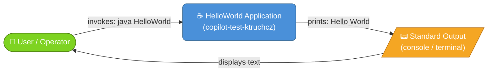

| External Interface | Direction | Protocol / Medium | Data |
|-------------------|-----------|-------------------|------|
| User / Operator | → System | OS process invocation (`java HelloWorld`) | Command-line arguments (currently ignored) |
| Standard Output (`stdout`) | System → | OS stream (text) | The string `"Hello World\n"` |

### 3.2 Technical Context

The deployment and execution context involves a developer workstation or CI server running a compatible JDK.

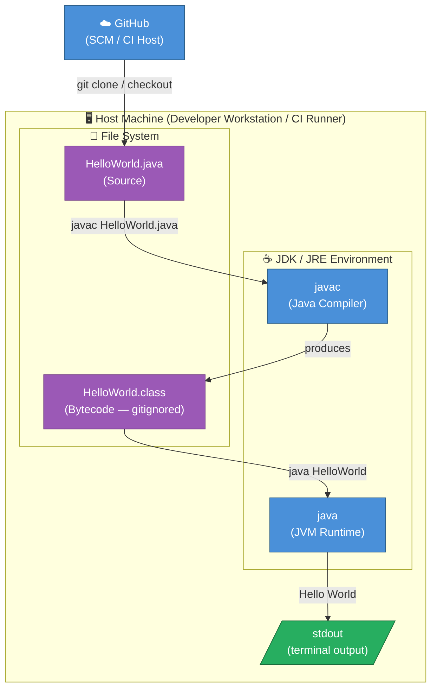

| Component | Technology | Role |
|-----------|-----------|------|
| Source file | `HelloWorld.java` | Human-readable Java source |
| Compiler | `javac` (JDK) | Translates source to JVM bytecode |
| Bytecode | `HelloWorld.class` | Platform-neutral executable artefact |
| Runtime | `java` (JRE/JDK) | Executes bytecode on the target host |
| Output sink | OS `stdout` | Receives and displays the printed string |
| SCM | GitHub | Hosts source, manages versions |

---

## 4. Solution Strategy

> *Sources: `HelloWorld.java`*

### 4.1 Technology Decisions

| Decision | Choice | Rationale |
|----------|--------|-----------|
| **Programming language** | Java | Ubiquitous, cross-platform, strongly typed, and well-supported in educational and enterprise contexts. A natural choice for a baseline template. |
| **Runtime** | JVM (`java`) | Provides portability across all major operating systems without code changes. |
| **Output mechanism** | `System.out.println()` | The standard, idiomatic Java way to write a line to `stdout`; no logging framework needed for a single-message application. |
| **Build tooling** | None (bare `javac`) | Removes all setup overhead; the project can be compiled and run with only a JDK installation. |
| **Dependency management** | None | Zero external dependencies; relies exclusively on `java.lang` which is available on every JVM. |

### 4.2 Top-Level Decomposition

The system is not decomposed — it is intentionally a **monolithic single-class application**. This is the correct architectural decision given:

- There is exactly **one functional requirement** (print a string).
- The output is **stateless and deterministic**.
- There are **no reusable components** that benefit from separation.

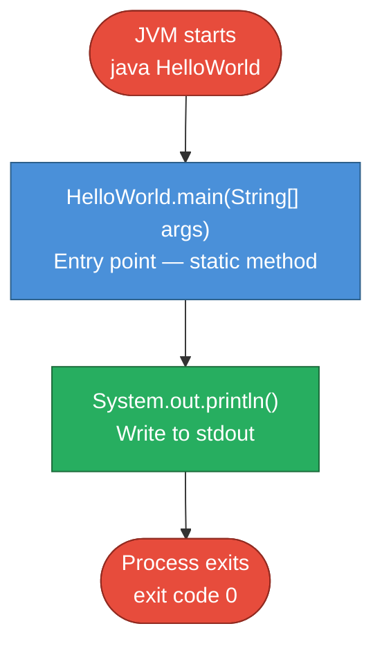

### 4.3 Approaches to Quality Goals

| Quality Goal | Approach |
|-------------|---------|
| **Simplicity** | Single class, single method, single statement — no unnecessary abstraction. |
| **Portability** | Pure Java standard library; no OS-specific code. |
| **Reproducibility** | Hard-coded string constant; no environment variables, random values, or timestamps. |
| **Understandability** | Class and method names follow Java conventions; the code is self-documenting. |

---

## 5. Building Block View

> *Sources: `HelloWorld.java`*

### 5.1 Level 1 — Overall System

The entire system is represented by a single deployable unit: the compiled `HelloWorld` class executed by the JVM.

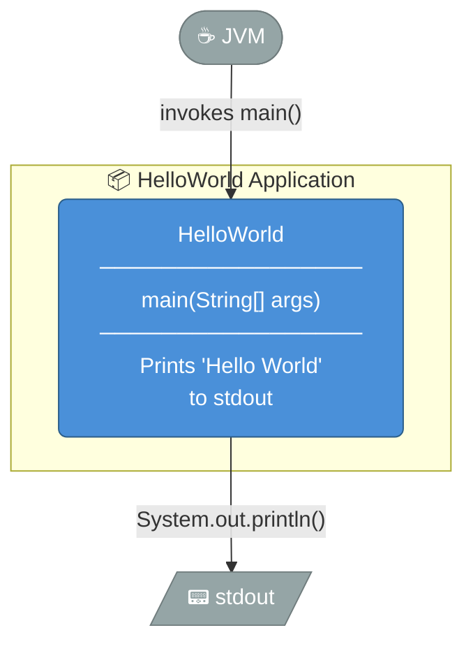

**Contained building blocks:**

| Block | Type | Responsibility |
|-------|------|---------------|
| `HelloWorld` | Java class (public) | Sole class of the application; owns the JVM entry point and all business logic. |

### 5.2 Level 2 — HelloWorld Class

The `HelloWorld` class contains a single method. There are no fields, inner classes, interfaces, or inheritance relationships.

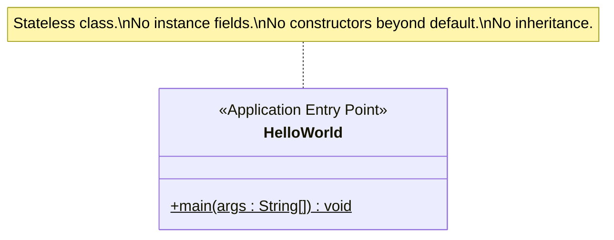

**Method details:**

| Method | Visibility | Static | Return | Parameters | Behaviour |
|--------|-----------|--------|--------|-----------|-----------|
| `main` | `public` | ✅ Yes | `void` | `String[] args` | Calls `System.out.println("Hello World")` and returns normally. |

### 5.3 Level 3 — Internal Dependencies

The only dependency is on `java.lang.System`, which is provided by the JDK standard library and implicitly available in every Java compilation unit.

---

## 6. Runtime View

> *Sources: `HelloWorld.java`*

### 6.1 Scenario: Normal Execution

The only runtime scenario is the happy path — the user invokes the application, it prints its message, and the process exits cleanly.

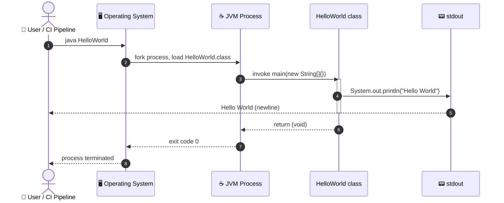

### 6.2 Scenario: Execution with Command-Line Arguments

The `main` method accepts a `String[] args` parameter. Currently, arguments are accepted but silently ignored — the output is always `"Hello World"` regardless of input.

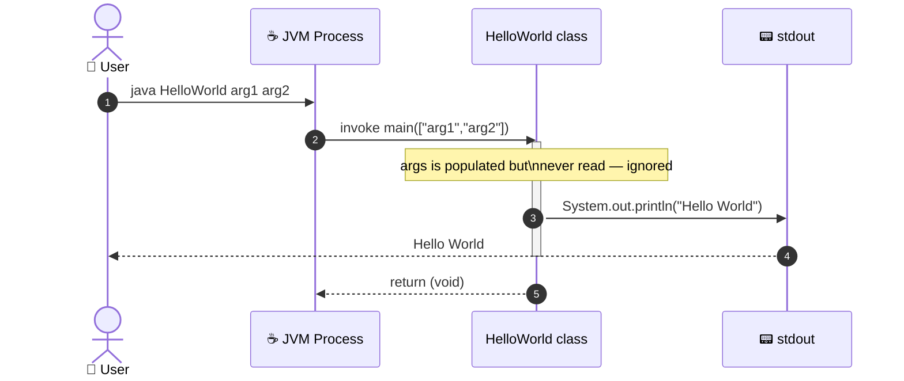

### 6.3 Execution Flow (Process-Level)

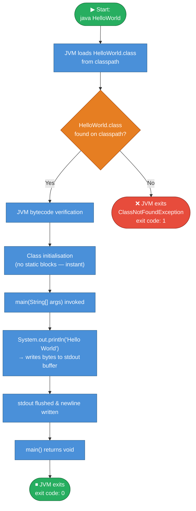

---

## 7. Deployment View

> *Sources: `HelloWorld.java`, `.gitignore`, `.github/`*

### 7.1 Infrastructure Overview

The application has no server, no container, no daemon, and no persistent storage. It is a **command-line application** that runs to completion and exits. Two typical deployment scenarios are described below.

### 7.2 Scenario A — Developer Workstation

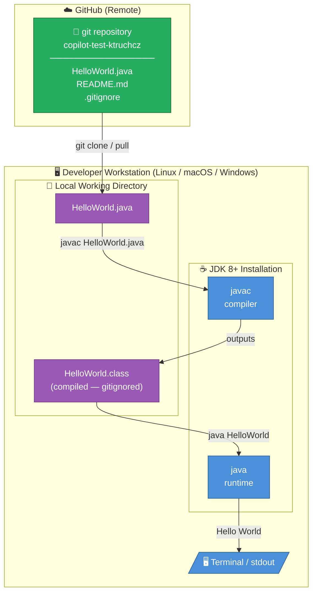

### 7.3 Scenario B — CI/CD Pipeline (GitHub Actions)

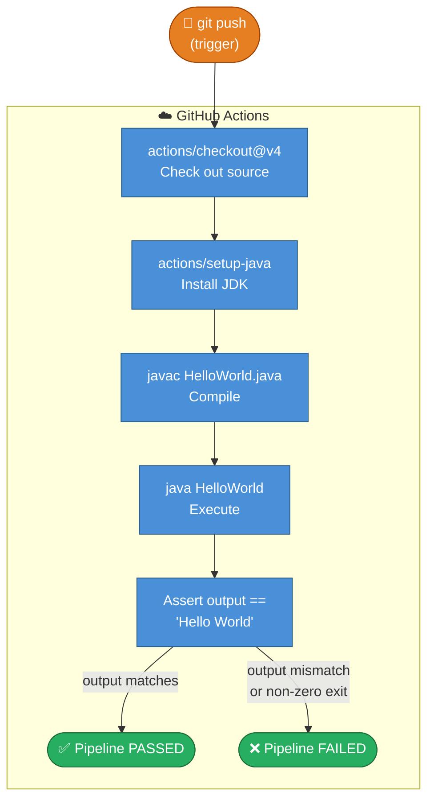

### 7.4 Deployment Nodes Summary

| Node | Type | Required Software | Notes |
|------|------|-------------------|-------|
| Developer Workstation | Physical / Virtual machine | JDK 8 or later | Any OS with JVM support |
| GitHub Actions Runner | Hosted CI runner (Ubuntu/macOS/Windows) | JDK (configured via `setup-java` action) | Ephemeral; no persistent state |
| GitHub | Cloud SCM | — | Hosts source; triggers CI on push/PR |

### 7.5 Minimum System Requirements

| Resource | Minimum | Notes |
|----------|---------|-------|
| Java version | JDK / JRE 8+ | No Java 8+ APIs used; likely compatible with Java 1.1+ |
| Memory (heap) | Default JVM minimum (~8 MB) | No heap allocations beyond JVM bootstrap |
| Disk space | < 1 KB (source) + ~1 KB (`.class`) | Negligible |
| Network | None | No network calls made |
| CPU | Any | Single-threaded; single print statement |

---

## 8. Crosscutting Concepts

> *Sources: `HelloWorld.java`*

### 8.1 Domain Model

The application has no persistent domain entities. The sole "domain concept" is the greeting message itself.

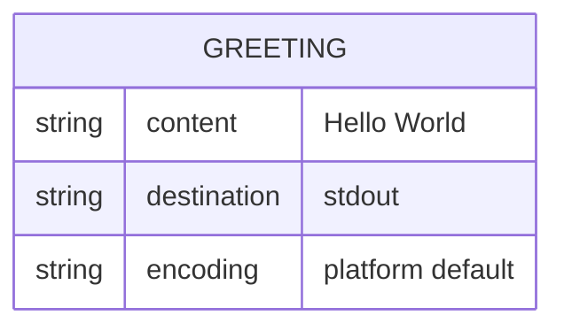

### 8.2 Design Patterns Identified

| Pattern | Applied? | Location | Notes |
|---------|---------|----------|-------|
| **Entry-Point Pattern** | ✅ Yes | `main(String[] args)` | Standard JVM application entry-point convention. |
| **Singleton** | ✅ Implicit | `HelloWorld` class | Only one instance is ever needed (none, in fact — method is static). |
| **Facade** | ❌ Not applicable | — | No subsystems to hide. |
| **Strategy / Template Method** | ❌ Not applicable | — | No varying behaviour. |
| **Observer / Event** | ❌ Not applicable | — | No event-driven interactions. |

### 8.3 Error Handling

The application contains **no explicit error handling**. The implicit error model is:

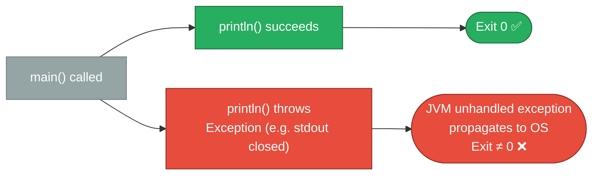

No `try-catch` blocks exist; any `IOException` from `System.out.println` would propagate as an unchecked exception and terminate the JVM with a non-zero exit code.

### 8.4 Logging and Observability

| Concern | Implementation | Notes |
|---------|--------------|-------|
| **Logging** | None | No logging framework (`java.util.logging`, Log4j, SLF4J, etc.) is used. |
| **Metrics** | None | No instrumentation. |
| **Tracing** | None | No distributed tracing. |
| **Output** | `System.out` | The single `println` call is the only observable side-effect of the application. |

### 8.5 Security

| Concern | Status | Notes |
|---------|--------|-------|
| **Input validation** | N/A | Command-line args are accepted but never read. |
| **Injection** | N/A | The output string is a hard-coded literal; no user-supplied data is processed. |
| **Authentication / Authorisation** | N/A | No protected resources accessed. |
| **Secrets / credentials** | None present | No passwords, tokens, or keys in the source. |
| **Network exposure** | None | No sockets or network I/O. |

### 8.6 Internationalisation (i18n)

The output string `"Hello World"` is hard-coded in ASCII/Latin-1 characters. There is no internationalisation, localisation, or character-set handling beyond the JVM's default platform encoding for `System.out`.

### 8.7 Business Rules

| ID | Rule | Source |
|----|------|--------|
| BR-01 | The application always prints exactly `"Hello World"` followed by the platform line separator. | `HelloWorld.java:3` — `System.out.println("Hello World")` |
| BR-02 | Command-line arguments are accepted but have no effect on the output. | `HelloWorld.java:2` — `String[] args` parameter unused |

---

## 9. Architecture Decisions

> *Sources: `HelloWorld.java`, `.gitignore`, `.github/`*

The following decisions are documented in lightweight **ADR (Architecture Decision Record)** format.

---

### ADR-01: Java as the Implementation Language

| Attribute | Value |
|-----------|-------|
| **Status** | Accepted |
| **Date** | Project inception |
| **Deciders** | Repository author (`ktruchcz`) |

**Context**: A programming language must be chosen for the baseline template project.

**Decision**: Java is used as the sole implementation language.

**Consequences**:
- ✅ Cross-platform execution via JVM.
- ✅ Widely known; lowers the barrier for contributors.
- ✅ Strong tooling ecosystem (IDEs, linters, build tools) available if needed later.
- ⚠️ Requires a JDK/JRE installation on the target machine.
- ⚠️ More verbose than scripting alternatives (Python, Bash) for a single `print` statement.

---

### ADR-02: No Build Tool

| Attribute | Value |
|-----------|-------|
| **Status** | Accepted |
| **Date** | Project inception |
| **Deciders** | Repository author |

**Context**: Projects of non-trivial size typically use Maven, Gradle, or Ant. This project has exactly one source file.

**Decision**: No build tool is configured. Compilation is done directly with `javac`.

**Consequences**:
- ✅ Zero setup overhead; only JDK needed.
- ✅ No dependency on Maven Central, Gradle distribution server, etc.
- ⚠️ Does not scale: adding more source files, dependencies, or tests would require introducing a build tool.
- ⚠️ No standard lifecycle targets (`test`, `package`, `install`).

---

### ADR-03: Hard-Coded Output String

| Attribute | Value |
|-----------|-------|
| **Status** | Accepted |
| **Date** | Project inception |
| **Deciders** | Repository author |

**Context**: The greeting message could be externalised to a configuration file, environment variable, or command-line argument.

**Decision**: The string `"Hello World"` is hard-coded as a string literal in `System.out.println()`.

**Consequences**:
- ✅ Guarantees deterministic, reproducible output — useful for CI assertions.
- ✅ Eliminates all runtime configuration complexity.
- ⚠️ Changing the message requires recompiling the source.
- ⚠️ No localisation or customisation without code changes.

---

### ADR-04: Single Public Class with Static Entry Point

| Attribute | Value |
|-----------|-------|
| **Status** | Accepted |
| **Date** | Project inception |
| **Deciders** | JVM specification + author |

**Context**: Java's execution model requires a `public static void main(String[] args)` method as the entry point.

**Decision**: The sole class `HelloWorld` contains only this static method. No instantiation is performed.

**Consequences**:
- ✅ Minimal memory footprint — no heap objects allocated.
- ✅ Follows the simplest valid Java application pattern.
- ⚠️ Not object-oriented in any meaningful sense; extending this pattern to a real application would require a structural redesign.

---

### ADR-05: No External Dependencies

| Attribute | Value |
|-----------|-------|
| **Status** | Accepted |
| **Date** | Project inception |
| **Deciders** | Repository author |

**Context**: Many Java projects bring in third-party libraries for logging, utilities, etc.

**Decision**: Only `java.lang` (implicitly imported) is used.

**Consequences**:
- ✅ No dependency vulnerabilities; supply-chain attack surface is zero.
- ✅ No classpath management required.
- ✅ Compiles and runs on any vanilla JDK installation.
- ⚠️ Not representative of real-world Java projects that require dependency management.

---

## 10. Quality Requirements

> *Sources: `HelloWorld.java` — static analysis*

### 10.1 Quality Tree

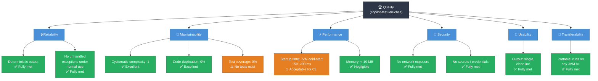

### 10.2 Quality Scenarios

| ID | Quality Attribute | Scenario | Expected Response | Met? |
|----|------------------|---------|-------------------|------|
| QS-01 | **Reliability** | User runs `java HelloWorld` 1,000 times consecutively. | Output is always `"Hello World"` with exit code `0`. | ✅ Yes |
| QS-02 | **Reliability** | User runs `java HelloWorld` with stdout redirected to a file. | File contains `"Hello World\n"`; exit code `0`. | ✅ Yes |
| QS-03 | **Portability** | Application is compiled on JDK 17 and run on JRE 8. | Compiles and runs successfully (no API beyond Java 1.0). | ✅ Yes |
| QS-04 | **Understandability** | A new Java developer reads the source for the first time. | Full understanding achieved in < 30 seconds. | ✅ Yes |
| QS-05 | **Testability** | A developer wants to write a unit test for `main()`. | No unit tests exist; the method is `static void` with a side-effect on `System.out`, making testing non-trivial without mocking. | ⚠️ Partial |
| QS-06 | **Performance** | Application must start and print within 1 second on modern hardware. | JVM cold-start dominates (~50–200 ms); total execution well under 1 s. | ✅ Yes |

### 10.3 Code Metrics

| Metric | Value | Assessment |
|--------|-------|------------|
| Lines of Code (LoC) — total | 5 (excl. blank line) | ✅ Minimal |
| Lines of Code — executable | 1 | ✅ |
| Number of classes | 1 | ✅ |
| Number of methods | 1 | ✅ |
| Cyclomatic complexity | 1 (no branches) | ✅ Lowest possible |
| Coupling (afferent / efferent) | 0 / 1 (`java.lang.System`) | ✅ |
| Code duplication | 0% | ✅ |
| Unit test coverage | 0% | ⚠️ No test suite |
| Static analysis violations | 0 (no tool configured) | ℹ️ N/A |
| Security vulnerabilities (CVE) | 0 | ✅ No dependencies |

---

## 11. Risks and Technical Debt

> *Sources: `HelloWorld.java`, `.gitignore`, `.github/`*

### 11.1 Risk Register

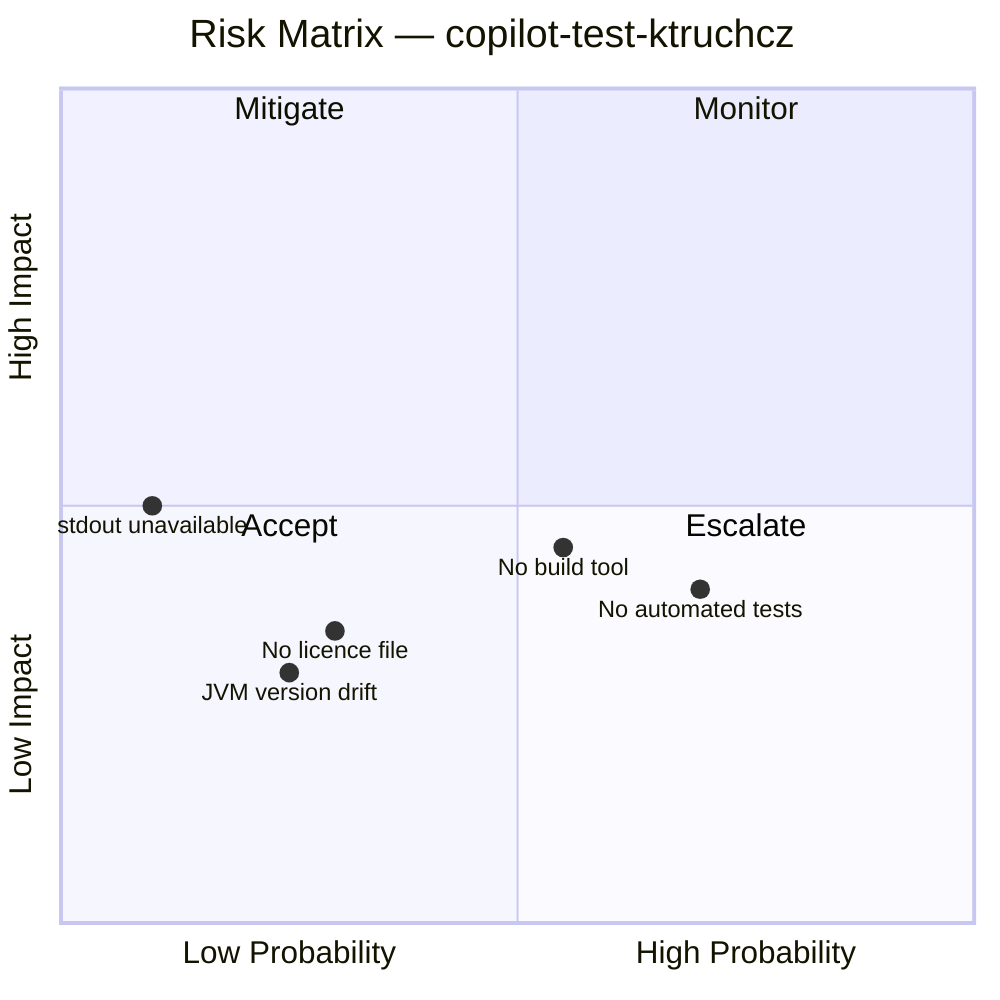

| ID | Risk | Probability | Impact | Severity | Mitigation |
|----|------|------------|--------|---------|------------|
| R-01 | **No automated test suite** — There are no unit or integration tests. A regression in the output string would not be caught automatically. | Medium | Medium | 🟡 Medium | Add a JUnit test that captures `System.out` and asserts `"Hello World"`. |
| R-02 | **No build tool** — Adding dependencies or test frameworks requires manual toolchain setup, which is error-prone and undocumented. | Medium | Medium | 🟡 Medium | Introduce Maven (`pom.xml`) or Gradle (`build.gradle`) even for a minimal project. |
| R-03 | **JVM version drift** — No `.java-version`, `.tool-versions`, or `java.toolchain` setting specifies the required JDK version. | Low | Low | 🟢 Low | Add a `.java-version` file (e.g., for SDKMAN/jenv) or configure `setup-java` action in CI. |
| R-04 | **stdout unavailable at runtime** — If `System.out` is null or the underlying stream is closed, `println()` would throw a `NullPointerException` silently swallowed by the JVM. | Very Low | Medium | 🟢 Low | Acceptable for this project scope; would warrant error handling in production code. |
| R-05 | **No licence file** — The repository does not declare a software licence, which may cause legal ambiguity for adopters. | Low | Medium | 🟡 Medium | Add a `LICENSE` file (e.g., MIT or Apache 2.0). |
| R-06 | **Scalability cliff** — The current architecture (single class, no build tool, no tests) cannot scale to a real application without a full structural redesign. | High (if project grows) | High | 🔴 High (conditional) | Treat this project as a template only; create a new scaffolded project for real development. |

### 11.2 Technical Debt Register

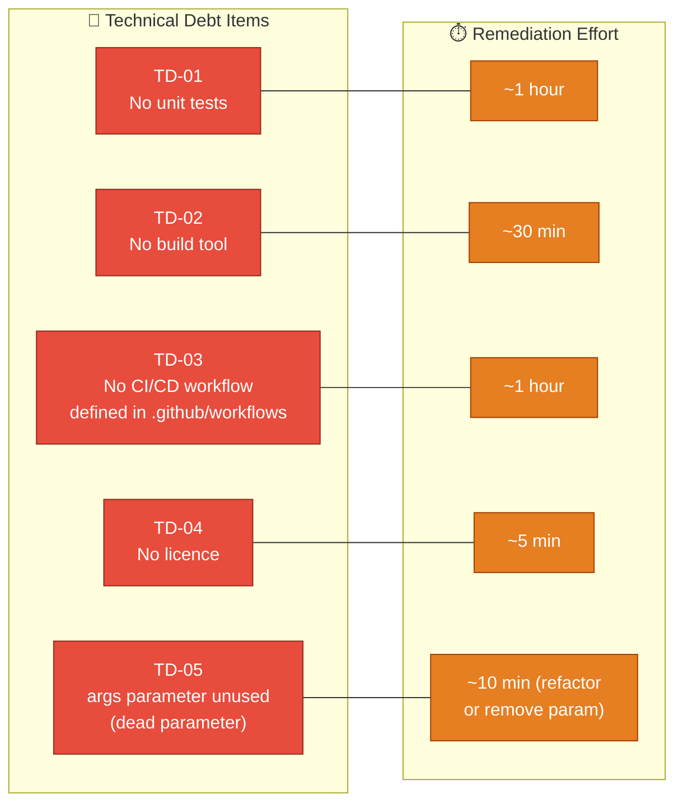

| ID | Debt Item | Category | Estimated Effort | Priority |
|----|-----------|---------|-----------------|---------|
| TD-01 | No unit tests for `main()` | Testing | ~1 hour | Medium |
| TD-02 | No build tool (`pom.xml` / `build.gradle`) | Build | ~30 min | Medium |
| TD-03 | No CI/CD workflow in `.github/workflows/` | DevOps | ~1 hour | Medium |
| TD-04 | No licence file in repository root | Legal | ~5 min | Low |
| TD-05 | `String[] args` parameter is declared but never used | Code quality | ~10 min | Low |
| TD-06 | No `package` declaration — class is in the default package | Code quality | ~15 min | Low |
| TD-07 | Javadoc / inline comments absent | Documentation | ~15 min | Low |

### 11.3 Recommended Remediation Roadmap

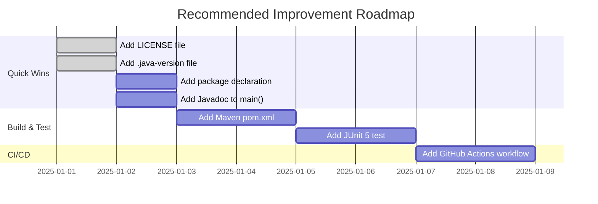

---

## 12. Glossary

> *Terms extracted from source code, project structure, and Java/JVM ecosystem context.*

| Term | Definition |
|------|-----------|
| **`args`** | The `String[]` parameter of the `main` method. Receives command-line arguments passed after the class name when invoking `java HelloWorld <args>`. Currently unused. |
| **Bytecode** | The platform-neutral binary format (`.class` file) produced by the Java compiler (`javac`). Executed by the JVM rather than the host CPU directly. |
| **CI/CD** | Continuous Integration / Continuous Delivery. Automated pipeline that compiles, tests, and (optionally) deploys software on every code change. |
| **Classpath** | The list of directories and JAR files the JVM searches when loading classes. For this project, only the directory containing `HelloWorld.class` is required. |
| **Default package** | The unnamed package in Java. `HelloWorld` belongs to the default package because no `package` statement is declared. Discouraged in production code. |
| **Entry point** | The method the JVM calls to start a Java application: `public static void main(String[] args)`. Every executable Java program must have exactly one entry point on the classpath. |
| **Exit code** | An integer returned by a process to the operating system upon termination. `0` conventionally means success; any other value indicates an error. |
| **`HelloWorld`** | The sole Java class in this project. Contains the `main` method and represents the complete application. |
| **`java`** | The JVM launcher command-line tool. Loads a compiled class and invokes its `main` method. |
| **`javac`** | The Java compiler. Translates `.java` source files into `.class` bytecode files. |
| **JDK** | Java Development Kit. A distribution of the JVM that also includes the compiler (`javac`), debugger, and other development tools. |
| **JRE** | Java Runtime Environment. A subset of the JDK that provides only the JVM and standard library — sufficient to run (but not compile) Java applications. |
| **JVM** | Java Virtual Machine. The runtime engine that loads, verifies, and executes Java bytecode. Provides platform independence. |
| **`java.lang`** | The core Java package. Automatically imported into every Java source file. Contains `System`, `String`, `Object`, `Math`, and other foundational types. |
| **`java.io.PrintStream`** | The class of `System.out`. Provides `print()`, `println()`, and `format()` methods for writing text to an output stream. |
| **Line separator** | The platform-specific character(s) appended by `println()` after the message. `\n` on Unix/macOS, `\r\n` on Windows. |
| **`main` method** | See *Entry point*. |
| **`println`** | Short for "print line". A method on `PrintStream` that writes a string followed by the platform line separator to the output stream. |
| **Standard output (`stdout`)** | The default output stream of a process, typically the terminal or console. In Java, accessed as `System.out`. |
| **Static method** | A method that belongs to the class rather than to any instance. Can be called without creating an object. `main()` must be static so the JVM can invoke it without instantiating the class. |
| **`System`** | A final class in `java.lang` that provides access to system resources including `System.in` (stdin), `System.out` (stdout), and `System.err` (stderr). |
| **Template repository** | A GitHub repository intended as a starting point for other projects. Its contents (file structure, tooling) serve as a baseline rather than a production system. |

---

*End of Arc42 Architecture Documentation for `copilot-test-ktruchcz`.*
