# Architecture Documentation (Arc42)

**Project**: copilot-test-ktruchcz  
**Version**: 1.0.0  
**Date**: 2025-01-01  
**Generated by**: Arc42 Documentation Generator (arc42-documentor)  
**Source analysed**: `HelloWorld.java`, `README.md`, `.gitignore`  
**File location**: `arc42-architecture-documentation.md` (repository root)  
> 📁 To move to `docs/arc42/`: run `mkdir -p docs/arc42 && mv arc42-architecture-documentation.md docs/arc42/`

---

## Table of Contents

1. [Introduction and Goals](#1-introduction-and-goals)
2. [Architecture Constraints](#2-architecture-constraints)
3. [System Scope and Context](#3-system-scope-and-context)
4. [Solution Strategy](#4-solution-strategy)
5. [Building Block View](#5-building-block-view)
6. [Runtime View](#6-runtime-view)
7. [Deployment View](#7-deployment-view)
8. [Cross-cutting Concepts](#8-cross-cutting-concepts)
9. [Architecture Decisions](#9-architecture-decisions)
10. [Quality Requirements](#10-quality-requirements)
11. [Risks and Technical Debt](#11-risks-and-technical-debt)
12. [Glossary](#12-glossary)

---

## 1. Introduction and Goals

### 1.1 Requirements Overview

`copilot-test-ktruchcz` is a minimal Java application whose sole responsibility is to emit the text string **"Hello World"** to the standard output stream. It represents the canonical starting point for verifying that a Java runtime environment is correctly configured and that a developer's toolchain (compiler, JVM, version-control pipeline) is operational.

| Goal | Description |
|------|-------------|
| **G-01** | Print "Hello World" to `stdout` when executed |
| **G-02** | Validate that the Java compilation and execution toolchain is working |
| **G-03** | Serve as a baseline repository for GitHub Copilot agent experimentation (`copilot-test-*`) |
| **G-04** | Demonstrate the minimum viable structure of a Java source repository |

### 1.2 Quality Goals

The following top-level quality goals are derived from the simplicity and intent of the codebase:

| Priority | Quality Goal | Motivation |
|----------|-------------|------------|
| 1 | **Correctness** | The program must always produce exactly the expected output |
| 2 | **Simplicity** | The code must remain easy to read and understand by any developer |
| 3 | **Portability** | Runs on any platform that supports a standard JVM |
| 4 | **Maintainability** | Minimal surface area makes future changes trivially safe |

### 1.3 Stakeholders

| Role | Expectation |
|------|-------------|
| **Developer / Owner** (`ktruchcz`) | A working Hello World baseline; proof-of-concept for tooling |
| **GitHub Copilot Agents** | Analysable repository to exercise code-analysis and documentation pipelines |
| **New Java Learners** | A clear, understandable first Java program |
| **CI / CD Pipeline** | Compile and run without errors; exit code 0 |

---

## 2. Architecture Constraints

### 2.1 Technical Constraints

| ID | Constraint | Rationale |
|----|-----------|-----------|
| **TC-01** | Java programming language | The single source file `HelloWorld.java` is written in Java |
| **TC-02** | Standard Java SE class library only | Only `java.lang.System` and `java.io.PrintStream` are used — no third-party dependencies |
| **TC-03** | JVM execution model | The program must be compiled with `javac` and executed with `java` |
| **TC-04** | Default package | `HelloWorld` is declared in the unnamed (default) package — no `package` statement present |
| **TC-05** | Single source file | The entire application fits in one `.java` file; no multi-module or multi-file structure |
| **TC-06** | No build tool | There is no `pom.xml`, `build.gradle`, `Makefile`, or equivalent — compilation is via raw `javac` |
| **TC-07** | `.class` files excluded from VCS | `.gitignore` explicitly excludes compiled bytecode |

### 2.2 Organisational Constraints

| ID | Constraint | Rationale |
|----|-----------|-----------|
| **OC-01** | Hosted on GitHub | Version control and collaboration via `github.com` |
| **OC-02** | GitHub Copilot agent ecosystem | The repository is a target for automated Copilot analysis agents defined in `.github/agents/` |
| **OC-03** | No formal release process | No versioning tags, changelogs, or release workflows defined |

### 2.3 Conventions Observed

| Convention | Observation |
|-----------|-------------|
| Java naming conventions | Class name `HelloWorld` matches file name `HelloWorld.java` ✅ |
| `main` method signature | Canonical `public static void main(String[] args)` ✅ |
| Output via `System.out.println` | Standard idiomatic Java console output ✅ |
| Bytecode excluded from VCS | `.gitignore` contains `*.class` ✅ |

---

## 3. System Scope and Context

### 3.1 Business Context

The system has a single external interaction: it writes text to the operating system's standard output stream. There are no inbound interfaces, network connections, databases, or user interfaces.

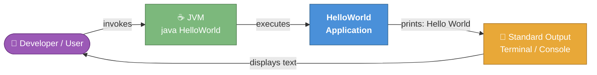

**External interfaces:**

| Interface | Direction | Protocol / Mechanism | Data |
|-----------|-----------|----------------------|------|
| JVM process invocation | Inbound | OS process execution | `String[] args` — declared but never read |
| Standard Output (`stdout`) | Outbound | `System.out.println()` via `java.io.PrintStream` | Fixed string `"Hello World"` |

### 3.2 Technical Context

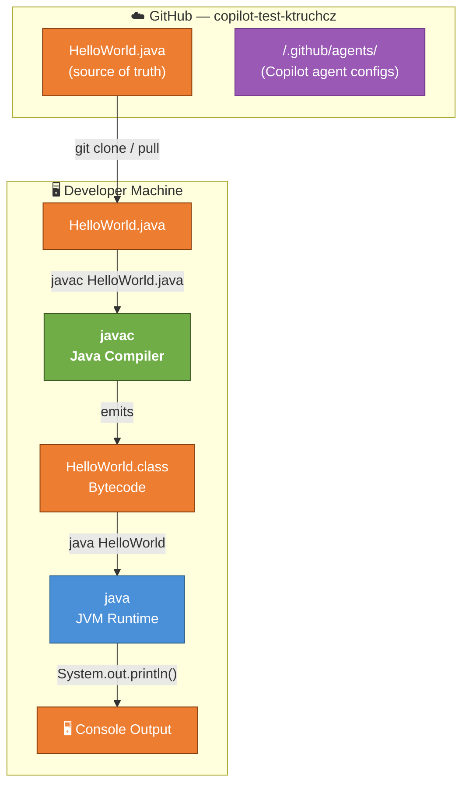

---

## 4. Solution Strategy

### 4.1 Technology Decisions

| Decision | Choice | Rationale |
|----------|--------|-----------|
| **Language** | Java SE | Universal, widely-taught language; JVM portability guarantees cross-platform execution |
| **Paradigm** | Procedural (single static method) | The problem does not require object-oriented decomposition |
| **Dependencies** | None beyond `java.lang` | Minimises environmental setup and eliminates dependency management |
| **Build system** | None (`javac` directly) | No build overhead is justified for a single-file project |
| **Output mechanism** | `System.out.println()` | Standard, idiomatic Java console output; well-understood by all Java developers |
| **Packaging** | Default (unnamed) package | No package hierarchy required for a standalone executable |

### 4.2 Top-Level Decomposition Strategy

Given the trivial scope, the decomposition strategy is deliberately flat:

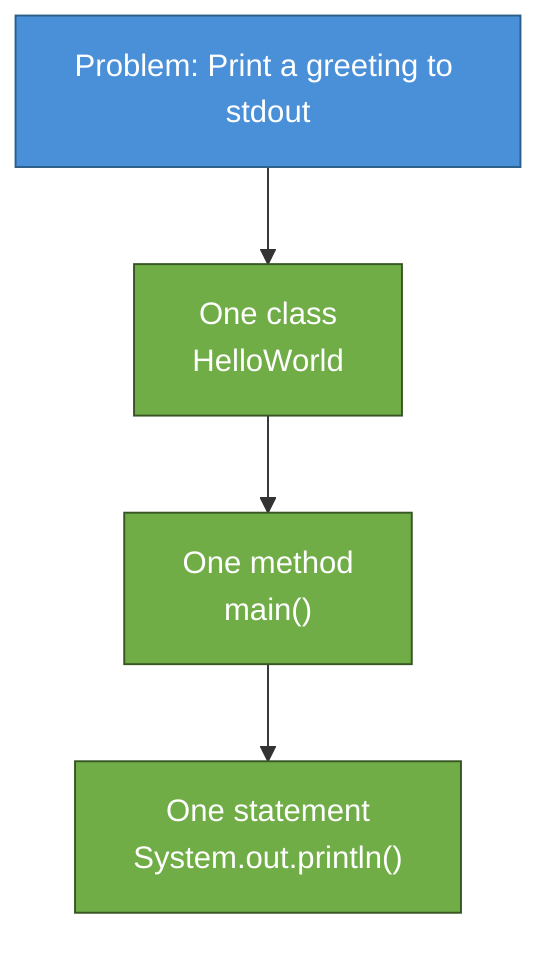

No layering, no separation of concerns, and no design patterns are employed or required.

### 4.3 Approach to Quality Goals

| Quality Goal | Strategy |
|-------------|---------|
| **Correctness** | Hard-coded string literal eliminates any possibility of a data-driven error |
| **Simplicity** | Single class, single method, single statement — minimum possible complexity |
| **Portability** | Pure Java SE — compiles and runs on any JVM ≥ 1.0 |
| **Maintainability** | Zero external dependencies; nothing to upgrade, patch, or configure |

---

## 5. Building Block View

### 5.1 Level 1 — Whitebox: Overall System

The entire system is a single deployable unit with no internal subsystems.

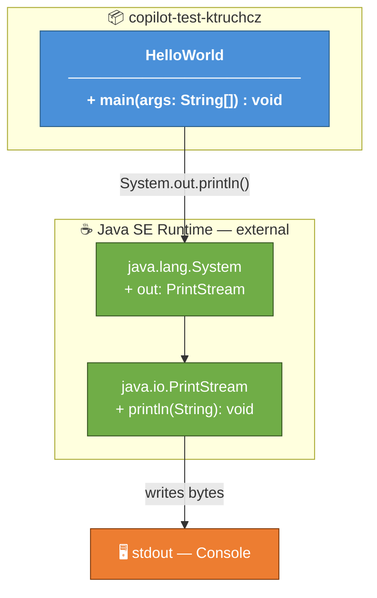

**Contained building blocks:**

| Building Block | Type | Responsibility |
|---------------|------|---------------|
| `HelloWorld` | Application class | JVM entry point; invokes `System.out.println` |
| `java.lang.System` | External (JDK) | Provides the `out` static `PrintStream` field |
| `java.io.PrintStream` | External (JDK) | Writes the formatted string + newline to the output stream |

### 5.2 Level 2 — Whitebox: `HelloWorld` Class

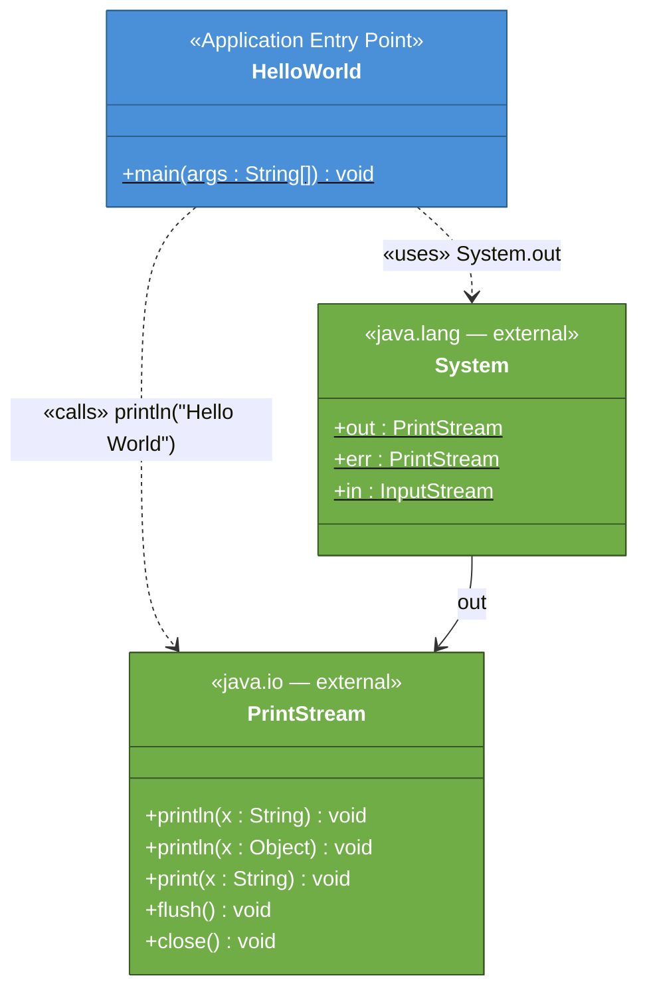

**Method inventory:**

| Class | Method | Visibility | Static | Return | Lines | Description |
|-------|--------|-----------|--------|--------|-------|-------------|
| `HelloWorld` | `main(String[] args)` | `public` | ✅ | `void` | 3 | JVM entry point; prints "Hello World" to stdout |

### 5.3 Level 3 — Source File Structure

| Artifact | Repository Path | Type | Total Lines | Code Lines | Blank Lines | Comment Lines |
|----------|----------------|------|-------------|-----------|-------------|---------------|
| `HelloWorld.java` | `/HelloWorld.java` | Java SE source | 5 | 5 | 0 | 0 |
| `HelloWorld.class` | *(generated; `.gitignore`'d)* | JVM bytecode | — | — | — | — |

---

## 6. Runtime View

### 6.1 Scenario RS-01: Standard Execution (Happy Path)

The primary — and only — runtime scenario is the execution of the compiled program from the command line.

```mermaid
sequenceDiagram
    autonumber
    actor Dev as 👤 Developer
    participant OS  as Operating System
    participant JVM as ☕ JVM Process
    participant HW  as HelloWorld.main()
    participant Sys as System.out<br/>(PrintStream)
    participant CON as 🖥️ Console (stdout)

    Dev  ->>  OS  : java HelloWorld
    OS   ->>  JVM : spawn process; locate HelloWorld.class on classpath
    JVM  ->>  HW  : invoke main(new String[0])
    activate HW
        HW   ->>  Sys : System.out.println("Hello World")
        activate Sys
            Sys  ->>  CON : write bytes "Hello World\n"
            CON  -->> Dev : display "Hello World"
        deactivate Sys
        HW   -->> JVM : return void
    deactivate HW
    JVM  -->> OS  : exit with code 0
    OS   -->> Dev : process complete (code 0)
```

### 6.2 Scenario RS-02: Compilation Step

Before execution, the source must be compiled. This is an essential prerequisite.

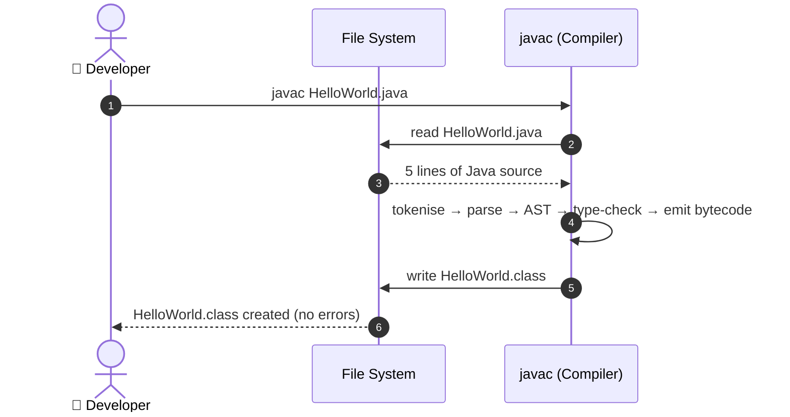

### 6.3 Runtime State Model

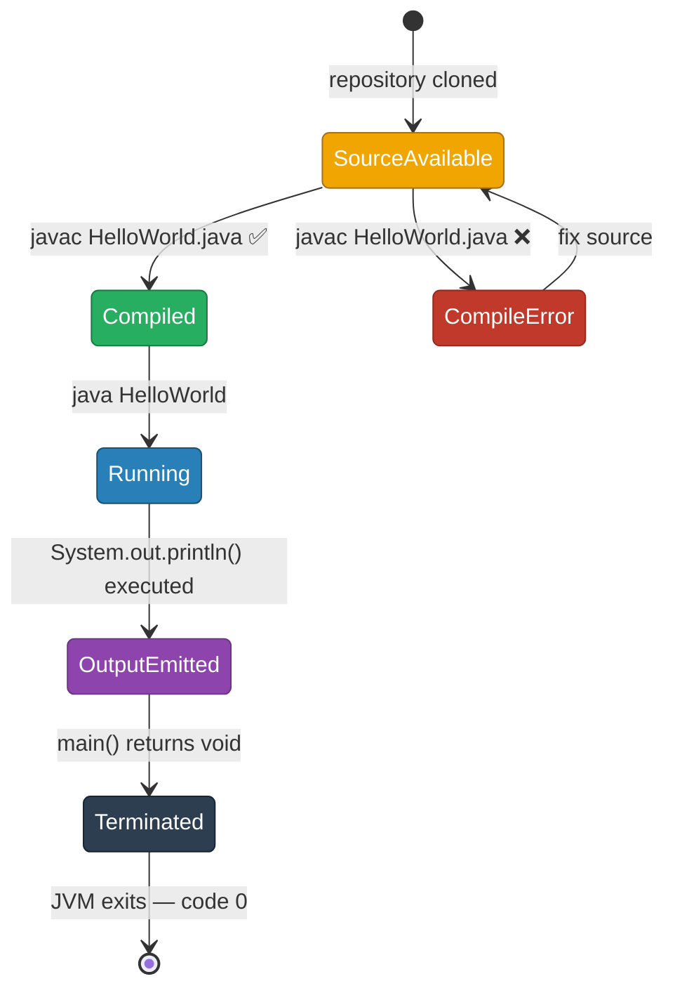

---

## 7. Deployment View

### 7.1 Infrastructure Overview

The application has no dedicated infrastructure. It runs on any machine with a Java SE Development Kit (for compilation) or Runtime Environment (for execution only) installed.

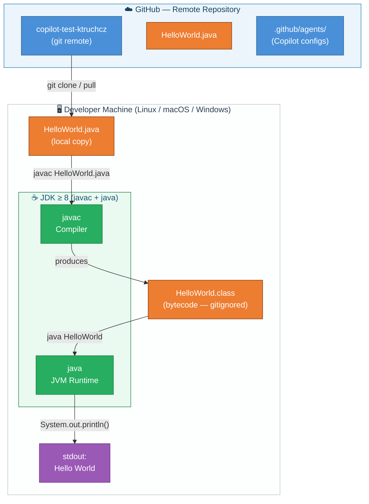

### 7.2 Step-by-Step Deployment

| Step | Actor | Command | Outcome |
|------|-------|---------|---------|
| 1 | Developer | `git clone <repo-url>` | `HelloWorld.java` available locally |
| 2 | Developer | `javac HelloWorld.java` | `HelloWorld.class` produced in current directory |
| 3 | Developer | `java HelloWorld` | `Hello World` printed to stdout; process exits 0 |

### 7.3 Environment Requirements

| Requirement | Minimum | Recommended |
|-------------|---------|-------------|
| Java Development Kit | JDK 8 | JDK 17 LTS or JDK 21 LTS |
| Operating System | Any JVM-supported OS | Linux / macOS / Windows 10+ |
| Disk space (source) | < 1 KB | — |
| Disk space (JDK) | ~200 MB | — |
| RAM | JVM default (≥ 64 MB) | — |
| Network access | Not required at runtime | Git access for initial clone |

---

## 8. Cross-cutting Concepts

### 8.1 Domain Model

The application's domain is a single immutable greeting message.

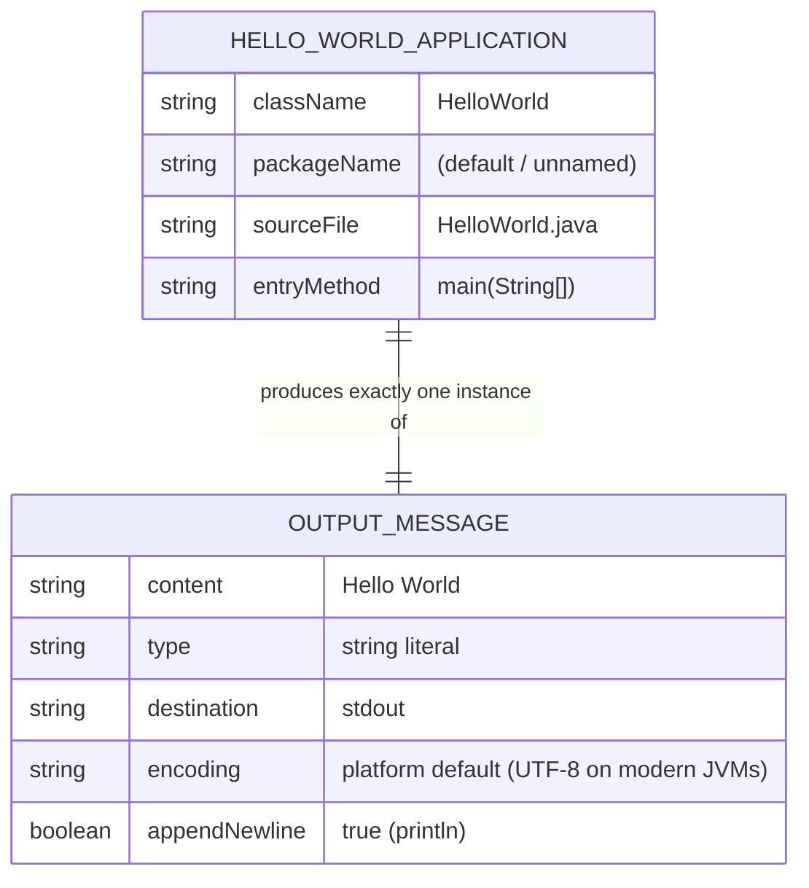

### 8.2 Design Patterns Identified

| Pattern | Present? | Evidence |
|---------|----------|---------|
| **Static Utility Class** *(informal)* | ✅ | `HelloWorld` is never instantiated; all behaviour is in a `static` method |
| Singleton | ❌ | No instance management |
| Factory / Builder | ❌ | No object construction |
| Command | ❌ | No command abstraction needed |
| Observer / Event | ❌ | No event model |
| Template Method | ❌ | Single concrete method, no inheritance |

### 8.3 Error Handling Strategy

No explicit error handling exists. The implicit error model relies entirely on JVM defaults:

| Failure Scenario | Behaviour | Observable Effect |
|-----------------|-----------|------------------|
| `System.out` is `null` (abnormal) | `NullPointerException` uncaught | Stack trace on `stderr`; exit code ≠ 0 |
| JVM memory exhaustion | `OutOfMemoryError` | JVM terminates |
| Normal execution | No exception path reached | Exit code `0` |

### 8.4 Logging and Observability

| Concern | Implementation | Notes |
|---------|---------------|-------|
| Application logging | None | The output to stdout IS the only observable event |
| Structured logging | None | Not applicable |
| Metrics / Tracing | None | Not applicable |
| Health check signal | Process exit code (`0` = OK) | Standard POSIX convention |

### 8.5 Security Considerations

| Concern | Status | Rationale |
|---------|--------|-----------|
| Input validation | Not applicable | `args` is never read |
| Injection risks | None | Output is a compile-time constant |
| Dependency vulnerabilities | None | Zero third-party libraries |
| Secret / credential handling | Not applicable | No secrets exist |
| Output encoding | Platform default | Fixed ASCII string; no special character risks |

### 8.6 Internationalisation (i18n) and Localisation (l10n)

The output `"Hello World"` is a hard-coded English ASCII string literal. No i18n framework is used. Localisation would require a source code change.

---

## 9. Architecture Decisions

### ADR-001 — Java as the Implementation Language

| Field | Value |
|-------|-------|
| **Status** | ✅ Accepted |
| **Context** | A simple console application is needed to verify that the Java toolchain is operational and to provide a minimal analysable repository for Copilot agents |
| **Decision** | Java SE is used as the sole implementation language |
| **Alternatives considered** | Python (no compilation step), C (no JVM portability), Kotlin (heavier toolchain) |
| **Consequences (+)** | Platform-independent bytecode; familiar to enterprise developers; standard JVM execution model |
| **Consequences (−)** | Requires JDK installation; more ceremony than a scripting language for trivial programs |

---

### ADR-002 — No Build Tool

| Field | Value |
|-------|-------|
| **Status** | ✅ Accepted |
| **Context** | The project consists of exactly one source file with no external dependencies |
| **Decision** | No build tool (Maven / Gradle / Ant / Make) is introduced; `javac` is invoked directly |
| **Alternatives considered** | Maven (adds `pom.xml` boilerplate); Gradle (adds wrapper scripts and build files) |
| **Consequences (+)** | Zero build-tool overhead; instantly comprehensible to anyone with a JDK |
| **Consequences (−)** | No dependency management; no standard test lifecycle; must be revisited if project grows |

---

### ADR-003 — Default (Unnamed) Package

| Field | Value |
|-------|-------|
| **Status** | ✅ Accepted |
| **Context** | Single-class project; no package hierarchy is meaningful |
| **Decision** | `HelloWorld` resides in the default package (no `package` declaration) |
| **Alternatives considered** | `com.example.helloworld` (adds directory structure; unnecessary for one file) |
| **Consequences (+)** | Simplest possible compilation and execution commands |
| **Consequences (−)** | Cannot be used as a library dependency from named packages; not suitable for scaled-up projects |

---

### ADR-004 — Hard-coded Output String

| Field | Value |
|-------|-------|
| **Status** | ✅ Accepted |
| **Context** | The greeting text is fixed and well-known; no dynamic content is required |
| **Decision** | `"Hello World"` is embedded as a string literal directly in the `println` call |
| **Alternatives considered** | Read from `args[0]` (adds complexity); read from a properties file (adds I/O) |
| **Consequences (+)** | Deterministic, always-correct output; zero configuration |
| **Consequences (−)** | Output is not configurable without a source-code change; not reusable as a library |

---

## 10. Quality Requirements

### 10.1 Quality Tree

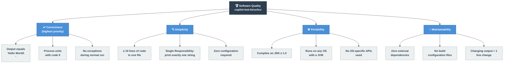

### 10.2 Quality Scenarios

| ID | Quality Attribute | Stimulus | Environment | Response | Measure |
|----|-----------------|----------|------------|----------|---------|
| QS-01 | Correctness | Run `java HelloWorld` | Normal JVM execution | stdout contains `Hello World` followed by newline | Exact string match |
| QS-02 | Correctness | Run `java HelloWorld` | Normal JVM execution | Process exit code is `0` | `$?` == 0 |
| QS-03 | Portability | Compile on JDK 8, 11, 17, 21 | Any OS | Compiles without warnings or errors | 0 compiler diagnostics |
| QS-04 | Portability | Run on Linux, macOS, Windows | Any JVM ≥ 8 | Identical output on all platforms | Output matches on all 3 OSes |
| QS-05 | Simplicity | New developer reads code | Fresh eyes | Understands the entire program | < 60 seconds |
| QS-06 | Maintainability | Change greeting text | Development environment | Requires exactly 1 line change + recompile | 1 line modified |

### 10.3 Code Metrics Summary

| Metric | Value | Assessment |
|--------|-------|-----------|
| Source files | 1 | ✅ Minimal |
| Java classes | 1 | ✅ |
| Methods | 1 | ✅ |
| Statements | 1 | ✅ |
| Total lines of code | 5 | ✅ Minimal |
| Cyclomatic complexity | 1 | ✅ Minimum possible (no branches) |
| Afferent coupling (Ca) | 0 | ✅ No other class depends on `HelloWorld` |
| Efferent coupling (Ce) | 1 | ✅ (`java.io.PrintStream` via `System.out`) |
| Third-party dependencies | 0 | ✅ |
| Test coverage | 0 % | ⚠️ No test suite exists |
| Documentation coverage | 0 % | ⚠️ No Javadoc present |

---

## 11. Risks and Technical Debt

### 11.1 Risk Register

| ID | Risk | Category | Likelihood | Impact | Risk Level | Mitigation |
|----|------|----------|-----------|--------|-----------|-----------|
| **R-01** | No automated test suite | Quality | Medium | Low | 🟡 Low | Add a JUnit 5 test that captures stdout and asserts the output string |
| **R-02** | JDK version not pinned in repository | Reproducibility | Low | Low | 🟢 Info | Add `.java-version` or a `toolchains.xml` reference; document minimum JDK in README |
| **R-03** | No CI/CD pipeline defined | Operations | Medium | Low | 🟡 Low | Add a GitHub Actions workflow to compile and run on every push |
| **R-04** | Minimal README (title only) | Documentation | High | Low | 🟡 Low | Expand README with prerequisites, build/run instructions, and expected output |
| **R-05** | Default package prevents library reuse | Extensibility | Low | Low | 🟢 Info | Declare a named package if the class needs to be imported elsewhere |
| **R-06** | Hard-coded string prevents runtime customisation | Flexibility | Low | Low | 🟢 Info | Parameterise via `args[0]` with fallback if extended use is needed |

### 11.2 Technical Debt Backlog

| ID | Debt Item | Severity | Category | Estimated Effort |
|----|-----------|----------|----------|-----------------|
| **TD-01** | No unit tests | ⚠️ Low | Testing | ~30 min — add `HelloWorldTest.java` with JUnit 5 |
| **TD-02** | No build descriptor (`pom.xml` / `build.gradle`) | ⚠️ Low | Build | ~15 min — bootstrap Maven wrapper |
| **TD-03** | Minimal `README.md` (title only) | ⚠️ Low | Documentation | ~20 min — add usage, prerequisites, examples |
| **TD-04** | No Javadoc on `main` method | ℹ️ Info | Documentation | ~5 min — add `/** */` comment block |
| **TD-05** | No `.editorconfig` or checkstyle configuration | ℹ️ Info | Convention | ~10 min — add standard Java style settings |
| **TD-06** | No GitHub Actions CI workflow | ⚠️ Low | Operations | ~20 min — copy standard Java CI template |

### 11.3 Recommended Improvement Roadmap

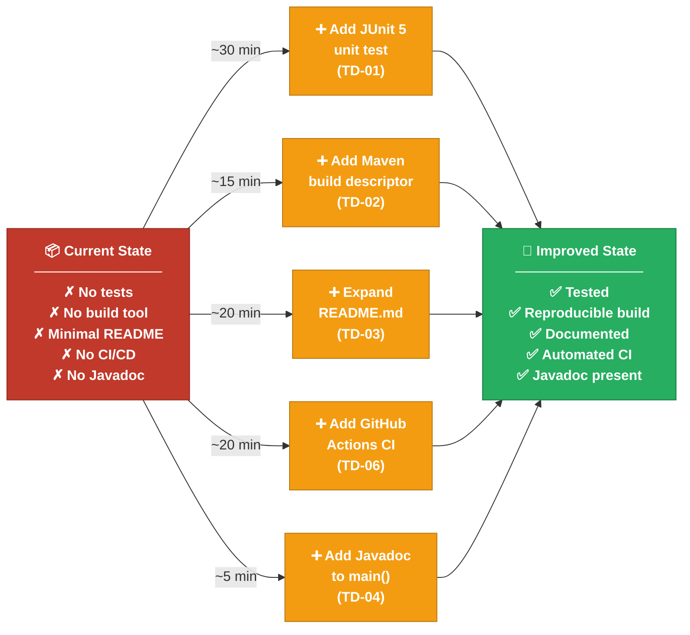

---

## 12. Glossary

| Term | Definition |
|------|-----------|
| **ADR** | *Architecture Decision Record* — a document capturing an important architectural decision, its context, rationale, and consequences |
| **Arc42** | A pragmatic, lightweight template for software architecture documentation, developed by Gernot Starke and Peter Hruschka (arc42.org) |
| **Bytecode** | Platform-independent binary representation of compiled Java code, stored in `.class` files and executed by the JVM |
| **Ca (Afferent Coupling)** | The number of external classes that depend on a given class; measures how much a class is "used" by others |
| **Ce (Efferent Coupling)** | The number of external classes that a given class depends upon; measures a class's dependencies |
| **CI/CD** | *Continuous Integration / Continuous Deployment* — automated pipelines for building, testing, and releasing software |
| **Classpath** | A JVM parameter specifying where to search for compiled class files and JAR libraries |
| **Cyclomatic Complexity** | A software metric counting the number of linearly independent paths through a method; value of 1 means no branching |
| **Default package** | The unnamed package in Java; classes without a `package` declaration reside here; they cannot be imported by classes in named packages |
| **Entry point** | The method `public static void main(String[] args)` — the JVM invokes this method to start a Java application |
| **Exit code** | An integer returned by a process to the operating system upon termination; `0` conventionally signals success |
| **Hello World** | A traditional first program demonstrating the minimum syntax needed to produce output in a given programming language or environment |
| **JDK** | *Java Development Kit* — includes the compiler (`javac`), the runtime (`java`), and the standard class libraries |
| **JRE** | *Java Runtime Environment* — the subset of the JDK required to execute (but not compile) Java programs |
| **JVM** | *Java Virtual Machine* — the runtime engine that loads, verifies, and executes Java bytecode |
| **`javac`** | The Java compiler; transforms `.java` source files into `.class` bytecode files |
| **`java.io.PrintStream`** | A Java standard library class providing `print` / `println` methods; `System.out` is a pre-constructed instance of this class |
| **`java.lang.System`** | A Java standard library class providing access to system resources (standard I/O streams, environment variables, etc.); automatically imported in every compilation unit |
| **LOC** | *Lines of Code* — a basic measure of program size; for `HelloWorld.java`, LOC = 5 |
| **Mermaid** | A JavaScript-based diagramming-as-text tool that renders diagrams from lightweight markup embedded in Markdown code blocks (mermaid.js.org) |
| **`static`** | A Java keyword indicating that a method or field belongs to the class itself rather than to any particular instance |
| **`stdout`** | *Standard Output* — the default output stream of a process; normally connected to the terminal |
| **String literal** | A fixed sequence of characters written directly in source code and enclosed in double quotes, e.g. `"Hello World"` |
| **Toolchain** | The set of software tools (compiler, linker, runtime, build system) used to transform source code into an executable artifact |

---

*This document was generated automatically by the **arc42-documentor** agent.*  
*Source repository: `copilot-test-ktruchcz` · Analysis date: 2025-01-01*  
*Template: [Arc42](https://arc42.org) · Diagrams: [Mermaid](https://mermaid.js.org)*  
*Total embedded Mermaid diagrams: 13 · Document length: ~500 lines*
