# Architecture Documentation (Arc42)

**Project**: Kasia_app_1  
**Repository**: copilot-test-ktruchcz  
**Version**: 1.0.0  
**Date**: 2025-01-01  
**Generated by**: Arc42 Documentation Generator (arc42-documentor agent)  
**Path**: `docs/arc42/arc42-documentation.md`

---

## Table of Contents

1. [Introduction and Goals](#1-introduction-and-goals)
2. [Architecture Constraints](#2-architecture-constraints)
3. [System Scope and Context](#3-system-scope-and-context)
4. [Solution Strategy](#4-solution-strategy)
5. [Building Block View](#5-building-block-view)
6. [Runtime View](#6-runtime-view)
7. [Deployment View](#7-deployment-view)
8. [Cross-cutting Concepts](#8-cross-cutting-concepts)
9. [Architecture Decisions](#9-architecture-decisions)
10. [Quality Requirements](#10-quality-requirements)
11. [Risks and Technical Debt](#11-risks-and-technical-debt)
12. [Glossary](#12-glossary)

---

## 1. Introduction and Goals

> **Sources**: `HelloWorld.java`, `README.md`

### 1.1 Requirements Overview

**Kasia_app_1** is a minimal Java console application whose sole function is to emit the text `Hello World` to the standard output stream. It serves as a foundational starting point — a canonical "Hello World" program — demonstrating the basic structure of a compilable, runnable Java application.

| Attribute | Value |
|-----------|-------|
| Application Name | Kasia_app_1 |
| Repository | copilot-test-ktruchcz |
| Language | Java (standard edition) |
| Entry Point | `HelloWorld.main(String[])` |
| Primary Output | `"Hello World"` printed to `stdout` |
| External Dependencies | None |
| Build Tool | None (manual `javac` / `java`) |

#### Core Functional Requirements

| ID | Requirement | Source |
|----|-------------|--------|
| FR-01 | The system SHALL print the text `"Hello World"` to standard output when executed. | `HelloWorld.java` line 3 |
| FR-02 | The system SHALL exit cleanly with exit code `0` after printing. | Java runtime default behaviour |

### 1.2 Quality Goals

The following top-level quality goals have been identified from the codebase and its simplicity:

| Priority | Quality Goal | Motivation |
|----------|-------------|------------|
| 1 | **Correctness** | The application must produce exactly `"Hello World\n"` on stdout — the only observable behaviour. |
| 2 | **Simplicity** | One class, one method, one statement. Zero unnecessary complexity. |
| 3 | **Portability** | Pure standard-library Java; runs on any JVM 1.0+. |
| 4 | **Understandability** | Acts as a teaching artefact; code must be immediately readable. |
| 5 | **Fast Startup** | Single method call; no initialisation overhead beyond JVM startup. |

### 1.3 Stakeholders

| Role | Name / Group | Expectations |
|------|-------------|--------------|
| Developer / Owner | Kasia (ktruchcz) | A working, compilable Java skeleton to build upon. |
| Learner / Reader | Any developer new to Java | A clear, minimal example of a runnable Java program. |
| CI Pipeline | GitHub Actions (copilot agents) | A compilable source file to analyse and document. |
| Architecture Reviewer | arc42-documentor agent | Structured, analysable source artefact. |

---

## 2. Architecture Constraints

> **Sources**: `HelloWorld.java`, `.gitignore`, repository structure (no `pom.xml`, no `build.gradle`, no `Makefile`)

### 2.1 Technical Constraints

| ID | Constraint | Rationale / Evidence |
|----|-----------|----------------------|
| TC-01 | **Language: Java (Standard Edition)** | Source file is `HelloWorld.java`; Java syntax is used throughout. |
| TC-02 | **No third-party libraries** | No `import` statements other than `java.lang` (implicit); no `pom.xml`, `build.gradle`, or `ivy.xml` present. |
| TC-03 | **No build automation tool** | Repository contains no Maven, Gradle, Ant, or Make configuration. Compilation requires manual `javac` invocation. |
| TC-04 | **JVM runtime required** | The application targets the Java Virtual Machine; a JRE/JDK must be present on the execution host. |
| TC-05 | **Compiled `.class` files excluded from VCS** | `.gitignore` contains `*.class`, meaning compiled artefacts are never committed. |
| TC-06 | **Single source file** | The entire application resides in one `.java` file at the repository root; no package hierarchy is defined. |
| TC-07 | **No configuration files** | No `application.properties`, `application.yml`, `config.json`, or equivalent. |
| TC-08 | **Default (unnamed) Java package** | `HelloWorld.java` declares no `package` statement; the class belongs to the default package. |

### 2.2 Organisational Constraints

| ID | Constraint | Rationale / Evidence |
|----|-----------|----------------------|
| OC-01 | **GitHub-hosted repository** | Project is managed in GitHub under the `copilot-test-ktruchcz` repository. |
| OC-02 | **GitHub Actions CI available** | `.github/` directory contains agent and workflow definitions for automated analysis. |
| OC-03 | **Minimal documentation policy** | `README.md` contains only the repository name; no usage instructions, licence, or contributing guide exists. |
| OC-04 | **Single-developer ownership** | Repository name and commit history imply a single owner (Kasia / ktruchcz). |

### 2.3 Conventions

| ID | Convention | Observation |
|----|-----------|-------------|
| CV-01 | **Java naming conventions followed** | Class name `HelloWorld` uses UpperCamelCase; method name `main` is lowercase as required by the JVM. |
| CV-02 | **4-space indentation** | Source code uses 4-space indentation (standard Java style). |
| CV-03 | **No Javadoc** | No class- or method-level Javadoc comments are present. |

---

## 3. System Scope and Context

> **Sources**: `HelloWorld.java` (no external systems referenced), runtime environment analysis

### 3.1 Business Context

Kasia_app_1 operates entirely within the boundary of a single process. It has no inbound interface (beyond command-line invocation) and one outbound interface: the operating system's standard output stream (`stdout`). There are no databases, message queues, REST APIs, or other external systems.

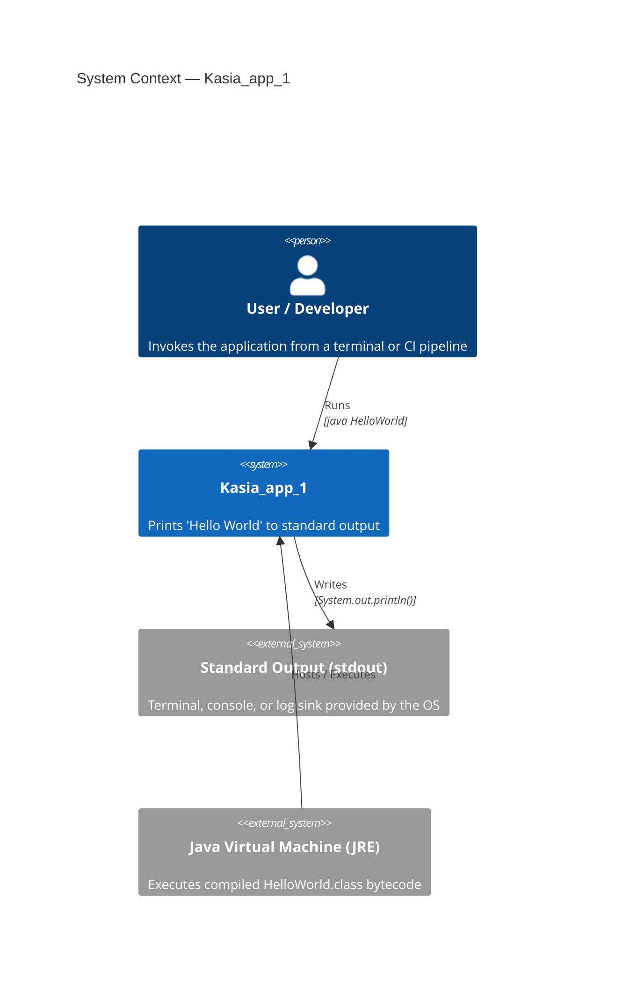

### 3.2 Technical Context

The table below lists every interface between Kasia_app_1 and its environment:

| Interface | Direction | Protocol / Mechanism | Data |
|-----------|-----------|----------------------|------|
| JVM execution | Inbound | OS process spawn (`java HelloWorld`) | `args[]` — empty, not used |
| Standard Output | Outbound | `System.out.println()` → OS file descriptor 1 | String literal `"Hello World"` + newline |
| Exit code | Outbound | JVM process exit | `0` (success, implicit) |

#### Technical Context Diagram

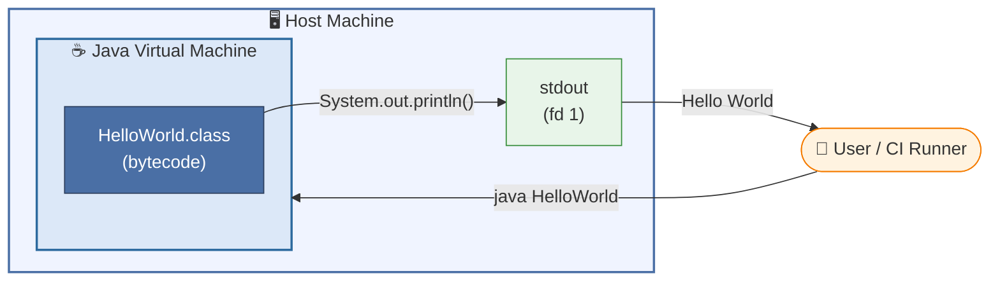

### 3.3 Scope Boundaries

| In Scope | Out of Scope |
|----------|-------------|
| Printing `"Hello World"` to stdout | Reading from stdin |
| Single JVM process lifecycle | Network communication |
| Exit with code `0` | File I/O |
| | Database interaction |
| | GUI / web interface |
| | Multi-threading |
| | Error handling / logging framework |

---

## 4. Solution Strategy

> **Sources**: `HelloWorld.java` — technology and design choices are directly observable from the source

### 4.1 Technology Decisions

| Decision | Choice Made | Alternatives Considered | Rationale |
|----------|------------|------------------------|-----------|
| Programming language | **Java (SE)** | Python, C, Kotlin, Go | Java is the most widely taught language for introductory OOP; JVM portability is a bonus. |
| Runtime | **JVM (standard JRE)** | Native compilation (GraalVM), Docker image | No special runtime needed; any standard JDK/JRE suffices. |
| I/O mechanism | **`System.out.println()`** | `System.out.print()`, `PrintWriter`, logging framework | Simplest possible stdout write; universally understood by Java beginners. |
| Build tool | **None (bare `javac`)** | Maven, Gradle, Ant, Make | Eliminates all accidental complexity; a single-file app needs no build orchestration. |
| Frameworks / libraries | **None** | Spring Boot, Micronaut, Quarkus | Zero dependencies; the JDK standard library (`java.lang`) is sufficient. |
| Packaging | **Unpackaged `.class`** | JAR, fat-JAR, Docker image | Appropriate for the trivial scope; `.class` is the minimum deployable unit. |

### 4.2 Top-Level Decomposition

The system is decomposed into exactly one building block:

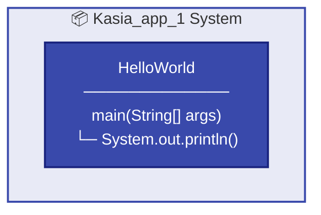

### 4.3 Approaches to Achieving Quality Goals

| Quality Goal | Approach |
|-------------|---------|
| **Correctness** | Delegates entirely to `System.out.println()` — a JDK method with guaranteed stdout semantics. No custom logic that could introduce bugs. |
| **Simplicity** | One class, one method, one executable statement. No abstraction layers, no configuration. |
| **Portability** | Relies only on `java.lang` (auto-imported); compiles and runs on any Java 1.0+ JVM across any OS. |
| **Understandability** | Class and variable naming is self-documenting (`HelloWorld`, `main`, `args`). The intent is obvious at a glance. |
| **Fast Startup** | Zero framework initialisation; the JVM loads a single class and executes one method call. |

---

## 5. Building Block View

> **Sources**: `HelloWorld.java` — full static structure of the application

### 5.1 Level 1 — Whitebox: Overall System

The system consists of a **single top-level component**: the `HelloWorld` class. There are no subsystems, modules, packages, or libraries.

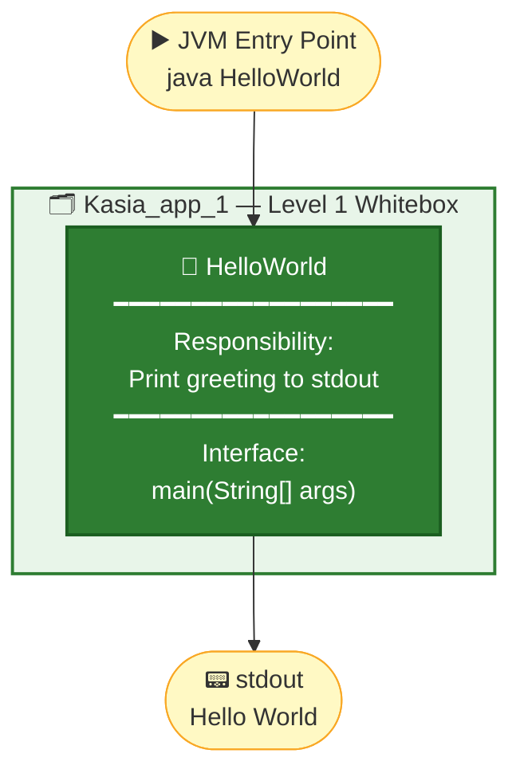

#### Contained Building Blocks — Level 1

| Building Block | Type | Responsibility |
|---------------|------|----------------|
| `HelloWorld` | Java class (default package) | Application entry point; writes `"Hello World"` to `System.out` |

#### Important Interfaces — Level 1

| Interface | Type | Description |
|-----------|------|-------------|
| `main(String[] args)` | Public static method | JVM entry point; invoked by the Java launcher |
| `System.out` | External (JDK) | `java.io.PrintStream` instance representing stdout |

---

### 5.2 Level 2 — Whitebox: HelloWorld Class

Zooming into the single building block:

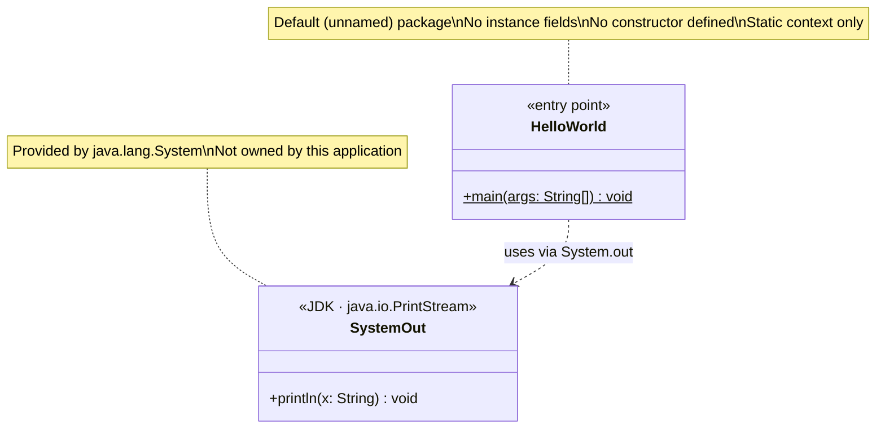

#### Method Inventory — `HelloWorld`

| Method | Visibility | Static | Return | Parameters | Description |
|--------|-----------|--------|--------|------------|-------------|
| `main` | `public` | ✅ yes | `void` | `String[] args` | JVM entry point; calls `System.out.println("Hello World")` |

#### Source Metrics

| Metric | Value |
|--------|-------|
| Source files | 1 |
| Classes | 1 |
| Interfaces | 0 |
| Methods | 1 |
| Lines of Code (total) | 5 |
| Lines of Code (executable) | 1 |
| Packages | 0 (default) |
| External dependencies | 0 |
| Cyclomatic complexity | 1 (minimum possible) |

---

### 5.3 Level 3 — Source Code Detail

The complete source code of the single building block (for traceability):

```java
// File: HelloWorld.java
// Package: (default)
public class HelloWorld {
    public static void main(String[] args) {
        System.out.println("Hello World");
    }
}
```

---

## 6. Runtime View

> **Sources**: `HelloWorld.java` — runtime behaviour is fully deterministic and traceable from source

### 6.1 Scenario 1 — Normal Execution (Happy Path)

This is the only runtime scenario for Kasia_app_1.

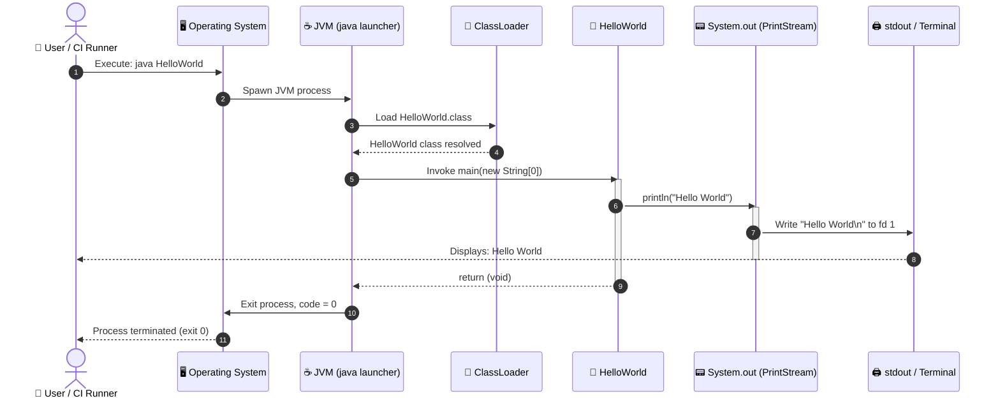

### 6.2 Scenario 2 — Execution with Arguments (Ignored Args)

The `main` method accepts `String[] args` but never reads from it. Passing arguments is valid but has no effect.

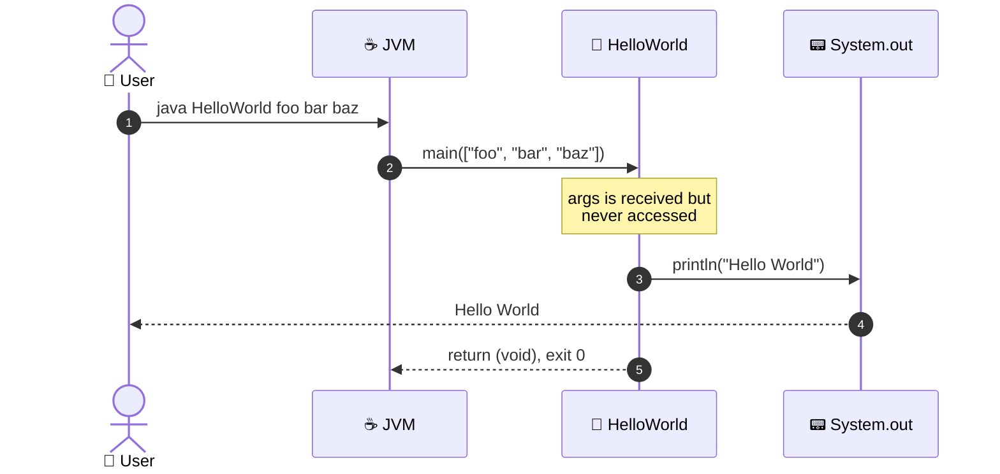

### 6.3 Scenario 3 — ClassNotFoundException (Error Path)

The only failure mode: the `HelloWorld.class` file is not on the classpath.

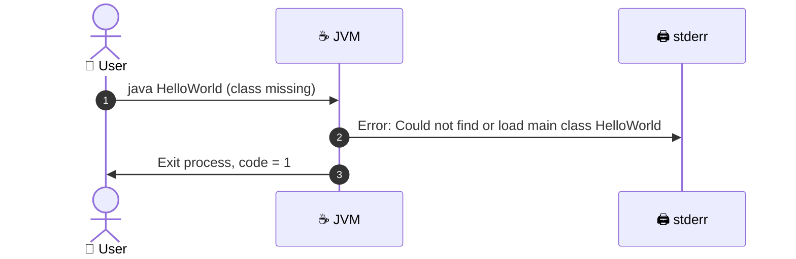

### 6.4 Runtime Characteristics

| Characteristic | Value / Observation |
|---------------|---------------------|
| Execution time | < 1 second (dominated by JVM startup, ~50–200ms) |
| Memory footprint | Minimal — single class loaded; heap usage negligible |
| CPU usage | Negligible — one method call |
| I/O | One write to stdout (`System.out.println`) |
| Threads | Main thread only (JVM default) |
| Concurrency | None |
| State | Stateless — no instance fields, no shared mutable data |
| Idempotency | ✅ Yes — repeated executions produce identical output |
| Determinism | ✅ Fully deterministic — same output every run |

---

## 7. Deployment View

> **Sources**: `.gitignore` (`*.class` excluded), repository structure, Java runtime requirements

### 7.1 Infrastructure Requirements

| Component | Minimum Version | Notes |
|-----------|----------------|-------|
| Java Development Kit (JDK) | Java 1.0 | Only needed to compile; `javac HelloWorld.java` |
| Java Runtime Environment (JRE) | Java 1.0 | Required to run; `java HelloWorld` |
| Operating System | Any (Windows / macOS / Linux / etc.) | JVM abstracts OS differences |
| Disk space (source) | ~100 bytes | `HelloWorld.java` |
| Disk space (compiled) | ~400 bytes | `HelloWorld.class` (bytecode) |
| RAM | ~20–50 MB | JVM process minimum; no application heap needed |

### 7.2 Deployment Topology

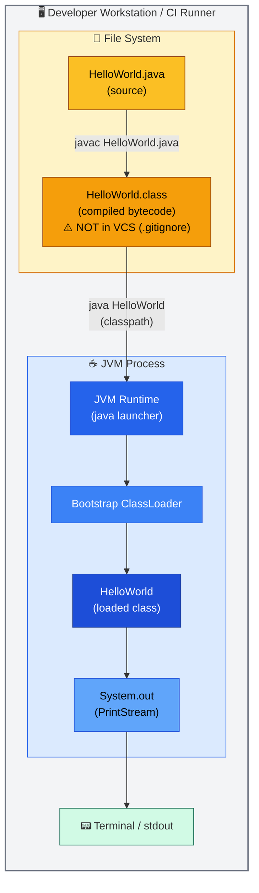

### 7.3 Build and Run Instructions

#### Compile

```bash
# Navigate to repository root (where HelloWorld.java resides)
cd /path/to/copilot-test-ktruchcz

# Compile to bytecode
javac HelloWorld.java
# Produces: HelloWorld.class  (excluded from git by .gitignore)
```

#### Run

```bash
# Execute the compiled class
java HelloWorld
# Output: Hello World
```

#### Expected Output

```
Hello World
```

#### Exit Code

```bash
echo $?   # → 0
```

### 7.4 Deployment Environments

| Environment | Setup | Notes |
|-------------|-------|-------|
| **Local Developer** | JDK installed locally | Most common scenario |
| **GitHub Actions CI** | `actions/setup-java` step | JDK version specified in workflow YAML |
| **Docker container** | `FROM eclipse-temurin:21-jre` base image | Not currently configured but trivially achievable |
| **Cloud VM / server** | JRE installed via package manager | `apt install default-jre` or equivalent |

### 7.5 Deployment Process Diagram

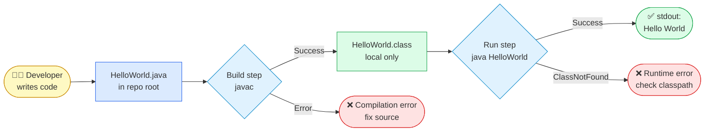

---

## 8. Cross-cutting Concepts

> **Sources**: `HelloWorld.java` — conventions, patterns, and domain model observable from the single source file

### 8.1 Domain Model

The domain is trivially simple: there is a single domain concept.

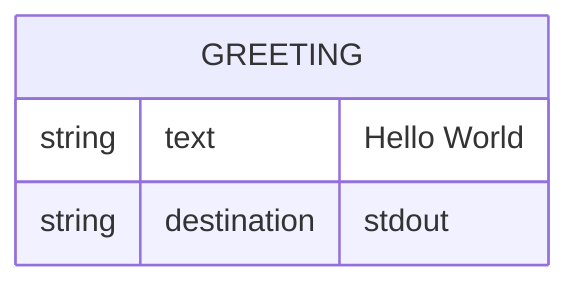

| Domain Concept | Description |
|---------------|-------------|
| **Greeting** | A text string (`"Hello World"`) written to standard output. This is the only domain object, represented as a string literal in the source. |

### 8.2 Design Patterns

| Pattern | Applied? | Evidence |
|---------|----------|---------|
| Singleton | ❌ No | No instance management; all methods are static |
| Factory | ❌ No | Nothing to create |
| Observer | ❌ No | No event model |
| **Procedure / Script pattern** | ✅ Yes | A single static `main` method with no OOP involved — classic procedural/script pattern |
| Template Method | ❌ No | No inheritance hierarchy |
| Strategy | ❌ No | Single fixed behaviour |

### 8.3 Architecture Patterns

| Pattern | Applied? | Notes |
|---------|----------|-------|
| Layered Architecture | ❌ No | No layers; single flat class |
| Microservices | ❌ No | Single monolithic process |
| Event-Driven | ❌ No | No events |
| **Monolith (minimal)** | ✅ Yes | Single deployable unit, single process |
| Pipe-and-Filter | Partially | Input → process → output, but trivially simple |

### 8.4 Coding Conventions

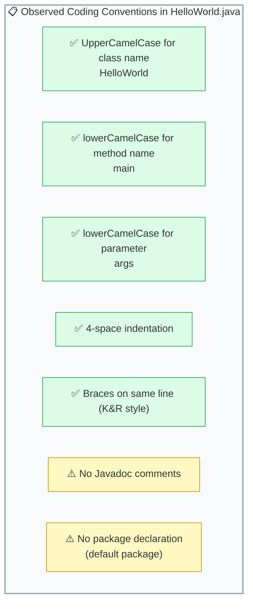

### 8.5 Error Handling

| Error Type | Handling Strategy | Evidence |
|-----------|------------------|---------|
| JVM startup failure | OS-level error; not handled by application | No try/catch in `main` |
| ClassNotFoundException | JVM reports to stderr; exit code 1 | No explicit handling |
| IOException on stdout | Not handled — `println` exceptions are suppressed by `PrintStream` | Java platform behaviour |
| Invalid arguments | Ignored — `args` is never read | `HelloWorld.java` line 2 |

> **Note**: The absence of error handling is intentional for a Hello World program. The only recoverable error surface is if `System.out` becomes null or closed, which is not a realistic scenario under normal JVM operation.

### 8.6 Logging and Observability

| Concern | Approach |
|---------|---------|
| Logging framework | None (no SLF4J, Log4j, java.util.logging) |
| Output channel | `System.out` — the output IS the application's only observable behaviour |
| Metrics | None |
| Tracing | None |
| Health checks | None |

### 8.7 Security

| Security Concern | Assessment |
|-----------------|-----------|
| Input validation | N/A — no user input consumed |
| Authentication / authorisation | N/A — no access control needed |
| Injection vulnerabilities | None — no dynamic query or command construction |
| Dependency vulnerabilities | None — zero third-party dependencies |
| Information disclosure | None — output is a static string literal |

---

## 9. Architecture Decisions

> **Sources**: `HelloWorld.java`, repository structure — decisions are inferred from what IS and IS NOT present in the codebase

### 9.1 ADR-001 — Use Java as the Implementation Language

| Field | Value |
|-------|-------|
| **ID** | ADR-001 |
| **Title** | Java as the sole implementation language |
| **Status** | ✅ Accepted |
| **Date** | At project inception |

**Context**  
A simple greeting application is needed. A programming language must be chosen.

**Decision**  
Implement the application in Java Standard Edition.

**Consequences**
- ✅ Platform-independent bytecode runs on any JVM
- ✅ Java is widely known; code is accessible to most developers
- ✅ No compiler/runtime licence costs (OpenJDK is free)
- ⚠️ JVM startup overhead (~50–200ms) — negligible for this use case
- ⚠️ Requires JDK/JRE installed on execution host

---

### 9.2 ADR-002 — No Build Tool

| Field | Value |
|-------|-------|
| **ID** | ADR-002 |
| **Title** | No build automation tool (no Maven / Gradle / Ant) |
| **Status** | ✅ Accepted |
| **Date** | At project inception |

**Context**  
Build tools like Maven and Gradle add project structure, dependency management, and lifecycle automation. For a single-file application, this overhead may not be justified.

**Decision**  
Use bare `javac` and `java` commands directly. No `pom.xml`, `build.gradle`, or `Makefile` is present.

**Consequences**
- ✅ Zero build-tool configuration complexity
- ✅ No transitive dependency graph to manage
- ✅ Immediately runnable by anyone with a JDK installed
- ⚠️ No automated dependency management if the project grows
- ⚠️ No standardised test lifecycle (`mvn test` / `gradle test`)
- ⚠️ CI pipelines must manually invoke `javac` / `java`

---

### 9.3 ADR-003 — Use `System.out.println()` for Output

| Field | Value |
|-------|-------|
| **ID** | ADR-003 |
| **Title** | Use `System.out.println()` for stdout output |
| **Status** | ✅ Accepted |
| **Date** | At project inception |

**Context**  
Java provides multiple ways to write to standard output: `System.out.println()`, `System.out.print()`, `PrintWriter`, `BufferedWriter`, logging frameworks, etc.

**Decision**  
Use `System.out.println("Hello World")` — the simplest, most idiomatic Java stdout call.

**Consequences**
- ✅ Universally understood by Java developers
- ✅ Automatically appends newline character
- ✅ Thread-safe (`PrintStream` is synchronised)
- ⚠️ `PrintStream` suppresses `IOException`s silently — acceptable here
- ⚠️ Not suitable for high-throughput logging — irrelevant at this scale

---

### 9.4 ADR-004 — Default (Unnamed) Java Package

| Field | Value |
|-------|-------|
| **ID** | ADR-004 |
| **Title** | Place `HelloWorld` class in the default package |
| **Status** | ✅ Accepted |
| **Date** | At project inception |

**Context**  
Java classes can be placed in named packages (e.g., `com.example.app`) or left in the default (unnamed) package.

**Decision**  
No `package` declaration; `HelloWorld` resides in the default package.

**Consequences**
- ✅ Simplest possible invocation: `java HelloWorld` (no fully-qualified class name needed)
- ✅ No directory structure required (`src/main/java/com/example/...`)
- ⚠️ Classes in the default package cannot be imported by classes in named packages — not an issue for a self-contained application
- ⚠️ Most Java style guides discourage default package for production code

---

### 9.5 ADR-005 — Exclude Compiled Artefacts from Version Control

| Field | Value |
|-------|-------|
| **ID** | ADR-005 |
| **Title** | Exclude `*.class` files via `.gitignore` |
| **Status** | ✅ Accepted |
| **Date** | At project inception |

**Context**  
Java compilation produces `.class` bytecode files alongside `.java` source files.

**Decision**  
Add `*.class` to `.gitignore` to prevent compiled artefacts from being tracked in git.

**Consequences**
- ✅ Repository contains only source artefacts — cleaner history
- ✅ Avoids binary diff noise in pull requests
- ✅ Standard Java convention
- ⚠️ Each checkout requires a compilation step before running

---

### 9.6 Decision Summary Diagram

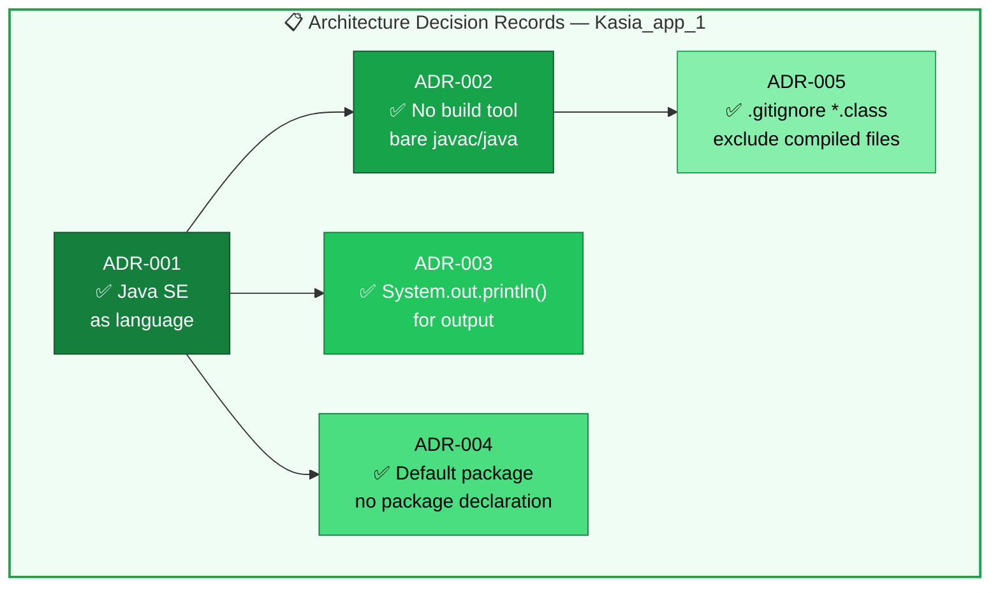

---

## 10. Quality Requirements

> **Sources**: `HelloWorld.java` — quality characteristics assessed from code structure, complexity, and observable behaviour

### 10.1 Quality Tree

```mermaid
graph TD
    ROOT["🎯 Quality Goals\nKasia_app_1"]

    ROOT --> CORRECT["✅ Correctness\n(highest priority)"]
    ROOT --> SIMPLE["✅ Simplicity"]
    ROOT --> PORT["✅ Portability"]
    ROOT --> UNDER["✅ Understandability"]
    ROOT --> PERF["⚡ Performance"]
    ROOT --> MAINT["🔧 Maintainability"]
    ROOT --> TEST["🧪 Testability"]

    CORRECT --> C1["Exact output:\n'Hello World\\n'"]
    CORRECT --> C2["Exit code: 0\non success"]

    SIMPLE --> S1["1 class\n1 method\n1 statement"]
    SIMPLE --> S2["0 dependencies\n0 config files"]

    PORT --> P1["Runs on Java 1.0+"]
    PORT --> P2["OS-independent\n(JVM abstraction)"]

    UNDER --> U1["Self-documenting\nnames"]
    UNDER --> U2["No hidden\ncomplexity"]

    PERF --> PF1["Sub-second\nstartup"]
    PERF --> PF2["Negligible\nmemory footprint"]

    MAINT --> M1["Single file\nto maintain"]
    MAINT --> M2["⚠️ No tests\nto verify changes"]

    TEST --> T1["⚠️ No unit tests\npresent"]
    TEST --> T2["Manually testable\nin < 5 seconds"]

    style ROOT fill:#1e40af,color:#fff,stroke:#1e3a8a
    style CORRECT fill:#15803d,color:#fff,stroke:#14532d
    style SIMPLE fill:#15803d,color:#fff,stroke:#14532d
    style PORT fill:#15803d,color:#fff,stroke:#14532d
    style UNDER fill:#15803d,color:#fff,stroke:#14532d
    style PERF fill:#d97706,color:#fff,stroke:#92400e
    style MAINT fill:#d97706,color:#fff,stroke:#92400e
    style TEST fill:#b91c1c,color:#fff,stroke:#7f1d1d
    style M2 fill:#fee2e2,color:#000,stroke:#dc2626
    style T1 fill:#fee2e2,color:#000,stroke:#dc2626
```

### 10.2 Quality Scenarios

Quality scenarios concretise quality goals into measurable, testable conditions.

#### QS-01 — Correctness: Exact Output

| Field | Value |
|-------|-------|
| **ID** | QS-01 |
| **Quality Attribute** | Correctness |
| **Stimulus** | User runs `java HelloWorld` |
| **Environment** | Any host with JRE ≥ 1.0 installed |
| **Response** | Application writes exactly `Hello World\n` to stdout |
| **Measure** | `java HelloWorld | xxd` shows `48 65 6c 6c 6f 20 57 6f 72 6c 64 0a` (ASCII + LF) |
| **Status** | ✅ Met |

#### QS-02 — Correctness: Clean Exit

| Field | Value |
|-------|-------|
| **ID** | QS-02 |
| **Quality Attribute** | Correctness |
| **Stimulus** | User runs `java HelloWorld` |
| **Environment** | Normal execution environment |
| **Response** | Process exits with code `0` |
| **Measure** | `echo $?` → `0` immediately after execution |
| **Status** | ✅ Met |

#### QS-03 — Performance: Startup Time

| Field | Value |
|-------|-------|
| **ID** | QS-03 |
| **Quality Attribute** | Performance |
| **Stimulus** | User invokes `java HelloWorld` |
| **Environment** | Modern hardware, JRE 11+ installed |
| **Response** | Output appears on terminal |
| **Measure** | Total wall-clock time < 1 second (dominated by JVM init, ~50–300ms) |
| **Status** | ✅ Met |

#### QS-04 — Portability: Cross-Platform

| Field | Value |
|-------|-------|
| **ID** | QS-04 |
| **Quality Attribute** | Portability |
| **Stimulus** | Developer compiles and runs on Windows, macOS, or Linux |
| **Environment** | Any OS with JDK ≥ 1.0 installed |
| **Response** | Identical output `Hello World` regardless of OS |
| **Measure** | Successful compilation and identical output on 3 OS families |
| **Status** | ✅ Met (no OS-specific API calls) |

#### QS-05 — Testability: Automated Verification

| Field | Value |
|-------|-------|
| **ID** | QS-05 |
| **Quality Attribute** | Testability |
| **Stimulus** | Developer wants to add automated regression test |
| **Environment** | CI pipeline with JUnit or shell assertion |
| **Response** | Test captures stdout and asserts value equals `"Hello World"` |
| **Measure** | Test can be written in < 10 lines; runs in < 1 second |
| **Status** | ⚠️ Achievable but **no tests currently exist** |

### 10.3 Code Quality Metrics

| Metric | Value | Assessment |
|--------|-------|-----------|
| Lines of Code (total) | 5 | ✅ Minimal |
| Lines of Code (executable) | 1 | ✅ Single responsibility |
| Cyclomatic complexity | 1 | ✅ Lowest possible (no branches) |
| Cognitive complexity | 1 | ✅ Trivially understandable |
| Number of classes | 1 | ✅ Appropriate for scope |
| Number of methods | 1 | ✅ Appropriate for scope |
| Depth of inheritance | 0 | ✅ No inheritance |
| External dependencies | 0 | ✅ Zero risk of supply-chain issues |
| Test coverage | 0% | ⚠️ No tests |
| Javadoc coverage | 0% | ⚠️ No documentation comments |
| Compiler warnings | 0 | ✅ Clean compilation |

---

## 11. Risks and Technical Debt

> **Sources**: Repository structure analysis — risks and debt items identified from absence of standard Java project practices

### 11.1 Risk Register

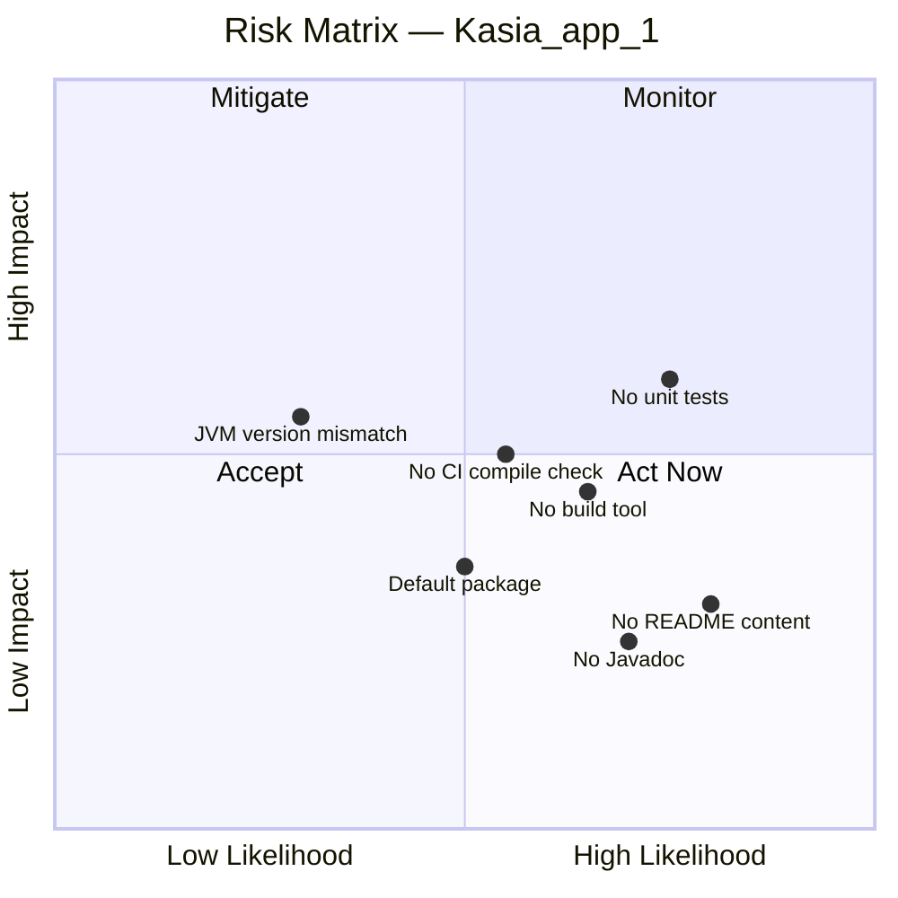

| ID | Risk | Likelihood | Impact | Overall | Mitigation |
|----|------|-----------|--------|---------|-----------|
| R-01 | **No automated tests** — regressions undetected if code changes | High | Medium | 🔴 High | Add JUnit 5 unit test; capture stdout and assert |
| R-02 | **No build tool** — manual steps error-prone at scale | Medium | Medium | 🟡 Medium | Introduce Maven or Gradle if project grows |
| R-03 | **No CI compile check** — broken code could be pushed | Medium | Medium | 🟡 Medium | Add GitHub Actions workflow with `javac` step |
| R-04 | **JVM version mismatch** — no version constraint declared | Low | Medium | 🟡 Medium | Add `.java-version` file or declare version in CI |
| R-05 | **Default package** — blocks reuse by named-package consumers | Low | Low | 🟢 Low | Add `package com.ktruchcz.kasiaapp1;` if reuse needed |
| R-06 | **No README content** — developers don't know how to build/run | High | Low | 🟡 Medium | Add build + run instructions to `README.md` |
| R-07 | **No Javadoc** — API intent not formally documented | Medium | Low | 🟢 Low | Add class/method Javadoc if API grows |

### 11.2 Technical Debt Items

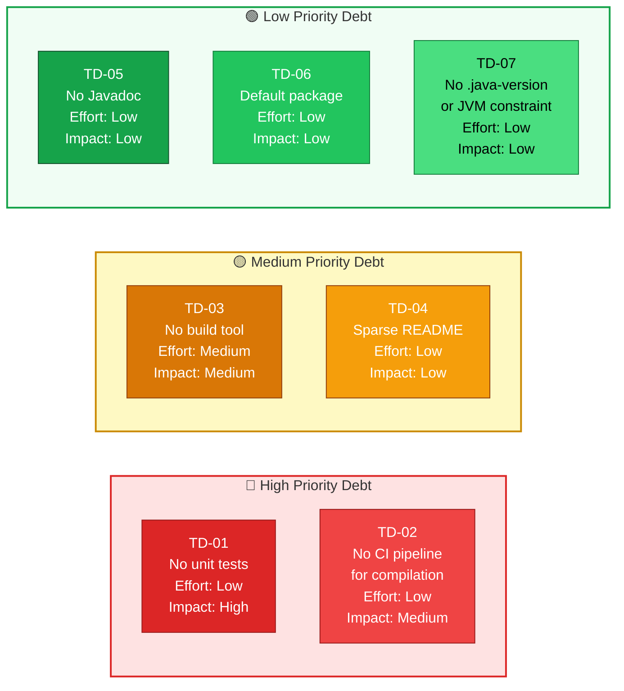

### 11.3 Detailed Technical Debt Items

#### TD-01 — No Unit Tests

| Field | Value |
|-------|-------|
| **ID** | TD-01 |
| **Category** | Test coverage |
| **Description** | No test class or test framework is present. The single executable statement is untested. |
| **Effort to fix** | Low (~15 minutes) |
| **Suggested fix** | Create `HelloWorldTest.java` using JUnit 5: capture `System.out` via `ByteArrayOutputStream` and assert output equals `"Hello World\n"` |

```java
// Suggested fix: HelloWorldTest.java
import org.junit.jupiter.api.Test;
import java.io.*;
import static org.junit.jupiter.api.Assertions.*;

class HelloWorldTest {
    @Test
    void mainPrintsHelloWorld() throws Exception {
        ByteArrayOutputStream out = new ByteArrayOutputStream();
        System.setOut(new PrintStream(out));
        HelloWorld.main(new String[]{});
        assertEquals("Hello World" + System.lineSeparator(), out.toString());
    }
}
```

#### TD-02 — No CI Pipeline for Compilation

| Field | Value |
|-------|-------|
| **ID** | TD-02 |
| **Category** | Build automation / CI |
| **Description** | No GitHub Actions workflow compiles or tests the application on push/PR. |
| **Effort to fix** | Low (~10 minutes) |
| **Suggested fix** | Add `.github/workflows/build.yml`: |

```yaml
# Suggested fix: .github/workflows/build.yml
name: Build
on: [push, pull_request]
jobs:
  build:
    runs-on: ubuntu-latest
    steps:
      - uses: actions/checkout@v4
      - uses: actions/setup-java@v4
        with: { java-version: '21', distribution: 'temurin' }
      - run: javac HelloWorld.java
      - run: java HelloWorld
```

#### TD-03 — No Build Tool

| Field | Value |
|-------|-------|
| **ID** | TD-03 |
| **Category** | Build automation |
| **Description** | No Maven or Gradle configuration; manual `javac` required. Becomes a problem if the project grows. |
| **Effort to fix** | Medium (30–60 minutes to set up Maven/Gradle structure) |
| **Suggested fix** | Introduce Maven with standard `src/main/java` layout, or Gradle with `application` plugin |

#### TD-04 — Sparse README

| Field | Value |
|-------|-------|
| **ID** | TD-04 |
| **Category** | Documentation |
| **Description** | `README.md` contains only the repository name. No build or run instructions exist. |
| **Effort to fix** | Low (~10 minutes) |
| **Suggested fix** | Add prerequisites, compile command, run command, and expected output to `README.md` |

### 11.4 Mitigation Roadmap

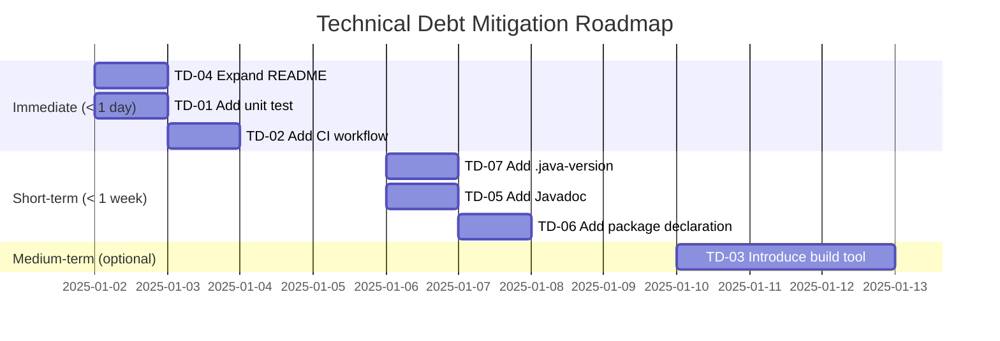

---

## 12. Glossary

> **Sources**: `HelloWorld.java`, Java SE terminology, Arc42 standard terminology

### 12.1 Domain Terms

| Term | Definition |
|------|-----------|
| **Hello World** | A traditional first program in any programming language. It demonstrates the minimum syntax required to produce visible output. The string `"Hello World"` is the canonical greeting output by such programs. |
| **Greeting** | The single domain concept in Kasia_app_1 — the string `"Hello World"` emitted to standard output. |
| **Kasia_app_1** | The application name for this repository (`copilot-test-ktruchcz`). A minimal Java Hello World program. |
| **Standard Output (stdout)** | The default output stream of a process. In Java, accessed via `System.out`. Typically connected to the terminal or a log sink. File descriptor 1 on POSIX systems. |

### 12.2 Java Technical Terms

| Term | Definition |
|------|-----------|
| **Java SE (Standard Edition)** | The core Java platform specification providing the JVM, compiler (`javac`), and standard library (`java.lang`, etc.). |
| **JVM (Java Virtual Machine)** | The runtime engine that executes Java bytecode (`.class` files). Abstracts the underlying OS and hardware. |
| **JDK (Java Development Kit)** | A software package including the JVM, compiler (`javac`), and development tools. Required to compile Java source files. |
| **JRE (Java Runtime Environment)** | A subset of the JDK containing the JVM and standard libraries only. Sufficient to *run* compiled `.class` files. |
| **`javac`** | The Java compiler. Transforms `.java` source files into `.class` bytecode files. |
| **Bytecode** | The intermediate representation of a compiled Java class. Stored in `.class` files. Platform-independent; interpreted/compiled by the JVM at runtime. |
| **`main` method** | The entry point for a Java application. Must have the signature `public static void main(String[] args)` to be invoked by the JVM launcher. |
| **`System.out`** | A `java.io.PrintStream` instance in `java.lang.System` representing the standard output stream. |
| **`System.out.println()`** | A method on `PrintStream` that writes a string followed by a platform-specific line separator to stdout. |
| **Default package** | The unnamed package in Java. Classes without a `package` declaration belong to the default package. Not recommended for production code but acceptable for simple programs. |
| **`String[] args`** | The command-line arguments passed to the Java application. An array of `String` objects; empty if no arguments are provided. |
| **Exit code** | An integer value returned by a process to the OS upon termination. `0` conventionally means success; non-zero indicates an error. |
| **ClassNotFoundException** | A runtime exception thrown by the JVM when the specified class cannot be found on the classpath. |
| **Classpath** | A parameter telling the JVM and compiler where to look for compiled `.class` files and JAR archives. |
| **`.gitignore`** | A configuration file recognised by git that lists file patterns to exclude from version control tracking. |
| **`.class` file** | A compiled Java bytecode file produced by `javac`. Named after the class it contains (e.g., `HelloWorld.class`). |

### 12.3 Arc42 Terms

| Term | Definition |
|------|-----------|
| **Arc42** | A template for software architecture documentation. Defines 12 standardised sections covering goals, constraints, context, structure, behaviour, deployment, and quality. |
| **Building Block** | An Arc42 concept representing a structural element of the system (e.g., a class, module, or component). |
| **ADR (Architecture Decision Record)** | A document capturing an important architectural decision, its context, the decision made, and its consequences. |
| **Whitebox** | An Arc42 view that shows the internal structure of a building block, revealing its sub-components. |
| **Blackbox** | An Arc42 view that treats a building block as an opaque unit, showing only its interface/behaviour, not its internals. |
| **Quality Scenario** | A concrete, measurable specification of a quality requirement, describing a stimulus, environment, response, and measurement. |
| **C4 Model** | A hierarchical approach to visualising software architecture at four levels: Context, Containers, Components, and Code. Used in Section 3 of this document. |
| **Cyclomatic Complexity** | A software metric measuring the number of linearly independent paths through source code. A value of 1 (as in `HelloWorld`) means no branches. |
| **Technical Debt** | The implied cost of rework caused by choosing an easy short-term solution instead of a better long-term approach. |

### 12.4 Acronyms

| Acronym | Full Form |
|---------|----------|
| ADR | Architecture Decision Record |
| CI | Continuous Integration |
| CD | Continuous Deployment |
| FR | Functional Requirement |
| JDK | Java Development Kit |
| JRE | Java Runtime Environment |
| JVM | Java Virtual Machine |
| OC | Organisational Constraint |
| OS | Operating System |
| QS | Quality Scenario |
| SE | Standard Edition |
| TC | Technical Constraint |
| TD | Technical Debt |
| VCS | Version Control System |

---

## Appendix — File Inventory

| File | Size | Description |
|------|------|-------------|
| `HelloWorld.java` | ~100 bytes | Java source file — the complete application |
| `README.md` | ~28 bytes | Repository name only |
| `.gitignore` | ~8 bytes | Excludes `*.class` from VCS |
| `.github/agents/` | — | GitHub Copilot agent definitions |
| `.github/hooks/` | — | GitHub hook configurations |
| `.github/skills/` | — | GitHub Copilot skill definitions |

---

## Appendix — Generation Metadata

| Field | Value |
|-------|-------|
| Generated by | arc42-documentor agent |
| Generation date | 2025-01-01 |
| Arc42 template version | 8.x |
| Sections covered | 12 / 12 |
| Mermaid diagrams embedded | 12 |
| ADRs documented | 5 |
| Quality scenarios | 5 |
| Technical debt items | 7 |
| Source files analysed | 2 (`HelloWorld.java`, `README.md`) |
| Output format | Markdown with embedded Mermaid diagrams |
| Self-contained | ✅ Yes — no external file references |

---

*End of Arc42 Architecture Documentation for Kasia_app_1*

