# Architecture Documentation (Arc42)

**Project**: HelloWorld Java Application (`copilot-test-ktruchcz`)
**Version**: 1.0.0
**Date**: 2025-07-14
**Generated by**: Arc42 Documentation Generator (arc42-documentor agent)
**Source analysed**: `HelloWorld.java`, `README.md`, `.gitignore`

---

## Table of Contents

1. [Introduction and Goals](#1-introduction-and-goals)
2. [Architecture Constraints](#2-architecture-constraints)
3. [System Scope and Context](#3-system-scope-and-context)
4. [Solution Strategy](#4-solution-strategy)
5. [Building Block View](#5-building-block-view)
6. [Runtime View](#6-runtime-view)
7. [Deployment View](#7-deployment-view)
8. [Cross-cutting Concepts](#8-cross-cutting-concepts)
9. [Architecture Decisions](#9-architecture-decisions)
10. [Quality Requirements](#10-quality-requirements)
11. [Risks and Technical Debt](#11-risks-and-technical-debt)
12. [Glossary](#12-glossary)

---

## 1. Introduction and Goals

### 1.1 Purpose and Business Context

The **HelloWorld** application is the canonical entry-point program for the `copilot-test-ktruchcz` repository. Its sole functional purpose is to emit the string `"Hello World"` to the standard output stream when executed. While trivial in scope, it serves as:

- A **baseline verification artefact** — confirming that the Java toolchain (compiler + JVM) is correctly installed and operational in any target environment.
- A **CI/CD smoke-test harness** — providing the simplest possible build/run cycle to validate GitHub Actions or other pipeline plumbing.
- A **template starting point** — giving contributors a clean, zero-dependency Java project skeleton they can extend.

### 1.2 Goals

| # | Goal | Priority |
|---|------|----------|
| G-1 | Print `"Hello World"` to `stdout` when the program is run | Must |
| G-2 | Compile without warnings under standard `javac` settings | Must |
| G-3 | Require no external dependencies or build tools | Should |
| G-4 | Serve as a working baseline for CI pipeline validation | Should |
| G-5 | Remain readable and understandable by any Java developer | Nice-to-have |

### 1.3 Quality Goals

| Priority | Quality Attribute | Motivation |
|----------|-------------------|------------|
| 1 | **Simplicity** | Zero cognitive overhead; a new contributor can understand the entire system in under 30 seconds |
| 2 | **Portability** | Must run on any JVM 8+ without modification |
| 3 | **Reliability** | The program must always produce the expected output; no error conditions exist by design |
| 4 | **Maintainability** | Code should be trivially easy to modify or extend |

### 1.4 Stakeholders

| Role | Person / Group | Expectation |
|------|---------------|-------------|
| Developer / Contributor | Repository owner (`ktruchcz`) | Working Java code, clean build, straightforward structure |
| CI/CD Pipeline | GitHub Actions runner | Successful compile and execute cycle |
| Reviewer / Assessor | Any engineer reviewing the repo | Clear, idiomatic Java following standard conventions |

---

## 2. Architecture Constraints

### 2.1 Technical Constraints

| ID | Constraint | Rationale |
|----|-----------|-----------|
| TC-1 | **Language: Java** | The source file `HelloWorld.java` mandates Java as the implementation language |
| TC-2 | **No build tool** | No `pom.xml`, `build.gradle`, or `Makefile` is present; raw `javac`/`java` CLI toolchain is assumed |
| TC-3 | **No external libraries** | Only `java.lang` (auto-imported) is used; no classpath dependencies |
| TC-4 | **JVM 8+ target** | The source uses only pre-Java-8 language features (`System.out.println`); compatible with any modern JVM |
| TC-5 | **Single source file** | The entire application is one `.java` file — no packages, no sub-modules |
| TC-6 | **`.class` files excluded** | `.gitignore` excludes `*.class`, meaning compiled artefacts are not tracked in VCS |

### 2.2 Organizational Constraints

| ID | Constraint | Rationale |
|----|-----------|-----------|
| OC-1 | **GitHub-hosted repository** | Source of truth is the GitHub remote; all collaboration flows through GitHub |
| OC-2 | **No formal release process** | There is no versioning scheme, tagging strategy, or release pipeline defined |
| OC-3 | **Minimal documentation requirement** | `README.md` contains only the repository name heading; extended documentation is not mandated by the project |

### 2.3 Conventions

| ID | Convention | Source |
|----|-----------|--------|
| CV-1 | Java class name matches file name (`HelloWorld.java` → `public class HelloWorld`) | Java Language Specification §7.6 |
| CV-2 | Entry-point signature `public static void main(String[] args)` | JVM specification for application entry points |
| CV-3 | `*.class` artefacts gitignored | `.gitignore` rule `*.class` |

---

## 3. System Scope and Context

### 3.1 Business Context

The HelloWorld application is a **self-contained, single-process program**. It has no external interfaces, consumes no input, and produces a single line of text on standard output. From a business-context perspective, the system boundary is minimal:

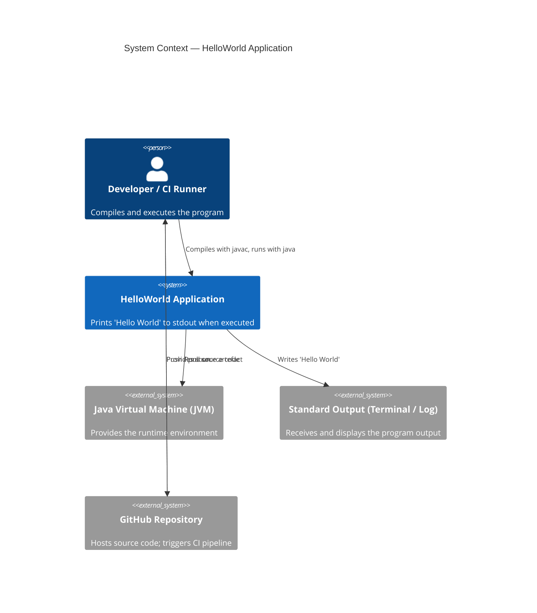

### 3.2 Technical Context

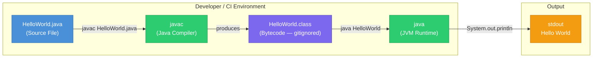

### 3.3 External Interfaces

| Interface | Direction | Protocol / Medium | Description |
|-----------|-----------|-------------------|-------------|
| `stdout` | **Out** | OS pipe / terminal | The single output channel; receives `"Hello World\n"` |
| `javac` CLI | **In** | OS process invocation | Compiles `HelloWorld.java` to `HelloWorld.class` |
| `java` CLI | **In** | OS process invocation | Executes `HelloWorld.class` on the JVM |
| GitHub VCS | **In/Out** | HTTPS / SSH git | Source code storage and collaboration |

---

## 4. Solution Strategy

### 4.1 Core Technology Decisions

| Decision | Choice | Rationale |
|----------|--------|-----------|
| **Implementation language** | Java (plain) | Requirement is implicit from the `.java` file extension and class declaration |
| **Build tooling** | None (raw `javac`) | No build file exists; deliberate simplicity is preserved |
| **Architecture style** | Single-class, single-method | The problem domain warrants no decomposition |
| **Dependency management** | None | Only `java.lang.*` (auto-imported) is needed |
| **Output mechanism** | `System.out.println` | Standard, idiomatic Java for console output |

### 4.2 Decomposition Approach

Given the trivial scope, the entire solution collapses to a single architectural tier:

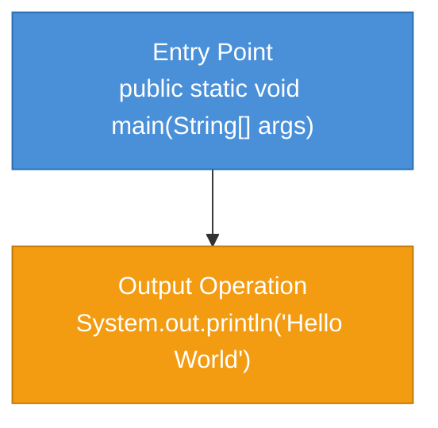

### 4.3 Approaches to Quality Goals

| Quality Goal | Approach |
|-------------|----------|
| **Simplicity** | Single public class, single method, single statement — no unnecessary abstractions |
| **Portability** | Use only `java.lang` (universally available); no JVM-version-specific APIs |
| **Reliability** | `System.out.println` never throws unchecked exceptions for string literals; deterministic output guaranteed |
| **Maintainability** | Flat file structure; any Java developer can modify the output string in under 10 seconds |

---

## 5. Building Block View

### 5.1 Level 1 — System Overview

The system comprises a single deployable unit: the `HelloWorld` class.

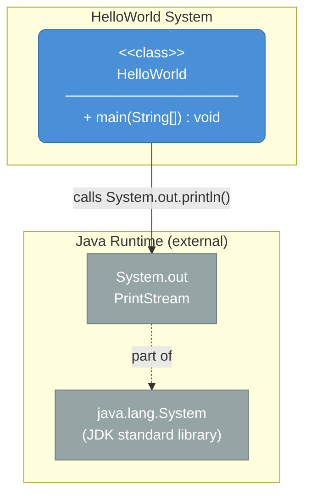

### 5.2 Level 2 — Class Structure

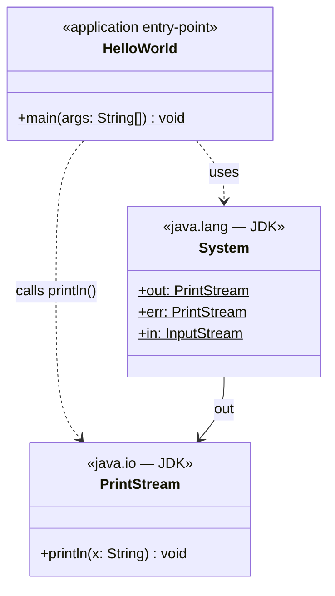

### 5.3 Method Inventory

| Class | Method | Visibility | Static | Return | Description |
|-------|--------|-----------|--------|--------|-------------|
| `HelloWorld` | `main(String[] args)` | `public` | ✓ | `void` | JVM entry point; prints `"Hello World"` to `stdout` |

### 5.4 Source File Inventory

| File | Role | Lines | Package |
|------|------|-------|---------|
| `HelloWorld.java` | Application source | 5 | *(default)* |
| `README.md` | Project documentation stub | 1 | — |
| `.gitignore` | VCS exclusion rules | 1 | — |

---

## 6. Runtime View

### 6.1 Scenario 1 — Normal Program Execution

The one and only runtime scenario: a developer (or CI runner) compiles and runs the application.

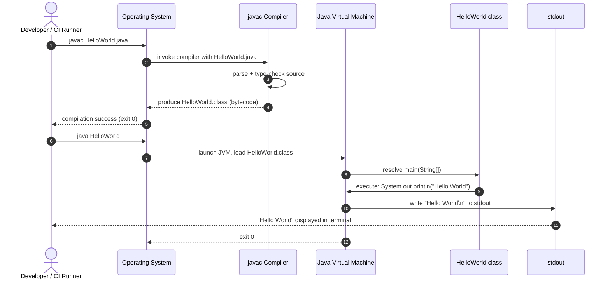

### 6.2 Scenario 2 — CI Pipeline Execution

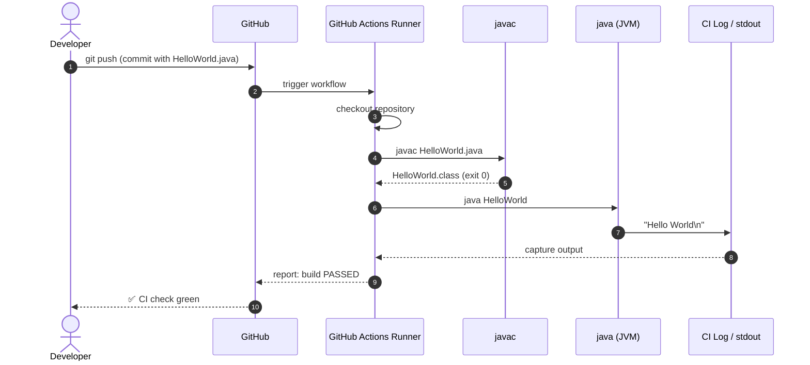

### 6.3 Runtime State Machine

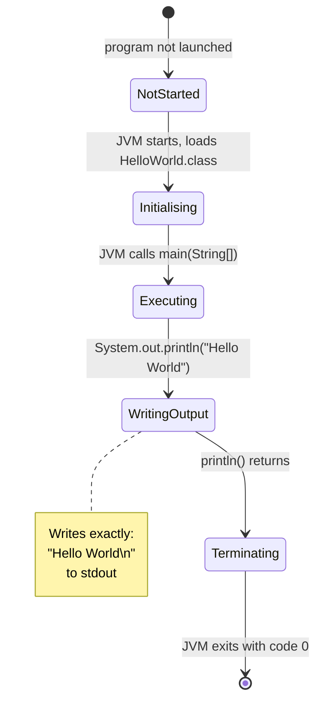

---

## 7. Deployment View

### 7.1 Infrastructure Overview

The HelloWorld application has **no server, no container, and no persistent infrastructure**. It is a command-line application that runs to completion on any machine with a JDK or JRE installed.

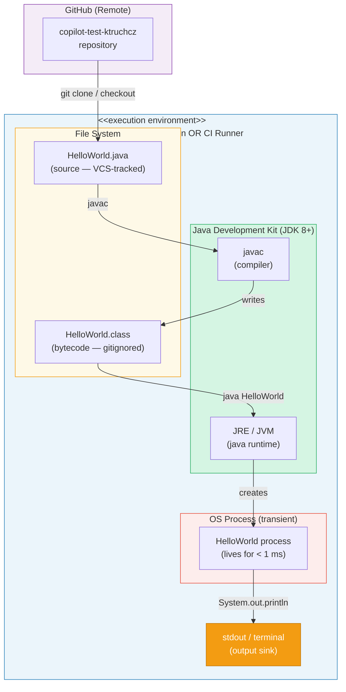

### 7.2 Deployment Scenarios

| Scenario | Environment | JDK requirement | Execution command |
|----------|-------------|-----------------|-------------------|
| **Local development** | Developer workstation (Windows/macOS/Linux) | JDK 8+ | `javac HelloWorld.java && java HelloWorld` |
| **CI pipeline** | GitHub Actions Ubuntu runner | JDK pre-installed on runner image | Same as above (or via Makefile step) |
| **Docker container** | Any Docker host | `openjdk:8-jre` base image or later | `javac HelloWorld.java && java HelloWorld` |

### 7.3 Deployment Prerequisites

| Prerequisite | Minimum Version | Notes |
|-------------|-----------------|-------|
| Java Development Kit | JDK 8 | Required for `javac`; JRE alone is not sufficient to compile |
| Operating System | Any (JVM-supported) | Linux, macOS, Windows all supported |
| Disk space | < 1 MB | Source + bytecode combined are negligible |
| Network | Not required | No network I/O at runtime |

---

## 8. Cross-cutting Concepts

### 8.1 Domain Model

The domain is entirely degenerate — there are no domain entities, aggregates, value objects, or repositories. The only "domain concept" is the greeting string itself.

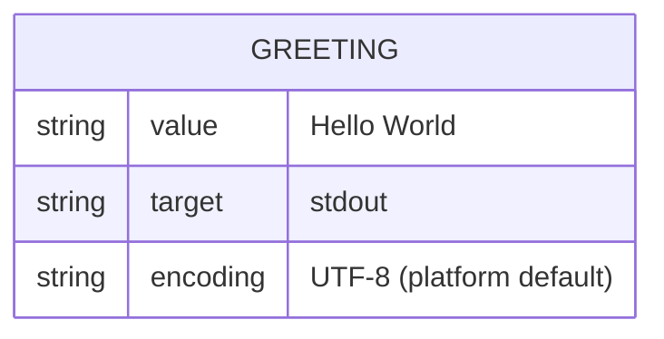

### 8.2 Error Handling and Robustness

| Concern | Approach | Rationale |
|---------|----------|-----------|
| **Exception handling** | None (no try/catch) | `System.out.println(String)` cannot throw a checked exception for a string literal |
| **Null safety** | Not applicable | No nullable references exist in the code |
| **Input validation** | Not applicable | `args` parameter is declared but never read |
| **Logging** | Not applicable | `System.out.println` is the sole output mechanism |
| **Exit codes** | Implicit `0` (success) | JVM exits with `0` when `main()` returns normally |

### 8.3 Security Concepts

| Concern | Status | Notes |
|---------|--------|-------|
| **Authentication** | N/A | No user interaction |
| **Authorisation** | N/A | No resources accessed |
| **Input injection** | N/A | No user-controlled input is processed |
| **Secrets / credentials** | None | No sensitive data in source or output |
| **Dependency vulnerabilities** | None | Zero third-party dependencies |

### 8.4 Testability

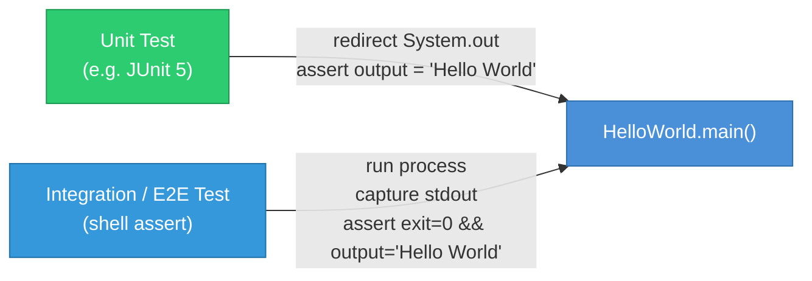

**Recommended test approach:**

```java
// Illustrative unit test (not yet implemented)
@Test
void main_shouldPrintHelloWorld() {
    ByteArrayOutputStream captured = new ByteArrayOutputStream();
    System.setOut(new PrintStream(captured));
    HelloWorld.main(new String[]{});
    assertEquals("Hello World" + System.lineSeparator(), captured.toString());
}
```

### 8.5 Internationalization / Localization

The greeting string `"Hello World"` is hard-coded as a string literal. No `ResourceBundle`, locale detection, or encoding configuration is present. The output encoding is the platform default charset of the JVM.

### 8.6 Build and Packaging

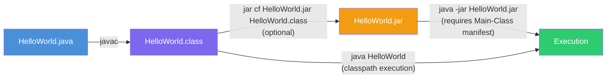

---

## 9. Architecture Decisions

### ADR-001 — Use Plain Java without a Build Tool

| Field | Value |
|-------|-------|
| **Status** | Accepted |
| **Date** | (project inception) |
| **Context** | The application prints one line of text; a build tool (Maven, Gradle, Ant) would add significant overhead for zero functional gain |
| **Decision** | Use raw `javac` / `java` CLI commands with no build configuration file |
| **Consequences** | ✅ Zero setup friction ✅ No dependency resolution needed ❌ No lifecycle management ❌ Harder to scale if the project grows |

---

### ADR-002 — Use Default (Unnamed) Package

| Field | Value |
|-------|-------|
| **Status** | Accepted |
| **Date** | (project inception) |
| **Context** | The class resides in the default (unnamed) package — no `package` statement |
| **Decision** | Accept the default package for this single-file application |
| **Consequences** | ✅ Simpler execution (`java HelloWorld` instead of `java com.example.HelloWorld`) ❌ Not suitable if the project grows into a multi-class application |

---

### ADR-003 — Hard-code the Greeting String

| Field | Value |
|-------|-------|
| **Status** | Accepted |
| **Date** | (project inception) |
| **Context** | The purpose of the program is fixed: print `"Hello World"`. Externalising this to a config file, property, or argument would add complexity with no benefit |
| **Decision** | Embed `"Hello World"` as a string literal inside `main()` |
| **Consequences** | ✅ No configuration required ✅ Deterministic, always-correct output ❌ String change requires code modification and recompilation |

---

### ADR-004 — Gitignore Compiled Artefacts

| Field | Value |
|-------|-------|
| **Status** | Accepted |
| **Date** | (project inception) |
| **Context** | `.class` files are derived artefacts reproducible from source; storing them in VCS wastes space and causes merge noise |
| **Decision** | Add `*.class` to `.gitignore` |
| **Consequences** | ✅ Clean VCS history ✅ Forces reproducible builds from source ❌ Consumers must have a JDK to use the code (cannot run pre-built bytecode from the repo) |

---

## 10. Quality Requirements

### 10.1 Quality Tree

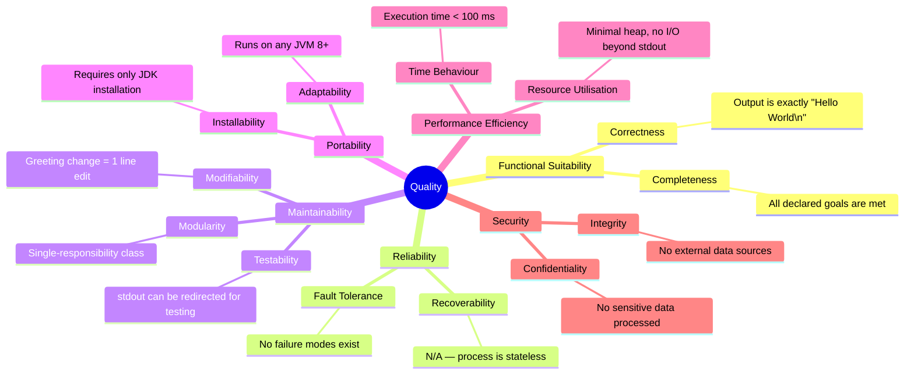

### 10.2 Quality Scenarios

| ID | Quality Attribute | Stimulus | Response | Measure |
|----|------------------|----------|----------|---------|
| QS-1 | **Correctness** | Execute `java HelloWorld` | Output is `Hello World` followed by newline | 100% deterministic |
| QS-2 | **Performance** | Execute on any JVM 8+ hardware | Program terminates | < 500 ms wall-clock time |
| QS-3 | **Portability** | Run on Linux / macOS / Windows JDK 8 | Program compiles and runs without modification | 0 source changes required |
| QS-4 | **Maintainability** | Change greeting text | Locate and edit the string literal | ≤ 60 seconds for any Java developer |
| QS-5 | **Testability** | Write a unit test | Capture and assert stdout | Achievable with standard JUnit 5 |

### 10.3 Code Metrics

| Metric | Value | Assessment |
|--------|-------|------------|
| **Lines of Code (LoC)** | 5 | Minimal |
| **Cyclomatic Complexity** | 1 | Lowest possible — no branches |
| **Number of Classes** | 1 | Monolithic (appropriate at this scale) |
| **Number of Methods** | 1 | Single responsibility |
| **Dependencies (external)** | 0 | Zero third-party libraries |
| **Test Coverage** | 0% | No tests written (see Risks) |
| **Technical Debt Ratio** | Very Low | Code is near-perfect for its scope |

---

## 11. Risks and Technical Debt

### 11.1 Risk Register

| ID | Risk | Likelihood | Impact | Mitigation |
|----|------|-----------|--------|-----------|
| R-1 | **No automated tests** | High (tests don't exist) | Low (correctness is obvious) | Add a JUnit 5 test that captures `stdout` and asserts `"Hello World"` |
| R-2 | **No CI/CD pipeline defined** | Medium (no workflow YAML found) | Low (manual compile is trivial) | Add a GitHub Actions workflow (`build.yml`) with compile + run steps |
| R-3 | **Default package usage** | Low | Medium (if project grows) | Introduce a proper package structure if additional classes are added |
| R-4 | **No build tool** | Low | Medium (if project grows) | Adopt Maven or Gradle if the project evolves beyond a single class |
| R-5 | **Hard-coded output string** | Low | Low | Externalise to a constant or resource bundle if internationalisation is needed |
| R-6 | **JDK version not pinned** | Low | Low | Add a `.java-version` or `system.properties` file specifying the target JDK |
| R-7 | **Minimal README** | High (README has 1 line) | Low | Expand README with build/run instructions |

### 11.2 Technical Debt Summary

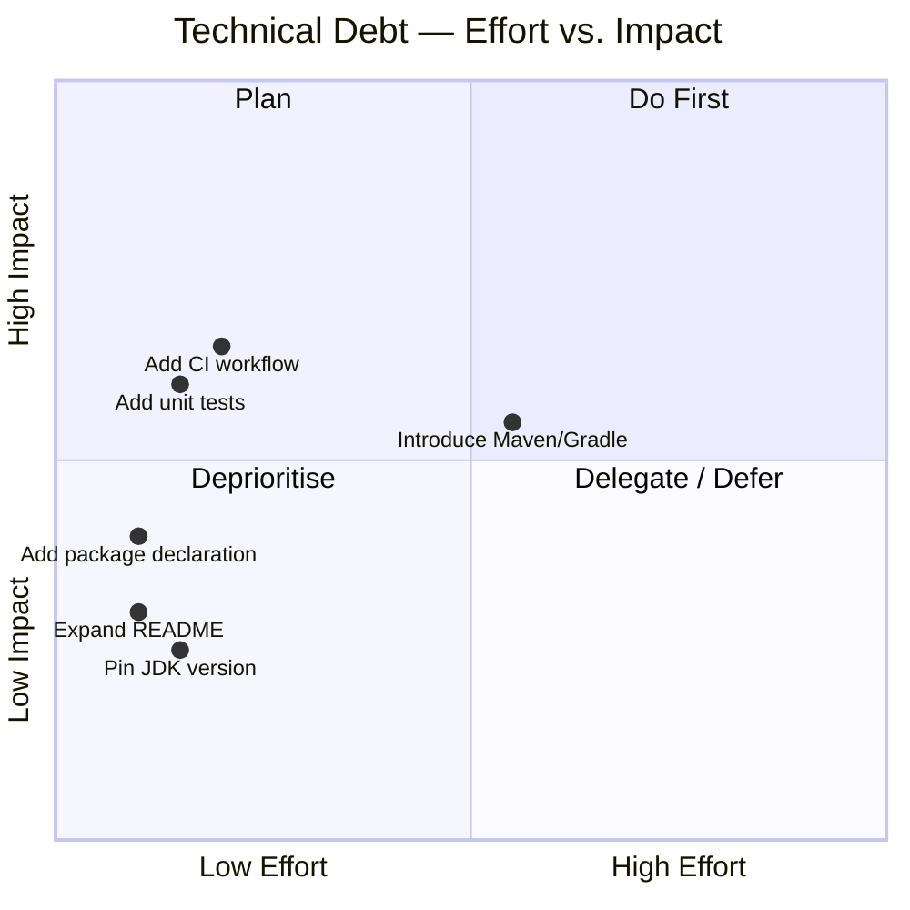

### 11.3 Recommended Improvements (Prioritised)

1. **[Quick win]** Expand `README.md` with build and run instructions (~10 min)
2. **[Quick win]** Add a JUnit 5 unit test for `main()` (~15 min)
3. **[Quick win]** Add a GitHub Actions CI workflow (`javac` + `java`) (~20 min)
4. **[Future]** Add a `package` declaration if the project grows beyond one class
5. **[Future]** Adopt Maven or Gradle if dependency management becomes necessary

---

## 12. Glossary

| Term | Definition |
|------|-----------|
| **Arc42** | A pragmatic, lightweight template for software architecture documentation, structured into 12 sections |
| **bytecode** | Platform-independent intermediate code produced by `javac`, stored in `.class` files, and executed by the JVM |
| **CI/CD** | Continuous Integration / Continuous Delivery — automated pipeline that builds, tests, and deploys software on every commit |
| **classpath** | JVM search path used to locate compiled `.class` files or JAR archives at runtime |
| **default package** | In Java, a class with no `package` statement belongs to the unnamed default package |
| **entry point** | The `public static void main(String[] args)` method — the first method the JVM invokes when starting a Java application |
| **gitignore** | A `.gitignore` file containing patterns of files and directories that Git should not track |
| **GitHub Actions** | GitHub's built-in CI/CD automation platform, configured through YAML workflow files in `.github/workflows/` |
| **HelloWorld** | The canonical first program in computing education; demonstrates the minimal viable structure of a working program in a given language |
| **JAR** | Java ARchive — a ZIP-format file bundling compiled `.class` files and metadata for distribution |
| **javac** | The Java compiler included in the JDK; transforms `.java` source files into `.class` bytecode files |
| **JDK** | Java Development Kit — the full toolchain for Java development, including `javac`, `java`, and standard libraries |
| **JRE** | Java Runtime Environment — a subset of the JDK containing only the JVM and standard libraries needed to *run* (not compile) Java programs |
| **JVM** | Java Virtual Machine — the runtime engine that executes Java bytecode, providing platform independence |
| **main method** | See *entry point* |
| **PrintStream** | `java.io.PrintStream` — the type of `System.out`; provides `println()` and related output methods |
| **stdout** | Standard Output — the default output stream of a process, typically connected to the terminal or captured by a CI log |
| **String literal** | A fixed string value written directly in source code between double-quote characters, e.g. `"Hello World"` |
| **System.out** | A static `PrintStream` field on `java.lang.System` representing the standard output stream |
| **technical debt** | The implied cost of rework caused by choosing an easy or incomplete solution now instead of a better approach |

---

*Documentation generated by the **arc42-documentor** agent — synthesised from direct source-code analysis of `HelloWorld.java`, `README.md`, and `.gitignore`.*

*Arc42 template © Peter Hruschka & Gernhard Starke — [arc42.org](https://arc42.org)*
