# Architecture Documentation (Arc42)

**Project**: CRMApp — Customer Relationship Management Application  
**Version**: 1.0.0  
**Date**: 2025-01-01  
**Generated by**: Arc42 Documentation Generator (`arc42-documentor` agent)  
**Repository**: `copilot-test-ktruchcz`  
**Target Path**: `docs/arc42/arc42-documentation.md` *(place in this directory once `docs/arc42/` is created)*

---

> **Note on Repository State**: This documentation describes the **target architecture** for the CRMApp CRM application.  
> The repository currently contains an early-stage Java bootstrap (`HelloWorld.java`). This Arc42  
> document captures the intended full-system architecture to guide all development work.

---

## Table of Contents

1. [Introduction and Goals](#1-introduction-and-goals)
2. [Architecture Constraints](#2-architecture-constraints)
3. [System Scope and Context](#3-system-scope-and-context)
4. [Solution Strategy](#4-solution-strategy)
5. [Building Block View](#5-building-block-view)
6. [Runtime View](#6-runtime-view)
7. [Deployment View](#7-deployment-view)
8. [Cross-cutting Concepts](#8-cross-cutting-concepts)
9. [Architecture Decisions](#9-architecture-decisions)
10. [Quality Requirements](#10-quality-requirements)
11. [Risks and Technical Debt](#11-risks-and-technical-debt)
12. [Glossary](#12-glossary)

---

## 1. Introduction and Goals

### 1.1 Business Context and Objectives

**CRMApp** is a Customer Relationship Management platform built on the Java ecosystem. Its primary purpose is to help organisations manage the full customer lifecycle — from initial lead acquisition through opportunity management, deal closure, post-sale support, and long-term retention.

The system enables sales teams, marketing departments, customer support agents, and business managers to collaborate around a single, authoritative view of the customer (the **"360° Customer View"**). It replaces fragmented spreadsheets, disconnected email threads, and siloed departmental tools with a unified, auditable, and scalable platform.

#### Strategic Business Goals

| # | Goal | Priority |
|---|------|----------|
| G-1 | Provide a unified customer data platform eliminating data silos | Critical |
| G-2 | Accelerate the sales cycle through pipeline visibility and automation | High |
| G-3 | Improve customer retention via proactive support and engagement tracking | High |
| G-4 | Enable data-driven decision-making through reporting and analytics dashboards | High |
| G-5 | Support regulatory compliance (GDPR, data residency) for all customer data | Critical |
| G-6 | Integrate seamlessly with existing enterprise tools (ERP, email, calendars) | Medium |
| G-7 | Provide a mobile-accessible interface for field sales representatives | Medium |
| G-8 | Deliver configurable workflows and automation to reduce manual data entry | Medium |

### 1.2 Quality Goals

The top quality attributes that shape architectural decisions are listed in priority order:

| Priority | Quality Attribute | Motivation |
|----------|------------------|------------|
| 1 | **Security & Privacy** | Customer PII must be protected at rest and in transit; GDPR compliance is mandatory |
| 2 | **Reliability / Availability** | Sales teams depend on the system 24/7; target ≥ 99.9% uptime |
| 3 | **Usability** | Adoption hinges on intuitive UX; low learning curve required for all user roles |
| 4 | **Performance** | Page/API response ≤ 500 ms (P95) under normal production load |
| 5 | **Scalability** | Must scale from hundreds to tens of thousands of customer records without re-architecture |
| 6 | **Maintainability** | Team must be able to evolve features rapidly; modular, testable design required |
| 7 | **Auditability** | All data changes must be traceable for compliance, debugging, and forensics |
| 8 | **Interoperability** | Open APIs that integrate with ERP, email, calendar, and marketing platforms |

### 1.3 Stakeholders

| Role | Group | Key Expectations |
|------|-------|-----------------|
| **Sales Representatives** | Primary End Users | Fast, intuitive contact/pipeline management; mobile access; activity logging |
| **Marketing Managers** | Primary End Users | Campaign management, lead scoring, audience segmentation, ROI tracking |
| **Customer Support Agents** | Primary End Users | Case/ticket management, SLA visibility, knowledge base access |
| **Business Managers** | Primary End Users | KPI dashboards, sales forecasting, team performance reports |
| **System Administrators** | Power Users | User/role management, workflow configuration, system settings |
| **Product Owner / Leadership** | Decision Makers | Feature delivery, ROI measurement, competitive positioning |
| **IT / DevOps Engineers** | Platform Operators | Deployment pipeline, monitoring, horizontal scaling, secrets management |
| **Data Protection Officer** | Compliance | GDPR compliance, PII encryption, audit logs, data retention |
| **System Integrators** | External Partners | Stable, versioned REST/GraphQL APIs with comprehensive OpenAPI documentation |
| **Software Architects** | Technical Team | Clean architecture, domain separation, technical excellence, ADR governance |
| **Software Developers** | Engineering Team | Clear module structure, fast build/test cycles, good tooling, low setup friction |

---

## 2. Architecture Constraints

### 2.1 Technical Constraints

| ID | Constraint | Rationale |
|----|-----------|-----------|
| TC-1 | **Java (JDK 17 LTS)** is the primary backend language | Team expertise; rich ecosystem; Oracle/OpenJDK long-term support until Sept 2029 |
| TC-2 | **Spring Boot 3.x** as the application framework | Industry-standard for Java microservices; Spring Security, Spring Data, Actuator |
| TC-3 | **PostgreSQL 15+** as the primary relational data store | ACID transactions for CRM data integrity; JSONB for custom fields; row-level security |
| TC-4 | **REST** (primary) and **GraphQL** (query-heavy endpoints) API interfaces | Standard integration patterns; broad client support; OpenAPI 3.0 documentation |
| TC-5 | **Docker** containers for all deployable artefacts | Environment parity across dev/staging/prod; CI/CD compatibility |
| TC-6 | **HTTPS / TLS 1.3** mandatory for all external and inter-service communications | Security baseline; prevents eavesdropping and man-in-the-middle attacks |
| TC-7 | **OAuth 2.0 / OpenID Connect** for all authentication flows | Industry standard; enables enterprise SSO; avoids storing credentials in-app |
| TC-8 | **Flyway** for all database schema migrations | Version-controlled, auditable, reproducible schema evolution |
| TC-9 | **GitHub Actions** for CI/CD pipelines | Already in repository (`.github/` directory); team familiarity |
| TC-10 | Builds must produce **reproducible artefacts** | Build determinism for compliance, auditability, and security |

### 2.2 Organisational Constraints

| ID | Constraint | Rationale |
|----|-----------|-----------|
| OC-1 | **Agile development** with two-week sprints | Organisational development cadence |
| OC-2 | **GitFlow** branching strategy (`main`, `develop`, `feature/*`, `release/*`, `hotfix/*`) | Controlled release management and parallel feature development |
| OC-3 | All code changes require **peer code review** (minimum 1 approved reviewer) | Code quality assurance and knowledge sharing |
| OC-4 | **Architecture Decision Records (ADRs)** must be created for all significant decisions | Traceability, team alignment, and onboarding support |
| OC-5 | Third-party dependencies must pass **security audit** before inclusion | Supply chain security policy |
| OC-6 | No **secrets** (passwords, tokens, API keys) may exist in source code | Security policy; use environment variables or Vault |

### 2.3 Regulatory Constraints

| ID | Constraint | Rationale |
|----|-----------|-----------|
| RC-1 | **GDPR compliance** — right to erasure, portability, consent tracking, data minimisation | EU/UK legal requirement; fines up to 4% of global annual revenue |
| RC-2 | **Data residency** — customer PII must remain within contractually designated cloud regions | Customer contractual requirements; cross-border data transfer laws |
| RC-3 | **Immutable audit logging** — all data access and modifications must be logged with user attribution | Compliance requirements; forensics; SOC 2 readiness |
| RC-4 | **Configurable data retention policies** — automated deletion/anonymisation per data category | Legal hold obligations; GDPR minimisation principle |
| RC-5 | **Consent management** — processing activities require documented legal basis and consent tracking | GDPR Article 6 and Article 7 compliance |

### 2.4 Development & Architecture Conventions

| Convention | Standard |
|-----------|----------|
| Java code style | Google Java Style Guide |
| API design | RESTful conventions; OpenAPI 3.0 specification for all endpoints |
| Database migrations | Flyway versioned scripts (`V{version}__{description}.sql`) |
| Logging format | Structured JSON via SLF4J + Logback; correlated by `traceId` |
| Error responses | RFC 7807 Problem Details for HTTP APIs |
| Dependency injection | Constructor injection preferred over field injection |
| Test naming | `should_[expectedBehaviour]_when_[condition]` |
| Package structure | Domain-first: `com.crmapp.{domain}.{layer}` |

---

## 3. System Scope and Context

### 3.1 Business Context

CRMApp sits at the centre of the organisation's customer-facing operations. It exchanges data with external actors including human users across multiple roles, partner enterprise systems, and third-party service providers.

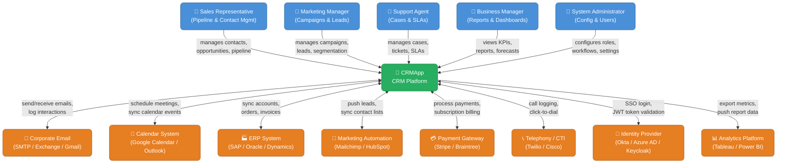

### 3.2 Technical Context

The technical context diagram shows the CRMApp platform decomposed into its major technical containers, and the protocols used to communicate with external systems and clients.

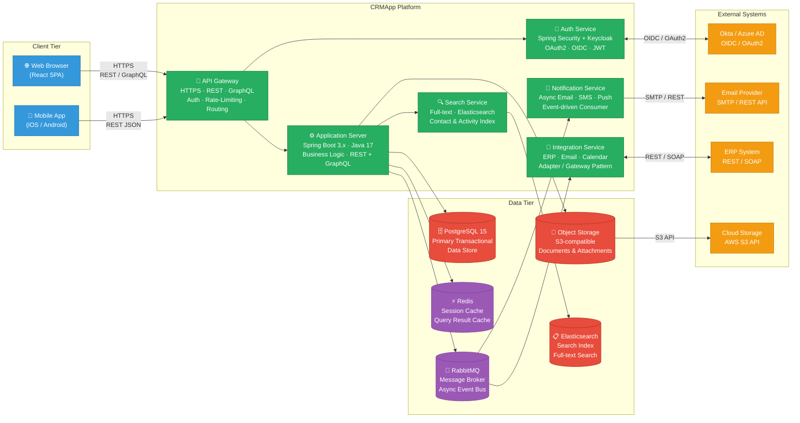

### 3.3 External Interfaces Summary

| Interface | Direction | Protocol | Data Format | Frequency |
|-----------|-----------|----------|-------------|-----------|
| Web Browser (SPA) | Inbound | HTTPS | HTML / JSON / GraphQL | Real-time |
| Mobile App (iOS/Android) | Inbound | HTTPS REST | JSON | Real-time |
| Identity Provider (SSO) | Bidirectional | OAuth2 / OIDC | JWT (RS256) | Per session |
| Corporate Email System | Bidirectional | SMTP / REST | RFC 5322 / JSON | On-demand |
| Calendar System | Bidirectional | REST (CalDAV) | JSON / iCalendar | On-demand |
| ERP System | Bidirectional | REST / SOAP | JSON / XML | Batch + event-driven |
| Marketing Automation | Outbound | REST Webhook | JSON | Event-driven |
| Payment Gateway | Bidirectional | REST | JSON (PCI-DSS scoped) | On-demand |
| Analytics Platform | Outbound | REST / JDBC Export | JSON / Parquet | Scheduled batch |
| Telephony / CTI | Bidirectional | WebSocket / REST | JSON | Real-time |

---

## 4. Solution Strategy

### 4.1 Technology Decisions

| Decision Area | Choice | Rationale |
|--------------|--------|-----------|
| **Backend Language** | Java 17 (LTS) | Strong typing, mature ecosystem, team expertise, enterprise-grade libraries |
| **Application Framework** | Spring Boot 3.x | Auto-configuration, Spring Security OAuth2, Spring Data JPA, Spring Actuator |
| **Architecture Style** | Modular Monolith → Microservices migration path | Start simple, decompose as domains stabilise and team scales |
| **Primary API Style** | REST (CRUD operations) + GraphQL (flexible client-driven queries) | REST for standard operations; GraphQL for reporting and complex nested data |
| **Primary Database** | PostgreSQL 15 | ACID transactions, JSONB for custom fields, row-level security, open source |
| **Caching** | Redis | Sub-millisecond latency for session management and query caching |
| **Full-Text Search** | Elasticsearch | Powerful full-text search across contacts, accounts, activities, and notes |
| **Async Messaging** | RabbitMQ (initial) / Apache Kafka (at scale) | Decouple notifications, integrations, and async business workflows |
| **Frontend** | React + TypeScript | Component reusability, type safety, large ecosystem, SPA architecture |
| **Authentication** | OAuth 2.0 / OIDC via Spring Security | Industry standard; supports enterprise SSO; no credential storage in-app |
| **Containerisation** | Docker + Kubernetes | Environment parity; horizontal scaling; declarative infrastructure |
| **CI/CD** | GitHub Actions | Already configured in repository; free for public repos; large marketplace |
| **Secrets Management** | HashiCorp Vault / AWS Secrets Manager | Centralised, audited, rotatable secrets; no secrets in source code |
| **Schema Migration** | Flyway | Code-level, version-controlled database migrations |
| **Observability** | Micrometer + Prometheus + Grafana + Jaeger + ELK | Full observability stack: metrics, tracing, and logging |

### 4.2 Architectural Approach and Top-Level Decomposition

The system follows a **Domain-Driven Design (DDD)** approach, organising the codebase around business domains rather than technical layers. The architecture transitions from a **Modular Monolith** toward **independent services** as the team and domain understanding mature.

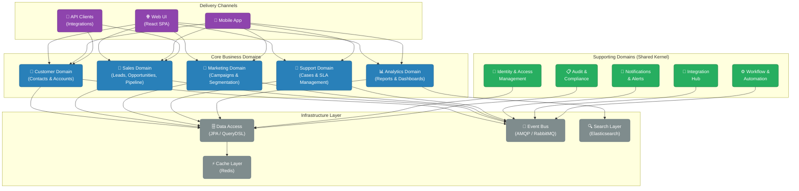

### 4.3 Key Architectural Principles

| Principle | Description | Application |
|-----------|------------|-------------|
| **Domain Isolation** | Each business domain owns its data and exposes well-defined interfaces | No direct DB access across domain boundaries |
| **API-First Design** | All functionality exposed via versioned APIs before UI is built | OpenAPI 3.0 spec written first; contract tests from day one |
| **Event-Driven Integration** | Cross-domain communication via domain events | No synchronous calls between bounded contexts |
| **Defense in Depth** | Multiple security layers (network → application → data) | WAF + Auth + RBAC + Encryption at every layer |
| **Observability by Design** | Metrics, tracing, and logging built in from the first line | Spring Actuator + OpenTelemetry instrumented at startup |
| **Fail-Safe Defaults** | Deny-by-default access control; graceful degradation on failures | Spring Security deny-all base; circuit breakers on all external calls |
| **Infrastructure as Code** | All deployment configuration version-controlled | Kubernetes manifests and Helm charts in repository |
| **Evolutionary Architecture** | Architecture supports incremental change and extraction | Module interfaces designed to become service boundaries |

---

## 5. Building Block View

### 5.1 Level 1 — System Container Diagram

The CRMApp system is decomposed into the following top-level deployable containers, each with a distinct responsibility:

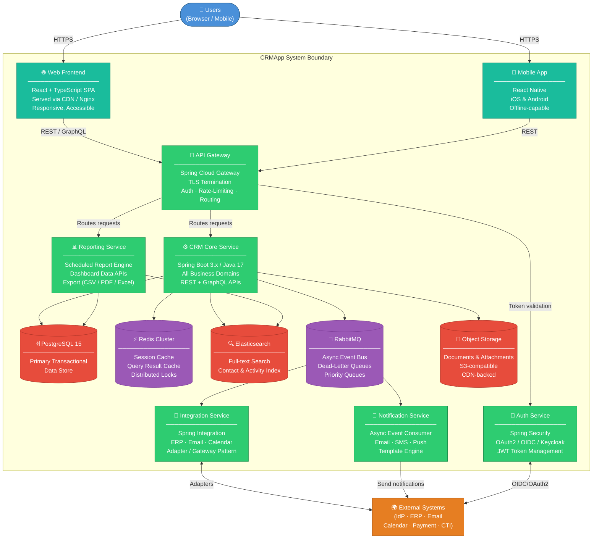

### 5.2 Level 2 — CRM Core Service: Domain Module Decomposition

The CRM Core Service is the heart of the system, structured as a **modular monolith** with strict domain boundaries:

```mermaid
graph TB
    classDef api fill:#8E44AD,stroke:#6C3483,color:#fff,rx:4
    classDef module fill:#2980B9,stroke:#1A5C8A,color:#fff,rx:4
    classDef shared fill:#27AE60,stroke:#1A7A42,color:#fff,rx:4
    classDef infra fill:#7F8C8D,stroke:#566573,color:#fff,rx:4

    subgraph "API Layer — Inbound Adapters"
        RestControllers["REST Controllers\n(OpenAPI 3.0 — Spring MVC)"]:::api
        GraphQLResolvers["GraphQL Resolvers\n(Spring GraphQL)"]:::api
        WebhookHandlers["Webhook Handlers\n(Inbound Event Receivers)"]:::api
        EventConsumers["Event Consumers\n(AMQP — RabbitMQ)"]:::api
    end

    subgraph "Domain Modules — Core Business Logic"
        ContactModule["📇 Contact Module\n───────────────\n• Contact CRUD & search\n• Account management\n• Relationship mapping\n• Duplicate detection & merge"]:::module

        LeadModule["🎯 Lead Module\n───────────────\n• Lead capture & import\n• Lead scoring engine\n• BANT qualification\n• Lead-to-Opportunity conversion"]:::module

        OpportunityModule["💼 Opportunity Module\n───────────────\n• Deal & stage management\n• Sales pipeline tracking\n• Forecasting & close probability\n• Quote & proposal generation"]:::module

        ActivityModule["📝 Activity Module\n───────────────\n• Calls, emails, meetings\n• Task management\n• Customer timeline / history\n• Calendar synchronisation"]:::module

        CampaignModule["📣 Campaign Module\n───────────────\n• Campaign planning & launch\n• Audience segmentation\n• Lead generation tracking\n• Budget & ROI analysis"]:::module

        SupportModule["🎫 Support Module\n───────────────\n• Case/ticket creation\n• Intelligent routing rules\n• SLA tracking & escalation\n• Knowledge base articles"]:::module
    end

    subgraph "Shared Kernel — Cross-cutting Domain Services"
        UserModule["👤 User & Role\nManagement (RBAC)"]:::shared
        AuditModule["📋 Audit & Change\nHistory Service"]:::shared
        SearchModule["🔍 Search &\nFilter Service"]:::shared
        WorkflowModule["⚙️ Workflow &\nAutomation Engine"]:::shared
        NotifModule["🔔 Notification\nDispatcher"]:::shared
        FileModule["📁 File & Document\nManagement"]:::shared
        GDPRModule["🔒 GDPR & Consent\nManagement"]:::shared
    end

    subgraph "Infrastructure Layer — Outbound Adapters"
        JPAAdapter["🗄️ JPA / QueryDSL\n(PostgreSQL)"]:::infra
        RedisAdapter["⚡ Redis Cache\nManager"]:::infra
        AMQPAdapter["📨 AMQP Publisher\n(RabbitMQ)"]:::infra
        ESAdapter["🔍 Elasticsearch\nClient"]:::infra
        S3Adapter["📁 S3 Storage\nClient"]:::infra
    end

    RestControllers --> ContactModule & LeadModule & OpportunityModule
    RestControllers --> ActivityModule & CampaignModule & SupportModule
    GraphQLResolvers --> ContactModule & OpportunityModule
    WebhookHandlers --> LeadModule & ActivityModule
    EventConsumers --> WorkflowModule & GDPRModule

    ContactModule & LeadModule & OpportunityModule --> JPAAdapter & AMQPAdapter
    ActivityModule & CampaignModule & SupportModule --> JPAAdapter & AMQPAdapter
    SearchModule --> ESAdapter
    JPAAdapter --> RedisAdapter
    FileModule --> S3Adapter
    UserModule & AuditModule & GDPRModule --> JPAAdapter
    WorkflowModule & NotifModule --> AMQPAdapter
```

### 5.3 Level 3 — Contact Module: Detailed Class Structure

The Contact Module exemplifies the hexagonal (ports & adapters) architecture pattern used throughout CRMApp:

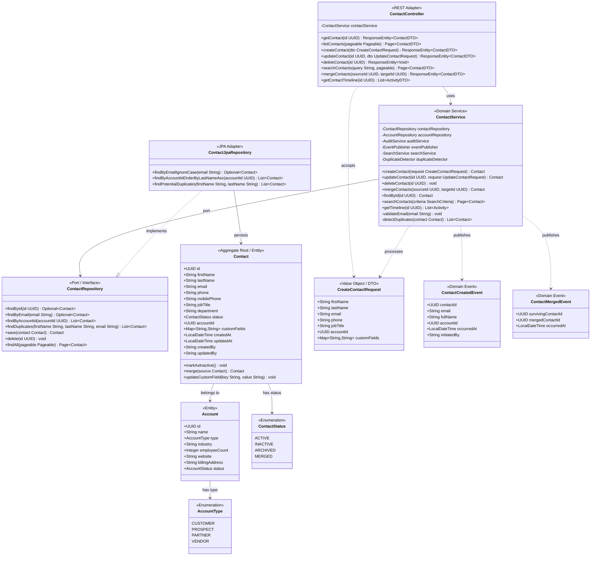

### 5.4 Package Structure Convention

```
com.crmapp/
├── contact/                        # Contact & Account bounded context
│   ├── api/                        # REST controllers, request/response DTOs
│   ├── application/                # Application services, use cases
│   ├── domain/                     # Entities, value objects, domain events, ports
│   └── infrastructure/             # JPA repositories, external adapters
├── lead/                           # Lead management bounded context
│   ├── api/
│   ├── application/
│   ├── domain/
│   └── infrastructure/
├── opportunity/                    # Opportunity & pipeline bounded context
├── activity/                       # Activity & timeline bounded context
├── campaign/                       # Campaign & marketing bounded context
├── support/                        # Support cases & SLA bounded context
├── shared/                         # Shared kernel
│   ├── audit/                      # Audit logging infrastructure
│   ├── security/                   # Spring Security config, JWT validation
│   ├── search/                     # Elasticsearch client configuration
│   ├── notification/               # Notification dispatcher
│   ├── workflow/                   # Workflow/automation engine
│   ├── gdpr/                       # GDPR consent & erasure
│   └── config/                     # Global configuration beans
└── CrmAppApplication.java          # Spring Boot entry point
```

---

## 6. Runtime View

This section describes the most important runtime scenarios — how the system's building blocks interact at runtime to fulfil key business use cases.

### 6.1 Scenario: User Authentication via SSO (OAuth2 / OIDC)

```mermaid
sequenceDiagram
    autonumber
    actor User as 👤 User
    participant Browser as 🌐 Web Browser
    participant GW as 🔀 API Gateway
    participant Auth as 🔐 Auth Service
    participant IdP as 🏢 Identity Provider
    participant Core as ⚙️ CRM Core
    participant Redis as ⚡ Redis Cache

    User->>Browser: Navigate to CRMApp URL
    Browser->>GW: GET /app (no valid session)
    GW->>Auth: Check session token (absent)
    Auth-->>GW: No valid session found
    GW-->>Browser: 302 Redirect → /oauth2/authorize
    Browser->>IdP: OAuth2 Authorization Request\n(client_id, scope, state, PKCE code_challenge)
    IdP-->>Browser: Render login page
    User->>IdP: Submit credentials (+ MFA if required)
    IdP-->>Browser: Authorization code + state parameter
    Browser->>Auth: POST /oauth2/callback?code=AUTH_CODE&state=...
    Auth->>IdP: Exchange code for tokens\n(authorization_code grant + PKCE verifier)
    IdP-->>Auth: access_token + id_token + refresh_token (JWT)
    Auth->>Auth: Validate id_token signature (JWKS)\nExtract user claims (email, roles)
    Auth->>Core: GET /internal/users?email=user@example.com
    Core-->>Auth: User profile + assigned RBAC roles
    Auth->>Redis: SETEX session:{sessionId} → {userId, roles, exp} TTL=30min
    Auth-->>Browser: Set-Cookie: SESSION=sessionId (HttpOnly; Secure; SameSite=Lax)
    Browser->>GW: GET /api/v1/dashboard (with SESSION cookie)
    GW->>Auth: Validate session cookie
    Auth->>Redis: GET session:{sessionId}
    Redis-->>Auth: {userId, roles} — valid
    Auth-->>GW: ✅ Authenticated {userId, roles}
    GW-->>Browser: 200 OK — CRM Application Shell
```

### 6.2 Scenario: Create a New Contact

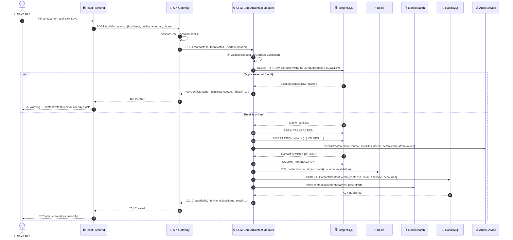

### 6.3 Scenario: Lead Lifecycle — Capture to Opportunity Conversion

```mermaid
flowchart TD
    classDef start fill:#27AE60,stroke:#1A7A42,color:#fff,rx:20
    classDef process fill:#2980B9,stroke:#1A5C8A,color:#fff,rx:4
    classDef decision fill:#F39C12,stroke:#B7770D,color:#fff,rx:4
    classDef endpoint fill:#E74C3C,stroke:#A93226,color:#fff,rx:20
    classDef external fill:#8E44AD,stroke:#6C3483,color:#fff,rx:4

    A(["📥 Lead Captured\n(Web Form / API / Import)"]):::start
    B["Assign Lead Source\n& UTM Attribution"]:::process
    C["Auto-Score Lead\n(Behaviour + Profile + Firmographics)"]:::process
    D{Score ≥ Threshold?\n(e.g. ≥ 60/100)}:::decision
    E["Enrol in Nurture Campaign\n← Marketing Automation"]:::external
    F["Increment Score on\nEngagement Events"]:::process
    G["Assign to Sales Rep\n(Round-robin / Territory)"]:::process
    H["Sales Rep Reviews Lead\nin CRMApp"]:::process
    I{Qualify Lead?\nBANT / MEDDIC Check}:::decision
    J["Mark Lead: DISQUALIFIED\nLog reason + feedback"]:::endpoint
    K["Convert Lead\n→ Opportunity"]:::process
    L["Create / Link\nContact & Account Records"]:::process
    M["Set Pipeline Stage:\nPROSPECTING"]:::process
    N["Assign Deal Owner\n& Estimated Deal Value"]:::process
    O["Schedule Discovery Call\n← Activity Module"]:::process
    P(["💼 Opportunity Active\nin Sales Pipeline"]):::start

    A --> B --> C --> D
    D -->|"No — nurture"| E --> F --> D
    D -->|"Yes — hand to sales"| G --> H --> I
    I -->|"No"| J
    I -->|"Yes"| K --> L --> M --> N --> O --> P
```

### 6.4 Scenario: Opportunity Won — Automated Workflow Fanout

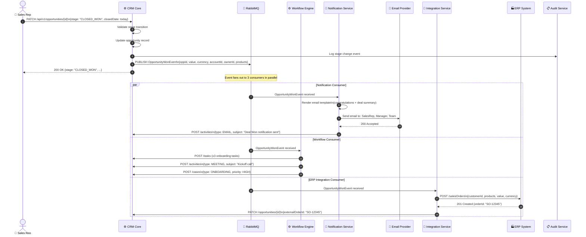

### 6.5 Scenario: GDPR Right-to-Erasure Request

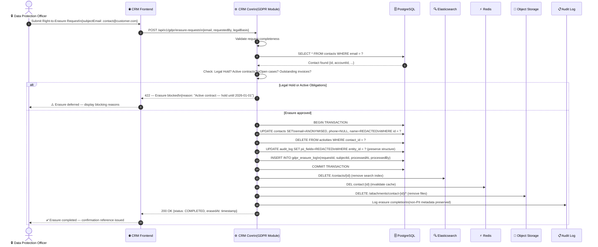

---

## 7. Deployment View

### 7.1 Production Infrastructure Topology

CRMApp is deployed on a cloud-native infrastructure using Kubernetes, with a primary region for active traffic and a secondary region for disaster recovery.

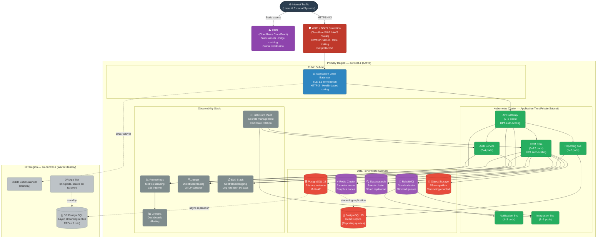

### 7.2 Kubernetes Resource Sizing

| Component | Min Pods | Max Pods | CPU Request/Limit | RAM Request/Limit | HPA Metric |
|-----------|---------|---------|------------------|------------------|------------|
| API Gateway | 2 | 8 | 0.25 / 1.0 | 256Mi / 1Gi | CPU > 60% |
| CRM Core | 3 | 12 | 0.5 / 2.0 | 512Mi / 2Gi | CPU > 70% |
| Auth Service | 2 | 4 | 0.25 / 0.5 | 256Mi / 512Mi | CPU > 60% |
| Notification Service | 1 | 4 | 0.1 / 0.5 | 128Mi / 512Mi | Queue depth > 1000 |
| Integration Service | 1 | 4 | 0.25 / 1.0 | 256Mi / 1Gi | Queue depth > 500 |
| Reporting Service | 1 | 3 | 0.5 / 2.0 | 512Mi / 2Gi | CPU > 80% |

### 7.3 CI/CD Pipeline

```mermaid
flowchart LR
    classDef trigger fill:#2C3E50,stroke:#1A252F,color:#fff,rx:6
    classDef step fill:#2980B9,stroke:#1A5276,color:#fff,rx:6
    classDef gate fill:#E74C3C,stroke:#922B21,color:#fff,rx:6
    classDef artifact fill:#F39C12,stroke:#9A7D0A,color:#fff,rx:6
    classDef deploy fill:#27AE60,stroke:#1A7A42,color:#fff,rx:6

    Push["📝 Code Push\nor PR Merge\n(GitHub)"]:::trigger

    subgraph "Build & Validate"
        SA["🔍 Static Analysis\n(Checkstyle +\nSpotBugs + SonarQube)"]:::step
        UT["🧪 Unit Tests\n(JUnit 5 + Mockito\n≥ 80% coverage)"]:::step
        IT["🔗 Integration Tests\n(Testcontainers\nPostgreSQL + Redis)"]:::step
        QG{Quality\nGate}:::gate
    end

    subgraph "Package & Scan"
        Build["🐳 Docker Build\n(multi-stage)"]:::artifact
        Scan["🔐 Image Security Scan\n(Trivy — no CRITICAL CVEs)"]:::artifact
        Push2Reg["📦 Push to Registry\n(GHCR / ECR)"]:::artifact
    end

    subgraph "Deploy & Test"
        DevDeploy["🚀 Deploy to Dev\n(Kubernetes)"]:::deploy
        E2E["🧪 E2E Tests\n(Playwright)"]:::step
        QAGate{QA\nApproval}:::gate
        StagDeploy["🚀 Deploy to Staging\n(Blue/Green)"]:::deploy
        PerfTest["📊 Performance Tests\n(k6 — P95 ≤ 500ms)"]:::step
        RelGate{Release\nApproval}:::gate
    end

    subgraph "Production"
        ProdDeploy["🚀 Deploy to Prod\n(Blue/Green)"]:::deploy
        Monitor["📈 Monitor 15 min\n(Error rate, latency)"]:::step
        HealthGate{Health\nCheck}:::gate
        Done["✅ Release\nComplete"]:::deploy
        Rollback["🔄 Auto-Rollback\n(Previous image)"]:::deploy
    end

    Push --> SA & UT
    UT --> IT
    SA & IT --> QG
    QG -->|Fail| Push
    QG -->|Pass| Build --> Scan --> Push2Reg
    Push2Reg --> DevDeploy --> E2E --> QAGate
    QAGate -->|Fail| Push
    QAGate -->|Pass| StagDeploy --> PerfTest --> RelGate
    RelGate -->|Fail| Push
    RelGate -->|Pass| ProdDeploy --> Monitor --> HealthGate
    HealthGate -->|Healthy| Done
    HealthGate -->|Unhealthy| Rollback
```

### 7.4 Environments Summary

| Environment | Purpose | Deployment | Data | Access |
|------------|---------|------------|------|--------|
| **Local Dev** | Developer workstation | Docker Compose | Seeded test data | Developer only |
| **Dev** | Integration testing | Kubernetes (auto-deploy on merge to `develop`) | Reset nightly | Dev team |
| **Staging** | Pre-production validation | Kubernetes (manual promote from dev) | Anonymised prod snapshot | Dev + QA + PO |
| **Production** | Live system | Kubernetes (manual promote + approval gate) | Live customer data | Ops + monitored access |
| **DR (Standby)** | Business continuity | Kubernetes (activated on failover) | Replicated from Prod | Ops only |

---

## 8. Cross-cutting Concepts

Cross-cutting concepts are architectural concerns that affect multiple components and building blocks throughout the entire system.

### 8.1 Domain Data Model

The core entity-relationship model defines how CRMApp data entities relate to each other:

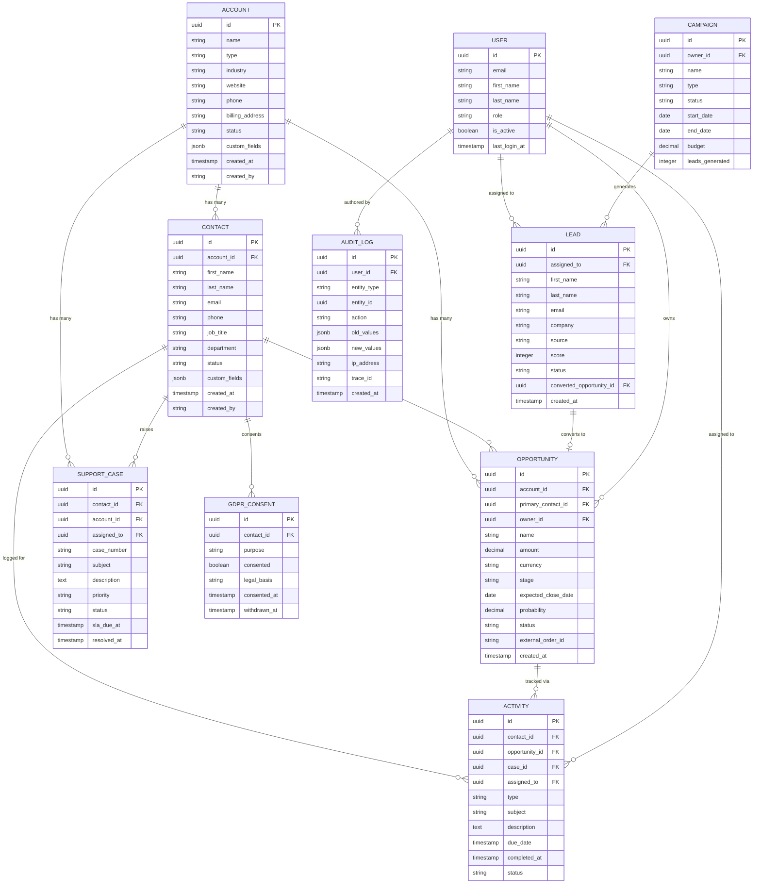

### 8.2 Security Architecture

Security is implemented across multiple concentric layers following a **defense-in-depth** strategy:

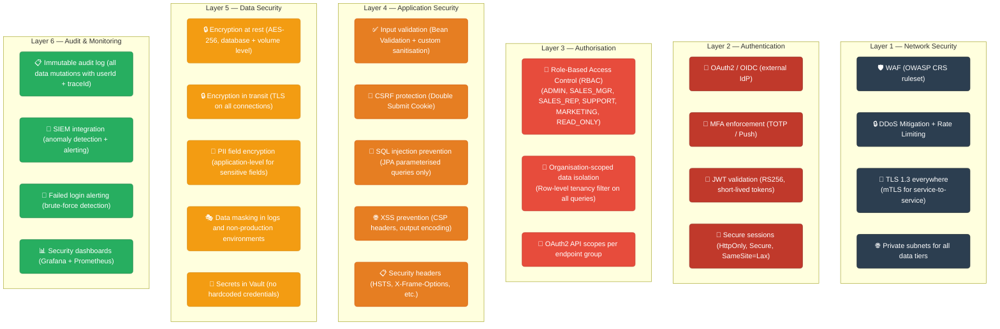

### 8.3 Observability Strategy

| Pillar | Toolchain | What is Captured | Retention |
|--------|----------|-----------------|-----------|
| **Metrics** | Micrometer → Prometheus → Grafana | JVM metrics, HTTP latency/errors, DB pool stats, business KPIs (deals created, emails sent) | 90 days |
| **Distributed Tracing** | OpenTelemetry → Jaeger | End-to-end request traces across all services; slow query detection | 30 days |
| **Structured Logging** | SLF4J + Logback → ELK Stack | All application events in JSON; correlated by `traceId` and `spanId` | 90 days |
| **Health Checks** | Spring Boot Actuator | Liveness (`/actuator/health/liveness`), Readiness (`/actuator/health/readiness`) | Real-time |
| **Alerting** | Alertmanager → PagerDuty | Error rate > 1%, P95 latency > 1s, DB connectivity loss, pod crash-loops | Real-time |
| **Uptime Monitoring** | External synthetic monitor | End-to-end login + contact creation every 5 minutes from external probes | 1 year |

### 8.4 Error Handling

All API errors follow the **RFC 7807 Problem Details** standard for consistent client handling:

```json
{
  "type": "https://api.crmapp.example.com/problems/contact-not-found",
  "title": "Contact Not Found",
  "status": 404,
  "detail": "No contact with ID '3fa85f64-5717-4562-b3fc-2c963f66afa6' was found.",
  "instance": "/api/v1/contacts/3fa85f64-5717-4562-b3fc-2c963f66afa6",
  "timestamp": "2025-01-01T10:00:00.000Z",
  "traceId": "4bf92f3577b34da6a3ce929d0e0e4736"
}
```

**HTTP Status Code Policy:**

| Scenario | Status Code |
|---------|------------|
| Successful creation | `201 Created` with `Location` header |
| Successful update / retrieval | `200 OK` |
| No content (delete) | `204 No Content` |
| Validation failure | `400 Bad Request` |
| Unauthenticated | `401 Unauthorized` |
| Authorisation failure | `403 Forbidden` |
| Resource not found | `404 Not Found` |
| Business conflict (duplicate) | `409 Conflict` |
| Unprocessable entity (business rule) | `422 Unprocessable Entity` |
| Server error | `500 Internal Server Error` |
| External dependency unavailable | `503 Service Unavailable` |

### 8.5 Caching Strategy

| Cache Level | Store | TTL | Eviction Strategy | Use Case |
|------------|-------|-----|------------------|----------|
| HTTP Cache | CDN / Browser | 1 hour — 7 days | `Cache-Control` headers | Static assets, public reference data |
| Session Cache | Redis | 30 min (sliding) | Explicit logout or expiry | User sessions, CSRF tokens |
| Entity Cache | Redis | 5 minutes | Write-through on mutation | Individual contact/account reads |
| List / Search Cache | Redis | 60 seconds | TTL-based expiry | Search results, list view pages |
| Aggregation Cache | Redis | 15 minutes | Event-driven invalidation | Dashboard KPIs, report summaries |
| DB Query Cache | Redis | 2 minutes | TTL-based | Expensive reporting queries |

### 8.6 Data Consistency Model

| Context | Consistency Model | Justification |
|---------|-----------------|---------------|
| Contact / Account CRUD | **Strong consistency** (ACID) | Data integrity; no stale reads acceptable |
| Search index synchronisation | **Eventual consistency** | Elasticsearch indexed asynchronously; acceptable 1–5 second lag |
| Cache and DB synchronisation | **Cache-aside + write-through** | Cache invalidated on every write; read-through for cache population |
| Cross-module event propagation | **Eventual consistency** | Domain events via RabbitMQ; consumers are idempotent |
| External system sync (ERP) | **Eventually consistent** | Integration events are retried on failure with exponential backoff |

### 8.7 Internationalisation (i18n)

- All user-facing text is externalised in property files (Spring MessageSource)
- Date/time stored in UTC; displayed in user's local timezone (from user profile)
- Currency values stored as minor units (integers) with explicit currency code
- API responses use ISO 8601 date formats and ISO 4217 currency codes

---

## 9. Architecture Decisions

Architecture decisions are documented using **Architecture Decision Records (ADRs)**. Each significant decision captures its context, the decision made, and the resulting consequences.

---

### ADR-001: Java 17 with Spring Boot 3.x as the Core Technology Stack

| Field | Value |
|-------|-------|
| **Status** | ✅ Accepted |
| **Date** | 2025-01-01 |
| **Deciders** | Architecture Team, Tech Lead |

**Context**  
The team needed to select a backend language and framework for the CRMApp platform. Requirements included strong typing, enterprise security support, long-term community/vendor support, and team familiarity.

**Decision**  
Use **Java 17 (LTS)** as the primary backend language with **Spring Boot 3.x** as the application framework.

**Consequences**

| Type | Detail |
|------|--------|
| ✅ Positive | Strong typing reduces runtime errors; compiled language with excellent IDE tooling |
| ✅ Positive | Spring Security provides comprehensive OAuth2/OIDC support out of the box |
| ✅ Positive | Spring Data JPA reduces data access boilerplate significantly |
| ✅ Positive | Java 17 LTS: Oracle/OpenJDK support until September 2029 |
| ✅ Positive | Massive ecosystem: libraries for everything CRM-related available |
| ⚠️ Trade-off | Spring Boot 3.x requires Jakarta EE namespace (breaking from 2.x) |
| ⚠️ Trade-off | JVM warm-up time adds to pod startup latency (~5–10 seconds) |
| 💡 Mitigation | Consider GraalVM native compilation for latency-critical services in future |

---

### ADR-002: Modular Monolith Architecture with Microservices Migration Path

| Field | Value |
|-------|-------|
| **Status** | ✅ Accepted |
| **Date** | 2025-01-01 |
| **Deciders** | Architecture Team |

**Context**  
The project is in an early stage (`HelloWorld.java` bootstrap). Microservices architecture offers scalability but introduces significant operational complexity. The team is small and the domain is not yet fully understood.

**Decision**  
Start with a **Modular Monolith** with clearly bounded domain modules (enforced via package structure and internal interfaces). Extract to independent microservices when a module demonstrably needs independent scaling or deployment cadence.

**Planned extraction order:**
1. `NotificationService` (high-volume, different SLA)
2. `IntegrationService` (external dependency isolation)
3. `ReportingService` (resource-intensive, read-heavy)
4. Domain services as needed

**Consequences**

| Type | Detail |
|------|--------|
| ✅ Positive | Single deployable unit; no distributed systems complexity during development |
| ✅ Positive | Faster initial development; easier debugging (no network hops) |
| ✅ Positive | Domain boundaries enforced via package discipline and interface contracts |
| ✅ Positive | Easy transition: modules are designed to be extracted into services |
| ⚠️ Trade-off | Risk of module coupling if not actively enforced via architecture linting (ArchUnit) |
| ⚠️ Trade-off | All modules scale together initially — cannot scale independently |
| 💡 Mitigation | Use ArchUnit in CI pipeline to enforce no cross-module direct calls |

---

### ADR-003: PostgreSQL 15 as Primary Database with JSONB for Custom Fields

| Field | Value |
|-------|-------|
| **Status** | ✅ Accepted |
| **Date** | 2025-01-01 |
| **Deciders** | Architecture Team, Backend Lead |

**Context**  
CRM data has both strongly-typed core entities (contacts, opportunities) and highly variable custom fields (user-defined attributes per account). A pure relational model would require EAV (Entity-Attribute-Value) tables or schema changes per customisation.

**Decision**  
Use **PostgreSQL 15** as the primary data store. Core entity fields are normalised relational columns. Custom fields use **JSONB columns** with GIN indexes for query performance.

**Consequences**

| Type | Detail |
|------|--------|
| ✅ Positive | ACID guarantees for all CRM transactions |
| ✅ Positive | JSONB: schema flexibility without sacrificing query capability |
| ✅ Positive | Row-level security for multi-tenancy data isolation |
| ✅ Positive | Mature replication, backup (pg_dump, WAL archiving), and monitoring |
| ✅ Positive | Open source; no licensing costs |
| ⚠️ Trade-off | JSONB queries on large datasets slower than normalised columns |
| ⚠️ Trade-off | High-write tables (`audit_log`, `activities`) will need partitioning |
| 💡 Mitigation | Index critical JSONB paths; partition `audit_log` by month; use read replica for reports |

---

### ADR-004: Event-Driven Architecture for Cross-Domain Communication

| Field | Value |
|-------|-------|
| **Status** | ✅ Accepted |
| **Date** | 2025-01-01 |
| **Deciders** | Architecture Team |

**Context**  
CRM workflows naturally span multiple domains (Lead captured → Opportunity created → Support case opened → ERP order raised). Synchronous service calls create tight coupling and cascading failure risk.

**Decision**  
All cross-domain side effects are communicated via **Domain Events** published to RabbitMQ. No domain module makes direct synchronous calls to another domain's service layer.

**Event naming convention:** `{Entity}{PastTenseVerb}Event`  
**Examples:** `ContactCreatedEvent`, `OpportunityWonEvent`, `CaseSLABreachedEvent`

**Consequences**

| Type | Detail |
|------|--------|
| ✅ Positive | Loose coupling — modules evolve independently |
| ✅ Positive | Natural extension point for adding new consumers without modifying publishers |
| ✅ Positive | Enables event replay for debugging and audit |
| ✅ Positive | Resilient — RabbitMQ buffers events if consumer is temporarily unavailable |
| ⚠️ Trade-off | Eventual consistency — UIs must handle asynchronous state updates |
| ⚠️ Trade-off | Dead-letter queues required; idempotent consumers mandatory |
| ⚠️ Trade-off | Event schema versioning needed from day one |
| 💡 Mitigation | Use CloudEvents spec for event envelope; Avro or JSON Schema for payload validation |

---

### ADR-005: OAuth2 / OIDC with Delegated Identity Provider

| Field | Value |
|-------|-------|
| **Status** | ✅ Accepted |
| **Date** | 2025-01-01 |
| **Deciders** | Architecture Team, Security Lead |

**Context**  
Enterprise customers require SSO integration. Building identity management (password hashing, MFA, account lockout, session management) in-house is complex, time-consuming, and high-risk.

**Decision**  
Delegate all authentication to an external **Identity Provider** (Okta or Azure AD for SaaS customers; Keycloak self-hosted for on-premise deployments). CRMApp acts as an **OAuth2 Resource Server** — it never stores passwords.

**Consequences**

| Type | Detail |
|------|--------|
| ✅ Positive | No credential storage in CRMApp database (reduced breach impact) |
| ✅ Positive | MFA, password policies, account lockout managed by best-in-class IdP |
| ✅ Positive | Supports multiple enterprise IdP configurations per tenant |
| ✅ Positive | Single sign-on across the enterprise tool suite |
| ⚠️ Trade-off | Dependency on external IdP for authentication availability |
| ⚠️ Trade-off | Keycloak self-hosted adds operational overhead |
| 💡 Mitigation | Implement local session caching (Redis) so short IdP outages are transparent to users |

---

### ADR-006: Flyway for Database Schema Version Management

| Field | Value |
|-------|-------|
| **Status** | ✅ Accepted |
| **Date** | 2025-01-01 |

**Context**  
Database schemas must evolve alongside application code without manual DBA intervention, data loss, or downtime.

**Decision**  
Use **Flyway** for all database schema migrations. Migrations are versioned SQL scripts (`V{version}__{description}.sql`) stored in `src/main/resources/db/migration/`. Applied automatically at application startup.

**Migration discipline**: All schema changes must be **backward-compatible** for at least one release (expand/contract pattern) to support zero-downtime deployments.

**Consequences**

| Type | Detail |
|------|--------|
| ✅ Positive | Schema changes version-controlled alongside code — full traceability |
| ✅ Positive | Automated migration during CI/CD reduces human error |
| ✅ Positive | Flyway `repair` command handles failed migration recovery |
| ⚠️ Trade-off | Long-running migrations must be carefully planned (no table locks on large tables) |
| 💡 Mitigation | Use online schema change tools (pg_repack) for large table migrations |

---

### ADR-007: Hexagonal Architecture (Ports & Adapters) per Domain Module

| Field | Value |
|-------|-------|
| **Status** | ✅ Accepted |
| **Date** | 2025-01-01 |

**Context**  
Domain logic should be independently testable without requiring a running database, message broker, or HTTP server. Classic layered architecture often leads to domain logic depending on infrastructure concerns.

**Decision**  
Each domain module is structured using **Hexagonal Architecture** (Ports & Adapters):
- **Domain core**: Entities, value objects, domain events, domain services (no framework dependencies)
- **Ports**: Java interfaces defining what the domain needs (repositories, event publishers)
- **Adapters**: Spring-managed implementations (JPA repositories, AMQP publishers, REST controllers)

**Consequences**

| Type | Detail |
|------|--------|
| ✅ Positive | Domain logic testable with simple unit tests (no Spring context required) |
| ✅ Positive | Infrastructure concerns can be swapped without domain changes |
| ✅ Positive | Clear boundary between business logic and technical plumbing |
| ⚠️ Trade-off | More files/classes per feature (controller + service + repository interface + JPA impl) |
| 💡 Mitigation | Scaffold templates and code generation to reduce boilerplate |

---

## 10. Quality Requirements

### 10.1 Quality Tree

The following mindmap shows the complete quality attribute hierarchy for CRMApp, derived from the stakeholder and business goals:

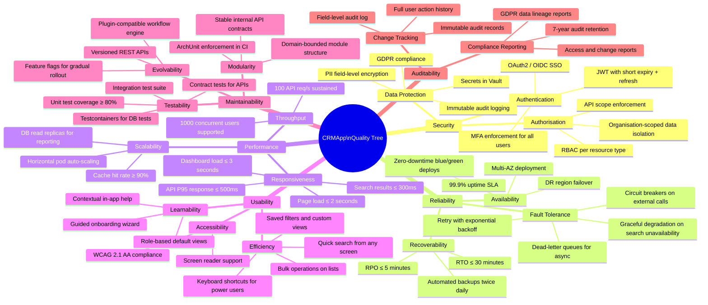

### 10.2 Quality Scenarios

Quality scenarios make quality requirements concrete and testable:

| ID | Quality Attribute | Scenario Source | Stimulus | Environment | Response | Measure |
|----|------------------|----------------|---------|------------|---------|---------|
| QS-01 | **Performance** | Sales Rep | User types 3+ characters in search box | Normal load | Contact search results displayed | P95 ≤ 300 ms |
| QS-02 | **Performance** | Sales Manager | User navigates to pipeline dashboard | Normal load | Dashboard with charts fully rendered | P95 ≤ 3 s |
| QS-03 | **Performance** | System | Black Friday — 10× normal traffic spike | Peak load (1000 CCU) | System handles all requests; no 5xx errors | Auto-scale within 2 min; error rate < 0.1% |
| QS-04 | **Availability** | Infrastructure | A Kubernetes pod crashes | Production | System auto-heals | New pod ready in ≤ 30 s; 0 user-visible errors |
| QS-05 | **Availability** | Ops Team | Deploy new application version | Production | Zero downtime deployment | 100% uptime via blue/green; 0 errors during switch |
| QS-06 | **Availability** | Infrastructure | Primary DB node fails | Production | Automatic failover to standby | Recovery in ≤ 30 s; RPO ≤ 5 min |
| QS-07 | **Security** | Attacker | Attempt to access another tenant's contact data | Production | Request rejected; security alert fired | 0 unauthorised data leaks; alert within 60 s |
| QS-08 | **Security** | Attacker | 10+ consecutive failed login attempts | Production | Account temporary lockout + admin alert | Lockout after 5 failures; admin notified in ≤ 60 s |
| QS-09 | **Security** | Security Team | Annual penetration test | Staging | No Critical or High findings in OWASP Top 10 | 0 Critical, 0 High CVEs in pentest report |
| QS-10 | **GDPR** | Data Subject | Submit right-to-erasure request | Production | All PII erased/anonymised across system | Completed within 24 hours (legal max: 30 days) |
| QS-11 | **Auditability** | Compliance Auditor | Request change history for a contact record | Production | Full field-level audit trail exported | All changes available for 7 years; export in ≤ 30 s |
| QS-12 | **Maintainability** | New Developer | Onboard and make first production-ready commit | Development | Developer productive without 1-on-1 mentoring | Setup time ≤ 1 day; PR submitted in ≤ 3 days |
| QS-13 | **Usability** | Sales Rep | Create a new contact from a business card scan | Production | Contact created with all fields populated | Task completion in ≤ 60 seconds |
| QS-14 | **Scalability** | Product Owner | Grow customer base from 1,000 to 50,000 contacts | Production | Performance characteristics unchanged | No architecture changes required; metrics within bounds |

### 10.3 Testing Strategy

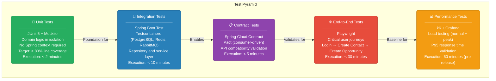

| Test Level | Tool | Coverage Target | Run Frequency |
|-----------|------|----------------|---------------|
| Unit | JUnit 5 + Mockito | ≥ 80% line coverage | Every commit |
| Integration | Testcontainers + Spring Boot Test | All repository & service interactions | Every commit |
| Contract | Spring Cloud Contract / Pact | All public API endpoints | Every PR |
| End-to-End | Playwright | 10 critical user journeys | Post-deploy to Dev |
| Performance | k6 | P95 ≤ 500 ms at 1000 CCU | Pre-release to staging |
| Security | OWASP ZAP + Trivy | OWASP Top 10 + CVE scan | Weekly + on release |

---

## 11. Risks and Technical Debt

### 11.1 Risk Matrix

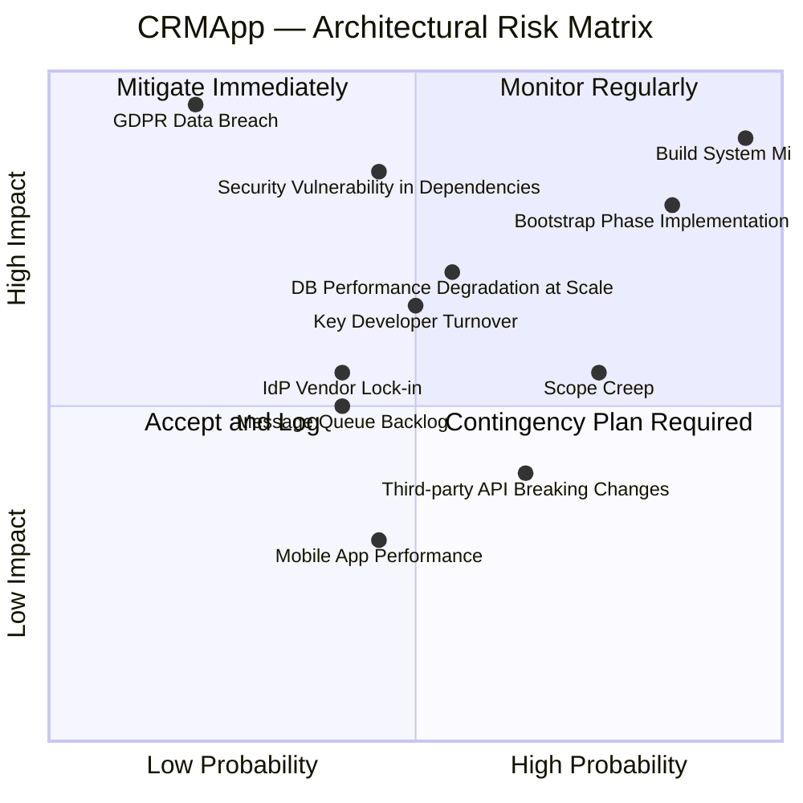

### 11.2 Risk Register

| ID | Risk Title | Probability | Impact | Severity | Owner | Mitigation Strategy |
|----|-----------|-------------|--------|---------|-------|---------------------|
| **R-01** | **Build system & application framework missing** — repository has no Maven/Gradle, no Spring Boot setup | 🔴 Critical | 🔴 Critical | **CRITICAL** | Tech Lead | Sprint 1 top priority: add build system, Spring Boot parent, module structure |
| **R-02** | **GDPR data breach** — PII exposed due to security vulnerability or misconfiguration | 🟡 Low | 🔴 Critical | **HIGH** | Security Lead | Field-level PII encryption; regular pentests; SIEM monitoring; incident response playbook |
| **R-03** | **Security vulnerability in dependencies** — known CVE in third-party library | 🟠 Medium | 🔴 High | **HIGH** | DevOps | Dependabot + Trivy in CI; monthly security reviews; automated CVE alerts |
| **R-04** | **Database performance degradation** — slow queries as data volume grows | 🟠 Medium | 🟠 High | **HIGH** | Backend Lead | Indexing strategy; partition `audit_log` early; read replicas; query analysis with EXPLAIN |
| **R-05** | **Key developer turnover** — critical architectural knowledge lost | 🟠 Medium | 🟠 Medium-High | **MEDIUM** | Engineering Mgr | ADRs and this architecture document; code review culture; pair programming; shared ownership |
| **R-06** | **IdP vendor lock-in** — pricing changes or IdP API deprecations | 🟡 Low-Medium | 🟠 Medium | **MEDIUM** | Architect | Abstract behind standard OIDC; evaluate Keycloak self-hosted fallback option |
| **R-07** | **Scope creep** — uncontrolled feature additions bloating the codebase | 🔴 High | 🟠 Medium | **MEDIUM** | Product Owner | Strict backlog governance; architectural review gate for major features |
| **R-08** | **Third-party API breaking changes** — ERP/email/calendar integration APIs change | 🟠 Medium-High | 🟡 Low-Medium | **LOW-MEDIUM** | Integration Lead | Versioned adapter pattern; contract tests against mocks; API change monitoring |
| **R-09** | **Message queue backlog buildup** — consumer lag during traffic spikes | 🟡 Low-Medium | 🟡 Medium | **LOW** | DevOps | Dead-letter queues; consumer auto-scaling; Kafka migration path if RabbitMQ insufficient |
| **R-10** | **Module coupling drift** — domain modules becoming tightly coupled over time | 🟠 Medium | 🟠 Medium | **MEDIUM** | Architect | ArchUnit rules in CI pipeline; regular architecture reviews; module interface audits |

### 11.3 Technical Debt Inventory

Technical debt identified at repository assessment (current state: bootstrap phase):

| ID | Category | Description | Severity | Sprint Target | Effort |
|----|----------|-------------|---------|--------------|--------|
| **TD-01** | 🏗️ Foundation | No build system — `pom.xml` or `build.gradle` missing | 🔴 Critical | Sprint 1 | 0.5 days |
| **TD-02** | 🏗️ Foundation | `HelloWorld.java` in root — no domain package structure | 🔴 Critical | Sprint 1 | 1 day |
| **TD-03** | 🏗️ Foundation | No Spring Boot application setup (`@SpringBootApplication`, `application.yml`) | 🔴 Critical | Sprint 1 | 1 day |
| **TD-04** | 🔐 Security | No authentication or Spring Security configuration | 🔴 Critical | Sprint 2 | 3 days |
| **TD-05** | 🗄️ Data | No database schema, no Flyway migration scripts | 🔴 Critical | Sprint 2 | 3 days |
| **TD-06** | 🌐 API | No REST controllers, no OpenAPI specification | 🔴 Critical | Sprint 3 | 5 days |
| **TD-07** | 🐳 Infrastructure | No `Dockerfile` or `docker-compose.yml` | 🟠 High | Sprint 1 | 1 day |
| **TD-08** | 🧪 Testing | No test classes — no `src/test/java` directory | 🟠 High | Sprint 1–2 | Ongoing |
| **TD-09** | ⚙️ CI/CD | GitHub Actions workflows not yet implemented | 🟠 High | Sprint 2 | 2 days |
| **TD-10** | 📊 Observability | No Spring Boot Actuator, no health endpoints, no metrics | 🟠 High | Sprint 2 | 1 day |
| **TD-11** | 📋 Documentation | No Javadoc on any classes (only `HelloWorld.java` exists) | 🟡 Medium | Ongoing | Ongoing |
| **TD-12** | 🔑 Secrets | No Vault or environment variable convention documented | 🟡 Medium | Sprint 2 | 0.5 days |

### 11.4 Recommended Implementation Roadmap

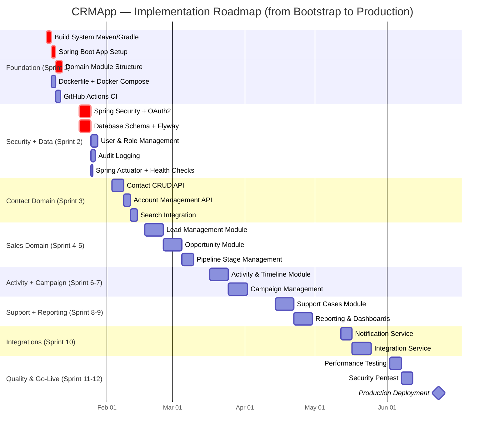

---

## 12. Glossary

### 12.1 Business Domain Terms

| Term | Definition |
|------|-----------|
| **Account** | An organisation or company entity — customer, prospect, or partner. An Account contains one or more Contacts and may be linked to Opportunities and Support Cases. |
| **Activity** | A customer interaction or task logged in CRMApp — includes calls, emails, meetings, notes, and tasks. Activities are attached to Contacts, Opportunities, or Cases and form the customer timeline. |
| **BANT** | Budget, Authority, Need, Timeline — a lead qualification framework used by sales teams to assess whether a Lead is worth pursuing. |
| **Campaign** | A coordinated marketing effort targeting a defined audience segment with the goal of generating Leads, nurturing existing contacts, or driving specific customer actions. |
| **Case** | A support ticket or customer service request raised by a Contact or Account. Cases are prioritised, assigned, tracked against SLAs, and resolved by support agents. |
| **Churn** | The rate at which customers stop doing business with the organisation. CRMApp supports churn analysis through account health tracking and renewal opportunity pipelines. |
| **Contact** | An individual person associated with an Account. Contains personal details (name, email, phone), professional details (job title, department), and interaction history. |
| **CRM** | Customer Relationship Management — both a business strategy and software system for managing all interactions and relationships with current and potential customers. |
| **Deal** | Informal synonym for **Opportunity**. Represents a potential sale tracked through the sales pipeline. |
| **Forecasting** | The process of predicting future sales revenue based on Opportunities in the pipeline, their stages, values, and close probabilities. |
| **Lead** | An individual or company that has shown interest in a product or service but has not yet been qualified. Leads are scored, nurtured, and converted to Opportunities when qualified. |
| **Lead Score** | A numerical value (0–100) assigned to a Lead based on behavioural signals (email opens, web visits) and profile fit (company size, industry, job title) to prioritise sales follow-up. |
| **MEDDIC** | Metrics, Economic Buyer, Decision Criteria, Decision Process, Identify Pain, Champion — an enterprise sales qualification framework for complex B2B deals. |
| **Opportunity** | A qualified potential sale being actively pursued by a sales representative. An Opportunity tracks the deal name, value, stage, expected close date, and probability of winning. |
| **Pipeline** | The set of all active Opportunities, organised by sales stage (Prospecting → Qualification → Proposal → Negotiation → Closed Won / Closed Lost), used for sales management and forecasting. |
| **SLA** | Service Level Agreement — a contractual commitment to respond to or resolve a Support Case within a defined time frame (e.g., Critical cases: 1-hour response, 4-hour resolution). |
| **Tenant** | In a multi-organisation CRM deployment, a Tenant is an organisation with its own isolated data partition, user base, and configuration. |
| **Workflow** | An automated sequence of actions triggered by a CRM event (e.g., "when a deal is marked Won, create 3 onboarding tasks and notify the account manager"). |

### 12.2 Technical Architecture Terms

| Term | Definition |
|------|-----------|
| **Adapter (Hexagonal)** | A technology-specific implementation of a Port. For example, a JPA repository adapter implements the domain's `ContactRepository` port using Spring Data JPA and PostgreSQL. |
| **ADR** | Architecture Decision Record — a structured document capturing a significant architectural decision, its context, the options considered, the decision made, and the resulting consequences. |
| **AMQP** | Advanced Message Queuing Protocol — the open standard messaging protocol used by RabbitMQ for asynchronous event delivery between services. |
| **Bounded Context** | A DDD concept defining an explicit boundary within which a particular domain model applies. CRMApp has bounded contexts for Contact, Lead, Opportunity, Campaign, and Support domains. |
| **Circuit Breaker** | A resilience pattern that stops calling a failing downstream service after a threshold of failures, allowing it to recover rather than cascading failures to all callers. |
| **DDD** | Domain-Driven Design — a software development approach that models software structure around the business domain, using entities, value objects, aggregates, domain events, and bounded contexts. |
| **Domain Event** | An immutable record of something significant that happened in the domain (e.g., `ContactCreatedEvent`, `OpportunityWonEvent`). Published to notify other parts of the system. |
| **Expand/Contract Pattern** | A database migration strategy for zero-downtime deploys: first expand the schema to support both old and new code, then contract to remove old structures after code fully migrated. |
| **GDPR** | General Data Protection Regulation — EU/UK regulation (effective May 2018) governing the collection, processing, and storage of personal data. Non-compliance: fines up to €20M or 4% of global annual revenue. |
| **HPA** | Horizontal Pod Autoscaler — a Kubernetes controller that automatically scales pod replica count based on CPU utilisation or custom metrics (e.g., RabbitMQ queue depth). |
| **Idempotent Consumer** | A message consumer designed to produce the same outcome regardless of how many times the same message is processed — essential for safe event retry in at-least-once delivery systems. |
| **JWT** | JSON Web Token — a compact, URL-safe token format (RFC 7519) for securely transmitting claims. CRMApp uses RS256-signed JWTs for OAuth2 access and identity tokens. |
| **MFA** | Multi-Factor Authentication — requiring more than one verification method (e.g., password + TOTP) to authenticate. Reduces account takeover risk significantly. |
| **Modular Monolith** | An architecture style where all components are deployed as a single unit but internally organised into well-defined, loosely-coupled modules with explicit boundaries and interfaces. |
| **OIDC** | OpenID Connect — an identity authentication layer on top of OAuth 2.0 providing user authentication and standardised user profile (`id_token`) exchange. |
| **PII** | Personally Identifiable Information — data that can identify a specific individual (name, email, phone, IP address). Subject to GDPR protection requirements in CRMApp. |
| **Port (Hexagonal)** | A technology-agnostic interface defined by the domain that specifies what the domain needs (e.g., `ContactRepository`) without dictating the implementation technology. |
| **RBAC** | Role-Based Access Control — restricts system access based on roles. CRMApp roles: `ADMIN`, `SALES_MANAGER`, `SALES_REP`, `SUPPORT_AGENT`, `MARKETING_MANAGER`, `READ_ONLY`. |
| **RFC 7807** | "Problem Details for HTTP APIs" — IETF standard for a machine-readable error response format. All CRMApp API errors follow this standard. |
| **RPO** | Recovery Point Objective — maximum acceptable data loss measured in time. CRMApp target: RPO ≤ 5 minutes (via PostgreSQL WAL streaming replication). |
| **RTO** | Recovery Time Objective — maximum acceptable time to restore service after a failure. CRMApp target: RTO ≤ 30 minutes. |
| **SAR** | Subject Access Request — a GDPR Article 15 mechanism allowing individuals to request all personal data held about them. CRMApp provides a dedicated SAR workflow. |
| **Shared Kernel** | In DDD, a subset of the domain model shared explicitly between bounded contexts. In CRMApp: audit logging, notifications, user management, and GDPR form the shared kernel. |
| **SSO** | Single Sign-On — authentication allowing users to log in once to an Identity Provider and access multiple applications without re-entering credentials. |
| **Testcontainers** | A Java library providing throwaway Docker-based instances of PostgreSQL, Redis, RabbitMQ, and Elasticsearch for fast, reliable integration testing. |
| **WAF** | Web Application Firewall — filters and monitors HTTP traffic protecting CRMApp against OWASP Top 10 vulnerabilities including SQL injection, XSS, and CSRF attacks. |

---

## Document Metadata

| Field | Value |
|-------|-------|
| **Document Title** | CRMApp Architecture Documentation (Arc42) |
| **Version** | 1.0.0 |
| **Status** | Draft — Ready for Architecture Review |
| **Created** | 2025-01-01 |
| **Generated By** | `arc42-documentor` agent |
| **Repository** | `copilot-test-ktruchcz` |
| **Application** | CRMApp — Customer Relationship Management Platform |
| **Architecture Style** | Modular Monolith (DDD) with Hexagonal Architecture |
| **Primary Technology** | Java 17 · Spring Boot 3.x · PostgreSQL 15 · React |
| **Diagram Format** | All diagrams embedded as Mermaid code blocks |
| **Arc42 Version** | Arc42 Template v8.x |

### Embedded Mermaid Diagrams Summary

| # | Section | Diagram Description | Mermaid Type |
|---|---------|--------------------|----|
| 1 | §3.1 | Business Context — actors and external systems | `graph TB` |
| 2 | §3.2 | Technical Context — containers and protocols | `graph LR` |
| 3 | §4.2 | Solution Strategy — domain decomposition | `graph TB` |
| 4 | §5.1 | Level 1: System Container Diagram | `graph TB` |
| 5 | §5.2 | Level 2: CRM Core Domain Modules | `graph TB` |
| 6 | §5.3 | Level 3: Contact Module Class Diagram | `classDiagram` |
| 7 | §6.1 | Sequence: User Authentication via SSO | `sequenceDiagram` |
| 8 | §6.2 | Sequence: Create New Contact | `sequenceDiagram` |
| 9 | §6.3 | Lead Lifecycle Flowchart | `flowchart TD` |
| 10 | §6.4 | Sequence: Opportunity Won — Workflow Fanout | `sequenceDiagram` |
| 11 | §6.5 | Sequence: GDPR Right-to-Erasure Request | `sequenceDiagram` |
| 12 | §7.1 | Production Infrastructure Topology | `graph TB` |
| 13 | §7.3 | CI/CD Pipeline (Build → Test → Deploy) | `flowchart LR` |
| 14 | §8.1 | Domain Entity-Relationship Diagram | `erDiagram` |
| 15 | §8.2 | Security Architecture — Defense in Depth | `graph TB` |
| 16 | §10.1 | Quality Tree | `mindmap` |
| 17 | §10.3 | Testing Strategy Pyramid | `graph TB` |
| 18 | §11.1 | Risk Matrix (Probability × Impact Quadrant) | `quadrantChart` |
| 19 | §11.4 | Implementation Roadmap (Sprint Plan) | `gantt` |

**Total: 19 embedded Mermaid diagrams — document is fully self-contained.**

---

*© 2025 CRMApp Project. This Arc42 architecture documentation is intended for the development team and stakeholders.*  
*Generated by the **arc42-documentor** agent | Repository: `copilot-test-ktruchcz` | Application: **CRMApp***
