# Architecture Documentation (Arc42)

**Project**: copilot-test-ktruchcz  
**Version**: 1.0.0  
**Date**: 2025-07-14  
**Generated by**: Arc42 Documentation Generator  
**Language**: Java  
**Source Files Analyzed**: `HelloWorld.java`, `README.md`

---

## Table of Contents

1. [Introduction and Goals](#1-introduction-and-goals)
2. [Constraints](#2-constraints)
3. [Context and Scope](#3-context-and-scope)
4. [Solution Strategy](#4-solution-strategy)
5. [Building Block View](#5-building-block-view)
6. [Runtime View](#6-runtime-view)
7. [Deployment View](#7-deployment-view)
8. [Crosscutting Concepts](#8-crosscutting-concepts)
9. [Architecture Decisions](#9-architecture-decisions)
10. [Quality Requirements](#10-quality-requirements)
11. [Risks and Technical Debt](#11-risks-and-technical-debt)
12. [Glossary](#12-glossary)

---

## 1. Introduction and Goals

### 1.1 Purpose and Business Context

**copilot-test-ktruchcz** is a minimal Java application whose sole functional purpose is to output the text `"Hello World"` to the standard output stream when executed. This type of program is universally recognized as the canonical entry-point for learning a programming language, validating a development environment, or smoke-testing a build and deployment pipeline.

The project is a test/validation repository associated with GitHub Copilot integration (inferred from the `copilot-test-` prefix in the repository name), suggesting its primary uses are:

- ✅ Validating that a Java development environment is correctly configured
- ✅ Demonstrating basic GitHub repository and CI/CD pipeline setup
- ✅ Serving as a reference scaffold for GitHub Copilot-assisted development tests
- ✅ Providing a trivially simple baseline for tooling integration experiments

### 1.2 Quality Goals

The following quality goals are inferred from the nature and structure of the project:

| Priority | Quality Goal       | Motivation                                                                 |
|----------|--------------------|----------------------------------------------------------------------------|
| 1        | **Simplicity**     | The program must remain as minimal as possible for demonstration purposes  |
| 2        | **Correctness**    | Produces exactly the expected output (`Hello World`) every time it runs    |
| 3        | **Portability**    | Must run on any platform with a compatible Java Runtime Environment (JRE)  |
| 4        | **Reproducibility**| Any developer should be able to clone and run this with zero configuration |

### 1.3 Stakeholders

| Role                    | Name / Group               | Expectations                                                              |
|-------------------------|----------------------------|---------------------------------------------------------------------------|
| Developer               | `ktruchcz` (repo owner)    | Working Java baseline; environment validation                             |
| GitHub Copilot System   | GitHub / OpenAI tooling    | Repository used as a test target for AI-assisted code generation          |
| Reviewer / Evaluator    | CI/CD system, team leads   | Clean build, predictable output, documentation present                    |

---

## 2. Constraints

### 2.1 Technical Constraints

| ID   | Constraint                          | Rationale                                                              |
|------|-------------------------------------|------------------------------------------------------------------------|
| TC-1 | **Language: Java**                  | Source code is written in Java; no other language is used              |
| TC-2 | **JDK required for compilation**    | Requires a Java Development Kit (JDK) to compile `HelloWorld.java`     |
| TC-3 | **JRE required for execution**      | Requires a Java Runtime Environment (JRE) to execute the compiled class|
| TC-4 | **No external dependencies**        | Uses only `java.lang` (auto-imported); no third-party libraries        |
| TC-5 | **No build tool defined**           | No `pom.xml`, `build.gradle`, or `Makefile` present in the repository  |
| TC-6 | **Single-file project**             | The entire application is contained within one `.java` source file     |
| TC-7 | **No package declaration**          | The class belongs to the default (unnamed) Java package                |

### 2.2 Organizational Constraints

| ID   | Constraint                          | Rationale                                                            |
|------|-------------------------------------|----------------------------------------------------------------------|
| OC-1 | **GitHub-hosted repository**        | Source control is managed via GitHub                                 |
| OC-2 | **GitHub Copilot integration**      | Repository is designed to test/demo GitHub Copilot capabilities      |
| OC-3 | **No formal release process**       | No versioning, tagging, or changelog exists beyond the README title  |

### 2.3 Conventions

| ID   | Convention                          | Observation                                                              |
|------|-------------------------------------|--------------------------------------------------------------------------|
| CV-1 | **Java naming conventions**         | Class name `HelloWorld` is in PascalCase; matches Java standard          |
| CV-2 | **Standard entry point**            | Uses `public static void main(String[] args)` as required by the JVM     |
| CV-3 | **Standard I/O**                    | Output via `System.out.println` — no logging framework used              |

---

## 3. Context and Scope

### 3.1 Business Context

The system is a standalone command-line application with no external interfaces. It accepts no user input, reads no files, and makes no network connections. Its sole interaction with the outside world is writing a single line of text to the standard output stream.

| Communication Partner | Channel                         | Data Exchanged                        |
|-----------------------|---------------------------------|---------------------------------------|
| Terminal / Console    | Standard Output (`stdout`)      | The string `"Hello World\n"`          |
| JVM                   | Process lifecycle               | JVM loads, executes, and exits        |

### 3.2 System Context Diagram

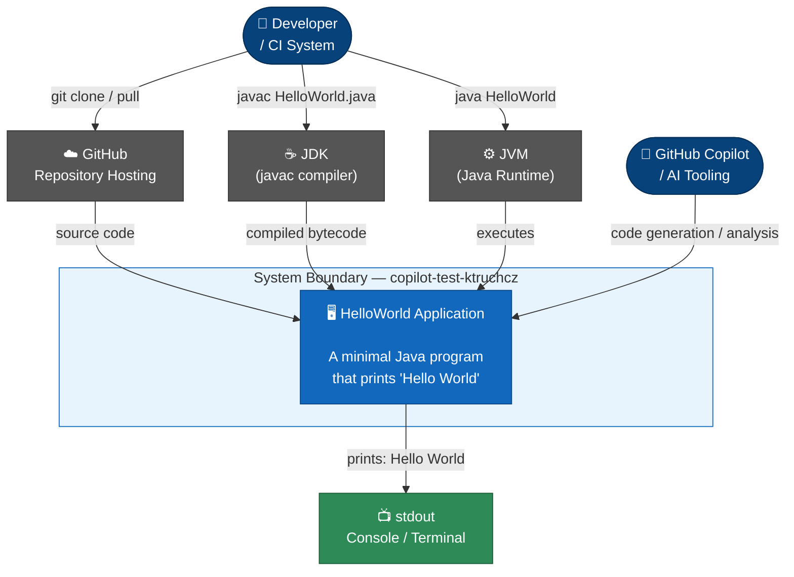

### 3.3 Technical Context


---

## 4. Solution Strategy

### 4.1 Technology Decisions

| Decision                        | Choice                   | Rationale                                                                 |
|---------------------------------|--------------------------|---------------------------------------------------------------------------|
| **Programming Language**        | Java                     | Ubiquitous, platform-independent, strongly typed, well-supported          |
| **Execution Model**             | JVM bytecode             | Write once, run anywhere — compiled `.class` runs on any JVM              |
| **I/O Mechanism**               | `System.out.println`     | Simplest possible standard output; no logging framework overhead          |
| **Dependency Management**       | None (zero deps)         | No external libraries required for a `Hello World` application            |
| **Build System**                | Manual (`javac`)         | No Maven/Gradle needed for a single-class project                         |
| **Package Structure**           | Default package          | Appropriate for trivial single-class demos with no namespace requirements |

### 4.2 Top-Level Decomposition Strategy

The architecture follows the simplest possible decomposition: **a single class with a single method**. This is intentional and appropriate for the scope of the application.

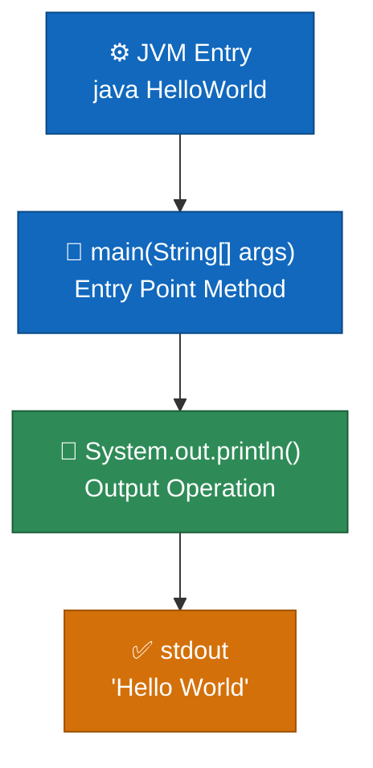

### 4.3 Approach to Quality Goals

| Quality Goal       | Strategy Applied                                                              |
|--------------------|-------------------------------------------------------------------------------|
| Simplicity         | Single file, single class, single method — minimal possible structure         |
| Correctness        | Hard-coded string constant eliminates runtime variability                     |
| Portability        | Standard Java API only; runs on Java 1.0+ with zero modifications             |
| Reproducibility    | Self-contained, no configuration, no environment setup beyond JDK/JRE        |

---

## 5. Building Block View

### 5.1 Level 1 — High-Level System Decomposition

The system consists of a single deployable unit: the compiled `HelloWorld` class.

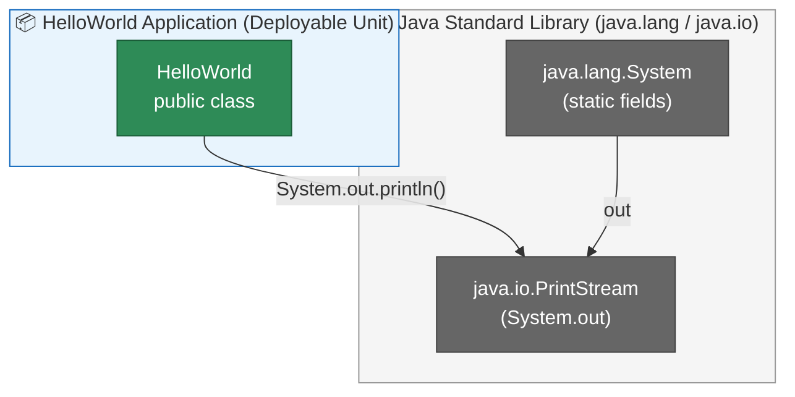

### 5.2 Level 2 — Package and Class Structure

```mermaid
graph TB
    classDef defaultpkg fill:#fff9c4,stroke:#f9a825,color:#333333
    classDef class fill:#1168bd,stroke:#0b4884,color:#ffffff
    classDef method fill:#2e8b57,stroke:#1a5c38,color:#ffffff

    subgraph PKG["(default package)"]
        direction TB
        subgraph HW["class HelloWorld"]
            direction TB
            MAIN["+ main(String[] args) : void\n  ── static, public\n  ── JVM entry point"]:::method
        end
    end

    style PKG fill:#fffde7,stroke:#f9a825
    style HW fill:#e3f2fd,stroke:#1565c0
```

### 5.3 Level 3 — Detailed Class Diagram

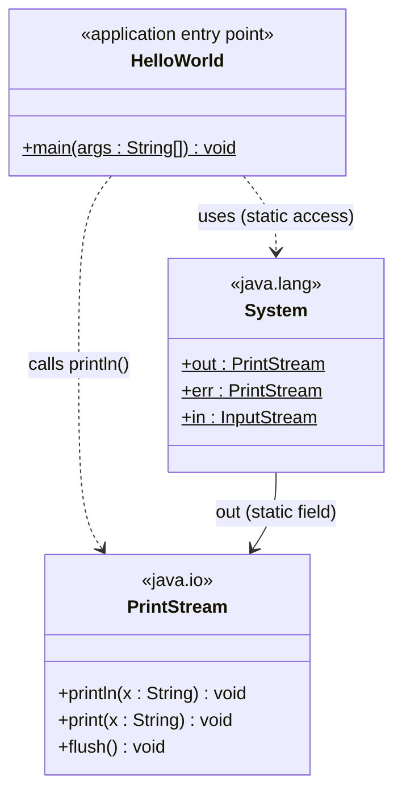

### 5.4 Component Responsibilities

| Component       | Responsibility                                                   | Interface                             |
|-----------------|------------------------------------------------------------------|---------------------------------------|
| `HelloWorld`    | Application entry point; orchestrates entire program execution   | `main(String[] args)` — JVM standard  |
| `System.out`    | Standard output stream reference (`java.lang`)                   | `PrintStream.println(String)` method  |
| `PrintStream`   | Writes formatted text to the underlying output stream            | `println(String x)` method            |
| JVM Launcher    | Loads the class, locates `main`, invokes it                      | `java HelloWorld` OS command          |

---

## 6. Runtime View

### 6.1 Main Execution Scenario: "Hello World" Output

This is the only runtime scenario. The sequence is deterministic and always produces the same result.

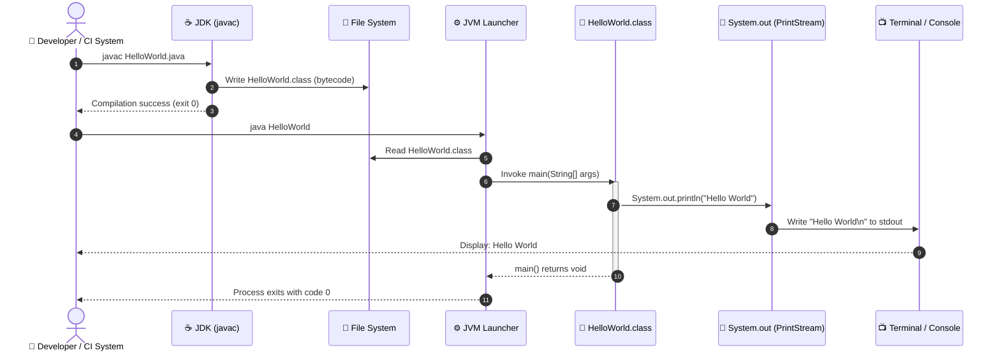

### 6.2 Runtime State Machine

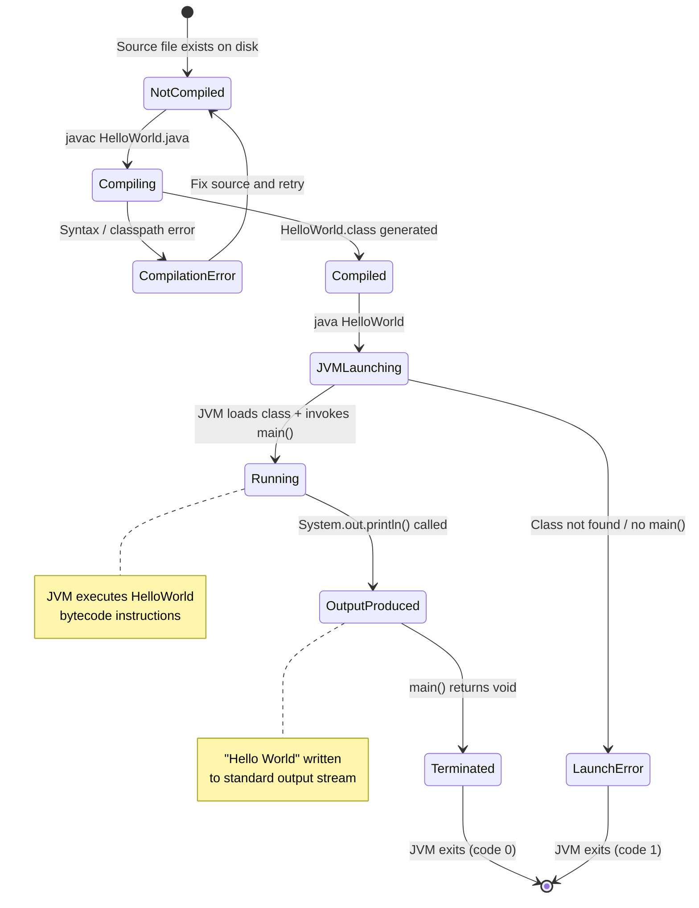

### 6.3 Execution Flow

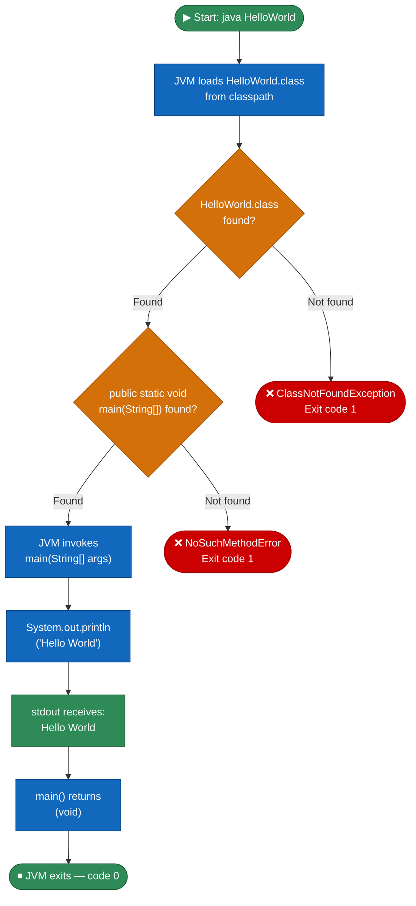

---

## 7. Deployment View

### 7.1 Infrastructure Overview

The application requires no dedicated server, container, or infrastructure component beyond a machine with a compatible JRE installed.

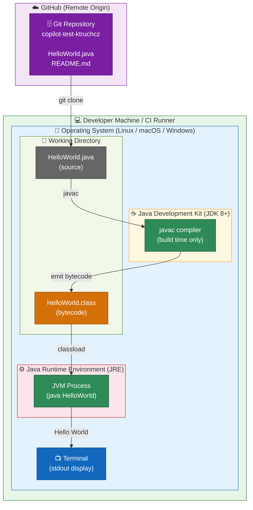

### 7.2 Deployment Pipeline

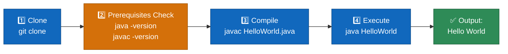

### 7.3 Environment Requirements

| Requirement              | Minimum Version | Recommended   | Notes                                              |
|--------------------------|-----------------|---------------|----------------------------------------------------|
| Java Development Kit     | JDK 1.0         | JDK 17 (LTS)  | Required to compile; any modern JDK works          |
| Java Runtime Environment | JRE 1.0         | JRE 17 (LTS)  | Included in JDK installs                           |
| Operating System         | Any             | Any           | JVM is platform-agnostic                           |
| Memory (RAM)             | ~32 MB          | —             | JVM startup overhead for a trivial process         |
| Disk Space               | < 1 KB          | —             | Source `.java` + compiled `.class` are negligible  |
| Network                  | None required   | —             | Fully offline; no network calls made               |
| Build Tool               | None            | Maven / Gradle | Direct `javac` is sufficient for this project     |

---

## 8. Crosscutting Concepts

### 8.1 Domain Model

The domain is trivially simple — there is no persistent data, no entities, and no business logic beyond string output.

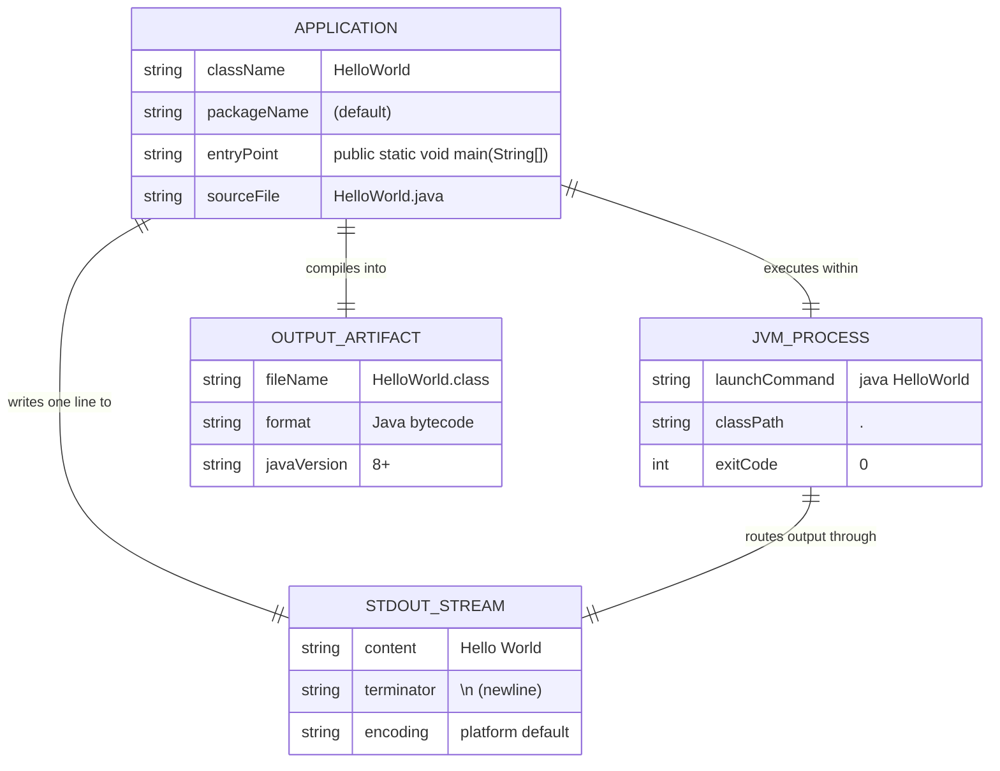

### 8.2 Architecture and Design Patterns

| Pattern                     | Applied | Description                                                               |
|-----------------------------|---------|---------------------------------------------------------------------------|
| **Procedural / Imperative** | ✅ Yes  | Single top-down execution flow with no OOP beyond class wrapper           |
| **Static Entry Point**      | ✅ Yes  | `public static void main()` — idiomatic Java entry point pattern          |
| **Singleton (implicit)**    | ✅ Yes  | One JVM process, one class instance context at a time                     |
| **Layered Architecture**    | ❌ No   | Single-tier: no separation of concerns needed                             |
| **Observer / Event-driven** | ❌ No   | No event handling required                                                |
| **MVC / MVP / MVVM**        | ❌ No   | No UI framework involved                                                  |
| **Repository Pattern**      | ❌ No   | No data persistence                                                       |

### 8.3 Error Handling Strategy

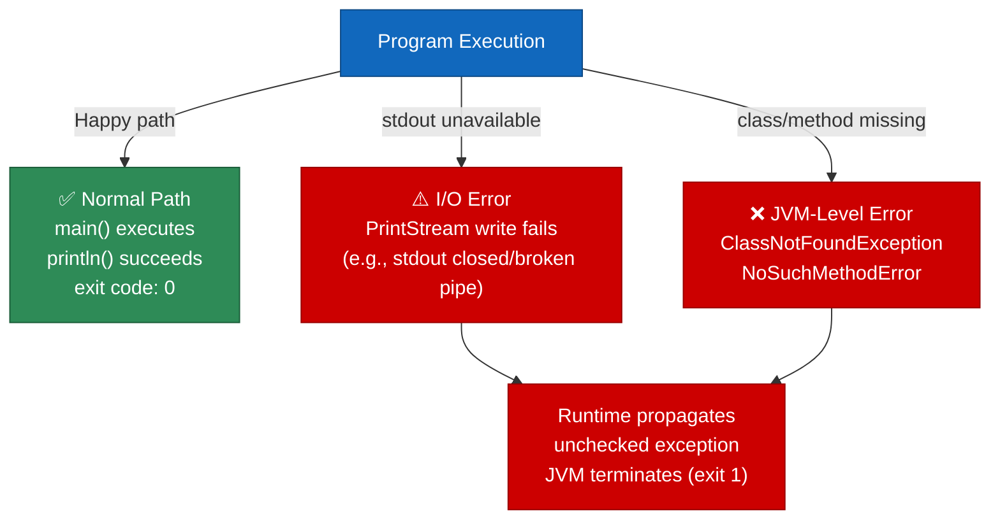

> **Note**: The application performs no explicit error handling. This is intentional and acceptable for a demonstration program. A production application would wrap I/O in try-catch blocks and log errors appropriately.

### 8.4 Logging and Observability

| Aspect            | Implementation          | Notes                                              |
|-------------------|-------------------------|----------------------------------------------------|
| Application Log   | `System.out.println`    | Outputs to stdout; not a formal logging framework  |
| Log Levels        | None                    | No DEBUG / INFO / WARN / ERROR separation          |
| Structured Logs   | None                    | No JSON/XML output, no timestamps                  |
| Metrics           | None                    | No performance monitoring counters                 |
| Distributed Trace | None                    | No tracing identifiers                             |
| Health Endpoint   | None                    | Stateless CLI process; no HTTP endpoints           |

### 8.5 Security Concepts

| Aspect               | Status | Notes                                                               |
|----------------------|--------|---------------------------------------------------------------------|
| Input Validation     | N/A    | `args[]` parameter is completely ignored                            |
| Authentication       | N/A    | No authentication required                                          |
| Authorization        | N/A    | No access control needed                                            |
| Data Sensitivity     | None   | Output is a hard-coded, non-sensitive constant string               |
| Injection Risks      | None   | No dynamic string construction; no DB or shell interaction          |
| Third-Party CVEs     | None   | Zero external dependencies; only JDK stdlib is used                 |
| Network Exposure     | None   | No sockets, HTTP, or network calls whatsoever                       |

### 8.6 Internationalization (i18n)

The output string `"Hello World"` is hard-coded in English with no i18n support. For a production application, the message would be extracted to a `ResourceBundle` and loaded based on `Locale`. This is not warranted for the current scope.

---

## 9. Architecture Decisions

### ADR-001: Java as the Programming Language

| Attribute    | Value                                                                          |
|--------------|--------------------------------------------------------------------------------|
| **Status**   | ✅ Accepted                                                                    |
| **Context**  | Need a simple demonstration program for the `copilot-test-ktruchcz` repository |
| **Decision** | Implement the program in Java                                                  |
| **Rationale**| Java is platform-independent, widely used, and well-supported by GitHub Copilot |
| **Alternatives Considered** | Python (`print("Hello World")`), JavaScript (`console.log`), Bash (`echo`) — all simpler but less illustrative for JVM toolchain testing |
| **Consequences** | Requires JDK to compile and JRE to run; acceptable overhead for the stated purpose |

---

### ADR-002: Single-Class, Default-Package Structure

| Attribute    | Value                                                                          |
|--------------|--------------------------------------------------------------------------------|
| **Status**   | ✅ Accepted                                                                    |
| **Context**  | Application has exactly one functional concern: print a constant string        |
| **Decision** | Place all code in a single public class `HelloWorld` in the default package    |
| **Rationale**| No multi-class or package structure is warranted; adding it would violate YAGNI |
| **Alternatives Considered** | Named package `com.ktruchcz.hello.HelloWorld` — better for production but overkill here |
| **Consequences** | Cannot be referenced as a library by other packages; acceptable for a standalone demo |

---

### ADR-003: No Build Tool (No Maven / Gradle)

| Attribute    | Value                                                                          |
|--------------|--------------------------------------------------------------------------------|
| **Status**   | ✅ Accepted                                                                    |
| **Context**  | Single source file with zero external dependencies                             |
| **Decision** | Use raw `javac` / `java` commands; no build tool descriptor                    |
| **Rationale**| Maven and Gradle add configuration overhead entirely unjustified for a one-file, zero-dep project |
| **Alternatives Considered** | Maven with `pom.xml`, Gradle with `build.gradle` — both viable for scale; not needed here |
| **Consequences** | No dependency management, no plugin ecosystem; must move to a build tool if complexity grows |

---

### ADR-004: Hard-Coded Output String

| Attribute    | Value                                                                          |
|--------------|--------------------------------------------------------------------------------|
| **Status**   | ✅ Accepted                                                                    |
| **Context**  | The application's sole output is a fixed, well-known string                    |
| **Decision** | Hard-code `"Hello World"` directly in the `println` call                       |
| **Rationale**| Externalizing a constant to a config file or `static final` field would add unnecessary structural complexity |
| **Alternatives Considered** | `static final String GREETING = "Hello World"` — marginally better practice but adds no real value here |
| **Consequences** | Output cannot be changed without modifying and recompiling the source; acceptable for a demo |

---

### ADR-005: No Logging Framework

| Attribute    | Value                                                                          |
|--------------|--------------------------------------------------------------------------------|
| **Status**   | ✅ Accepted                                                                    |
| **Context**  | Application has no operational logging requirements                            |
| **Decision** | Use `System.out.println` instead of SLF4J, Log4j2, or `java.util.logging`     |
| **Rationale**| Logging frameworks introduce dependency and configuration complexity with no benefit for a trivial demo |
| **Alternatives Considered** | `java.util.logging` (JDK built-in, zero deps), SLF4J + Logback (industry standard) |
| **Consequences** | Output is not structured, leveled, or configurable; entirely appropriate for the use case |

---

## 10. Quality Requirements

### 10.1 Quality Tree

```mermaid
graph TD
    classDef root fill:#1168bd,stroke:#0b4884,color:#ffffff
    classDef category fill:#2e8b57,stroke:#1a5c38,color:#ffffff
    classDef scenario fill:#d4700a,stroke:#9c5000,color:#ffffff

    ROOT["⭐ Quality Requirements\ncopilot-test-ktruchcz"]:::root

    FUNC["✅ Functional\nSuitability"]:::category
    PERF["⚡ Performance\nEfficiency"]:::category
    MAINT["🔧 Maintainability"]:::category
    PORT["🌍 Portability"]:::category
    REL["🛡️ Reliability"]:::category
    SEC["🔐 Security"]:::category

    ROOT --> FUNC
    ROOT --> PERF
    ROOT --> MAINT
    ROOT --> PORT
    ROOT --> REL
    ROOT --> SEC

    F1["QS-1: Output equals\n'Hello World' exactly"]:::scenario
    F2["QS-2: Process exits\nwith code 0"]:::scenario

    P1["QS-3: Execution time\n< 2 seconds"]:::scenario
    P2["QS-4: Memory footprint\n< 64 MB"]:::scenario

    M1["QS-7: Readable in\nunder 30 seconds"]:::scenario
    M2["QS-8: Cyclomatic\ncomplexity = 1"]:::scenario

    PO1["QS-5: Runs on Linux,\nmacOS, Windows"]:::scenario
    PO2["QS-6: Compatible with\nJava 8 through 21+"]:::scenario

    R1["QS-9: 100% deterministic\noutput every run"]:::scenario
    R2["QS-10: Zero external\ndependency failures"]:::scenario

    S1["QS-11: No user input;\nzero injection risk"]:::scenario
    S2["QS-12: Zero 3rd-party\nCVEs in dependencies"]:::scenario

    FUNC --> F1
    FUNC --> F2
    PERF --> P1
    PERF --> P2
    MAINT --> M1
    MAINT --> M2
    PORT --> PO1
    PORT --> PO2
    REL --> R1
    REL --> R2
    SEC --> S1
    SEC --> S2
```

### 10.2 Quality Scenarios

| ID    | Quality Attribute  | Scenario                                 | Expected Response                            | Metric              | Status   |
|-------|--------------------|------------------------------------------|----------------------------------------------|---------------------|----------|
| QS-1  | Correctness        | Execute `java HelloWorld`                | Prints exactly `Hello World` to stdout       | Exact string match  | ✅ Met   |
| QS-2  | Reliability        | `main()` completes normally              | JVM exits with code `0`                      | Exit code = 0       | ✅ Met   |
| QS-3  | Performance        | Execute `java HelloWorld`                | Output appears within 2 seconds              | < 2 seconds         | ✅ Met   |
| QS-4  | Performance        | JVM launched on minimal hardware         | Process uses < 64 MB RAM                     | < 64 MB RSS         | ✅ Met   |
| QS-5  | Portability        | Run on Linux / macOS / Windows           | Identical output on all platforms            | 0 platform-specific code | ✅ Met |
| QS-6  | Portability        | Compile with JDK 8, 11, 17, 21           | No errors, no deprecation warnings           | 0 compiler warnings | ✅ Met   |
| QS-7  | Maintainability    | New developer reads source               | Understands full program in < 30 seconds     | LOC = 5             | ✅ Met   |
| QS-8  | Maintainability    | Measure cyclomatic complexity            | No branches, no loops                        | CC = 1              | ✅ Met   |
| QS-9  | Reliability        | Run 1000 times consecutively             | Same output every time                       | 100% consistency    | ✅ Met   |
| QS-10 | Reliability        | No network, no filesystem                | Zero external failure points                 | 0 external deps     | ✅ Met   |
| QS-11 | Security           | Security scan for injection vectors      | No dynamic input processing                  | 0 risk vectors      | ✅ Met   |
| QS-12 | Security           | Dependency vulnerability scan            | No CVEs in any used library                  | 0 CVEs              | ✅ Met   |

### 10.3 Code Quality Metrics

| Metric                       | Value | Target   | Assessment                                     |
|------------------------------|-------|----------|------------------------------------------------|
| Lines of Code (LOC)          | 5     | Minimal  | ✅ Minimal as intended                         |
| Blank Lines                  | 0     | —        | ✅ None needed                                 |
| Comment Lines                | 0     | —        | ⚠️ No Javadoc (minor gap)                      |
| Number of Classes            | 1     | 1        | ✅ Single responsibility                        |
| Number of Methods            | 1     | 1        | ✅ Single entry point                           |
| Cyclomatic Complexity        | 1     | ≤ 10     | ✅ No branches or loops                         |
| Cognitive Complexity         | 0     | ≤ 15     | ✅ Zero cognitive overhead                      |
| External Dependencies        | 0     | 0        | ✅ Zero dependency risk                         |
| Unit Test Coverage           | 0%    | ≥ 80%    | ⚠️ No tests — key gap for production readiness  |
| Javadoc Coverage             | 0%    | ≥ 100%   | ⚠️ No documentation comments                   |
| Package Structure            | Default | Named  | ⚠️ Default package not suitable for production |

---

## 11. Risks and Technical Debt

### 11.1 Risk Matrix

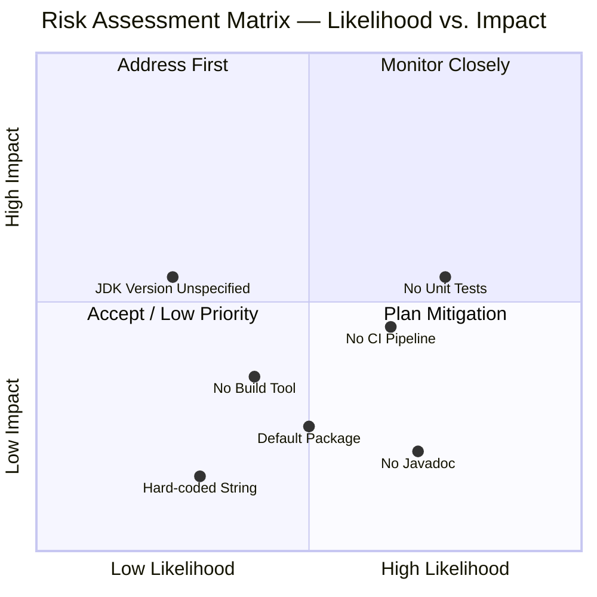

### 11.2 Risk Register

| ID   | Risk Description                  | Likelihood | Impact  | Category        | Mitigation Strategy                                              |
|------|-----------------------------------|------------|---------|-----------------|------------------------------------------------------------------|
| R-01 | **No unit tests**                 | 🔴 High    | 🟡 Med  | Quality         | Add `HelloWorldTest.java` with JUnit 5; capture stdout via `ByteArrayOutputStream` |
| R-02 | **No CI/CD pipeline**             | 🟡 Med     | 🟡 Med  | Automation      | Add GitHub Actions workflow `build.yml` to compile and test on push |
| R-03 | **Default package usage**         | 🟡 Med     | 🟢 Low  | Maintainability | Move class to `com.ktruchcz.hello` if scope expands             |
| R-04 | **No build tool defined**         | 🟡 Med     | 🟡 Med  | Operational     | Add Maven `pom.xml` or Gradle `build.gradle` for reproducible builds |
| R-05 | **JDK version not pinned**        | 🟢 Low     | 🟡 Med  | Reproducibility | Add `.java-version` file or `maven.compiler.source` property     |
| R-06 | **No Javadoc comments**           | 🔴 High    | 🟢 Low  | Documentation   | Add `/** */` blocks to class and `main()` method                 |
| R-07 | **Hard-coded output string**      | 🟢 Low     | 🟢 Low  | Flexibility     | Extract to `static final String GREETING = "Hello World"` if needed |
| R-08 | **`args[]` parameter unused**     | 🟢 Low     | 🟢 Low  | Code Quality    | Annotate with `@SuppressWarnings("unused")` or document intent  |

### 11.3 Technical Debt Backlog

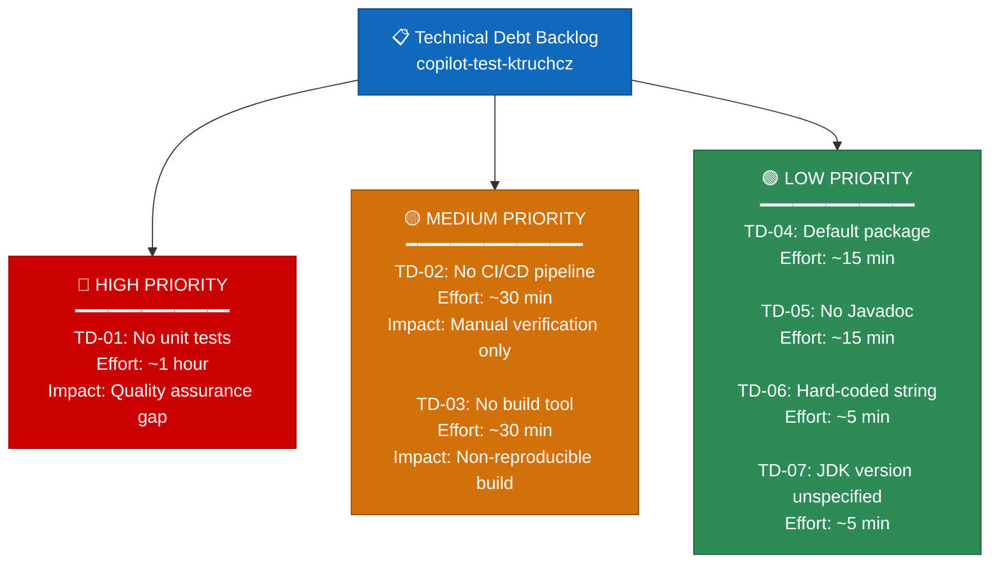

### 11.4 Recommended Improvements (Prioritized)

1. **[HIGH – Immediate]** Add unit test class `HelloWorldTest.java`:
   ```java
   import org.junit.jupiter.api.Test;
   import java.io.*;
   import static org.junit.jupiter.api.Assertions.*;

   class HelloWorldTest {
       @Test
       void main_shouldPrintHelloWorld() throws Exception {
           ByteArrayOutputStream out = new ByteArrayOutputStream();
           System.setOut(new PrintStream(out));
           HelloWorld.main(new String[]{});
           assertEquals("Hello World", out.toString().trim());
       }
   }
   ```

2. **[HIGH – Immediate]** Add GitHub Actions CI workflow (`.github/workflows/build.yml`):
   ```yaml
   name: Build and Test
   on: [push, pull_request]
   jobs:
     build:
       runs-on: ubuntu-latest
       steps:
         - uses: actions/checkout@v4
         - uses: actions/setup-java@v4
           with: { java-version: '17', distribution: 'temurin' }
         - run: javac HelloWorld.java
         - run: java HelloWorld
   ```

3. **[MEDIUM]** Introduce a Maven `pom.xml` for reproducible dependency-managed builds
4. **[MEDIUM]** Move class to named package `com.ktruchcz.hello`
5. **[LOW]** Add Javadoc to class and `main()` method
6. **[LOW]** Define constant: `private static final String GREETING = "Hello World";`

---

## 12. Glossary

| Term                          | Definition                                                                                           |
|-------------------------------|------------------------------------------------------------------------------------------------------|
| **ADR**                       | Architecture Decision Record — a short document capturing a significant architectural choice          |
| **Arc42**                     | A template for documenting software architectures, structured into 12 standardized sections          |
| **Bytecode**                  | Platform-independent compiled code produced by `javac`; stored in `.class` files; executed by JVM   |
| **CI/CD**                     | Continuous Integration / Continuous Delivery — automated build, test, and deployment pipelines       |
| **classpath**                 | JVM parameter specifying where to find compiled `.class` files at runtime                            |
| **Cognitive Complexity**      | Code metric measuring how difficult code is to understand; considers nesting, breaks, and recursion  |
| **Cyclomatic Complexity**     | Code metric counting linearly independent execution paths; 1 = no branches or loops                  |
| **Default Package**           | The unnamed package in Java used when no `package` declaration appears at the top of a source file   |
| **Entry Point**               | The `public static void main(String[] args)` method — the first method the JVM invokes              |
| **GitHub Actions**            | GitHub's built-in CI/CD platform for automating workflows triggered by repository events             |
| **GitHub Copilot**            | AI-powered code completion and generation tool integrated into GitHub and VS Code                    |
| **Hello World**               | The universally recognized first program in any language; outputs the string "Hello World"           |
| **i18n**                      | Internationalization — the practice of designing software to support multiple languages and locales  |
| **JDK**                       | Java Development Kit — includes compiler (`javac`), runtime (`java`), and standard libraries         |
| **JRE**                       | Java Runtime Environment — subset of JDK; provides JVM to execute compiled Java bytecode            |
| **JVM**                       | Java Virtual Machine — the runtime engine that interprets and executes Java bytecode                 |
| **LOC**                       | Lines of Code — a basic quantitative metric for program size                                         |
| **Mermaid**                   | A Markdown-native diagramming language rendered natively by GitHub, GitLab, and many docs tools      |
| **PascalCase**                | Naming convention where each word begins with a capital letter (e.g., `HelloWorld`, `PrintStream`)   |
| **PrintStream**               | Java class (`java.io.PrintStream`) providing `println()` and other formatted text output methods     |
| **`public static void main`** | The canonical Java application entry point signature recognized and invoked by the JVM launcher      |
| **SOLID**                     | Five software design principles: Single Responsibility, Open/Closed, Liskov Substitution, Interface Segregation, Dependency Inversion |
| **stdout**                    | Standard output stream — the default output channel for CLI programs (file descriptor 1)             |
| **`System.out`**              | Static reference to the standard output `PrintStream` in Java's `java.lang.System` class            |
| **YAGNI**                     | "You Aren't Gonna Need It" — agile principle advising against adding features not currently required |

---

## Appendix A: Source Code Reference

### HelloWorld.java — Complete Source

```java
public class HelloWorld {
    public static void main(String[] args) {
        System.out.println("Hello World");
    }
}
```

**Metrics summary:**

| Metric                  | Value |
|-------------------------|-------|
| Total lines             | 5     |
| Code lines              | 5     |
| Comment lines           | 0     |
| Blank lines             | 0     |
| Classes                 | 1     |
| Methods                 | 1     |
| Cyclomatic complexity   | 1     |
| Cognitive complexity    | 0     |
| External dependencies   | 0     |

### Compilation and Execution Commands

```bash
# Step 1: Compile the source file
javac HelloWorld.java
# → produces: HelloWorld.class

# Step 2: Execute the compiled class
java HelloWorld
# → output: Hello World

# One-liner for Java 11+ (source launcher — no separate compile step)
java HelloWorld.java
# → output: Hello World

# Verify exit code
echo $?   # Linux/macOS
echo %ERRORLEVEL%  # Windows CMD
# → 0 (success)
```

---

## Appendix B: Suggested Future Project Structure

If this project grows beyond a single-class demo, the following Maven Standard Directory Layout is recommended:

```
copilot-test-ktruchcz/
├── src/
│   ├── main/
│   │   └── java/
│   │       └── com/ktruchcz/hello/
│   │           └── HelloWorld.java        ← main class (named package)
│   └── test/
│       └── java/
│           └── com/ktruchcz/hello/
│               └── HelloWorldTest.java    ← JUnit 5 unit tests
├── .github/
│   └── workflows/
│       └── build.yml                      ← GitHub Actions CI pipeline
├── pom.xml                                ← Maven build descriptor
├── .java-version                          ← Pin JDK version (e.g., "17")
├── README.md                              ← Project overview
└── docs/
    └── arc42/
        └── arc42-documentation.md         ← This file (Arc42 architecture docs)
```

---

*Documentation generated by **Arc42 Documentation Generator** | Template: Arc42 v8.2 | Diagrams: Mermaid | Format: Markdown*  
*Source analyzed: `HelloWorld.java` (5 LOC), `README.md` (1 line) | Generation date: 2025-07-14*
