# Architecture Documentation (Arc42)

**Project**: `copilot-test-ktruchcz`  
**Version**: 1.0.0  
**Date**: 2025-07-14  
**Generated by**: Arc42 Documentation Generator  
**Path**: `docs/arc42/arc42-documentation.md`

---

## Table of Contents

1. [Introduction and Goals](#1-introduction-and-goals)
2. [Architecture Constraints](#2-architecture-constraints)
3. [System Scope and Context](#3-system-scope-and-context)
4. [Solution Strategy](#4-solution-strategy)
5. [Building Block View](#5-building-block-view)
6. [Runtime View](#6-runtime-view)
7. [Deployment View](#7-deployment-view)
8. [Cross-cutting Concepts](#8-cross-cutting-concepts)
9. [Architecture Decisions](#9-architecture-decisions)
10. [Quality Requirements](#10-quality-requirements)
11. [Risks and Technical Debt](#11-risks-and-technical-debt)
12. [Glossary](#12-glossary)

---

## 1. Introduction and Goals

### 1.1 Requirements Overview

`copilot-test-ktruchcz` is a minimal Java application whose sole purpose is to emit a greeting
message to the standard output stream. The project serves as a **baseline/seed repository**
demonstrating the simplest possible runnable Java program and acting as a scaffold for GitHub
Copilot agent-based tooling experiments.

| ID  | Requirement | Priority |
|-----|-------------|----------|
| R-01 | The system SHALL print the text `Hello World` to standard output when executed. | High |
| R-02 | The system SHALL terminate with exit code `0` on successful execution. | High |
| R-03 | The system SHALL require no runtime configuration or external dependencies. | Medium |
| R-04 | The system SHOULD compile and run on any standard JDK environment (Java 8+). | Medium |

### 1.2 Quality Goals

The top quality goals for this architecture, ordered by priority:

| Priority | Quality Goal | Motivation |
|----------|-------------|------------|
| 1 | **Simplicity** | The program must be immediately understandable by any Java developer. |
| 2 | **Portability** | Must run on any platform with a JDK installed — no OS-specific code. |
| 3 | **Self-containment** | Zero external dependencies; a single source file is the complete deliverable. |
| 4 | **Reproducibility** | Identical output on every execution, in every environment. |

### 1.3 Stakeholders

| Role | Name / Group | Expectation |
|------|-------------|-------------|
| Developer / Author | `ktruchcz` (inferred from repo name) | A working "Hello World" to validate the Java toolchain. |
| GitHub Copilot Agents | Automated analysis agents (this repo) | A representative codebase for agent feature testing and documentation generation. |
| Reviewers / Evaluators | Copilot platform team | A minimal, well-documented project demonstrating agent capabilities. |

---

## 2. Architecture Constraints

### 2.1 Technical Constraints

| ID | Constraint | Background |
|----|-----------|------------|
| TC-01 | **Language: Java** | The single source file `HelloWorld.java` is written in Java. No other language is present. |
| TC-02 | **Java SE 1.0+ compatible syntax** | Uses only `public static void main(String[] args)` and `System.out.println` — both available since Java 1.0. |
| TC-03 | **No build tool** | There is no `pom.xml`, `build.gradle`, `Makefile`, or any other build descriptor. Compilation must be performed manually via `javac`. |
| TC-04 | **No external libraries** | No `import` statements; the program relies exclusively on `java.lang` (auto-imported). |
| TC-05 | **`.class` files excluded from VCS** | `.gitignore` contains `*.class`, meaning compiled artefacts are never committed. |
| TC-06 | **Single-file architecture** | The entire application is one file, one class, one method — enforcing the simplest possible structure. |

### 2.2 Organizational Constraints

| ID | Constraint | Background |
|----|-----------|------------|
| OC-01 | **GitHub-hosted repository** | Source control is GitHub; CI/CD, agents, and tooling are GitHub-native. |
| OC-02 | **Copilot agent experiment context** | The repository exists primarily as a test target for GitHub Copilot agent workflows defined under `.github/agents/`. |
| OC-03 | **Minimal documentation baseline** | The README contains only a project title (`# copilot-test-ktruchcz`), leaving all deeper documentation to be generated by agents. |

### 2.3 Conventions

| Convention | Detail |
|-----------|--------|
| Java naming | Class name `HelloWorld` matches the filename `HelloWorld.java` (required by the Java compiler for public classes). |
| Indentation | 4-space indentation (standard Java convention). |
| Output format | Plain text to `stdout`, terminated by a newline (via `println`). |

---

## 3. System Scope and Context

### 3.1 Business Context

The system receives no business inputs and produces a single, deterministic business output: the
greeting string `"Hello World"`. All interactions occur at the OS process boundary.


| Neighbour | Channel | Data Exchanged |
|-----------|---------|----------------|
| **User / Operator** | OS process invocation (`java HelloWorld`) | Command-line arguments (accepted but ignored) |
| **Standard Output (`stdout`)** | `System.out` Java stream → OS file descriptor 1 | The string `Hello World\n` |
| **JVM** | Java class loading and execution | Bytecode (`.class` file) |

### 3.2 Technical Context

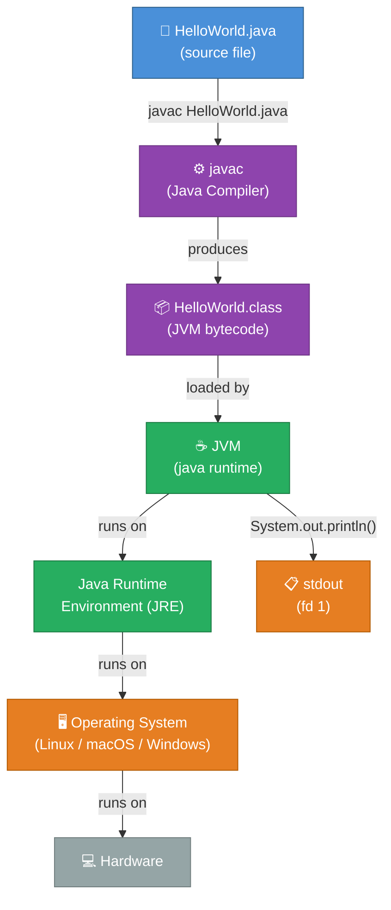

| Channel | Technology | Protocol |
|---------|-----------|---------|
| Source → Compiler | File system read | Local I/O |
| Compiler → Bytecode | File system write | Local I/O |
| Bytecode → JVM | Class loader | JVM internal |
| JVM → stdout | `PrintStream` (`System.out`) | OS file descriptor |

---

## 4. Solution Strategy

### 4.1 Technology Decisions

| Decision | Choice | Rationale |
|----------|--------|-----------|
| **Programming Language** | Java | Established, platform-independent, strongly typed language; universally understood. |
| **Execution Model** | JVM (compile-then-run) | Write once, run anywhere — no native binary required. |
| **Build Tooling** | None (raw `javac`) | Zero overhead for a single-class program; no dependency resolver needed. |
| **Output Mechanism** | `System.out.println()` | Standard Java idiom for console output; unbuffered line termination. |
| **Entry Point Pattern** | `public static void main(String[] args)` | The canonical JVM application entry point defined in the Java Language Specification. |

### 4.2 Top-Level Decomposition

The system is intentionally undivided — one class, one method, one responsibility:

```mermaid
mindmap
    root((HelloWorld\nSystem))
        Compilation
            javac compiler
            HelloWorld.class bytecode
        Execution
            JVM class loader
            main() entry point
            System.out stream
        Output
            Hello World string
            newline terminator
            stdout file descriptor
```

### 4.3 Approaches to Achieve Quality Goals

| Quality Goal | Approach |
|-------------|----------|
| **Simplicity** | Single class, single method, single statement — no abstractions, no layers. |
| **Portability** | Pure Java SE API; no OS calls, no native libraries. |
| **Self-containment** | No imports beyond `java.lang`; no classpath entries required. |
| **Reproducibility** | Hard-coded literal string output; no environment variables, no randomness, no I/O. |

---

## 5. Building Block View

### 5.1 Level 1 — System Overview

At the highest level, the entire system is a single deployable unit: a JVM application composed
of exactly one class.

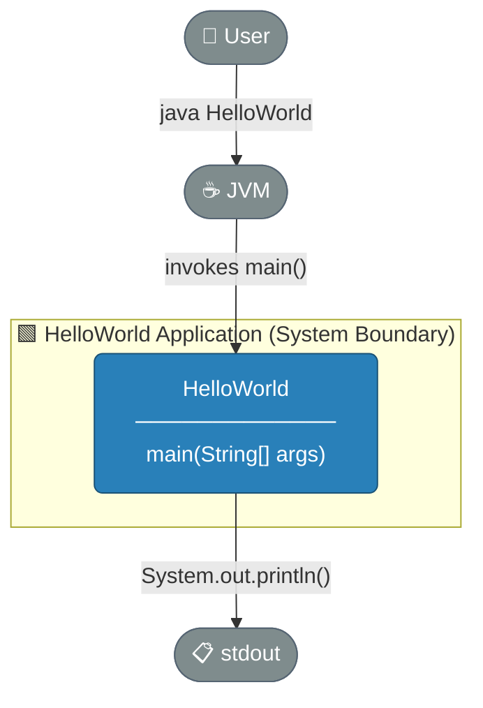

**Responsibilities of `HelloWorld`:**

| Responsibility | Detail |
|---------------|--------|
| Application entry point | Implements the `main(String[] args)` contract required by the JVM launcher. |
| Output production | Writes the greeting string to `System.out`. |
| Lifecycle management | Performs an implicit clean exit (no `System.exit()` call; JVM exits normally). |

### 5.2 Level 2 — Class Structure

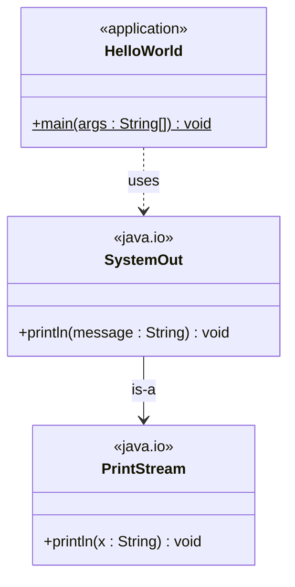

### 5.3 Level 3 — Method Detail

```mermaid
flowchart TD
    classDef step fill:#2980B9,stroke:#1A5276,color:#fff,rx:6
    classDef io fill:#27AE60,stroke:#1A7A42,color:#fff,rx:6
    classDef term fill:#E74C3C,stroke:#922B21,color:#fff,rx:6

    START([▶ JVM invokes main]):::step
    ARGS["Receive args : String[]\n(ignored)"]:::step
    PRINT["System.out.println\n(\"Hello World\")"]:::io
    STDOUT["Write 'Hello World\\n'\nto stdout fd-1"]:::io
    FLUSH["PrintStream auto-flush\non newline"]:::io
    END([⏹ main() returns\nJVM exits 0]):::term

    START --> ARGS --> PRINT --> STDOUT --> FLUSH --> END
```

| Black Box | Interface | Responsibility |
|-----------|-----------|---------------|
| `HelloWorld` | `main(String[])` | Entry point; orchestrates output |
| `System.out` (PrintStream) | `println(String)` | Writes to stdout with newline |

---

## 6. Runtime View

### 6.1 Scenario 1 — Nominal Execution

The only runtime scenario: a user invokes the application from the command line.

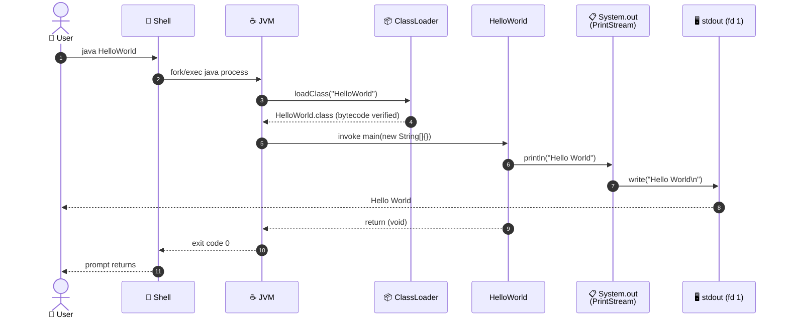

### 6.2 Scenario 2 — Execution with Arguments

Arguments are accepted by the `main` signature but silently ignored.

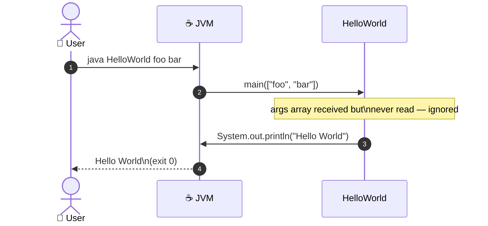

### 6.3 Application Lifecycle

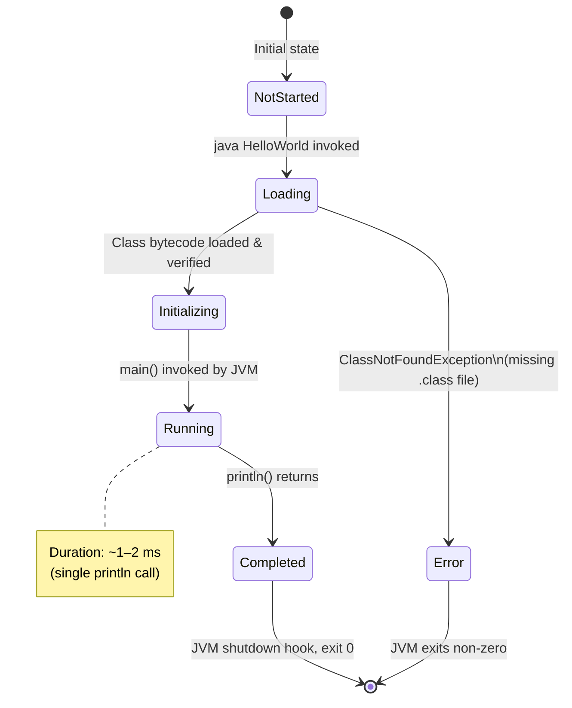

---

## 7. Deployment View

### 7.1 Infrastructure Requirements

| Requirement | Minimum | Recommended |
|-------------|---------|-------------|
| Java Development Kit (JDK) | Java 1.0 | Java 17 LTS or Java 21 LTS |
| Operating System | Any OS with JVM port | Linux, macOS, or Windows |
| Disk space (source) | < 1 KB | — |
| Disk space (bytecode) | < 1 KB | — |
| RAM | ~25 MB (JVM overhead) | ~50 MB |
| CPU | Any | Any |

### 7.2 Deployment Topology

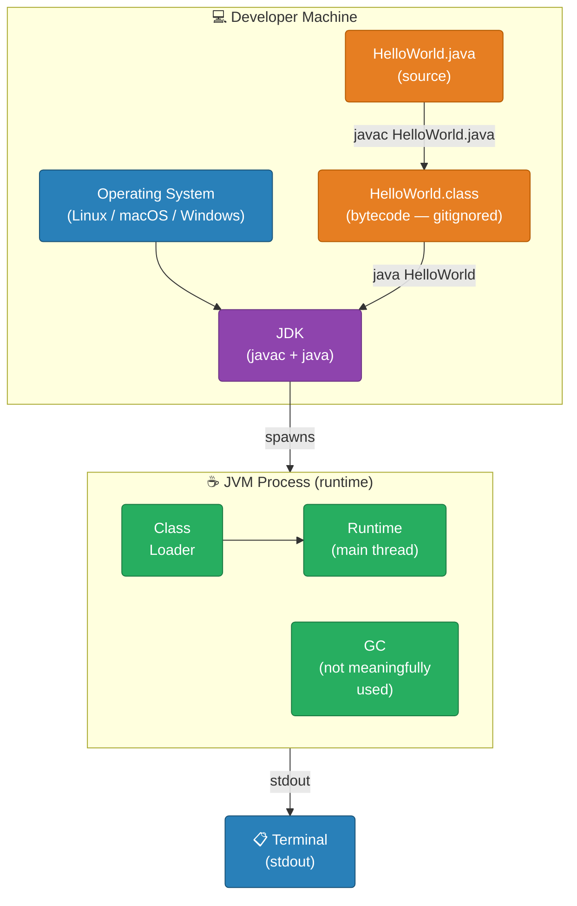

### 7.3 Build and Run Steps


### 7.4 CI/CD Considerations

There is currently **no CI/CD pipeline** configured (no `.github/workflows/` directory was
found). A recommended minimal GitHub Actions workflow would be:

```yaml
# .github/workflows/build.yml  (recommended — not yet present)
name: Build and Run
on: [push, pull_request]
jobs:
  build:
    runs-on: ubuntu-latest
    steps:
      - uses: actions/checkout@v4
      - uses: actions/setup-java@v4
        with:
          java-version: '21'
          distribution: 'temurin'
      - run: javac HelloWorld.java
      - run: java HelloWorld
```

---

## 8. Cross-cutting Concepts

### 8.1 Domain Model

The domain is trivially simple: a single entity with no state.

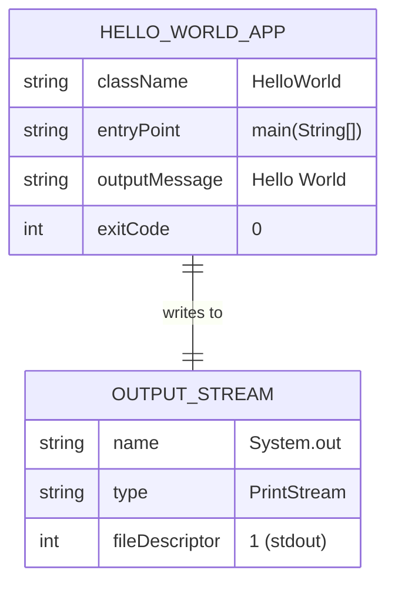

### 8.2 Design Patterns Identified

| Pattern | Location | Description |
|---------|---------|-------------|
| **Entry Point Pattern** | `main(String[] args)` | JVM mandated application bootstrap pattern. |
| **Static Utility Method** | `main` is `static` | No object instantiation required — direct class-level invocation. |
| **Facade (minimal)** | `System.out` | `System` class acts as a facade over the underlying `FileOutputStream` for stdout. |

### 8.3 Architecture Patterns

| Pattern | Applied? | Notes |
|---------|---------|-------|
| Layered Architecture | ❌ | Single layer — no separation of concerns needed at this scale. |
| Hexagonal / Ports & Adapters | ❌ | No domain logic to isolate; trivially simple output. |
| MVC | ❌ | No user interface, no model, no controller. |
| Pipeline | ✅ (implicit) | Source → Compile → Load → Execute → Output is a linear pipeline. |

### 8.4 Error Handling

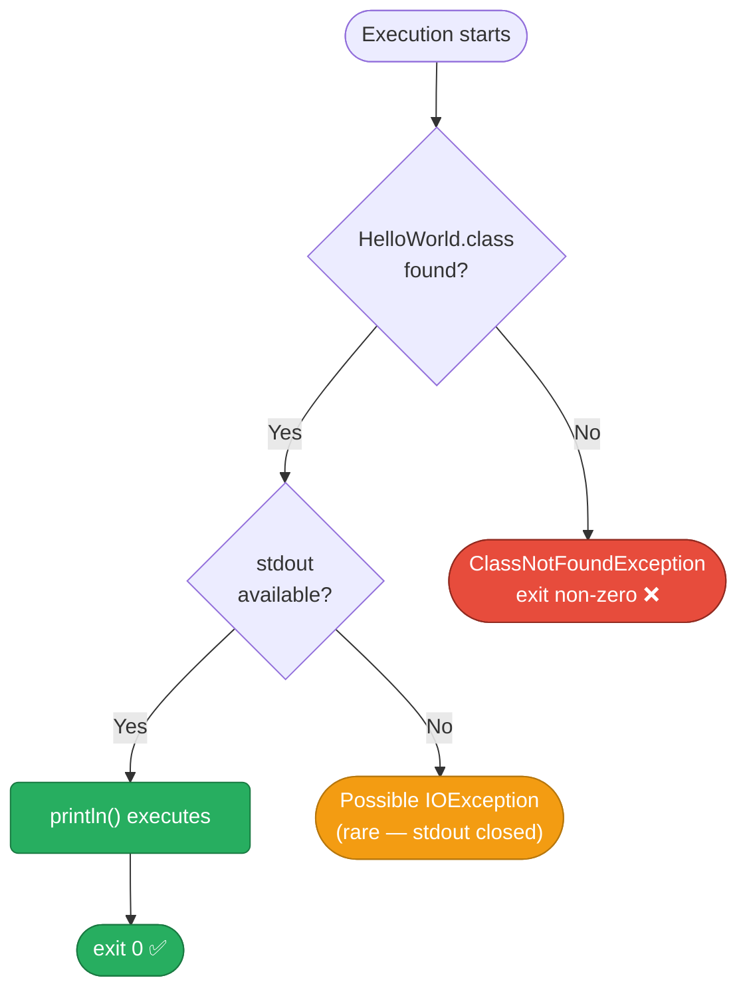

> **Note**: The application contains no explicit `try/catch` blocks. All error handling is
> delegated to the JVM's default uncaught exception handler, which prints a stack trace to
> `stderr` and exits with a non-zero code.

### 8.5 Logging and Observability

| Aspect | Current State | Recommendation |
|--------|-------------|----------------|
| Application logging | None (output IS the application) | N/A for this scope |
| Structured logging | None | N/A |
| Metrics | None | N/A |
| Tracing | None | N/A |
| Health checks | None | N/A |

### 8.6 Security Concepts

| Concern | Assessment |
|---------|-----------|
| Input validation | No user input is processed; `args` array is ignored. |
| Output sanitisation | Output is a hard-coded string literal — no injection risk. |
| Dependency vulnerabilities | No dependencies — zero CVE surface. |
| Code injection | Impossible — no dynamic evaluation. |

---

## 9. Architecture Decisions

### ADR-001 — Use Java as the Implementation Language

| Field | Value |
|-------|-------|
| **Status** | Accepted |
| **Date** | Initial commit |
| **Context** | A minimal "Hello World" program is needed to validate developer toolchains and serve as a Copilot agent test target. |
| **Decision** | Implement the program in Java. |
| **Rationale** | Java is a mainstream, platform-independent language with ubiquitous toolchain support. It is a natural choice for a developer sandbox repository. |
| **Consequences** | Requires JDK to compile; produces `.class` bytecode artefacts (excluded via `.gitignore`). |
| **Alternatives considered** | Python (`print("Hello World")`), C (`printf`), Bash (`echo`) — all rejected in favour of Java given the repository naming convention suggests Java usage. |

---

### ADR-002 — No Build Tool

| Field | Value |
|-------|-------|
| **Status** | Accepted |
| **Date** | Initial commit |
| **Context** | The application is a single `.java` file with zero dependencies. |
| **Decision** | Do not add Maven, Gradle, or any other build tool. |
| **Rationale** | Adding a build tool would introduce unnecessary complexity and configuration for a program with a single source file and no dependencies. |
| **Consequences** | Compilation must be performed manually with `javac`. There is no standard way to run tests via a build lifecycle. |
| **Alternatives considered** | Maven (`pom.xml`), Gradle (`build.gradle`) — both rejected as over-engineering. |

---

### ADR-003 — Ignore Compiled Artefacts via `.gitignore`

| Field | Value |
|-------|-------|
| **Status** | Accepted |
| **Date** | Initial commit |
| **Context** | Java compilation produces `.class` binary files alongside source files. |
| **Decision** | Add `*.class` to `.gitignore`. |
| **Rationale** | Compiled artefacts are derived outputs; they should not be version-controlled. Source code is the single source of truth. |
| **Consequences** | Users must compile the source before running. Compilation outputs are never committed. |

---

### ADR-004 — Hard-code the Output String

| Field | Value |
|-------|-------|
| **Status** | Accepted |
| **Date** | Initial commit |
| **Context** | The program must output the string `"Hello World"`. |
| **Decision** | Use a string literal directly in the `println` call. |
| **Rationale** | No configuration, externalisation, or parameterisation is needed. The output is fixed and deterministic. |
| **Consequences** | Output cannot be changed without modifying source code. This is intentional for this use case. |
| **Alternatives considered** | Reading from `args[0]`, reading from a properties file — both rejected as unnecessary complexity. |

---

## 10. Quality Requirements

### 10.1 Quality Tree

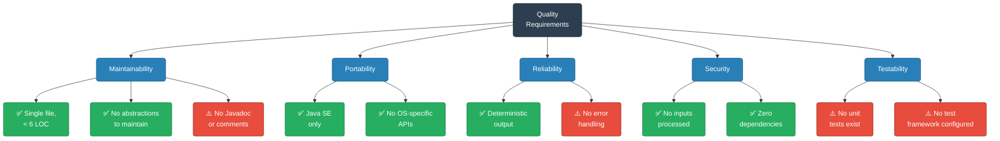

### 10.2 Quality Scenarios

| ID | Quality Attribute | Stimulus | Response | Measure |
|----|-----------------|---------|---------|---------|
| QS-01 | **Performance** | User invokes `java HelloWorld` | Output appears on terminal | < 500 ms (JVM startup dominated) |
| QS-02 | **Reliability** | Any supported JVM | Program completes successfully | 100% success rate (no failure modes in program logic) |
| QS-03 | **Portability** | Any OS (Linux/macOS/Windows) with JDK 8+ | Program compiles and runs | 0 platform-specific failures |
| QS-04 | **Maintainability** | Developer reads source | Understands entire program | < 30 seconds to understand |
| QS-05 | **Security** | Malicious input via `args` | No unexpected behaviour | `args` silently ignored; no vulnerabilities |

### 10.3 Code Metrics

| Metric | Value | Assessment |
|--------|-------|-----------|
| Lines of Code (LOC) | 5 (non-blank) | ✅ Minimal |
| Classes | 1 | ✅ Single responsibility |
| Methods | 1 | ✅ Single entry point |
| Cyclomatic Complexity | 1 | ✅ No branches |
| External Dependencies | 0 | ✅ Self-contained |
| Test Coverage | 0% | ⚠️ No tests |
| Documentation Coverage | 0% | ⚠️ No Javadoc |
| Build Tool | None | ⚠️ Manual compilation |

---

## 11. Risks and Technical Debt

### 11.1 Risk Register

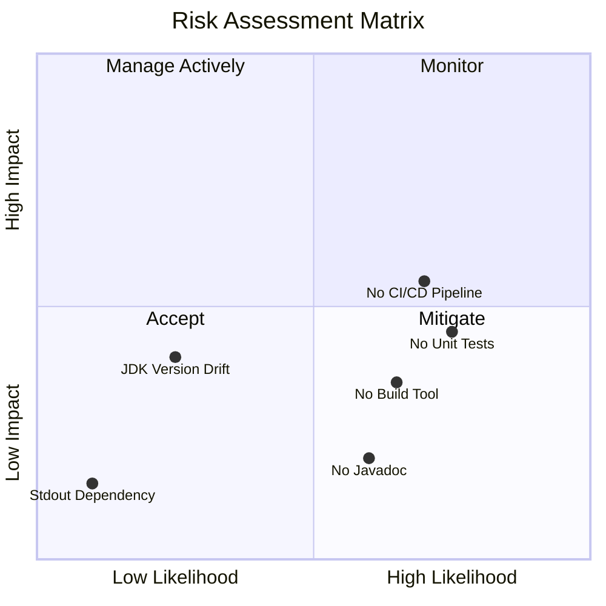

### 11.2 Identified Risks

| ID | Risk | Likelihood | Impact | Category | Mitigation |
|----|------|-----------|--------|---------|-----------|
| RK-01 | **No automated tests** — Regressions cannot be caught automatically. | High | Medium | Technical | Add JUnit 5 test class; configure Maven/Gradle. |
| RK-02 | **No CI/CD pipeline** — Changes are not automatically validated on push. | High | Medium | Process | Add `.github/workflows/build.yml` with compile + run step. |
| RK-03 | **No build tool** — Onboarding friction; no standard lifecycle. | High | Low | Technical | Add Maven wrapper (`mvnw`) or Gradle wrapper (`gradlew`). |
| RK-04 | **No Javadoc / comments** — Future maintainers lack inline documentation. | Medium | Low | Quality | Add class-level and method-level Javadoc. |
| RK-05 | **JDK version not pinned** — Behaviour may subtly differ across JDK versions. | Low | Medium | Technical | Add `.java-version` or document minimum JDK in README. |
| RK-06 | **Sparse README** — Minimal project description; no build/run instructions. | High | Low | Documentation | Expand README with prerequisites, build steps, and usage. |

### 11.3 Technical Debt Summary

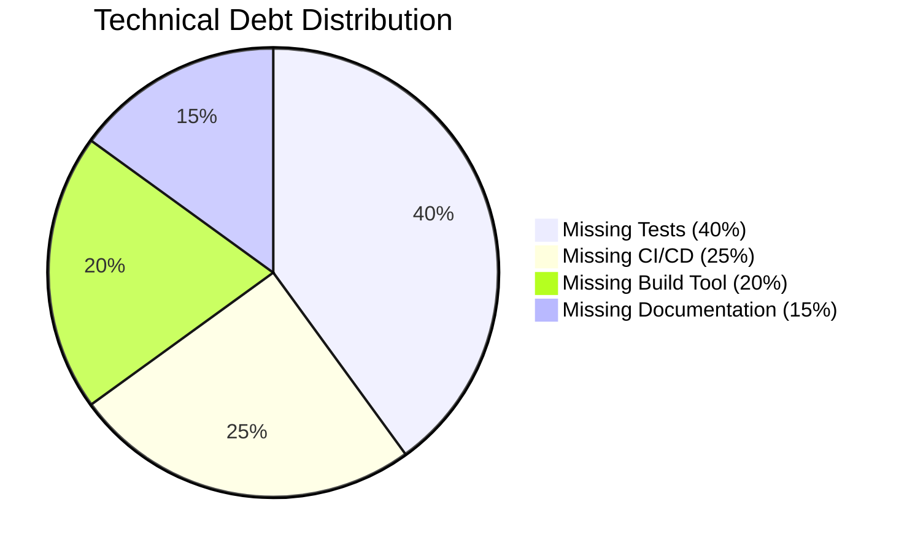

| Debt Item | Effort to Resolve | Value of Resolving |
|-----------|-----------------|-------------------|
| Add JUnit 5 unit test | 1 hour | Automated regression detection |
| Add GitHub Actions workflow | 30 minutes | Continuous validation on every push |
| Add Maven/Gradle build file | 30 minutes | Standard lifecycle, dependency management |
| Add Javadoc to `HelloWorld` | 15 minutes | Inline documentation for future readers |
| Expand README | 30 minutes | Better developer onboarding |
| Pin JDK version | 10 minutes | Reproducible builds across environments |

### 11.4 Recommended Improvement Roadmap

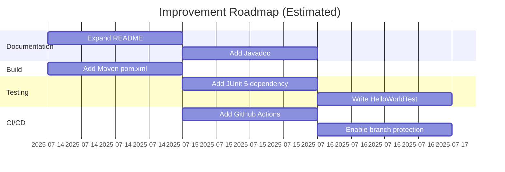

---

## 12. Glossary

| Term | Definition |
|------|-----------|
| **Arc42** | A template for software architecture documentation structured into 12 sections. Originally created by Gernot Starke and Peter Hruschka. |
| **Bytecode** | Platform-independent binary instructions produced by `javac` and stored in `.class` files, interpreted or JIT-compiled by the JVM at runtime. |
| **CI/CD** | Continuous Integration / Continuous Deployment — automated pipelines that build, test, and deploy software on every code change. |
| **ClassLoader** | A JVM subsystem responsible for locating and loading `.class` files into the runtime environment. |
| **Classpath** | A parameter passed to the JVM that specifies where to look for `.class` files and JAR archives. |
| **Cyclomatic Complexity** | A software metric measuring the number of linearly independent paths through a program's source code. A value of 1 means no branching. |
| **Entry Point** | The method invoked by the JVM to start a Java application: `public static void main(String[] args)`. |
| **fd-1** | File descriptor 1 — the POSIX standard output stream. `System.out` in Java maps to this descriptor. |
| **Hello World** | A traditional first program in any programming language; prints the string `"Hello World"` to verify a working toolchain. |
| **JDK** | Java Development Kit — includes the Java compiler (`javac`), the JVM (`java`), and standard libraries. |
| **JRE** | Java Runtime Environment — a subset of the JDK sufficient to *run* (but not compile) Java programs. |
| **JVM** | Java Virtual Machine — the runtime engine that executes Java bytecode, providing platform independence. |
| **`java.lang`** | The core Java package automatically imported into every Java source file. Contains `String`, `System`, `Object`, and other fundamental types. |
| **javac** | The Java source-to-bytecode compiler included in the JDK. Invoked as `javac FileName.java`. |
| **LOC** | Lines of Code — a simple measure of program size. |
| **Mermaid** | A Markdown-embedded diagramming language that renders diagrams from text definitions. |
| **PrintStream** | The Java class (`java.io.PrintStream`) that implements `System.out`, providing `print()`, `println()`, and `printf()` methods. |
| **`public static void main`** | The standard JVM application entry point signature. `public` — accessible by JVM; `static` — no instance needed; `void` — no return value; `main` — conventional name; `String[] args` — command-line arguments. |
| **stdout** | Standard output — the default output stream for a process, typically connected to the terminal. Accessed in Java via `System.out`. |
| **Technical Debt** | The implied cost of future rework caused by choosing a quick or easy solution now instead of a better approach that would take longer. |

---

*Documentation generated by the **Arc42 Documentation Generator** agent.*  
*Source repository: `copilot-test-ktruchcz`*  
*All diagrams rendered with [Mermaid](https://mermaid.js.org/).*
