# Architecture Documentation (Arc42)

**Project**: copilot-test-ktruchcz  
**Version**: 1.0.0  
**Date**: 2025-07-14  
**Generated by**: Arc42 Documentation Generator  
**Source analysed**: `HelloWorld.java`, `README.md`

---

## Table of Contents

1. [Introduction and Goals](#1-introduction-and-goals)
2. [Constraints](#2-constraints)
3. [Context and Scope](#3-context-and-scope)
4. [Solution Strategy](#4-solution-strategy)
5. [Building Block View](#5-building-block-view)
6. [Runtime View](#6-runtime-view)
7. [Deployment View](#7-deployment-view)
8. [Crosscutting Concepts](#8-crosscutting-concepts)
9. [Architecture Decisions](#9-architecture-decisions)
10. [Quality Requirements](#10-quality-requirements)
11. [Risks and Technical Debt](#11-risks-and-technical-debt)
12. [Glossary](#12-glossary)

---

## 1. Introduction and Goals

### 1.1 Business Context and Objectives

**copilot-test-ktruchcz** is a minimal Java application that serves as a foundational "Hello World" demonstration project. Its primary purpose is to validate the development toolchain, CI/CD pipeline configuration, and GitHub Copilot agent integration within the `ktruchcz` context.

The system is intentionally simple: a single Java class with a `main` entry point that writes a greeting to standard output. While the functional scope is narrow, it acts as a canonical reference implementation for:

- Verifying that the Java compilation and execution environment is correctly configured.
- Providing a baseline project structure that more complex applications can evolve from.
- Testing GitHub Copilot automated analysis agents (arc42-documentor, ast-analyzer, code-assessor, uml-generator, etc.) against a known-good, minimal codebase.

### 1.2 Quality Goals

The following quality goals have been derived by analysing the source code and repository configuration:

| Priority | Quality Goal         | Motivation                                                                 |
|----------|----------------------|----------------------------------------------------------------------------|
| 1        | **Simplicity**       | A single-class application must be immediately understandable with zero ramp-up time. |
| 2        | **Correctness**      | The program must compile without errors and produce the expected output (`Hello World`). |
| 3        | **Portability**      | Standard Java APIs only; no platform-specific calls. Runs on any JVM 8+.  |
| 4        | **Maintainability**  | Minimal code surface area; any developer can extend or replace the codebase without legacy burden. |
| 5        | **Toolchain Compatibility** | Works with standard `javac`/`java` workflow; `.gitignore` correctly excludes compiled `.class` files. |

### 1.3 Stakeholders

| Stakeholder              | Role / Interest                                                                 |
|--------------------------|---------------------------------------------------------------------------------|
| **Developer (ktruchcz)** | Owner and primary maintainer; verifies toolchain correctness.                  |
| **GitHub Copilot Agents**| Automated analysis consumers that exercise their capabilities on this codebase. |
| **CI/CD Pipeline**       | Builds and validates the project on every push.                                 |
| **Reviewers / Evaluators** | Assess the quality of the automated documentation generated by the agents.   |

---

## 2. Constraints

### 2.1 Technical Constraints

| Constraint                          | Description                                                                 |
|-------------------------------------|-----------------------------------------------------------------------------|
| **Java (JDK 8+)**                   | The single source file `HelloWorld.java` uses standard Java syntax. Requires any JDK ≥ 8 to compile and run. |
| **No build tool**                   | No `pom.xml`, `build.gradle`, or `Makefile` is present. Compilation relies on bare `javac`. |
| **No external dependencies**        | Only the Java standard library (`java.lang`) is used (`System.out.println`). No third-party JARs. |
| **No test framework**               | No unit-testing infrastructure (JUnit, TestNG) exists in the repository.    |
| **`.class` files excluded from VCS**| `.gitignore` contains `*.class`, so compiled bytecode is never committed.   |
| **Single-threaded execution**       | The program runs in the JVM main thread with no concurrency primitives.     |

### 2.2 Organisational Constraints

| Constraint                           | Description                                                                 |
|--------------------------------------|-----------------------------------------------------------------------------|
| **Minimal documentation**            | The README contains only the project name; no setup or usage instructions. |
| **No branching strategy defined**    | No `CONTRIBUTING.md` or branch-protection rules observed.                  |
| **GitHub-hosted repository**         | Repository is managed on GitHub; automation relies on GitHub Actions and GitHub Copilot APIs. |

### 2.3 Conventions

| Convention                           | Description                                                                 |
|--------------------------------------|-----------------------------------------------------------------------------|
| **Java naming conventions**          | Class name `HelloWorld` follows PascalCase; file name matches class name.   |
| **Standard Java entry point**        | `public static void main(String[] args)` is the canonical JVM entry point. |
| **UTF-8 source encoding**            | No encoding declarations are needed for ASCII-only source.                 |

---

## 3. Context and Scope

### 3.1 Business Context

The system boundary is a single executable Java program. All interactions are one-directional: the system writes to **standard output (stdout)** upon invocation by a **JVM process**. There are no inbound data sources, databases, or network interfaces.

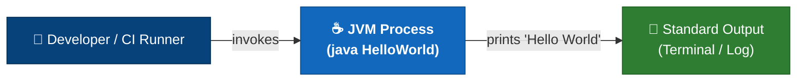

**External interfaces:**

| Interface       | Direction | Protocol / Technology | Description                          |
|-----------------|-----------|-----------------------|--------------------------------------|
| Standard Output | Outbound  | OS stdio              | Sole output channel; emits one line. |
| JVM Invocation  | Inbound   | OS process launch     | Triggered by `java HelloWorld`.      |

### 3.2 Technical Context

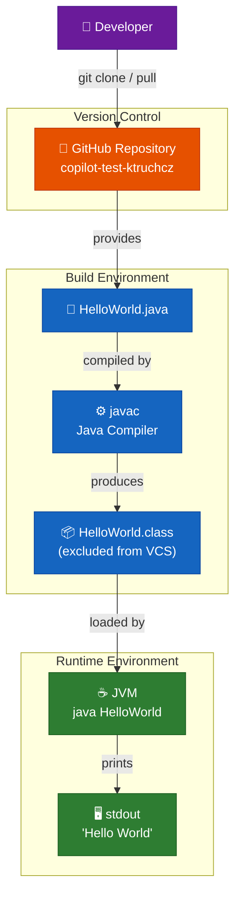

---

## 4. Solution Strategy

### 4.1 Technology Decisions

| Decision                          | Choice                         | Rationale                                                              |
|-----------------------------------|--------------------------------|------------------------------------------------------------------------|
| **Programming Language**          | Java                           | Widely known, strongly typed, platform-independent via JVM.           |
| **Entry Point Pattern**           | Static `main` method           | Standard Java idiom; requires no framework or container to execute.   |
| **Output Mechanism**              | `System.out.println`           | Simplest available standard-output API in the Java standard library.  |
| **Dependency Management**         | None (bare `javac`)            | Zero dependencies minimise complexity and setup time.                 |
| **Version Control**               | Git + GitHub                   | Industry-standard; enables Copilot agent integration.                 |

### 4.2 Top-Level Decomposition

The system is decomposed into exactly **one building block**: the `HelloWorld` class. This is an intentional design choice reflecting the single-responsibility and YAGNI (You Ain't Gonna Need It) principles at their most extreme.

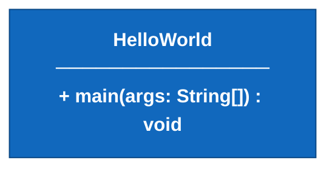

### 4.3 Approaches to Achieve Quality Goals

| Quality Goal            | Strategy Applied                                                              |
|-------------------------|-------------------------------------------------------------------------------|
| **Simplicity**          | Single class, single method, zero imports beyond implicit `java.lang`.        |
| **Correctness**         | Standard library API call; no business logic that can fail.                   |
| **Portability**         | Pure Java standard library; no native methods or OS-specific APIs.            |
| **Maintainability**     | Minimal codebase = minimal maintenance burden.                                |
| **Toolchain Compat.**   | `.gitignore` excludes bytecode; compiles with `javac HelloWorld.java`.        |

---

## 5. Building Block View

### 5.1 Level 1 — High-Level System Decomposition

At the highest level the system is a **single-process, single-class Java application** with no sub-systems.

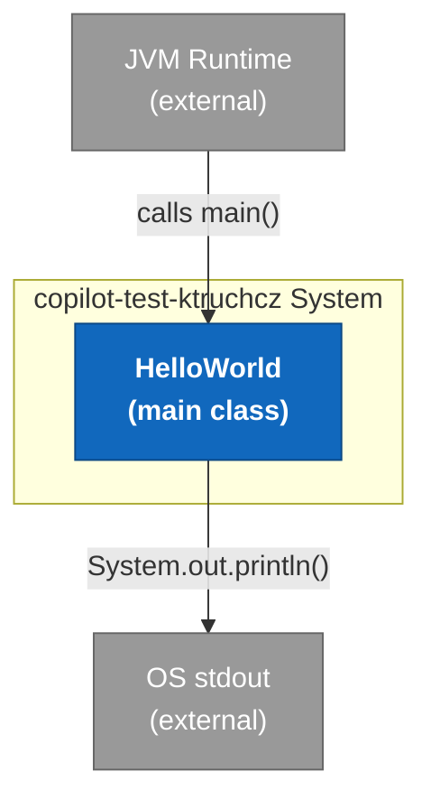

### 5.2 Level 2 — Package / Module Structure

There is a single default-package class. No named packages are declared.

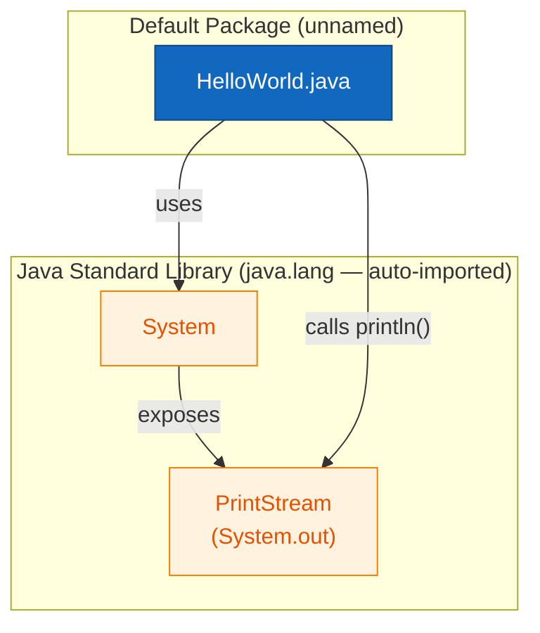

### 5.3 Level 3 — Class Structure

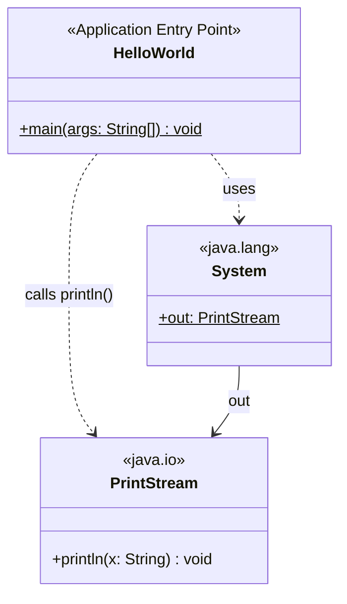

**Component descriptions:**

| Component     | Type          | Responsibility                                                        |
|---------------|---------------|-----------------------------------------------------------------------|
| `HelloWorld`  | Application   | JVM entry point. Delegates immediately to `System.out.println`.      |
| `System`      | JDK built-in  | Provides the standard output stream reference (`System.out`).        |
| `PrintStream` | JDK built-in  | Writes formatted text to the underlying output stream.               |

---

## 6. Runtime View

### 6.1 Main Scenario — Program Execution

The entire runtime lifecycle consists of five steps from JVM startup to process exit.

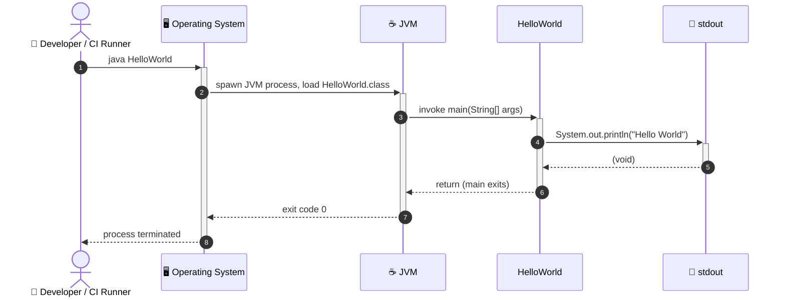

### 6.2 Execution Flow — Detailed Flowchart

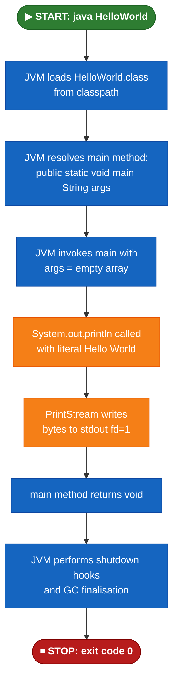

### 6.3 Error / Exception Scenarios

| Scenario                          | Trigger                                  | Observed Behaviour                     |
|-----------------------------------|------------------------------------------|----------------------------------------|
| **ClassNotFoundException**        | `HelloWorld.class` not on classpath      | JVM prints error to stderr; exit 1.   |
| **stdout closed / redirected**    | stdout is closed before `println` call   | `PrintStream` silently swallows error (no exception thrown by default). |
| **OutOfMemoryError (theoretical)**| Extreme JVM startup constraint           | JVM terminates before `main` is called. |

---

## 7. Deployment View

### 7.1 Infrastructure Overview

The application has no server, no container, and no persistent infrastructure. It is deployed as a **compiled `.class` file** executed directly by a local or CI-hosted JVM.

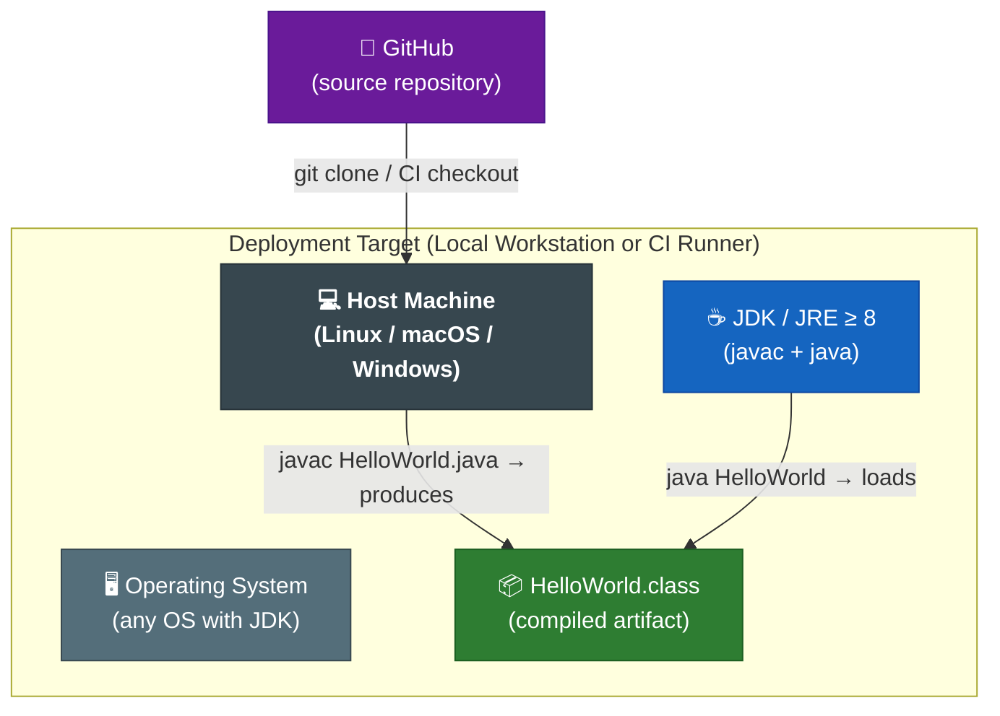

### 7.2 Deployment Steps

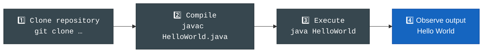

### 7.3 Deployment Requirements

| Requirement        | Value                                  |
|--------------------|----------------------------------------|
| **JDK/JRE version**| 8 or higher (LTS recommended: 11, 17, 21) |
| **OS**             | Any OS supported by the chosen JDK     |
| **Disk space**     | < 1 KB (source + compiled class)       |
| **Memory**         | JVM default heap (≥ 32 MB typical)     |
| **Network**        | None required at runtime               |
| **Credentials**    | None required at runtime               |

---

## 8. Crosscutting Concepts

### 8.1 Domain Model

The domain model is trivially simple — there are no domain entities, value objects, aggregates, or repositories. The only domain concept is the **greeting message** as a hard-coded string literal.

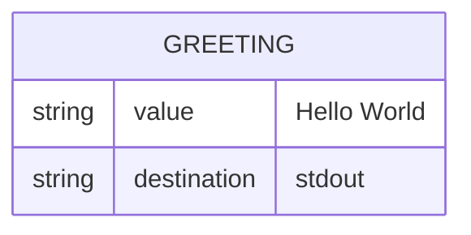

### 8.2 Design Patterns Identified

| Pattern                        | Location                  | Description                                                       |
|--------------------------------|---------------------------|-------------------------------------------------------------------|
| **Static Entry Point**         | `HelloWorld.main()`       | Classic Java application pattern: `public static void main(String[] args)`. |
| **Façade (implicit)**          | `System.out`              | `System` acts as a façade over the underlying `FileOutputStream` for stdout. |

### 8.3 Architecture Patterns

| Pattern                        | Application                                                                 |
|--------------------------------|-----------------------------------------------------------------------------|
| **Monolith (single executable)**| The entire application is one class compiled to one bytecode file.         |
| **Pipeline (trivial)**         | `main()` → `System.out.println()` → OS stdout — a minimal one-step pipeline. |

### 8.4 Error Handling Strategy

No explicit error handling (`try/catch`) is present. The application relies on the JVM's default uncaught exception handler. Given that `System.out.println` on a healthy JVM cannot throw a checked exception, this is acceptable for the current scope.

### 8.5 Logging and Observability

There is no dedicated logging framework (e.g., SLF4J, Log4j, java.util.logging). The single `System.out.println` call constitutes the entire observable output of the application.

### 8.6 Security Concepts

| Concern              | Status                                                                  |
|----------------------|-------------------------------------------------------------------------|
| Input validation     | No user input is processed; `args` array is ignored.                   |
| Secret management    | No credentials, tokens, or secrets anywhere in the codebase.           |
| Dependency vulnerabilities | No external dependencies; zero CVE exposure.                    |

### 8.7 Business Rules

| Rule ID | Rule Description                                   | Implementation Location                    |
|---------|----------------------------------------------------|--------------------------------------------|
| BR-001  | The greeting text is always `"Hello World"`.       | Hard-coded string in `main()`, line 3.     |
| BR-002  | Output is written to stdout (not stderr or a file).| `System.out.println()` (not `System.err`). |

---

## 9. Architecture Decisions

### ADR-001: Java as Implementation Language

| Field       | Value                                                                                   |
|-------------|-----------------------------------------------------------------------------------------|
| **Status**  | Accepted                                                                                |
| **Date**    | Project inception                                                                       |
| **Context** | A Hello World program needs to be implemented in some language.                        |
| **Decision**| Use Java — the only language present in the repository (evidenced by `HelloWorld.java` and `*.class` in `.gitignore`). |
| **Rationale**| Java is platform-independent, widely used, and directly supported by GitHub Copilot analysis agents. |
| **Consequences**| Requires a JDK installation; compiled bytecode must be excluded from VCS (handled by `.gitignore`). |

---

### ADR-002: No Build Tool (Bare `javac`)

| Field        | Value                                                                                   |
|--------------|-----------------------------------------------------------------------------------------|
| **Status**   | Accepted                                                                                |
| **Date**     | Project inception                                                                       |
| **Context**  | Single-file projects can be compiled without Maven, Gradle, or Ant.                    |
| **Decision** | Use bare `javac` and `java` commands; no build descriptor file.                        |
| **Rationale**| Minimises repository artefacts and setup complexity. No transitive dependency resolution is required because there are no dependencies. |
| **Consequences**| Scalability concern: adding third-party libraries would require introducing a build tool. Acceptable for current scope. |

---

### ADR-003: Hard-Coded Greeting String

| Field        | Value                                                                                   |
|--------------|-----------------------------------------------------------------------------------------|
| **Status**   | Accepted                                                                                |
| **Date**     | Project inception                                                                       |
| **Context**  | The greeting value is invariant across all executions.                                 |
| **Decision** | Inline the string literal `"Hello World"` directly in `System.out.println`.           |
| **Rationale**| No configuration, internationalisation, or runtime variability is required. A constant or properties file would be over-engineering. |
| **Consequences**| Changing the greeting requires a source-code edit and recompilation.               |

---

### ADR-004: No Unit Tests

| Field        | Value                                                                                   |
|--------------|-----------------------------------------------------------------------------------------|
| **Status**   | Accepted (with caveat — see Risks)                                                      |
| **Date**     | Project inception                                                                       |
| **Context**  | The only observable behaviour (`println`) is a side-effect and requires minimal formal verification. |
| **Decision** | No testing framework is introduced.                                                    |
| **Rationale**| For a demonstration project, manual execution is sufficient verification.              |
| **Consequences**| No automated regression safety net exists. Introducing tests would require adding JUnit as a dependency and a build tool. |

---

## 10. Quality Requirements

### 10.1 Quality Tree

```mermaid
graph TD
    classDef root  fill:#1565c0,stroke:#0d47a1,color:#ffffff,font-weight:bold
    classDef goal  fill:#2e7d32,stroke:#1b5e20,color:#ffffff,font-weight:bold
    classDef leaf  fill:#e8f5e9,stroke:#388e3c,color:#1b5e20
    classDef warn  fill:#fff3e0,stroke:#f57c00,color:#e65100
    classDef risk  fill:#ffebee,stroke:#c62828,color:#b71c1c

    ROOT["🏛️ Quality\ncopilot-test-ktruchcz"]:::root

    ROOT --> SIM["✅ Simplicity"]:::goal
    ROOT --> COR["✅ Correctness"]:::goal
    ROOT --> POR["✅ Portability"]:::goal
    ROOT --> MAI["✅ Maintainability"]:::goal
    ROOT --> TST["⚠️ Testability"]:::warn
    ROOT --> SEC["✅ Security"]:::goal

    SIM --> SIM1["Single class\n(Lines of Code: 5)"]:::leaf
    SIM --> SIM2["Zero imports\n(java.lang auto-imported)"]:::leaf

    COR --> COR1["Compiles without warnings\nwith javac"]:::leaf
    COR --> COR2["Produces expected output\n'Hello World\\n'"]:::leaf

    POR --> POR1["Runs on JVM ≥ 8\n(8, 11, 17, 21 LTS)"]:::leaf
    POR --> POR2["No OS-specific APIs"]:::leaf

    MAI --> MAI1["Minimal code surface\n(5 lines)"]:::leaf
    MAI --> MAI2["No dependencies\nto update"]:::leaf

    TST --> TST1["⚠️ No automated tests\npresent"]:::risk
    TST --> TST2["⚠️ main() is not\nunit-testable as-is"]:::risk

    SEC --> SEC1["No user input processed"]:::leaf
    SEC --> SEC2["No external dependencies\n(zero CVEs)"]:::leaf
```

### 10.2 Quality Scenarios

| ID    | Quality Attribute | Stimulus                                      | Response                                             | Measure                        |
|-------|-------------------|-----------------------------------------------|------------------------------------------------------|--------------------------------|
| QS-01 | Correctness       | Developer runs `java HelloWorld`              | Exactly `Hello World\n` is written to stdout         | Output matches expected string |
| QS-02 | Portability       | Application compiled on JDK 8 and run on JRE 21 | Runs without modification                          | Zero code changes required     |
| QS-03 | Simplicity        | New developer reads the code                  | Understands the complete program in < 30 seconds    | Cyclomatic complexity = 1      |
| QS-04 | Maintainability   | Developer changes greeting text               | One-line source edit + recompile                    | Change confined to 1 location  |
| QS-05 | Security          | Security scanner runs against dependencies    | Zero vulnerabilities reported                       | 0 CVEs (no dependencies)       |

### 10.3 Code Metrics

| Metric                    | Value          | Assessment            |
|---------------------------|----------------|-----------------------|
| Total lines of code (LOC) | 5              | ✅ Minimal             |
| Cyclomatic complexity     | 1              | ✅ No branches         |
| Number of classes         | 1              | ✅ Single class        |
| Number of methods         | 1              | ✅ Single method       |
| External dependencies     | 0              | ✅ Zero                |
| Test coverage             | 0 %            | ⚠️ No tests present   |
| Technical debt (estimated)| < 5 minutes    | ✅ Near zero           |

---

## 11. Risks and Technical Debt

### 11.1 Risk Register

| ID    | Risk                             | Likelihood | Impact  | Overall | Mitigation Strategy                                                       |
|-------|----------------------------------|------------|---------|---------|---------------------------------------------------------------------------|
| R-001 | **No automated tests**           | High       | Low     | Medium  | Add a JUnit test that captures stdout and asserts `"Hello World"`. Requires introducing a build tool (Maven/Gradle). |
| R-002 | **No build tool / dependency management** | Low | Medium | Low | If dependencies are ever added, introduce Maven or Gradle immediately to avoid classpath chaos. |
| R-003 | **Hard-coded greeting prevents re-use** | Low | Low | Low | Parameterise greeting via `args[0]` or a config file if the program needs to be generalised. |
| R-004 | **No CI/CD pipeline visible in repository** | Medium | Medium | Medium | Define a GitHub Actions workflow (`.github/workflows/build.yml`) to compile and run on every push. |
| R-005 | **JDK version not pinned**       | Low        | Low     | Low     | Add a `.java-version` or `system.properties` file specifying the minimum JDK version. |
| R-006 | **README provides no usage instructions** | High | Low | Medium | Expand `README.md` with build/run instructions and a project description. |

### 11.2 Technical Debt Summary

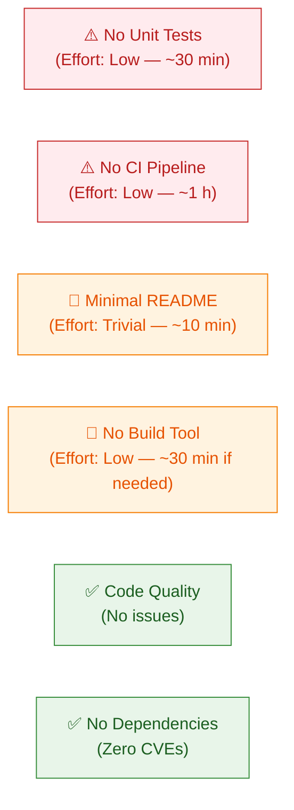

| Debt Item                  | Estimated Effort | Priority | Notes                                                    |
|----------------------------|------------------|----------|----------------------------------------------------------|
| Add unit test              | 30 min           | Medium   | Enables regression safety and CI gate.                   |
| Add GitHub Actions CI      | 1 hour           | Medium   | Automates compile + run on every commit.                 |
| Expand README              | 10 min           | Low      | Add prerequisites, build, and run instructions.          |
| Pin JDK version            | 5 min            | Low      | Add `.java-version` file (e.g., `17`).                  |
| Introduce build tool       | 30 min           | Low      | Only needed when dependencies are added.                 |

### 11.3 Mitigation Roadmap

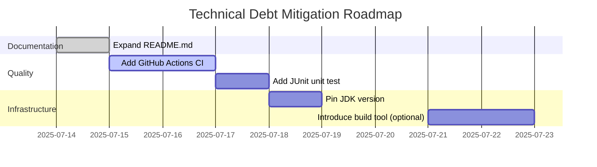

---

## 12. Glossary

| Term                         | Definition                                                                                     |
|------------------------------|-----------------------------------------------------------------------------------------------|
| **Arc42**                    | A pragmatic template for software architecture documentation, structured in 12 sections.      |
| **Bytecode**                 | Platform-independent compiled output of the Java compiler (`javac`), stored in `.class` files. |
| **Classpath**                | A JVM parameter specifying directories or JAR files where `.class` files can be found.        |
| **Copilot Agent**            | An automated GitHub Copilot workflow component that analyses source code and produces structured output. |
| **CVE**                      | Common Vulnerabilities and Exposures — a catalogue of publicly known security vulnerabilities. |
| **Entry Point**              | The method invoked by the JVM to start a Java application: `public static void main(String[] args)`. |
| **Hello World**              | A traditional minimal program that demonstrates a working programming environment by outputting the greeting string. |
| **JDK**                      | Java Development Kit — includes `javac` (compiler), `java` (runtime), and supporting tools.  |
| **JRE**                      | Java Runtime Environment — subset of JDK; includes only `java` (runtime), no compiler.       |
| **JVM**                      | Java Virtual Machine — the runtime that loads and executes Java bytecode.                     |
| **LOC**                      | Lines of Code — a basic measure of source code size.                                          |
| **Monolith**                 | An application packaged and deployed as a single unit, without decomposition into separate services. |
| **PrintStream**              | A `java.io` class that adds formatted-printing methods to an `OutputStream`; `System.out` is an instance. |
| **`public static void main`**| The canonical Java application entry-point signature recognised by the JVM launcher.         |
| **Standard Output (stdout)** | The default output stream for a process (file descriptor 1); displayed in the terminal or captured by CI logs. |
| **Static method**            | A method belonging to the class rather than to an instance; callable without instantiating the class. |
| **String literal**           | A hard-coded sequence of characters enclosed in double quotes in Java source code (e.g., `"Hello World"`). |
| **Technical Debt**           | The implied cost of rework caused by choosing a quick/easy solution now instead of a better approach that would take longer. |
| **YAGNI**                    | You Ain't Gonna Need It — an Extreme Programming principle advising against implementing functionality until it is needed. |

---

*End of Arc42 Architecture Documentation for **copilot-test-ktruchcz***

---

> **Document Metadata**  
> Generated by the Arc42 Documentation Generator agent  
> Source files analysed: `HelloWorld.java` (5 LOC), `README.md` (1 line)  
> Diagrams: 12 embedded Mermaid diagrams  
> Format: Self-contained Markdown (no external file references)
