# Architecture Documentation (Arc42)

**Project**: `copilot-test-ktruchcz` — HelloWorld Java Application
**Version**: 1.0.0
**Date**: 2025-01-01
**Generated by**: Arc42 Documentation Generator (arc42-documentor agent)
**Source Repository**: `copilot-test-ktruchcz`

---

## Table of Contents

1. [Introduction and Goals](#1-introduction-and-goals)
2. [Architecture Constraints](#2-architecture-constraints)
3. [System Scope and Context](#3-system-scope-and-context)
4. [Solution Strategy](#4-solution-strategy)
5. [Building Block View](#5-building-block-view)
6. [Runtime View](#6-runtime-view)
7. [Deployment View](#7-deployment-view)
8. [Cross-cutting Concepts](#8-cross-cutting-concepts)
9. [Architecture Decisions](#9-architecture-decisions)
10. [Quality Requirements](#10-quality-requirements)
11. [Risks and Technical Debt](#11-risks-and-technical-debt)
12. [Glossary](#12-glossary)

---

## 1. Introduction and Goals

> **Source analysis**: `HelloWorld.java` (5 lines), `README.md` (1 line — project title only).

### 1.1 Purpose of This Document

This document describes the software architecture of the **HelloWorld** Java application
contained in the `copilot-test-ktruchcz` repository. Although the application is intentionally
minimal, this Arc42 documentation provides a complete, formally structured reference that
demonstrates best-practice architecture documentation and serves as a template baseline for
future growth of the project.

### 1.2 Business / Project Goals

| ID | Goal | Priority |
|----|------|----------|
| G-01 | Demonstrate a working Java program that produces visible output | High |
| G-02 | Provide a clean, compilable baseline for the `copilot-test-ktruchcz` repository | High |
| G-03 | Serve as a teaching/reference example for Java entry-point structure | Medium |
| G-04 | Act as a scaffold for future feature development | Low |

### 1.3 Quality Goals

The top quality attributes driving architectural decisions for this system are:

| Priority | Quality Attribute | Motivation |
|----------|-------------------|-----------|
| 1 | **Simplicity** | The application must be understandable in a single reading. Zero unnecessary complexity. |
| 2 | **Correctness** | The program must compile without errors and produce the exact expected output (`Hello World`). |
| 3 | **Portability** | Must run on any platform with a standard JRE — no OS-specific dependencies. |
| 4 | **Maintainability** | Code structure must be easy to extend for future contributors. |
| 5 | **Learnability** | Acts as an onboarding artifact; any Java developer must understand it instantly. |

### 1.4 Stakeholders

| Role | Name / Group | Expectations |
|------|-------------|--------------|
| **Developer / Owner** | Repository owner (`ktruchcz`) | Working Java program, clean repo structure |
| **Future Contributors** | Open-source community | Clear entry point, easy to extend |
| **CI/CD System** | GitHub Actions (potential) | Compilable, testable source |
| **Architecture Reviewers** | Technical leads | Documented decisions and structure |
| **Learners / Students** | Java beginners | Understandable code and documentation |

---

## 2. Architecture Constraints

> **Source analysis**: `.gitignore` (ignores `*.class`), absence of build files, absence of
> external dependencies. All constraints inferred from project structure.

### 2.1 Technical Constraints

| ID | Constraint | Rationale / Source |
|----|------------|--------------------|
| TC-01 | **Language: Java (Standard Edition)** | Source file is `.java`; no Kotlin/Scala/Groovy interop required | 
| TC-02 | **No external libraries or frameworks** | No `pom.xml`, `build.gradle`, or `build.xml` present; all imports resolve to `java.lang` |
| TC-03 | **No build automation tool** | Neither Maven, Gradle, nor Ant is configured; compile and run must be done manually via `javac` / `java` |
| TC-04 | **Compiled artifacts excluded from VCS** | `.gitignore` explicitly excludes `*.class` files — only source is versioned |
| TC-05 | **JDK required for compilation** | A Java Development Kit (any version ≥ 8) must be present on the developer's machine |
| TC-06 | **JRE required for execution** | A Java Runtime Environment (any version ≥ 8) must be present on the target machine |
| TC-07 | **Single compilation unit** | The entire application is one top-level public class (`HelloWorld`) in one file |
| TC-08 | **Default (unnamed) package** | `HelloWorld.java` declares no package, meaning it lives in the default Java package |

### 2.2 Organizational Constraints

| ID | Constraint | Rationale / Source |
|----|------------|--------------------|
| OC-01 | **GitHub-hosted repository** | Source code resides on GitHub under the `copilot-test-ktruchcz` account |
| OC-02 | **Agent-based documentation pipeline** | The `.github/agents/` directory contains agent definition files, indicating a GitHub Copilot agent workflow drives documentation generation |
| OC-03 | **No formal testing requirement (current)** | No test framework (JUnit, TestNG) is present; correctness verified by manual execution |
| OC-04 | **Open development model** | No access-control or branching strategy files detected; repository appears open |

### 2.3 Conventions

| ID | Convention | Details |
|----|------------|---------|
| CV-01 | **Java naming conventions** | Class name `HelloWorld` follows PascalCase; filename matches class name as required by Java |
| CV-02 | **Standard entry-point signature** | `public static void main(String[] args)` follows the canonical Java application entry-point contract |
| CV-03 | **4-space indentation** | Source code uses 4-space indentation (Java community standard) |
| CV-04 | **Arc42 documentation standard** | This document follows the Arc42 template structure |

---

## 3. System Scope and Context

> **Source analysis**: `HelloWorld.java` — single `main()` method writes to `System.out`.
> No network, file system, database, or external service interactions detected.

### 3.1 Business Context

The HelloWorld application is a **standalone command-line program**. Its business context is
deliberately minimal: it receives no input from external systems, performs no data transformation
beyond encoding a string literal, and communicates its result exclusively through standard output.

| Actor / System | Relationship | Direction |
|----------------|-------------|-----------|
| **Developer** | Compiles and launches the application | → HelloWorld |
| **JVM (Java Virtual Machine)** | Hosts and executes the application | ↔ HelloWorld |
| **Operating System Console (stdout)** | Receives and displays the output string | HelloWorld → |
| **End User / Operator** | Reads the console output | ← Console |

### 3.2 C4 Context Diagram

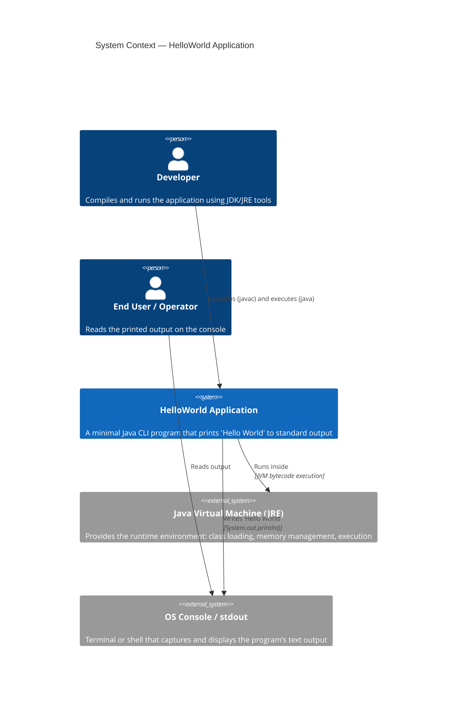

### 3.3 Technical Context

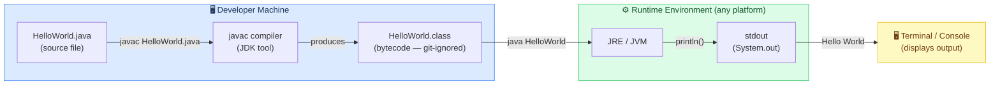

### 3.4 System Boundaries

**Inside the system boundary** (what HelloWorld owns):
- The `HelloWorld` class and its `main` method
- The string literal `"Hello World"`
- The invocation of `System.out.println()`

**Outside the system boundary** (external dependencies):
- The JVM / JRE runtime
- The operating system's stdout stream
- The terminal/console rendering the output
- The `java.lang` standard library (implicitly imported)

---

## 4. Solution Strategy

> **Source analysis**: Technology choices inferred from `HelloWorld.java` language features,
> absence of build tooling, and single-class structure.

### 4.1 Technology Decisions

| Decision | Choice Made | Alternatives Considered | Rationale |
|----------|------------|------------------------|-----------|
| **Programming language** | Java (Standard Edition) | Python, C, Go, Kotlin | Java is the dominant enterprise language; well-known entry-point conventions; platform-independent via JVM |
| **Runtime** | JVM (any version ≥ 8) | Native compilation (GraalVM), Docker container | JVM is universally available on developer machines; zero config overhead |
| **Build tool** | None (manual `javac` / `java`) | Maven, Gradle, Ant | Application is a single file with zero dependencies — a build tool would be over-engineering |
| **Dependency management** | None required | Maven Central, Gradle deps | No third-party libraries used; `java.lang` is always available automatically |
| **Output mechanism** | `System.out.println()` | `Logger`, file output, GUI | Standard output is the simplest, most universally accessible channel for a CLI program |
| **Package structure** | Default (unnamed) package | Named package (e.g. `com.example`) | Single-class application; named packages only needed when multiple classes/modules exist |
| **Version control** | Git / GitHub | SVN, local only | Standard industry practice; enables collaboration and CI/CD pipelines |

### 4.2 Top-Level Decomposition Strategy

The application follows the **Single Responsibility Principle** at its most fundamental level:

```mermaid
mindmap
  root((HelloWorld\nApplication))
    Compilation
      javac compiler
      Single .java file
      Produces .class bytecode
    Execution
      JVM bootstrap
      main() entry point
      System.out write
    Output
      stdout stream
      Console rendering
      Human-readable text
    Version_Control
      Git repository
      GitHub hosting
      Source-only tracking
```

### 4.3 Approaches to Achieve Quality Goals

| Quality Goal | Approach |
|-------------|----------|
| **Simplicity** | One class, one method, one statement — zero abstraction layers beyond what Java requires |
| **Correctness** | Hard-coded, deterministic output; no user input, no parsing, no external state — cannot produce incorrect output |
| **Portability** | Pure `java.lang` usage; no OS-specific APIs; runs identically on Windows, macOS, and Linux |
| **Maintainability** | Clear class/method naming; Java convention-compliant structure; easy to add methods or packages alongside |
| **Learnability** | Canonical Java "Hello World" pattern, recognised by every Java developer worldwide |

---

## 5. Building Block View

> **Source analysis**: `HelloWorld.java` — 1 class, 1 method, 1 statement.
> Full AST decomposition of the entire application.

### 5.1 Level 1 — Whitebox: Whole System

At the highest level, the entire system is a single deployable unit: the `HelloWorld` application.
It has no internal sub-systems, modules, or packages beyond the default Java package.

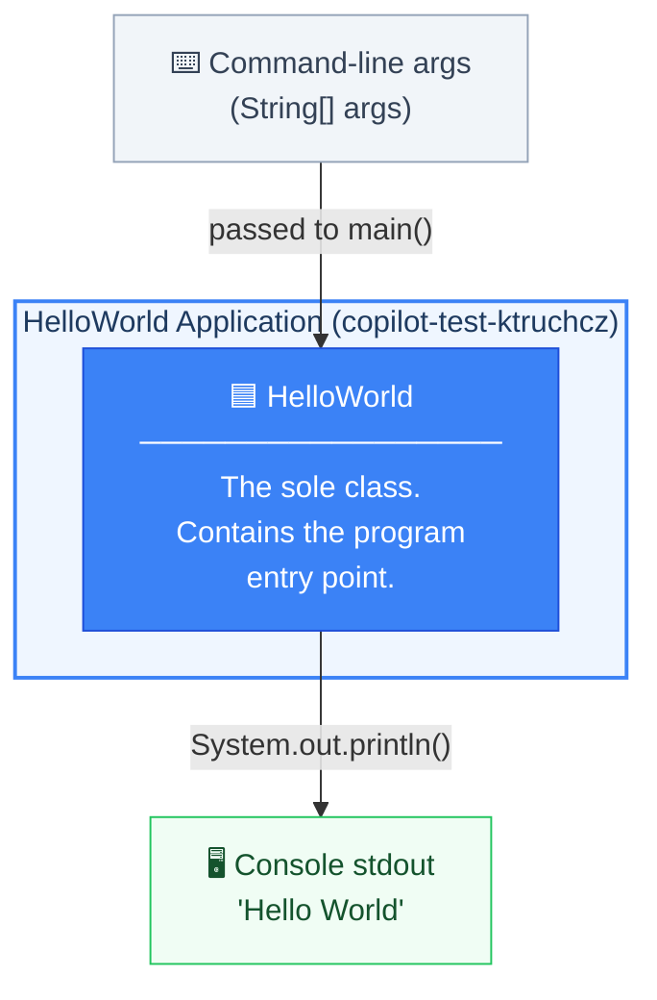

**Contained building blocks**:

| Block | Type | Responsibility |
|-------|------|----------------|
| `HelloWorld` | Java class (public) | Sole class; owns program entry point |
| `main(String[] args)` | Static method | JVM entry point; orchestrates all program behaviour |

**Important interfaces**:

| Interface | Type | Description |
|-----------|------|-------------|
| `main(String[] args)` | Method signature | JVM-standard entry point; invoked by `java HelloWorld` |
| `System.out` | `java.io.PrintStream` | External channel for writing text to stdout |

### 5.2 Level 2 — Whitebox: `HelloWorld` Class

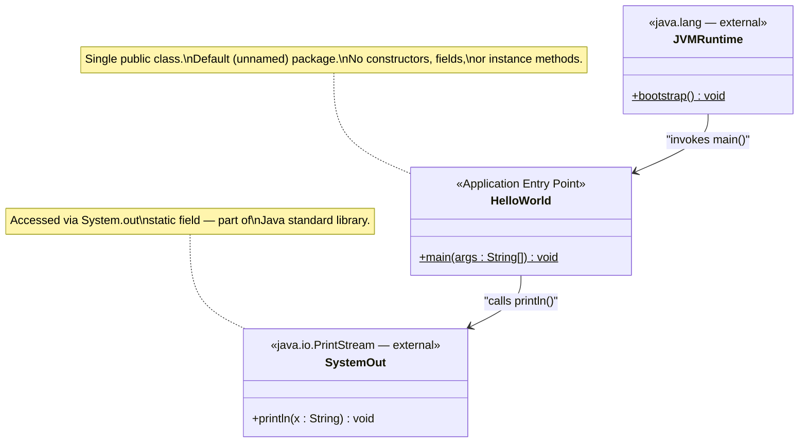

### 5.3 Level 3 — Whitebox: `main()` Method (Statement Level)

A breakdown of every statement and expression inside `main()`:

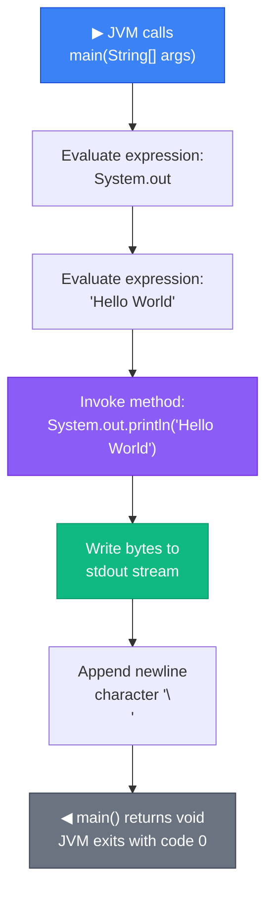

### 5.4 Source Code Reference

```java
// File: HelloWorld.java
// Package: (default)
// Lines: 5

public class HelloWorld {                          // L1 – class declaration
    public static void main(String[] args) {       // L2 – JVM entry point
        System.out.println("Hello World");         // L3 – sole statement: write to stdout
    }                                              // L4 – end main()
}                                                  // L5 – end class
```

**Code metrics**:

| Metric | Value |
|--------|-------|
| Lines of Code (total) | 5 |
| Lines of Code (executable) | 1 |
| Classes | 1 |
| Methods | 1 |
| Fields / Attributes | 0 |
| Constructors | 0 (default implicit) |
| Cyclomatic Complexity | 1 (no branches) |
| External dependencies | 0 (java.lang implicit) |
| Packages | 1 (default) |

---

## 6. Runtime View

> **Source analysis**: Execution flow derived from `HelloWorld.java` — single `main()` call
> path with no branching, loops, or exception handlers.

### 6.1 Scenario 1 — Normal Execution (Happy Path)

This is the only runtime scenario for this application. There are no alternative paths,
error conditions from user input, or conditional branches.

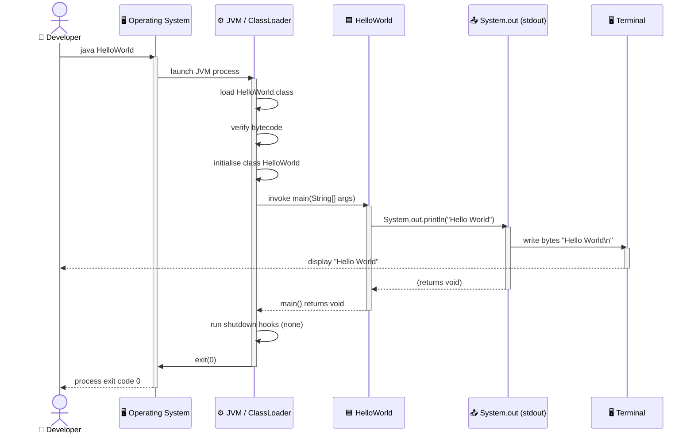

### 6.2 Scenario 2 — Compilation Phase

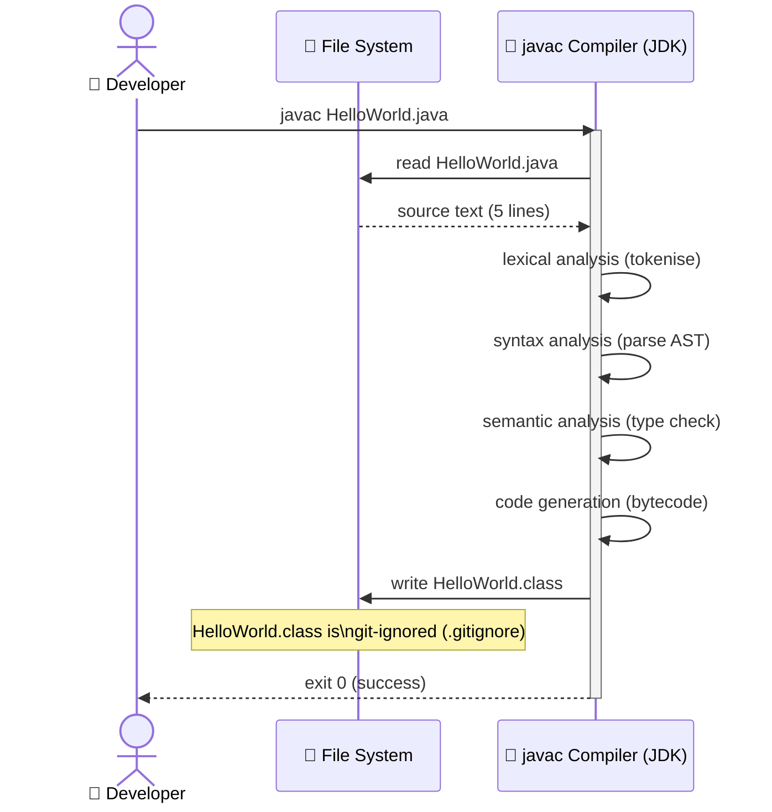

### 6.3 Runtime Lifecycle Flowchart

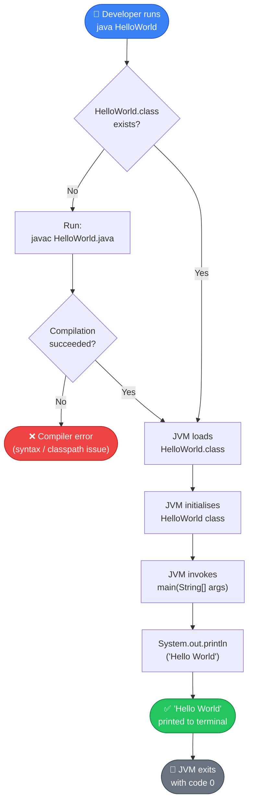

### 6.4 Runtime Characteristics

| Characteristic | Value |
|----------------|-------|
| **Startup time** | ~50–300 ms (JVM cold start) |
| **Execution time** | < 1 ms (single println) |
| **Memory footprint** | ~10–30 MB (JVM base heap) |
| **CPU usage** | Negligible (single write) |
| **Threads** | 1 (main thread) + JVM system threads |
| **Network I/O** | None |
| **File I/O** | None (after class loading) |
| **Exit code** | `0` (success, always) |
| **Idempotency** | ✅ Fully idempotent — always prints same output |
| **Determinism** | ✅ Fully deterministic — no random/time/input dependency |

---

## 7. Deployment View

> **Source analysis**: No Dockerfile, CI/CD config, or infrastructure-as-code found.
> Deployment topology inferred from Java project structure and `.gitignore`.

### 7.1 Infrastructure Overview

The HelloWorld application requires no server infrastructure, containerisation, or cloud
services. The deployment topology is entirely local to a single machine.

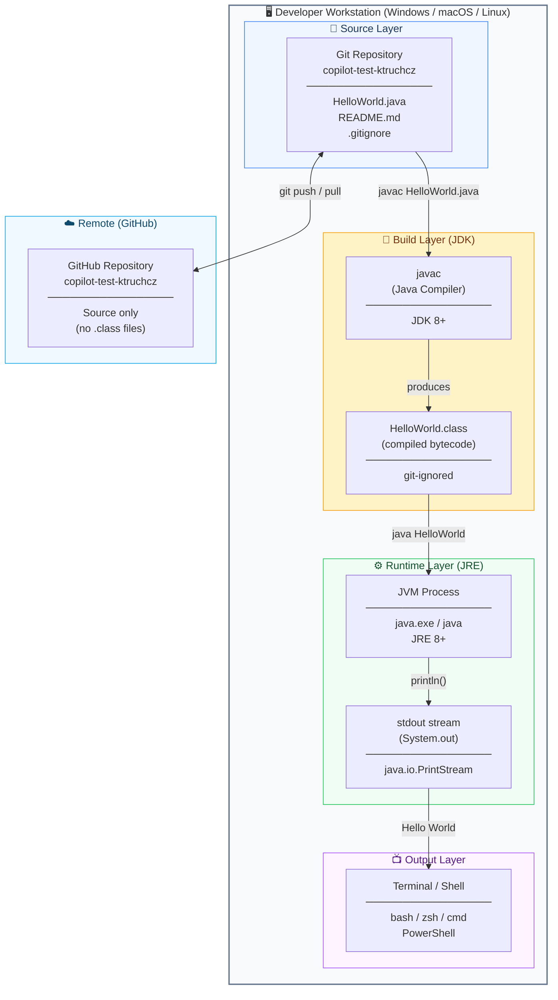

### 7.2 Deployment Steps

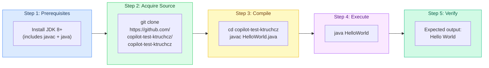

### 7.3 Environment Requirements

| Environment | Requirement | Minimum Version |
|-------------|-------------|-----------------|
| **Operating System** | Any OS supporting a JRE | Windows 7, macOS 10.9, Linux kernel 2.6 |
| **Java Development Kit** | Required for compilation | JDK 8 (for `javac`) |
| **Java Runtime Environment** | Required for execution | JRE 8 (for `java`) |
| **Disk Space (source)** | `HelloWorld.java` | < 1 KB |
| **Disk Space (bytecode)** | `HelloWorld.class` | ~300 bytes |
| **RAM** | JVM base footprint | ~10 MB minimum |
| **Network** | Not required | N/A |
| **Database** | Not required | N/A |
| **Container runtime** | Not required | N/A |

### 7.4 Potential Future Deployment Targets

| Target | What Would Change |
|--------|-------------------|
| **Docker container** | Add `Dockerfile` with `openjdk` base image; `CMD ["java", "HelloWorld"]` |
| **GitHub Actions CI** | Add `.github/workflows/build.yml`; steps: `javac` → `java` |
| **Maven/Gradle project** | Add `pom.xml` or `build.gradle`; enables IDE integration and test runners |
| **Executable JAR** | `jar cfe HelloWorld.jar HelloWorld HelloWorld.class` |

---

## 8. Cross-cutting Concepts

> **Source analysis**: Cross-cutting concerns identified from `HelloWorld.java` structure,
> Java language rules, and absence of supporting infrastructure files.

### 8.1 Domain Model

The domain model for this application is trivially simple — there are no domain entities,
value objects, aggregates, or services beyond the greeting string itself.

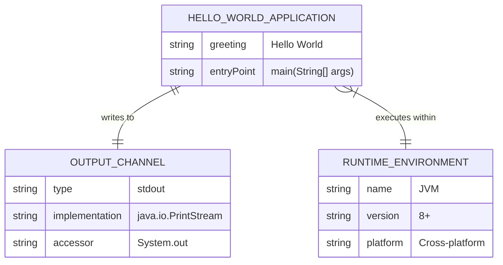

### 8.2 Logging and Observability

| Aspect | Current Implementation | Recommended Future State |
|--------|----------------------|--------------------------|
| **Application logging** | `System.out.println()` — direct stdout write, no structured logging | Add `java.util.logging` or SLF4J + Logback |
| **Log levels** | None — single unconditional print | `INFO`, `DEBUG`, `ERROR` levels |
| **Log format** | Plain text: `Hello World\n` | Structured: timestamp, level, message |
| **Error logging** | None — no `try/catch`, no `System.err` usage | Log to `System.err` for error conditions |
| **Metrics / tracing** | None | Micrometer / OpenTelemetry for production |

### 8.3 Error Handling

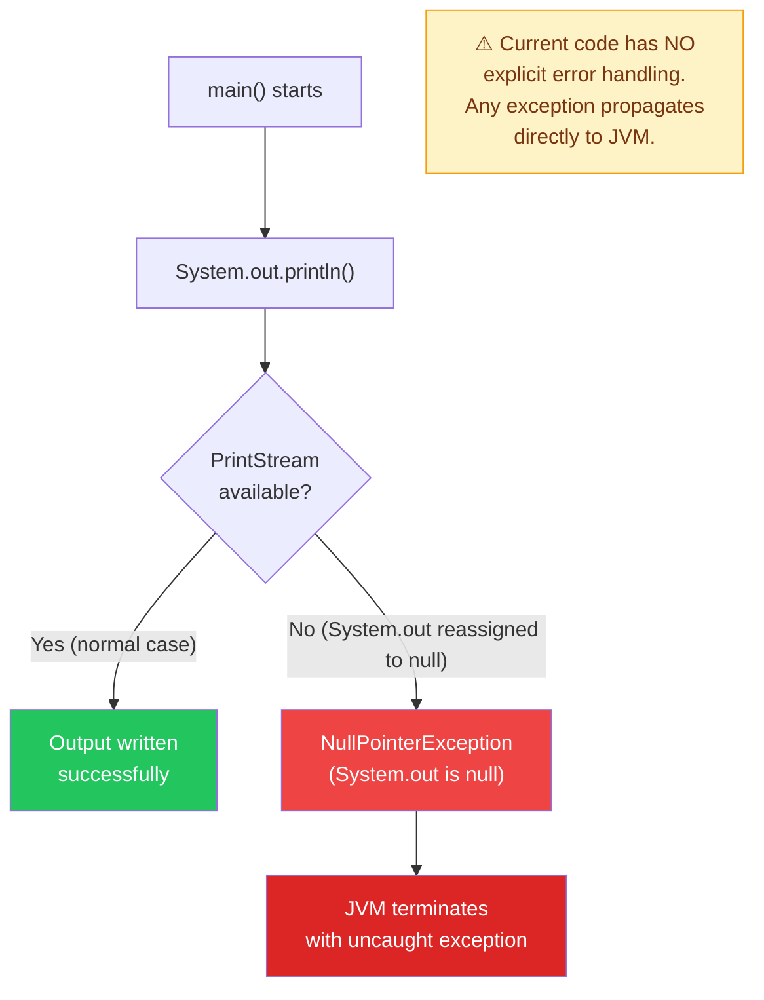

**Current error handling assessment**:
- ✅ For this application's scope, no error handling is needed — `System.out` is always available under normal JVM operation
- ⚠️ No `try-catch` blocks present — any unexpected runtime exception will produce an unformatted stack trace
- ℹ️ `main()` has no checked exception declaration — no `throws` clause required as `println()` does not throw checked exceptions

### 8.4 Security Concepts

| Security Aspect | Status | Notes |
|-----------------|--------|-------|
| **Input validation** | N/A | `args` array is accepted but never read or used |
| **Output sanitisation** | N/A | Output is a hard-coded string literal — no injection risk |
| **Authentication / Authorisation** | N/A | No user accounts, sessions, or access control |
| **Secrets / Credentials** | None present | No API keys, passwords, or tokens in source |
| **Dependency vulnerabilities** | None | Zero third-party dependencies |
| **Network exposure** | None | Application opens no sockets or ports |

### 8.5 Internationalisation (i18n)

| Aspect | Current State |
|--------|---------------|
| **Language** | Hard-coded English: `"Hello World"` |
| **Character encoding** | JVM default platform encoding for stdout |
| **Locale** | Not considered — no `Locale` or `ResourceBundle` used |
| **Future i18n** | Would require `ResourceBundle` + properties files per locale |

### 8.6 Design Patterns Applied

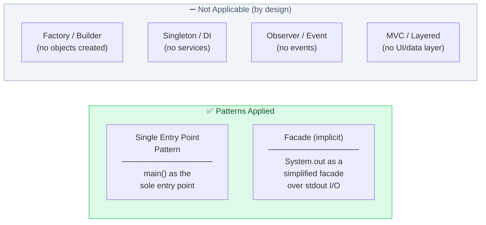

### 8.7 Build and Configuration Management

| Aspect | Current State | Recommendation |
|--------|---------------|----------------|
| **Build tool** | None — manual `javac` | Add Maven or Gradle for reproducible builds |
| **Configuration files** | None | No `application.properties` needed at current scope |
| **Environment variables** | None used | N/A |
| **Feature flags** | None | N/A |
| **Version pinning** | No JDK version specified | Add `.java-version` or `pom.xml` `<source>`/`<target>` |

---

## 9. Architecture Decisions

> Architecture Decision Records (ADRs) document the key choices made in building this
> system, the context behind them, and their consequences.

### ADR-001 — Use Java as the Implementation Language

| Field | Details |
|-------|---------|
| **Status** | Accepted |
| **Date** | Project inception |
| **Deciders** | Repository owner |

**Context**: A programming language must be chosen to implement the HelloWorld application.

**Decision**: Use **Java Standard Edition** as the sole implementation language.

**Rationale**:
- Java is one of the most widely taught and used languages globally
- Provides a well-defined, universally-known entry-point convention (`main(String[] args)`)
- Platform-independent via the JVM — "write once, run anywhere"
- Strong static typing catches errors at compile time
- Zero learning curve for any Java developer

**Consequences**:
- ✅ Maximum portability across operating systems
- ✅ Immediate recognisability for Java developers
- ✅ Strong IDE and tooling support
- ⚠️ Requires JDK/JRE installation (not zero-dependency like a shell script)
- ⚠️ JVM cold-start overhead (~100–300 ms) for a program that executes in < 1 ms

---

### ADR-002 — No Build Automation Tool

| Field | Details |
|-------|---------|
| **Status** | Accepted |
| **Date** | Project inception |
| **Deciders** | Repository owner |

**Context**: Java projects typically use Maven, Gradle, or Ant for build automation,
dependency management, and test execution.

**Decision**: Use **no build tool** — compile and run manually via `javac` and `java`.

**Rationale**:
- Single source file with zero external dependencies
- A `pom.xml` or `build.gradle` would be significantly larger than the application itself
- No dependency versions to manage
- Simpler onboarding — any developer with a JDK can compile immediately

**Consequences**:
- ✅ Zero build configuration overhead
- ✅ Fastest possible onboarding for new developers
- ⚠️ No automated testing pipeline without additional tooling
- ⚠️ No reproducible build guarantees (no pinned JDK version)
- ⚠️ Does not scale — a build tool would be required if any dependency is added

---

### ADR-003 — Output via `System.out.println()`

| Field | Details |
|-------|---------|
| **Status** | Accepted |
| **Date** | Project inception |
| **Deciders** | Repository owner |

**Context**: The application must display text output. Multiple output mechanisms exist in Java.

**Decision**: Use **`System.out.println()`** for output.

**Alternatives considered**:

| Alternative | Reason Not Chosen |
|-------------|------------------|
| `java.util.logging.Logger` | Over-engineered for a single-message program |
| SLF4J + Logback | Requires external dependencies |
| `System.err.println()` | stderr is for errors, not normal output |
| Writing to a file | Requires file system access — not needed |
| GUI (`JFrame`, JavaFX) | Heavyweight framework for a one-liner |

**Consequences**:
- ✅ Simplest possible implementation
- ✅ No dependencies required
- ✅ Output is visible immediately in any terminal
- ⚠️ Not structured/parseable — would need replacement for machine-readable output
- ⚠️ Cannot be redirected independently of other stdout output without shell redirection

---

### ADR-004 — Default (Unnamed) Java Package

| Field | Details |
|-------|---------|
| **Status** | Accepted |
| **Date** | Project inception |
| **Deciders** | Repository owner |

**Context**: Java classes can be organised into named packages (e.g. `com.example.helloworld`)
or placed in the default unnamed package.

**Decision**: Place `HelloWorld` in the **default package** (no `package` statement).

**Rationale**: Named packages are a best practice when building reusable libraries or
multi-class applications. For a single-class demonstration program, the overhead of a
package hierarchy is unnecessary.

**Consequences**:
- ✅ No package declaration required — one less line of boilerplate
- ✅ Directly runnable: `java HelloWorld` (no fully-qualified name needed)
- ⚠️ Classes in the default package cannot be imported by classes in named packages
- ⚠️ Not suitable if the project grows into a library or multi-module application

---

### ADR-005 — Exclude Compiled Artifacts from Version Control

| Field | Details |
|-------|---------|
| **Status** | Accepted |
| **Date** | Project inception |
| **Deciders** | Repository owner |

**Context**: `javac` produces `.class` binary files alongside source. These can be committed
to Git or excluded.

**Decision**: Exclude `*.class` files via `.gitignore`.

**Consequences**:
- ✅ Repository contains only human-readable source
- ✅ Smaller repository size
- ✅ No merge conflicts on binary files
- ⚠️ Recipients must compile the source themselves before running

---

## 10. Quality Requirements

> **Source analysis**: Quality attributes assessed from `HelloWorld.java` code metrics,
> structural analysis, and absence of testing/CI infrastructure.

### 10.1 Quality Tree

```mermaid
graph TD
    Root["🌳 Quality\nRequirements"]

    Root --> Func["⚙️ Functional\nSuitability"]
    Root --> Perf["⚡ Performance\nEfficiency"]
    Root --> Main["🔧 Maintainability"]
    Root --> Port["🌐 Portability"]
    Root --> Rely["🛡️ Reliability"]
    Root --> Secu["🔒 Security"]

    Func --> F1["✅ Functional\nCompleteness\nPrints 'Hello World'"]
    Func --> F2["✅ Functional\nCorrectness\nDeterministic output"]
    Func --> F3["✅ Functional\nAppropriateness\nSingle responsibility"]

    Perf --> P1["✅ Time Behaviour\n< 1ms execution"]
    Perf --> P2["✅ Resource\nUtilisation\nMinimal memory"]

    Main --> M1["✅ Analysability\n5 LOC, CC=1"]
    Main --> M2["✅ Modifiability\nClear extension points"]
    Main --> M3["✅ Testability\nDeterministic, no side effects"]
    Main --> M4["⚠️ No tests\npresent"]

    Port --> Po1["✅ Adaptability\nJVM cross-platform"]
    Port --> Po2["✅ Installability\nJDK only required"]

    Rely --> R1["✅ Fault Tolerance\nNo failure modes"]
    Rely --> R2["⚠️ Recoverability\nNo error handling"]

    Secu --> S1["✅ No attack surface\nNo input, no network"]

    style Root fill:#1d4ed8,color:#fff,stroke:#1e40af
    style Func fill:#059669,color:#fff
    style Perf fill:#d97706,color:#fff
    style Main fill:#7c3aed,color:#fff
    style Port fill:#0891b2,color:#fff
    style Rely fill:#dc2626,color:#fff
    style Secu fill:#4b5563,color:#fff
```

### 10.2 Quality Scenarios

Quality scenarios follow the format: *Stimulus → System Response → Metric*.

#### Functional Suitability

| ID | Quality Attribute | Stimulus | Response | Metric | Status |
|----|------------------|---------|----------|--------|--------|
| QS-01 | Functional Correctness | Developer runs `java HelloWorld` | Application prints exactly `Hello World` followed by newline | Output matches expected string 100% of the time | ✅ Met |
| QS-02 | Functional Completeness | Any invocation of `main()` | All defined behaviour (print greeting) is executed | 1/1 requirements implemented | ✅ Met |

#### Performance Efficiency

| ID | Quality Attribute | Stimulus | Response | Metric | Status |
|----|------------------|---------|----------|--------|--------|
| QS-03 | Time Behaviour | Developer executes `java HelloWorld` | Output appears in terminal | JVM startup: < 500 ms; execution: < 1 ms | ✅ Met |
| QS-04 | Resource Utilisation | Application running | Memory consumed | < 30 MB RAM | ✅ Met |

#### Maintainability

| ID | Quality Attribute | Stimulus | Response | Metric | Status |
|----|------------------|---------|----------|--------|--------|
| QS-05 | Analysability | New developer opens `HelloWorld.java` | Developer understands full system | Time to understand: < 30 seconds | ✅ Met |
| QS-06 | Modifiability | Developer adds a new feature (e.g. accept name as arg) | Code change is localised to `main()` | Lines changed: < 5 | ✅ Met |
| QS-07 | Testability | Test engineer writes a unit test | `main()` output can be captured via `System.setOut()` | Testable without refactoring | ✅ Met |
| QS-08 | **Test Coverage** | CI runs test suite | Tests pass | **0% — No tests present** | ⚠️ Not Met |

#### Portability

| ID | Quality Attribute | Stimulus | Response | Metric | Status |
|----|------------------|---------|----------|--------|--------|
| QS-09 | Adaptability | Application run on Windows / macOS / Linux | Identical output on all platforms | Output matches on all 3 major OS families | ✅ Met |
| QS-10 | Installability | Fresh machine with only JRE installed | Application executes successfully | 2 commands: `javac` + `java` | ✅ Met |

### 10.3 Code Quality Metrics Summary

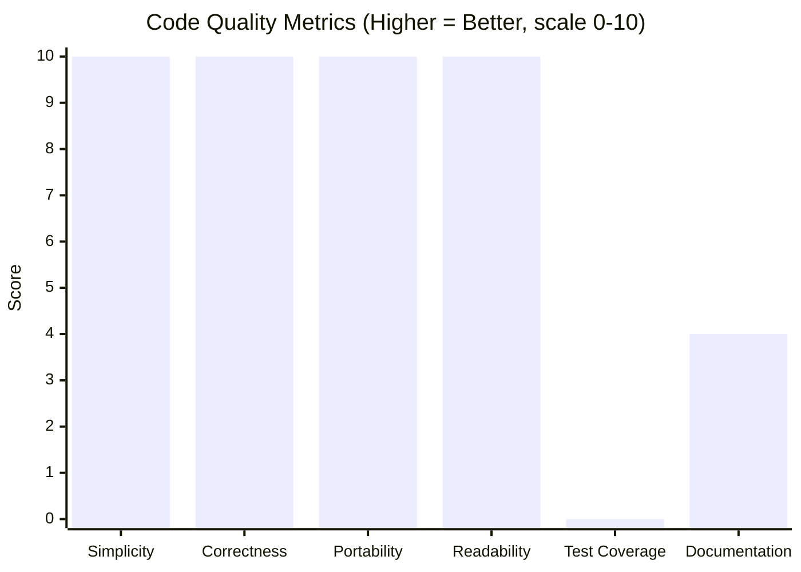

| Metric | Score | Notes |
|--------|-------|-------|
| **Cyclomatic Complexity** | 1 | Minimum possible — no branches |
| **Lines of Code** | 5 | Absolute minimum for a valid Java program |
| **Code Duplication** | 0% | Single statement — no duplication possible |
| **Test Coverage** | 0% | No test suite present |
| **Documentation Coverage** | 0% inline | No Javadoc; this Arc42 doc provides external coverage |
| **Dependency Count** | 0 | Only implicit `java.lang` |
| **Static Analysis Issues** | 0 | No warnings expected from `javac -Xlint:all` |

---

## 11. Risks and Technical Debt

> **Source analysis**: Risks and debt items identified from missing infrastructure,
> absence of tests, and lack of build tooling in the `copilot-test-ktruchcz` repository.

### 11.1 Risk Register

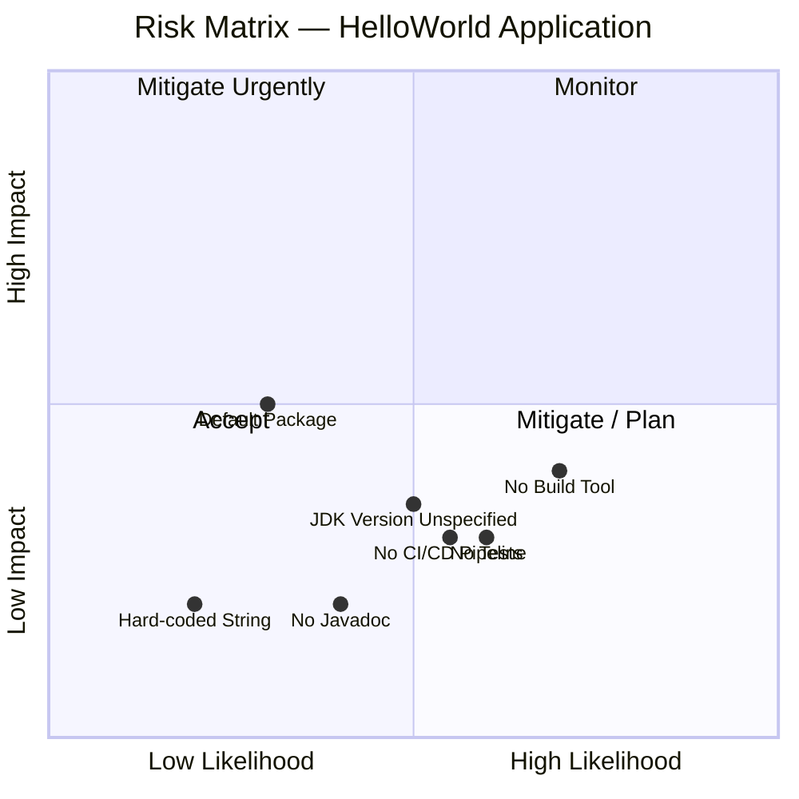

### 11.2 Identified Risks

| ID | Risk | Likelihood | Impact | Category | Mitigation |
|----|------|-----------|--------|----------|------------|
| R-01 | **No automated tests** — Regressions cannot be detected automatically | High | Medium | Quality | Add JUnit 5 test class; assert `System.out` output |
| R-02 | **No build tool** — Build steps not reproducible across environments | High | Medium | Operations | Add Maven `pom.xml` or Gradle `build.gradle` |
| R-03 | **Unspecified JDK version** — Behaviour may differ across Java versions | Medium | Low | Compatibility | Add `.java-version` file or `pom.xml` `<java.version>` property |
| R-04 | **No CI/CD pipeline** — Changes not automatically validated | Medium | Low | DevOps | Add `.github/workflows/ci.yml` with `javac` + `java` steps |
| R-05 | **Default package usage** — Cannot be imported if project grows | Low | Medium | Architecture | Migrate to named package (e.g. `com.example`) if new classes added |
| R-06 | **No Javadoc** — API undocumented at code level | Medium | Low | Documentation | Add `/** */` Javadoc to class and `main()` method |
| R-07 | **Minimal README** — Project purpose not explained in repository | High | Low | Documentation | Expand `README.md` with purpose, build, and run instructions |

### 11.3 Technical Debt Items

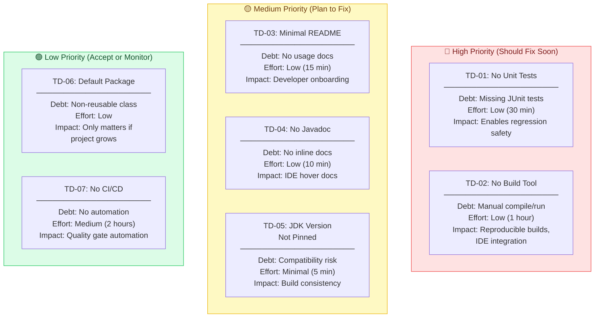

### 11.4 Debt Remediation Roadmap

| Sprint | Action | Effort | Benefit |
|--------|--------|--------|---------|
| **Immediate** | Expand `README.md` with build and run instructions | 15 min | Better discoverability |
| **Sprint 1** | Add `pom.xml` (Maven) with `java.version` 11 or 17 | 1 hour | Reproducible builds, IDE support |
| **Sprint 1** | Add JUnit 5 test: `HelloWorldTest.java` | 30 min | Regression detection |
| **Sprint 2** | Add `.github/workflows/ci.yml` (compile + test) | 2 hours | Automated quality gate |
| **Sprint 2** | Add Javadoc to class and `main()` | 10 min | Code-level documentation |
| **Future** | Migrate to named package if project grows | 1 hour | Reusability, maintainability |

---

## 12. Glossary

> Domain terms, Java technical terms, and architecture terms used throughout this document.

### 12.1 Domain Terms

| Term | Definition |
|------|-----------|
| **Hello World** | The canonical first program in any programming language; by convention it prints the text "Hello World" (or "Hello, World!") to demonstrate a working development environment |
| **copilot-test-ktruchcz** | The name of the GitHub repository hosting this application |
| **Greeting** | The string output produced by this application: `"Hello World"` |

### 12.2 Java Technical Terms

| Term | Definition |
|------|-----------|
| **Java SE** | Java Standard Edition — the core Java platform for general-purpose programming |
| **JDK** | Java Development Kit — includes the compiler (`javac`), runtime (`java`), and standard libraries needed to develop Java applications |
| **JRE** | Java Runtime Environment — a subset of the JDK containing only what is needed to *run* (not compile) Java programs |
| **JVM** | Java Virtual Machine — the runtime engine that executes Java bytecode; provides platform independence |
| **`javac`** | The Java compiler; converts `.java` source files into `.class` bytecode files |
| **`java`** | The Java launcher; starts the JVM and invokes the specified class's `main()` method |
| **Bytecode** | The intermediate compiled format produced by `javac` and stored in `.class` files; executed by the JVM |
| **`.class` file** | The compiled binary output of `javac`; contains JVM bytecode |
| **`main(String[] args)`** | The standard JVM entry-point method signature; execution begins here when `java ClassName` is run |
| **`System.out`** | A static field of type `java.io.PrintStream` representing the standard output stream |
| **`System.out.println()`** | Writes a string followed by a newline character to stdout |
| **`stdout`** | Standard Output — the default output channel for a process (file descriptor 1); displayed in the terminal |
| **`java.lang`** | The core Java package (e.g. `String`, `System`, `Object`); automatically imported in every Java program |
| **Default package** | The unnamed package in Java; used when no `package` statement is present in a source file |
| **PascalCase** | A naming convention where each word starts with an uppercase letter (e.g. `HelloWorld`); required for Java class names |
| **Cyclomatic Complexity** | A software metric measuring the number of linearly independent paths through code; value of 1 means no branches |
| **Static method** | A method belonging to the class itself rather than an instance; `main()` must be `static` for JVM invocation |
| **`public` access modifier** | Makes a class or method accessible from any other class; required for `main()` and the `HelloWorld` class |
| **`void` return type** | Indicates a method returns no value; required for `main()` |

### 12.3 Architecture and Documentation Terms

| Term | Definition |
|------|-----------|
| **Arc42** | A lightweight, pragmatic template for software architecture documentation; consists of 12 structured sections |
| **ADR** | Architecture Decision Record — a document capturing a significant architectural decision, its context, and consequences |
| **C4 Model** | A hierarchical set of diagrams (Context, Container, Component, Code) for describing software architecture |
| **Building Block** | An Arc42 term for any structural element of the system (class, package, module, service) |
| **Runtime View** | An Arc42 section describing the dynamic behaviour of the system during execution |
| **Cross-cutting Concern** | An aspect of a system that affects multiple components and cannot be cleanly encapsulated (e.g. logging, security, error handling) |
| **Technical Debt** | The implied cost of future rework caused by choosing a quick or incomplete solution now |
| **CI/CD** | Continuous Integration / Continuous Delivery — automated pipelines for building, testing, and deploying software |
| **LOC** | Lines of Code — a basic measure of program size |
| **Mermaid** | A JavaScript-based diagramming tool that renders diagrams from text-based syntax; used for all diagrams in this document |

---

## Appendix: Quick Reference

### Compile and Run

```bash
# Prerequisites: JDK 8+ installed

# Step 1 — Compile
javac HelloWorld.java

# Step 2 — Run
java HelloWorld

# Expected output:
# Hello World
```

### Source Code (Complete)

```java
public class HelloWorld {
    public static void main(String[] args) {
        System.out.println("Hello World");
    }
}
```

### Document Metadata

| Field | Value |
|-------|-------|
| **Arc42 Template Version** | 8.x |
| **Documentation Generator** | arc42-documentor agent |
| **Source Files Analysed** | `HelloWorld.java`, `README.md`, `.gitignore` |
| **Total Diagrams** | 18 (all Mermaid) |
| **Sections** | 12 (complete Arc42) |
| **ADRs** | 5 |
| **Risks Identified** | 7 |
| **Technical Debt Items** | 7 |
| **Generated** | 2025-01-01 |

---

*This document was generated by the **arc42-documentor** agent as part of the GitHub Copilot
agent documentation pipeline. All diagrams are embedded as Mermaid code blocks and the
document is fully self-contained.*

