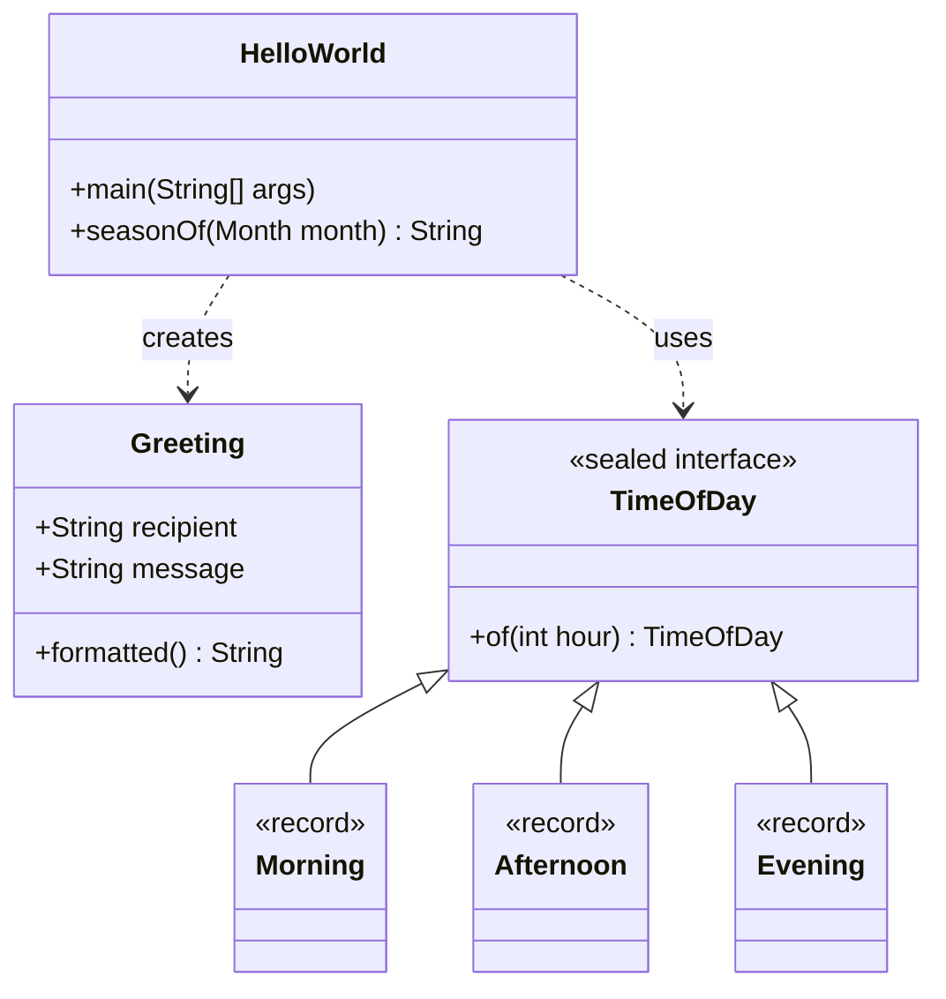
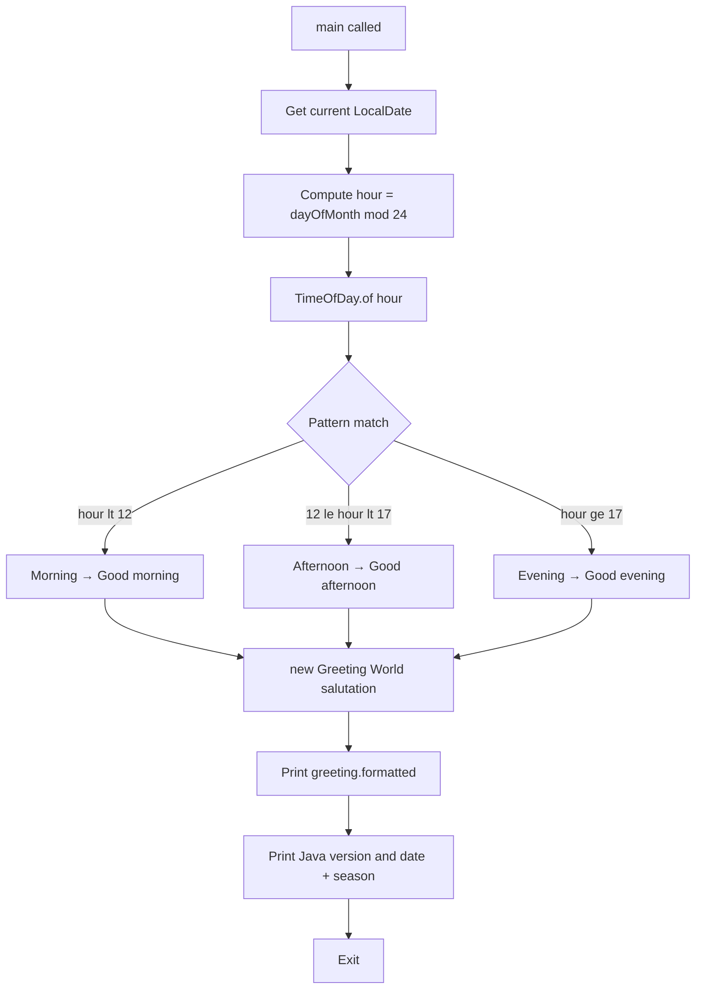

# Code Structure

The entire application is contained in a single Java source file: `src/main/java/HelloWorld.java`.

## Component Diagram

## Classes and Types

### `HelloWorld`

Top-level class and application entry point. Contains two static members:

| Member | Type | Description |
|--------|------|-------------|
| `main(String[])` | Method | Entry point; orchestrates greeting output and metadata printing |
| `seasonOf(Month)` | Method | Maps a `java.time.Month` to a meteorological season string |

### `HelloWorld.Greeting`

A Java 16 **record** that holds a recipient name and a salutation message.

| Member | Description |
|--------|-------------|
| `recipient` | Name of the person being greeted |
| `message` | Salutation string (e.g., `Good morning`) |
| Compact constructor | Validates that neither field is blank; throws `IllegalArgumentException` otherwise |
| `formatted()` | Returns a Unicode box-drawing banner containing the message and recipient |

### `HelloWorld.TimeOfDay`

A **sealed interface** with three permitted record subtypes, used to classify an hour of the day.

| Subtype | Hour range | Salutation |
|---------|-----------|------------|
| `Morning` | 0 – 11 | Good morning |
| `Afternoon` | 12 – 16 | Good afternoon |
| `Evening` | 17 – 23 | Good evening |

The factory method `TimeOfDay.of(int hour)` uses a guarded pattern-matching switch to construct the correct subtype.

## Execution Flow

## Key Java 21 Features Used

| Feature | Where |
|---------|-------|
| Record (`Greeting`) | Immutable value object with compact constructor |
| Sealed interface (`TimeOfDay`) | Exhaustive type hierarchy |
| Guarded pattern switch | `TimeOfDay.of` — `case Integer h when h < 12` |
| Pattern matching switch | `main` — `case TimeOfDay.Morning ignored` |
| Text block | `Greeting.formatted()` and the `info` variable in `main` |
| `var` inference | All local variables in `main` |

*Last updated: 2026-05-06*
