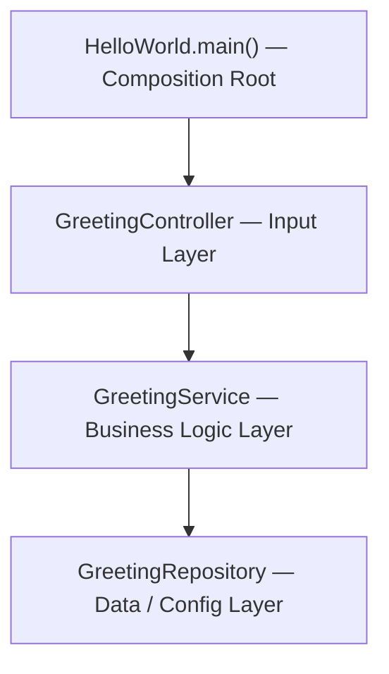
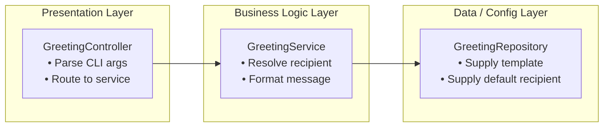
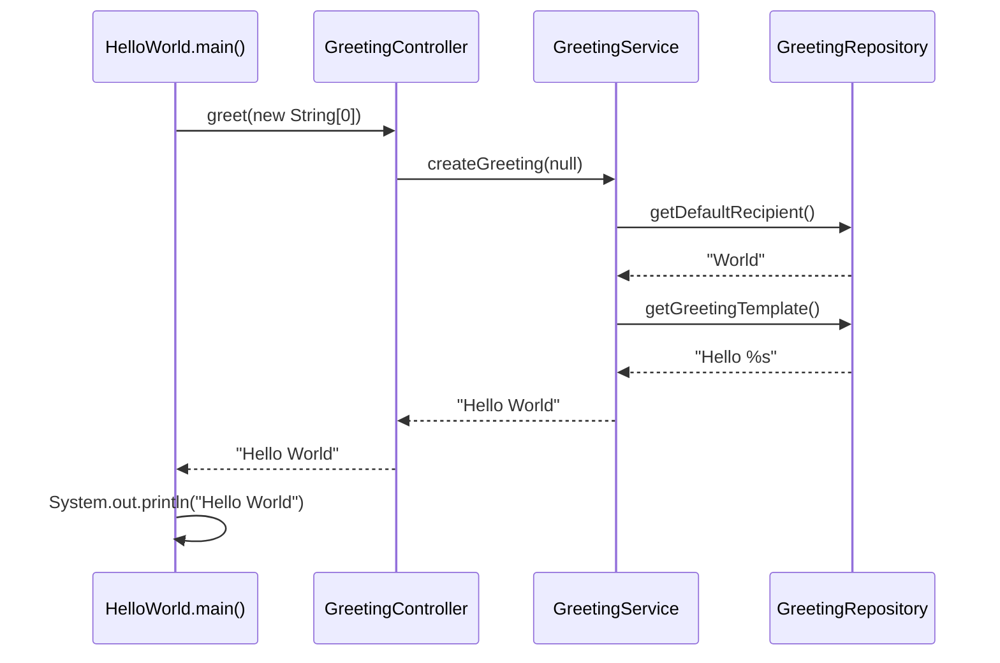
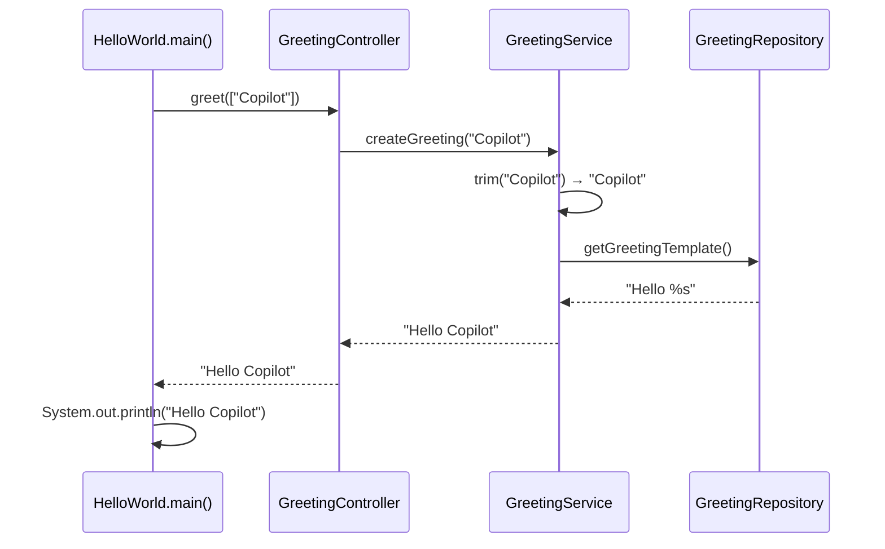
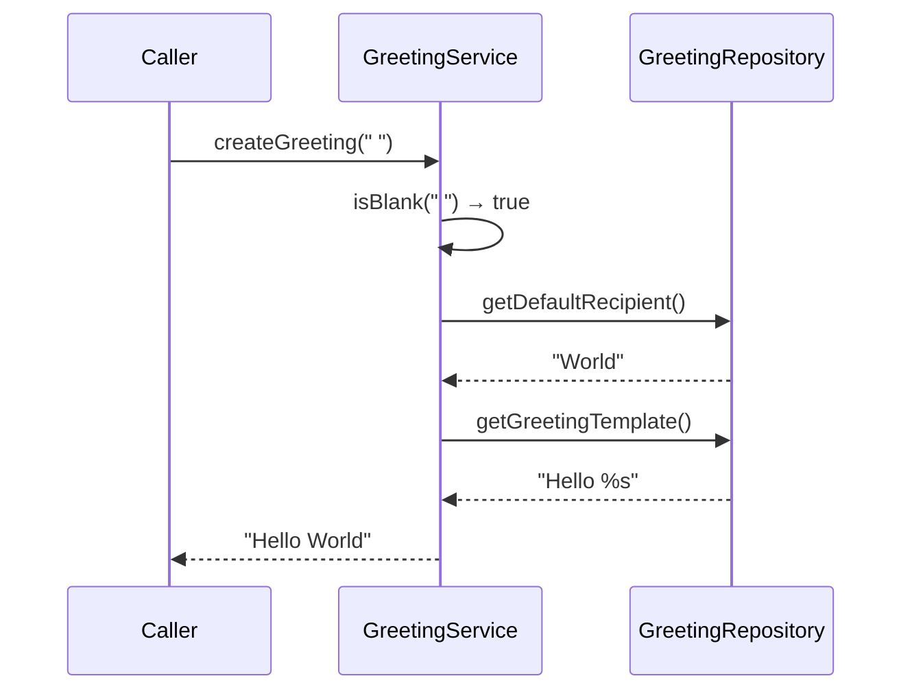
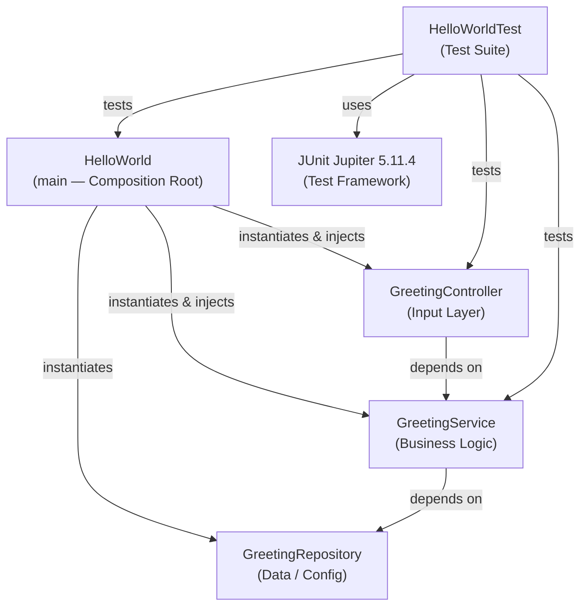

# LegacyFinApp-026 — Comprehensive Code Documentation Report

**Project**: `copilot-test-ktruchcz` · **Version**: 1.0.0  
**Language**: Java 25 · **Build**: Maven · **Generated**: 2025-01-01

---

## Table of Contents

1. [Application Overview](#1-application-overview)
2. [Architecture & Design Patterns](#2-architecture--design-patterns)
3. [File-by-File Documentation](#3-file-by-file-documentation)
   - 3.1 [HelloWorld.java](#31-helloworldjava)
   - 3.2 [GreetingController.java](#32-greetingcontrollerjava)
   - 3.3 [GreetingService.java](#33-greetingservicejava)
   - 3.4 [GreetingRepository.java](#34-greetingrepositoryjava)
   - 3.5 [HelloWorldTest.java](#35-helloworldtestjava)
   - 3.6 [pom.xml](#36-pomxml)
4. [Business Rules Catalogue](#4-business-rules-catalogue)
5. [Workflow Documentation](#5-workflow-documentation)
6. [Edge Cases & Validation Behaviour](#6-edge-cases--validation-behaviour)
7. [Test Coverage Summary](#7-test-coverage-summary)
8. [Dependency Graph](#8-dependency-graph)
9. [Technical Stack Summary](#9-technical-stack-summary)

---

## 1. Application Overview

**LegacyFinApp-026** is a minimal Java console application whose sole purpose is to print a personalised greeting to standard output. The application accepts an optional recipient name as the first command-line argument. When no argument is provided — or when the argument is blank — the application falls back to the default recipient `World`, printing `Hello World`.

Despite its simplicity, the codebase deliberately demonstrates professional software engineering principles: a **three-tier layered architecture**, **constructor-based dependency injection**, and **null-safe guard clauses**. It serves as a baseline repository for tooling experiments (e.g., GitHub Copilot) and as a canonical Java project skeleton.

### Key Functionalities

| # | Functionality | Description |
|---|--------------|-------------|
| 1 | Personalised greeting | Accepts a recipient name via CLI; produces `Hello <name>` |
| 2 | Default recipient fallback | Uses `World` when no recipient is supplied or input is blank |
| 3 | Whitespace normalisation | Trims leading/trailing whitespace from user-supplied recipient names |
| 4 | Stdout output | Writes the formatted greeting to standard output with a trailing newline |

---

## 2. Architecture & Design Patterns

The application implements a **three-tier layered architecture** combined with **constructor-based dependency injection**. The full object graph is assembled at a single **composition root** in `HelloWorld.main()`.



### Design Patterns Identified

| Pattern | Location | Description |
|---------|----------|-------------|
| **Constructor-Based Dependency Injection** | All classes | Dependencies are injected through constructors, not field/setter injection |
| **Composition Root** | `HelloWorld.main()` | Single location where the entire object graph is wired and assembled |
| **Layered Architecture (Three-Tier)** | Full codebase | Controller → Service → Repository separation of concerns |
| **Null Object / Default Value** | `GreetingService.createGreeting()` | Substitutes a default value when input is absent, preventing null propagation |
| **Guard Clause** | Controller & Service constructors | `Objects.requireNonNull` fails fast on invalid dependencies |

### Layer Responsibilities



---

## 3. File-by-File Documentation

### 3.1 HelloWorld.java

| Attribute | Value |
|-----------|-------|
| **Category** | Technical (Composition Root) |
| **Responsibility** | Application bootstrap; object graph wiring |
| **Business Capability** | Greeting Generation |
| **Sub-Capability** | Application Bootstrap |
| **Dependencies** | `GreetingRepository`, `GreetingService`, `GreetingController` |

#### Purpose
`HelloWorld` is the **entry point** of the application. It manually instantiates all three layers in bottom-up order (repository → service → controller) using constructor injection, then delegates to the controller and prints the result to stdout.

#### Methods

##### `public static void main(String[] args)`
- **Summary**: Composes the full dependency graph and invokes the greeting workflow.
- **Parameters**: `args (String[])` — Optional CLI arguments; `args[0]`, if present, becomes the greeting recipient.
- **Returns**: `void`
- **Dependencies**: `GreetingRepository`, `GreetingService`, `GreetingController`
- **Significance**: Sole application entry point and composition root. Controls the full startup sequence.

```java
public static void main(String[] args) {
    var repository  = new GreetingRepository();
    var service     = new GreetingService(repository);
    var controller  = new GreetingController(service);
    System.out.println(controller.greet(args));
}
```

---

### 3.2 GreetingController.java

| Attribute | Value |
|-----------|-------|
| **Category** | Business |
| **Responsibility** | Input parsing and routing |
| **Business Capability** | Greeting Generation |
| **Sub-Capability** | Input Handling and Routing |
| **Dependencies** | `GreetingService`, `java.util.Objects` |

#### Purpose
`GreetingController` acts as the **input-processing facade** between the raw CLI entry point and the domain service. It validates the presence of command-line arguments and extracts the first one as the intended recipient, then delegates message construction to `GreetingService`.

#### Methods

##### `GreetingController(GreetingService greetingService)` — Constructor
- **Summary**: Initialises the controller with a mandatory service dependency.
- **Parameters**: `greetingService (GreetingService)` — Must not be null.
- **Returns**: New `GreetingController` instance.
- **Business Rule Enforced**: `BR-003` — null service is rejected immediately.

##### `public String greet(String[] args)`
- **Summary**: Parses CLI args; passes `null` to the service when args are absent, or `args[0]` when present.
- **Parameters**: `args (String[])` — Raw CLI argument array; may be null or empty.
- **Returns**: `String` — The formatted greeting message.
- **Business Rules Enforced**: `BR-004`, `BR-005`, `BR-006`

```java
public String greet(String[] args) {
    if (args == null || args.length == 0) {
        return greetingService.createGreeting(null);  // triggers default fallback
    }
    return greetingService.createGreeting(args[0]);   // first arg only
}
```

---

### 3.3 GreetingService.java

| Attribute | Value |
|-----------|-------|
| **Category** | Business |
| **Responsibility** | Recipient resolution and greeting formatting |
| **Business Capability** | Greeting Generation |
| **Sub-Capability** | Recipient Resolution and Message Formatting |
| **Dependencies** | `GreetingRepository`, `java.util.Objects` |

#### Purpose
`GreetingService` contains the **core business logic** of the application. It resolves the effective recipient by applying a null/blank check with a default fallback, normalises whitespace, and assembles the final greeting string using the repository-supplied template.

#### Methods

##### `GreetingService(GreetingRepository greetingRepository)` — Constructor
- **Summary**: Initialises the service with a mandatory repository dependency.
- **Parameters**: `greetingRepository (GreetingRepository)` — Must not be null.
- **Returns**: New `GreetingService` instance.
- **Business Rule Enforced**: `BR-007`

##### `public String createGreeting(String requestedRecipient)`
- **Summary**: Resolves the recipient (null/blank → default, otherwise trim) and formats the greeting.
- **Parameters**: `requestedRecipient (String)` — Caller-supplied name; may be null or blank.
- **Returns**: `String` — Formatted greeting, e.g. `Hello World` or `Hello Alice`.
- **Business Rules Enforced**: `BR-008`, `BR-009`, `BR-010`, `BR-011`

```java
public String createGreeting(String requestedRecipient) {
    var recipient = requestedRecipient == null || requestedRecipient.isBlank()
            ? greetingRepository.getDefaultRecipient()   // fallback to "World"
            : requestedRecipient.trim();                 // clean user input
    return greetingRepository.getGreetingTemplate().formatted(recipient);
}
```

---

### 3.4 GreetingRepository.java

| Attribute | Value |
|-----------|-------|
| **Category** | Technical |
| **Responsibility** | Static greeting configuration data |
| **Business Capability** | Greeting Configuration |
| **Sub-Capability** | Static Greeting Data Access |
| **Dependencies** | None |

#### Purpose
`GreetingRepository` is the **data-access layer**, providing the two pieces of configuration that define all greeting output: the message format template and the default recipient name. Both values are hard-coded, making this a thin static configuration provider.

#### Methods

##### `public String getGreetingTemplate()`
- **Summary**: Returns the greeting format string `"Hello %s"`.
- **Returns**: `String` — `"Hello %s"`
- **Business Rule Defined**: `BR-012`, `BR-014`
- **Significance**: Changing this method changes all greeting output system-wide.

##### `public String getDefaultRecipient()`
- **Summary**: Returns the fallback recipient name `"World"`.
- **Returns**: `String` — `"World"`
- **Business Rule Defined**: `BR-013`
- **Significance**: Determines output when no recipient argument is provided.

---

### 3.5 HelloWorldTest.java

| Attribute | Value |
|-----------|-------|
| **Category** | Technical (Test) |
| **Responsibility** | Automated validation of business rules and integration paths |
| **Business Capability** | Greeting Generation |
| **Sub-Capability** | Automated Quality Assurance |
| **Test Framework** | JUnit Jupiter 5.11.4 |

#### Test Cases

| Test Method | Type | Business Rules Validated | Description |
|-------------|------|--------------------------|-------------|
| `mainPrintsHelloWorldWithTrailingNewline` | Integration | BR-001, BR-002, BR-005, BR-008, BR-012, BR-013 | Full end-to-end: runs `HelloWorld.main(new String[0])`, captures stdout, asserts `"Hello World\n"` |
| `controllerUsesFirstArgumentAsRecipient` | Unit | BR-006, BR-011, BR-012 | Passes `"Copilot"` as `args[0]`; asserts result is `"Hello Copilot"` |
| `serviceFallsBackToDefaultRecipientForBlankInput` | Unit | BR-009, BR-013 | Passes `"   "` (spaces) to `createGreeting`; asserts result is `"Hello World"` |

---

### 3.6 pom.xml

| Attribute | Value |
|-----------|-------|
| **Group ID** | `com.example` |
| **Artifact ID** | `hello-world` |
| **Version** | `1.0.0` |
| **Packaging** | `jar` |
| **Java Version** | 25 |
| **Encoding** | UTF-8 |

#### Dependencies

| Dependency | Version | Scope |
|------------|---------|-------|
| `org.junit.jupiter:junit-jupiter` | 5.11.4 | test |

#### Build Plugins

| Plugin | Version | Purpose |
|--------|---------|---------|
| `maven-compiler-plugin` | 3.13.0 | Java 25 source/target compilation |
| `maven-surefire-plugin` | 3.5.2 | JUnit 5 test execution |

---

## 4. Business Rules Catalogue

| Rule ID | Rule | Source Class | Method | Priority | Test Covered |
|---------|------|-------------|--------|----------|--------------|
| **BR-001** | When no CLI arguments are supplied the app must produce a greeting using default recipient `World` | `HelloWorld` | `main` | Must-Have | ✅ `mainPrintsHelloWorldWithTrailingNewline` |
| **BR-002** | The greeting output must be written to stdout terminated with a system newline | `HelloWorld` | `main` | Must-Have | ✅ `mainPrintsHelloWorldWithTrailingNewline` |
| **BR-003** | `GreetingService` injected into `GreetingController` must not be null; constructor fails fast if null | `GreetingController` | constructor | Must-Have | ❌ Not tested |
| **BR-004** | When `args` is null, the controller treats it as absent and delegates `null` to the service | `GreetingController` | `greet` | Must-Have | ❌ Not tested |
| **BR-005** | When `args` is empty (zero-length), the controller treats it as absent and delegates `null` to the service | `GreetingController` | `greet` | Must-Have | ✅ `mainPrintsHelloWorldWithTrailingNewline` |
| **BR-006** | Only `args[0]` is used as the recipient; subsequent arguments are discarded | `GreetingController` | `greet` | Must-Have | ✅ `controllerUsesFirstArgumentAsRecipient` |
| **BR-007** | `GreetingRepository` injected into `GreetingService` must not be null; constructor fails fast if null | `GreetingService` | constructor | Must-Have | ❌ Not tested |
| **BR-008** | If `requestedRecipient` is null the service substitutes the repository default recipient | `GreetingService` | `createGreeting` | Must-Have | ✅ `mainPrintsHelloWorldWithTrailingNewline` |
| **BR-009** | If `requestedRecipient` is blank (whitespace-only) the service substitutes the repository default recipient | `GreetingService` | `createGreeting` | Must-Have | ✅ `serviceFallsBackToDefaultRecipientForBlankInput` |
| **BR-010** | A non-null non-blank `requestedRecipient` must have leading/trailing whitespace trimmed before use | `GreetingService` | `createGreeting` | Must-Have | ❌ Not tested |
| **BR-011** | The greeting message is formed by inserting the resolved recipient into the repository template | `GreetingService` | `createGreeting` | Must-Have | ✅ `controllerUsesFirstArgumentAsRecipient` |
| **BR-012** | The greeting template is `"Hello %s"` where `%s` is replaced by the resolved recipient | `GreetingRepository` | `getGreetingTemplate` | Must-Have | ✅ `mainPrintsHelloWorldWithTrailingNewline` |
| **BR-013** | The default recipient name is `"World"` | `GreetingRepository` | `getDefaultRecipient` | Must-Have | ✅ `mainPrintsHelloWorldWithTrailingNewline` |
| **BR-014** | The greeting template must contain exactly one positional string placeholder | `GreetingRepository` | `getGreetingTemplate` | Must-Have | ✅ `controllerUsesFirstArgumentAsRecipient` |

**Coverage: 9 / 14 rules tested (64.3%)**

---

## 5. Workflow Documentation

### WF-001 — Default Greeting Workflow
*Triggered when the application is run with no CLI arguments.*



**Business rules applied**: BR-001, BR-002, BR-005, BR-008, BR-011, BR-012, BR-013

---

### WF-002 — Named Recipient Greeting Workflow
*Triggered when a recipient name is passed as the first CLI argument.*



**Business rules applied**: BR-002, BR-006, BR-010, BR-011, BR-012

---

### WF-003 — Blank Recipient Fallback Workflow
*Triggered when a whitespace-only string is passed as the recipient.*



**Business rules applied**: BR-009, BR-011, BR-012, BR-013

---

## 6. Edge Cases & Validation Behaviour

| Scenario | Input | Behaviour | Rule |
|----------|-------|-----------|------|
| No CLI arguments | `main(new String[0])` | Fallback to `"World"` → prints `"Hello World"` | BR-001, BR-005 |
| Null args array | `main(null)` | `greet(null)` treats as absent → fallback to `"World"` | BR-004 |
| Whitespace-only recipient | `createGreeting("   ")` | `isBlank()` triggers default fallback → `"Hello World"` | BR-009 |
| Multiple CLI arguments | `main(["Alice","Bob"])` | Only `"Alice"` used; `"Bob"` silently discarded | BR-006 |
| Null GreetingService in controller | `new GreetingController(null)` | `NullPointerException`: `"greetingService must not be null"` | BR-003 |
| Null GreetingRepository in service | `new GreetingService(null)` | `NullPointerException`: `"greetingRepository must not be null"` | BR-007 |
| Recipient with surrounding spaces | `createGreeting("  Alice  ")` | Trimmed to `"Alice"` → `"Hello Alice"` | BR-010 |

---

## 7. Test Coverage Summary

### Tests by Business Rule

```
BR-001  ████████████  Covered  (mainPrintsHelloWorldWithTrailingNewline)
BR-002  ████████████  Covered  (mainPrintsHelloWorldWithTrailingNewline)
BR-003  ············  MISSING
BR-004  ············  MISSING
BR-005  ████████████  Covered  (mainPrintsHelloWorldWithTrailingNewline)
BR-006  ████████████  Covered  (controllerUsesFirstArgumentAsRecipient)
BR-007  ············  MISSING
BR-008  ████████████  Covered  (mainPrintsHelloWorldWithTrailingNewline)
BR-009  ████████████  Covered  (serviceFallsBackToDefaultRecipientForBlankInput)
BR-010  ············  MISSING
BR-011  ████████████  Covered  (controllerUsesFirstArgumentAsRecipient)
BR-012  ████████████  Covered  (mainPrintsHelloWorldWithTrailingNewline)
BR-013  ████████████  Covered  (mainPrintsHelloWorldWithTrailingNewline)
BR-014  ████████████  Covered  (controllerUsesFirstArgumentAsRecipient)
```

**Overall coverage: 9 / 14 rules (64.3%)**

### Recommended Additional Test Cases

| Test Name | Rule Covered | Scenario |
|-----------|-------------|---------|
| `controllerRejectsNullService` | BR-003 | Assert `NullPointerException` when constructing `GreetingController(null)` |
| `serviceRejectsNullRepository` | BR-007 | Assert `NullPointerException` when constructing `GreetingService(null)` |
| `controllerTreatsNullArgsAsAbsent` | BR-004 | `controller.greet(null)` must return `"Hello World"` |
| `serviceTrimsSurroundingWhitespace` | BR-010 | `createGreeting("  Alice  ")` must return `"Hello Alice"` |
| `templateHasSinglePlaceholder` | BR-014 | Assert template contains exactly one `%s` |

---

## 8. Dependency Graph



---

## 9. Technical Stack Summary

| Component | Technology | Version |
|-----------|-----------|---------|
| Language | Java | 25 |
| Build Tool | Apache Maven | 3.x |
| Test Framework | JUnit Jupiter | 5.11.4 |
| Compiler Plugin | maven-compiler-plugin | 3.13.0 |
| Test Runner | maven-surefire-plugin | 3.5.2 |
| Source Encoding | UTF-8 | — |
| Packaging | JAR | — |
| Runtime Target | JRE 25 | — |
| External Runtime Dependencies | None | — |

### Build & Run Commands

```bash
# Compile and run all tests
mvn clean test

# Compile only
mvn compile

# Run the application (after compiling)
java -cp target/classes HelloWorld

# Run with a custom recipient
java -cp target/classes HelloWorld Alice
```

---

*Documentation generated by Code Documentation Specialist · Project: LegacyFinApp-026 · copilot-test-ktruchcz*
