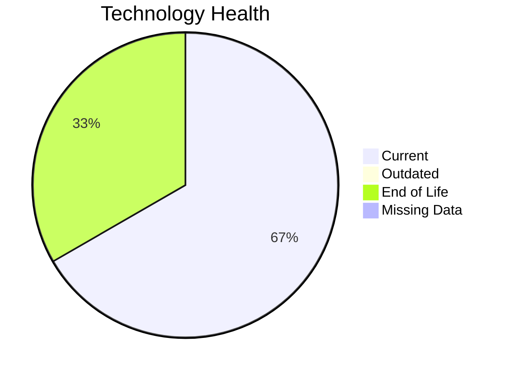

# Application Report: ERPApp-001

**ID:** app001  
**Generated:** 2026-05-07

## Overview

| Attribute | Value |
|-----------|-------|
| Business Unit | Finance |
| Deployment Type | On-Premise |
| Business Criticality | High |
| Users | 350 |
| Servers | 2 |
| Solution Type | Custom made |

**Description:** Core ERP system handling financial transactions, general ledger, and regulatory reporting

## Technology Stack

| Component | Technology | Status |
|-----------|-----------|--------|
| Os | AIX 7.2 | 🟢 CURRENT_VERSION |
| Database | Oracle 19c | 🟢 CURRENT_VERSION |
| Language | COBOL- None | 🔴 EOL |

## Complexity Assessment

**Score:** 7/10 — **HIGH**  
**Confidence:** 9/10

**Reasoning:** Technology age: 8/10 (1 EOL, 0 outdated components) | Integration: 5/10 (5 external interfaces) | Infrastructure: 4/10 (2 servers, 2 environments) | Criticality: 9/10 (high) | Architecture: 8/10 (containerized: no, CI/CD: no) | Data: 6/10 (1000 GB storage)

### Contributing Factors

| Factor | Value |
|--------|-------|
| Servers | 2 |
| Databases | 1 |
| Environments | 2 |
| Interfaces | 5 |
| EOL Technologies | 1 |
| Outdated Technologies | 0 |
| Containerized | No |
| CI/CD Present | No |

## Modernization Scenarios

### Applicable Scenarios

#### ✅ Switch to standard Linux Operating System

- **Priority:** Medium
- **Effort:** Medium
- **Effects:** agility, security, cost
- **Cost:** $399.00 (one-time)
- **Savings:** $400.00/year
- **Reasoning:** Triggered by: Operating System is a commercial or proprietary non-Linux system (e.g. AIX, HP-UX, Solaris, IRIX), Operating System lacks container support. Supporting conditions: Application is a custom developed Application

#### ✅ Applications Server replacement

- **Priority:** Medium
- **Effort:** Medium
- **Effects:** agility, cost
- **Cost:** $13,300.10 (one-time)
- **Savings:** $9,600.00/year
- **Reasoning:** Triggered by: Application Server lacks container support. Supporting conditions: Application is a custom developed Application

#### ✅ Application Migration to Cloud Infrastructure (Lift & Shift)

- **Priority:** High
- **Effort:** Low
- **Effects:** security, agility
- **Cost:** $6,650.05 (one-time)
- **Savings:** $2,400.00/year
- **Reasoning:** Triggered by: Environment Type is On-Premise. Supporting conditions: Application is custom developed

#### ✅ Application Refactoring and De-coupling

- **Priority:** High
- **Effort:** High
- **Effects:** agility, cost, sustainability
- **Cost:** $332,502.49 (one-time)
- **Savings:** $120,000.00/year
- **Reasoning:** Triggered by: Architecture is Tightly Coupled, Architecture is Monolithic. Supporting conditions: Application is a custom developed application

#### ✅ Switch DB Engine to open-source database solution

- **Priority:** High
- **Effort:** Medium
- **Effects:** cost
- **Cost:** $0.00 (one-time)
- **Savings:** $0.00/year
- **Reasoning:** Triggered by: Database Engine is proprietary or requires a paid commercial license (e.g. Oracle, SQL Server, DB2). Supporting conditions: Application is a custom developed application

#### ✅ Update outdated components

- **Priority:** High
- **Effort:** High
- **Effects:** security, agility, cost
- **Cost:** $0.00 (one-time)
- **Savings:** $0.00/year
- **Reasoning:** Triggered by: Used Programming language is legacy or outdated (e.g. Java 6 or older, .NET Framework 3.5 or older, PHP 5.x or older, Python 2.x), Used programming language is no longer supported by vendor or community. Supporting conditions: Application is a custom developed application

### Other Scenarios

| Scenario | Status | Reason |
|----------|--------|--------|
| Operating System Update | ✔️ FULFILLED | Fulfilled: Operating system is on a current, supported version with no end-of-li... |
| Switch to ARM-based CPU | ❌ NOT_APPLICABLE | No primary triggers matched for this application. |
| Application Containerization | ❌ NOT_APPLICABLE | No primary triggers matched for this application. |
| Upgrade Legacy Databases | ✔️ FULFILLED | Fulfilled: All database components are on a current, supported version with no e... |

## Financial Summary

| Metric | Value |
|--------|-------|
| Total One-Time Cost | $352,851.64 |
| Total Yearly Savings | $132,400.00 |
| Break-Even | 2.67 years |

---

*This report was automatically generated from application portfolio analysis.*
