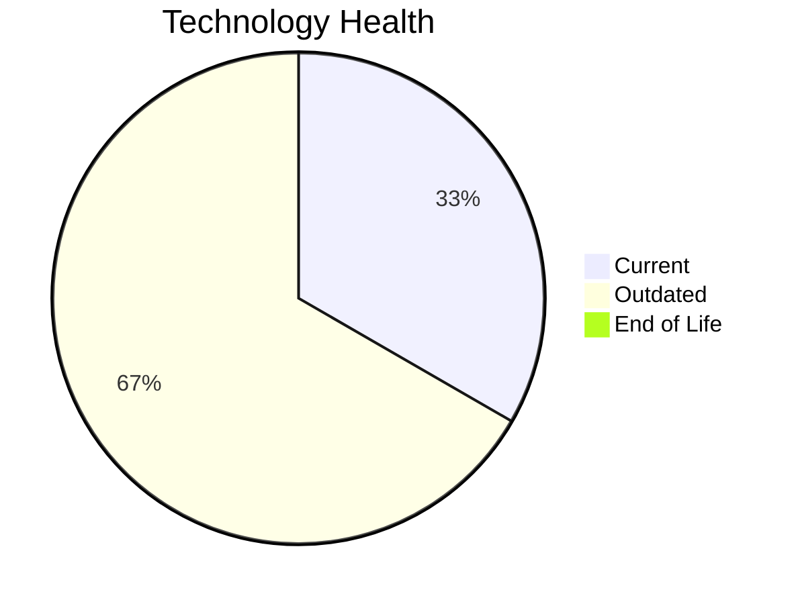

# Application Report: ERPApp-001

**ID:** app001  
**Generated:** 2026-05-06

## Overview

| Attribute | Value |
|-----------|-------|
| Business Unit | Finance |
| Deployment | On-Premise |
| Business Criticality | High |
| Users | 350 |
| Servers | 2 |
| Architecture | 1-Tier |
| Containerized | No |
| CI/CD | No |

## Technology Stack

| Component | Technology | Status |
|-----------|-----------|--------|
| Operating System | AIX 7.2 | 🟡 OUTDATED |
| Database | Oracle 19c | 🟢 CURRENT_VERSION |
| Language | COBOL-2014 | 🟡 OUTDATED |

## Complexity Assessment

**Score:** 6/10 — **MEDIUM**  
**Confidence:** 8/10

> Complexity score 6/10 (MEDIUM). 2 outdated component(s), High business criticality.

| Factor | Score |
|--------|-------|
| Technology Age & EOL | 5/10 |
| Integration Complexity | 5/10 |
| Infrastructure Scale | 4/10 |
| Business Criticality | 7/10 |
| Code & Architecture | 10/10 |
| Data Complexity | 6/10 |

## Modernization Scenarios

### Applicable Scenarios

#### ✅ Operating System Update

- **Priority:** High
- **Effort:** Low
- **Effects:** security
- **Cost:** €1,157 (one-time)
- **Savings:** €500/year
- **Reasoning:** OS (AIX 7.2) is OUTDATED; update to a current, supported version.

#### ✅ Switch to standard Linux Operating System

- **Priority:** Medium
- **Effort:** Medium
- **Effects:** agility, security, cost
- **Cost:** €347 (one-time)
- **Savings:** €400/year
- **Reasoning:** OS (AIX 7.2) is proprietary/commercial; consider migrating to standard Linux.

#### ✅ Application Migration to Cloud Infrastructure (Lift & Shift)

- **Priority:** High
- **Effort:** Low
- **Effects:** security, agility
- **Cost:** €5,783 (one-time)
- **Savings:** €2,700/year
- **Reasoning:** Application is on-premise; cloud migration could reduce infrastructure costs.

#### ✅ Application Containerization

- **Priority:** High
- **Effort:** High
- **Effects:** agility, cost, sustainability
- **Cost:** €115,653 (one-time)
- **Savings:** €90,000/year
- **Reasoning:** Application is not containerized; containerization could improve portability and deployment efficiency.

#### ✅ Application Refactoring and De-coupling

- **Priority:** High
- **Effort:** High
- **Effects:** agility, cost, sustainability
- **Cost:** €289,133 (one-time)
- **Savings:** €135,000/year
- **Reasoning:** Architecture is 1-Tier; refactoring to microservices could improve maintainability.

#### ✅ Switch DB Engine to open-source database solution

- **Priority:** High
- **Effort:** Medium
- **Effects:** cost
- **Cost:** N/A (one-time)
- **Savings:** N/A
- **Reasoning:** Oracle database requires expensive licensing; migration to PostgreSQL could reduce costs.

#### ✅ Update outdated components

- **Priority:** High
- **Effort:** High
- **Effects:** security, agility, cost
- **Cost:** N/A (one-time)
- **Savings:** N/A
- **Reasoning:** Components need updating. Outdated: AIX 7.2, COBOL-2014.

### Other Scenarios

| Scenario | Status | Reason |
|----------|--------|--------|
| Switch to ARM-based CPU | LACK_OF_DATA | CPU architecture not documented in application data. |
| Applications Server replacement | NOT_APPLICABLE | No application server component identified. |
| Upgrade Legacy Databases | FULFILLED | Database (Oracle 19c) is on a current, supported version. |

## Financial Summary

| Metric | Value |
|--------|-------|
| Total One-Time Investment | €412,073 |
| Total Annual Savings | €228,600 |
| Break-Even | 1.8 years |
