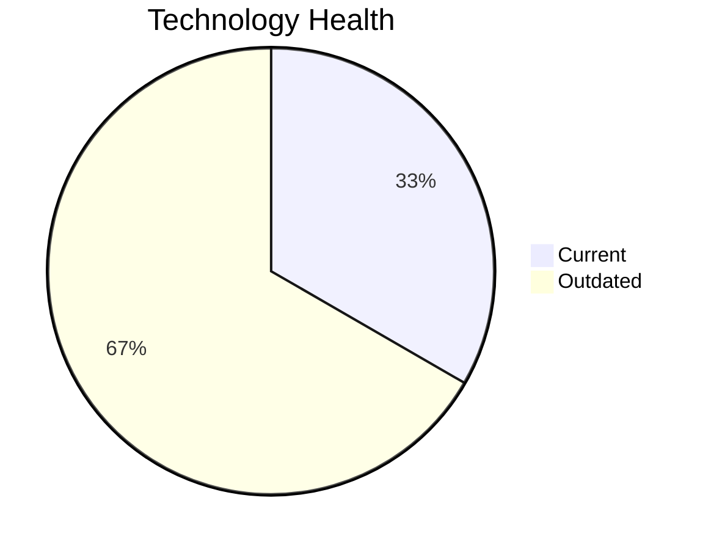

# Application Report: ERPApp-001

**ID:** app001
**Generated:** 2026-05-14

## Overview

| Attribute | Value |
|-----------|-------|
| Business Unit | Finance |
| Business Criticality | High |
| Solution Type | Custom made |
| Deployment Type | On-Premise |
| Users | 350 |
| Servers | 2 |
| External Interfaces | 5 |
| Containerized | No |
| CI/CD Present | No |
| Architecture | 1-Tier |

## Technology Stack

| Component | Technology | Version | Status |
|-----------|-----------|---------|--------|
| Os | AIX | 7.2 | 🟡 OUTDATED |
| Language | COBOL | 2014 | 🟡 OUTDATED |
| Database | Oracle | 19c | 🟢 CURRENT_VERSION |

## Complexity Assessment

**Score:** 6/10 — **MEDIUM**
**Confidence:** 7

Score 6/10 (MEDIUM): EOL components=0, Outdated=2, Interfaces=5, Servers=2, Criticality=High, Architecture=1-Tier.

| Factor | Value |
|--------|-------|
| Servers | 2 |
| Environments | 2 |
| Interfaces | 5 |
| EOL Technologies | 0 |
| Outdated Technologies | 2 |
| Business Criticality | High |

## Modernization Scenarios

### Applicable Scenarios

#### ✅ Operating System Update

- **Priority:** High
- **Effort:** Low
- **Effects:** security
- **One-Time Cost:** $1,157
- **Annual Savings:** $500/year
- **Reasoning:** Operating system AIX 7.2 is OUTDATED. Update to a current supported OS version is recommended.

#### ✅ Switch to standard Linux Operating System

- **Priority:** Medium
- **Effort:** Medium
- **Effects:** agility, security, cost
- **One-Time Cost:** $347
- **Annual Savings:** $400/year
- **Reasoning:** Application runs on proprietary OS AIX 7.2. Switching to standard Linux reduces licensing and maintenance costs.

#### ✅ Application Migration to Cloud Infrastructure (Lift & Shift)

- **Priority:** High
- **Effort:** Low
- **Effects:** security, agility
- **One-Time Cost:** $5,783
- **Annual Savings:** $2,700/year
- **Reasoning:** Application is On-Premise. Lift & Shift to cloud infrastructure is applicable to reduce infrastructure costs.

#### ✅ Application Refactoring and De-coupling

- **Priority:** High
- **Effort:** High
- **Effects:** agility, cost, sustainability
- **One-Time Cost:** $289,133
- **Annual Savings:** $135,000/year
- **Reasoning:** Application uses 1-tier architecture - a tightly coupled pattern. Refactoring into modular/microservice components is recommended.

#### ✅ Switch DB Engine to open-source database solution

- **Priority:** High
- **Effort:** Medium
- **Effects:** cost
- **Reasoning:** Database Oracle 19c is a proprietary licensed database. Switching to PostgreSQL or another open-source solution would eliminate license costs.

#### ✅ Update outdated components

- **Priority:** High
- **Effort:** High
- **Effects:** security, agility, cost
- **Reasoning:** Application has EOL or very legacy components. Update of outdated programming language and framework components is required.

### Other Scenarios

| Scenario | Status | Reason |
|----------|--------|--------|
| Switch to ARM-based CPU | ❓ LACK_OF_DATA | CPU architecture is not explicitly documented as x86/x64. Cannot confirm primary trigger for ARM mig... |
| Applications Server replacement | ❌ NOT_APPLICABLE | No application server is used by this application. |
| Application Containerization | 🚫 BLOCKED | Application is a legacy 1-tier monolith with COBOL-2014. Containerization is not feasible without si... |
| Upgrade Legacy Databases | ✔️ FULFILLED | Database Oracle 19c is on a current, supported version. |