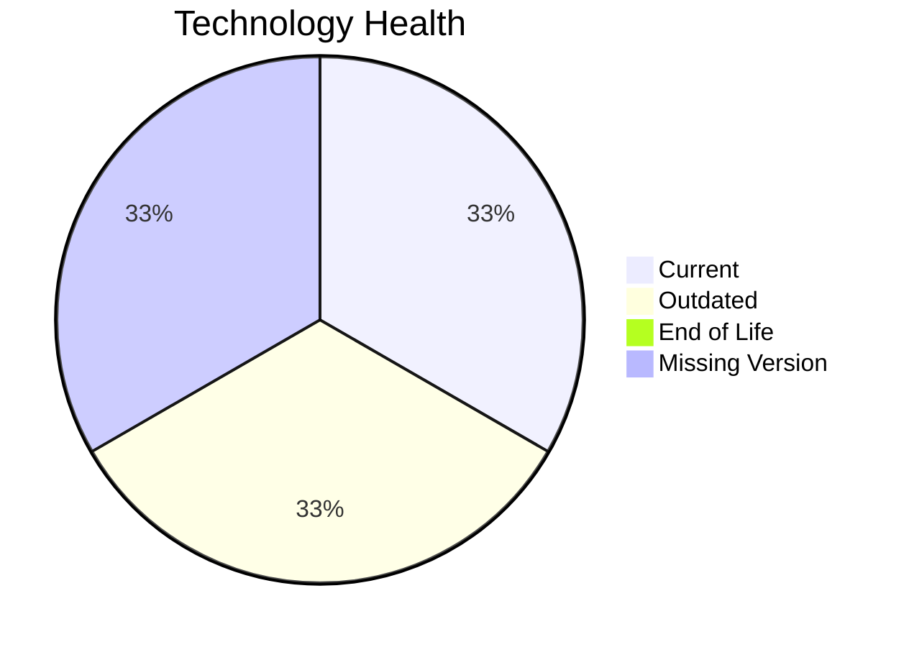

# Application Report: ERPApp-001

**ID:** app001
**Generated:** 2026-05-19

## Overview

| Attribute | Value |
|-----------|-------|
| Owner | unknown |
| Environment | On-Premise |
| Business Criticality | High |
| Users | 350 |
| Servers | 2 |

## Technology Stack

| Component | Technology | Version | Status |
|-----------|-----------|---------|--------|
| Operating System | AIX 7.2 | 7.2 | 🟡 OUTDATED |
| Database | Oracle 19c | 19c | 🟢 CURRENT_VERSION |
| Language | COBOL-2014 | 2014 | ⚪ NO_KNOWLEDGE |
| Framework | N/A | N/A | ⚪ N/A |
| App Server | N/A | N/A | ⚪ N/A |

## Complexity Assessment

**Score:** 6/10 — **MEDIUM**
**Confidence:** 8

| Factor | Score | Notes |
|--------|-------|-------|
| Technology Age | n/a | High-critical app with complexity driven by technology age, integrations, and architecture characteristics. |
| Integration | n/a | Interfaces: 5 |
| Infrastructure | n/a | Environments: 2 |
| Business Criticality | n/a | High |
| Architecture | n/a | Containerized: No; CI/CD: No |
| Data | n/a | Databases: 1 |

## Scenario Applicability

### Applicable Scenarios

#### ✅ Operating System Update

- **Priority:** High
- **Effort:** Low
- **Effects:** security
- **Cost:** €1,157 (one-time)
- **Savings:** €500/year
- **Reasoning:** AIX 7.2 is classified as OUTDATED, which triggers an operating system update scenario.

#### ✅ Switch to standard Linux Operating System

- **Priority:** Medium
- **Effort:** Medium
- **Effects:** agility, security, cost
- **Cost:** €347 (one-time)
- **Savings:** €400/year
- **Reasoning:** AIX 7.2 is a proprietary Unix platform rather than a standard Linux distribution.

#### ✅ Application Migration to Cloud Infrastructure (Lift & Shift)

- **Priority:** High
- **Effort:** Low
- **Effects:** security, agility
- **Cost:** €5,783 (one-time)
- **Savings:** €2,700/year
- **Reasoning:** Application is hosted on-premise only, so lift-and-shift cloud migration is applicable.

#### ✅ Application Refactoring and De-coupling

- **Priority:** High
- **Effort:** High
- **Effects:** agility, cost, sustainability
- **Cost:** €289,133 (one-time)
- **Savings:** €135,000/year
- **Reasoning:** Legacy architecture signals or coupling indicators suggest refactoring and de-coupling would add value.

#### ✅ Switch DB Engine to open-source database solution

- **Priority:** High
- **Effort:** Medium
- **Effects:** cost
- **Cost:** N/A (one-time)
- **Savings:** N/A/year
- **Reasoning:** Oracle 19c is a proprietary engine that could be evaluated for open-source replacement.

#### ✅ Update outdated components

- **Priority:** High
- **Effort:** High
- **Effects:** security, agility, cost
- **Cost:** N/A (one-time)
- **Savings:** N/A/year
- **Reasoning:** The technology assessment found outdated or EOL components that justify a component refresh.

### Not Applicable / Other

| Scenario | Status | Reason |
|----------|--------|--------|
| Switch to ARM-based CPU | 🚫 BLOCKED | Current operating system platform is a legacy Windows/proprietary Unix environment that is not a good ARM migration candidate. |
| Applications Server replacement | ❌ NOT_APPLICABLE | No standalone application server is identified in the source data. |
| Application Containerization | 🚫 BLOCKED | Legacy proprietary platform characteristics make containerization difficult without deeper refactoring. |
| Upgrade Legacy Databases | ✔️ FULFILLED | Oracle 19c is currently supported. |

## Financial Summary

| Metric | Value |
|--------|-------|
| Total One-Time Cost | €296,420 |
| Total Yearly Savings | €138,600 |
| Break-Even | 2.1 years |
