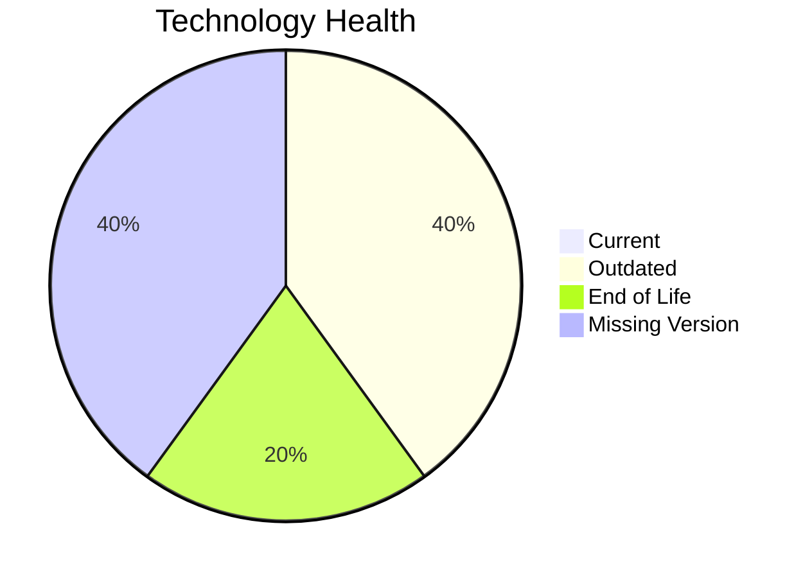

# Application Report: ERPApp-001

**ID:** app001
**Generated:** 2026-05-14

## Overview

| Attribute | Value |
|-----------|-------|
| Owner | Finance |
| Environment | On-Premise |
| Business Criticality | High |
| Users | 350 |
| Servers | sv01, sv02 |

## Technology Stack

| Component | Technology | Status |
|-----------|-----------|--------|
| Operating System | AIX 7.2 | 🔴 |
| Database | Oracle 19c | 🟡 |
| Language | COBOL-2014 | 🟡 |

## Complexity Assessment

**Score:** 7/10 — **HIGH**

## Modernization Scenarios

### ✅ Os Update Security Patch
- **Reasoning:** EOL operating system/server components require security remediation.

### ✅ Switch To Standard Linux Os
- **Reasoning:** Current OS footprint includes non-standard enterprise OS variants.

### ✅ App Deployment To Cloud
- **Reasoning:** On-premise deployment model is a direct cloud-migration opportunity.

### ✅ App Containerization
- **Reasoning:** Application is not containerized and can benefit from platform standardization.

### ✅ App Refactor Decoupling
- **Reasoning:** High coupling and/or monolithic architecture indicates refactor opportunity.

## Financial Summary

| Metric | Value |
|--------|-------|
| Total One-Time Cost | €527082 |
| Total Yearly Savings | €236220 |
| Break-Even | 2.2 years |
