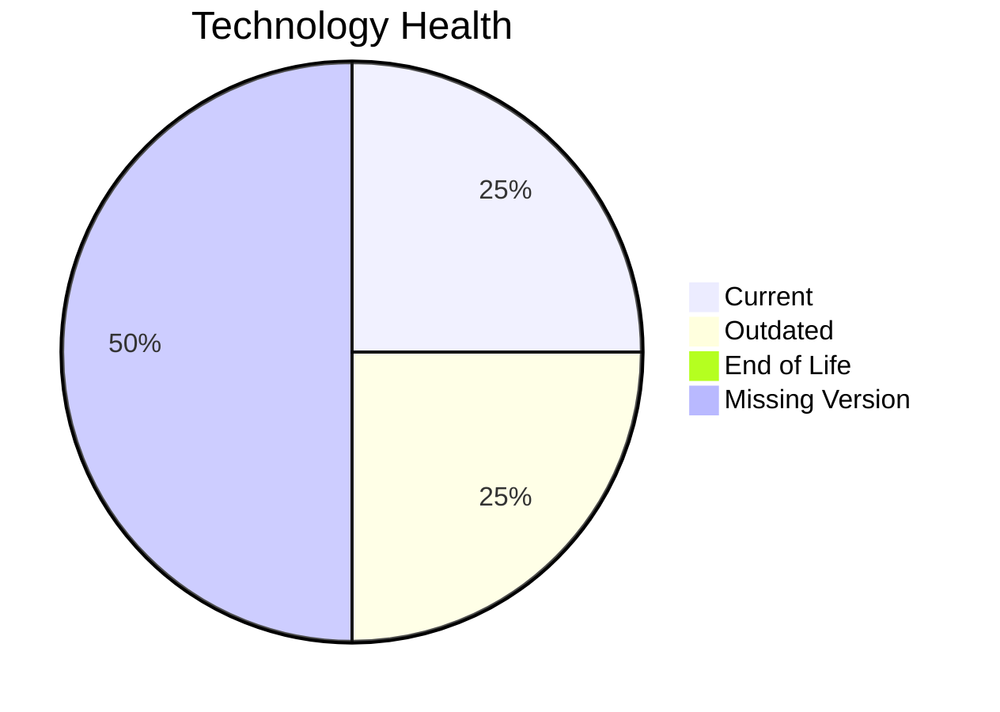

# Application Report: ERPApp-001

**ID:** app001  
**Generated:** 2026-05-13

## Overview
| Attribute | Value |
|---|---|
| Owner | Finance |
| Environment | On-Premise |
| Business Criticality | High |
| Users | 350 |
| Servers | 2 |

## Technology Stack
| Component | Technology | Status |
|---|---|---|
| Operating System | AIX 7.2 | 🟡 OUTDATED |
| Language | COBOL-2014 | ⚪ NO_KNOWLEDGE |
| Application Server | None | ⚪ NO_KNOWLEDGE |
| Database | Oracle 19c | 🟢 CURRENT_VERSION |

## Complexity Assessment
**Score:** 6/10 — **MEDIUM**  
**Confidence:** Medium

## Modernization Scenarios
| Applicable Scenario | Priority | Cost | Savings/Year |
|---|---|---:|---:|
| Operating System Update | High | €1157 | €500 |
| Switch to standard Linux Operating System | Medium | €347 | €400 |
| Application Migration to Cloud Infrastructure (Lift & Shift) | High | €5783 | €2700 |
| Application Refactoring and De-coupling | High | €289133 | €135000 |
| Switch DB Engine to open-source database solution | High | €N/A | €N/A |
| Update outdated components | High | €N/A | €N/A |

## Financial Summary
| Metric | Value |
|---|---:|
| Total One-Time Cost | €296420 |
| Total Yearly Savings | €138600 |
| Break-Even | 2.1 years |
