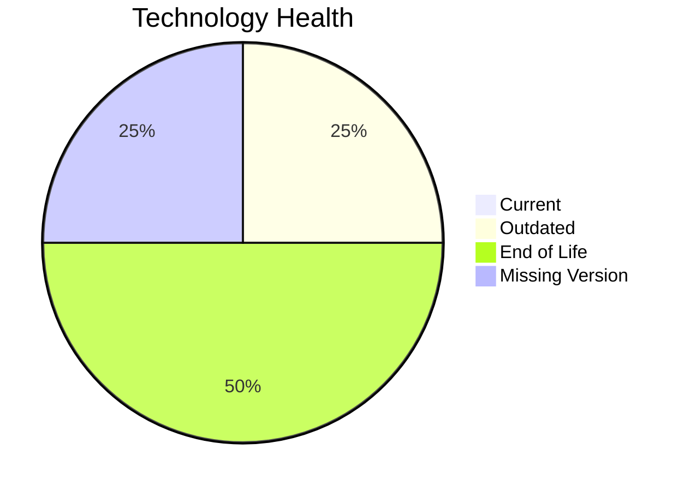

# Application Report: CRMApp-002

**ID:** app002
**Generated:** 2026-05-11

## Overview

| Attribute | Value |
|-----------|-------|
| Owner | Marketing |
| Environment | AWS |
| Business Criticality | Medium |
| Users | 1200 |
| Servers | 2 |

## Technology Stack

| Component | Technology | Version | Status |
|-----------|-----------|---------|--------|
| Operating System | RHEL | RHEL 7 | 🔴 EOL |
| Database | Amazon RDS MySQL | Amazon RDS MySQL | ⚪ NO_KNOWLEDGE |
| Language | Java | Java 11 | 🟡 OUTDATED |
| Framework | N/A | N/A | ⚪ |
| App Server | WebSphere | Websphere 7.0 | 🔴 EOL |

## Complexity Assessment

**Score:** 7/10 — **HIGH**
**Confidence:** 7

Technology age score 9/10 (EOL=2, outdated=1, unknown=1); integration score 8/10 (interfaces=8, api_endpoints=15); infrastructure score 5/10 (servers=2, environments=2); business criticality score 6/10 (Medium, users=1200); architecture score 6/10 (architecture=unknown, CI/CD=Yes, containerized=No); data score 5/10 (db_count=1, db_storage_gb=500).

## Modernization Scenarios

### Applicable Scenarios

#### ✅ Operating System Update

- **Priority:** High
- **Effort:** Low
- **Effects:** security
- **Cost:** €1330 (one-time)
- **Savings:** €500/year
- **Reasoning:** Operating system is outdated or end-of-life per technology assessment.

### Not Applicable / Other

| Scenario | Status | Reason |
|----------|--------|--------|
| Switch to standard Linux Operating System | FULFILLED | Application already runs on a standard Linux distribution. |
| Switch to ARM-based CPU | BLOCKED | Third-party software dependency may block ARM compatibility changes. |
| Applications Server replacement | BLOCKED | Application server lifecycle for third-party stack is vendor-controlled. |
| Application Migration to Cloud Infrastructure (Lift & Shift) | FULFILLED | Application is already hosted on public cloud infrastructure. |
| Application Containerization | BLOCKED | Third-party software may not permit customer-managed container packaging. |
| Application Refactoring and De-coupling | BLOCKED | Source code ownership is vendor-controlled for third-party software. |
| Upgrade Legacy Databases | LACK_OF_DATA | Database version/support information is incomplete. |
| Switch DB Engine to open-source database solution | BLOCKED | Database migration path for third-party application is constrained. |
| Update outdated components | BLOCKED | Component lifecycle updates are vendor-managed for third-party software. |

## Financial Summary

| Metric | Value |
|--------|-------|
| Total One-Time Cost | €1330 |
| Total Yearly Savings | €500 |
| Break-Even | 2.7 years |
