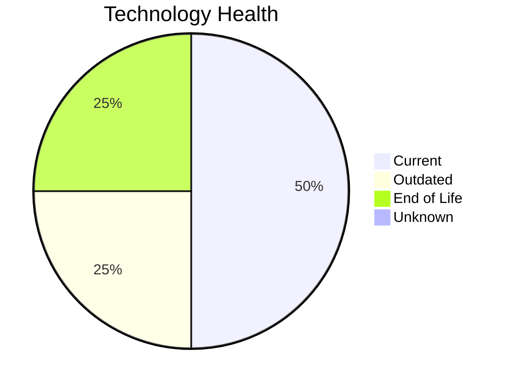

# Application Report: CRMApp-002

**ID:** app002
**Generated:** 2026-05-14

## Overview

| Attribute | Value |
|-----------|-------|
| Owner | Marketing |
| Environment | AWS |
| Business Criticality | Medium |
| Users | 1200 |
| Servers | 2 |
| Solution Type | 3rd party software |
| Architecture | unknown |
| Containerized | No |
| CI/CD | Yes |

## Technology Stack

| Component | Technology | Version | Status |
|-----------|-----------|---------|--------|
| Os | RHEL 7 | 7 | 🔴 EOL |
| Database | Amazon RDS MySQL | RDS MySQL | 🟢 CURRENT_VERSION |
| Programming Language | Java 11 | 11 | 🟢 CURRENT_VERSION |
| Application Server | Websphere 7.0 | 7.0 | 🟡 OUTDATED |

## Complexity Assessment

**Score:** 5/10 — **MEDIUM**
**Confidence:** 8/10

| Factor | Score | Notes |
|--------|-------|-------|
| Technology Age | 7/10 | 1 EOL, 1 outdated components |
| Integration | 7/10 | 8 external interfaces |
| Infrastructure | 4/10 | 2 server(s), 2 environment(s) |
| Business Criticality | 4/10 | Medium criticality |
| Architecture | 3/10 | Containerized: No, CI/CD: Yes |
| Data | 5/10 | DB: Amazon RDS MySQL |

## Modernization Scenarios

### Applicable Scenarios

#### ✅ Operating System Update

- **Priority:** High
- **Effort:** Low
- **Effects:** security
- **Cost:** €1,006 (one-time)
- **Savings:** €500/year
- **Reasoning:** Operating system RHEL 7 has reached End of Life and no longer receives security patches. Immediate OS update required.

### Not Applicable / Other

| Scenario | Status | Reason |
|----------|--------|--------|
| Switch to standard Linux Operating System | ✔️ FULFILLED | Application already runs on standard Linux (RHEL 7). No migration needed. |
| Switch to ARM-based CPU | 🚫 BLOCKED | 3rd party software has potential x86-specific dependencies that are vendor-managed; customer cannot ... |
| Applications Server replacement | 🚫 BLOCKED | Application server Websphere 7.0 is outdated but is part of a 3rd party vendor stack. |
| Application Migration to Cloud Infrastructure (Lift & Shift) | ✔️ FULFILLED | Application is already deployed on cloud infrastructure (AWS). No migration needed. |
| Application Containerization | 🚫 BLOCKED | Application is 3rd party software. Containerization is a vendor responsibility and cannot be modifie... |
| Application Refactoring and De-coupling | 🚫 BLOCKED | Application is 3rd party software; internal architecture is not under customer control and cannot be... |
| Upgrade Legacy Databases | ✔️ FULFILLED | Database Amazon RDS MySQL is on a current, supported version. No upgrade needed. |
| Switch DB Engine to open-source database solution | ✔️ FULFILLED | Database Amazon RDS MySQL is already an open-source or managed solution. No commercial license migra... |
| Update outdated components | 🚫 BLOCKED | 3rd party application — component versions (language, framework, app server) are vendor-managed and ... |

## Financial Summary

| Metric | Value |
|--------|-------|
| Total One-Time Cost | €1,006 |
| Total Yearly Savings | €500 |
| Break-Even | 2.0 years |
