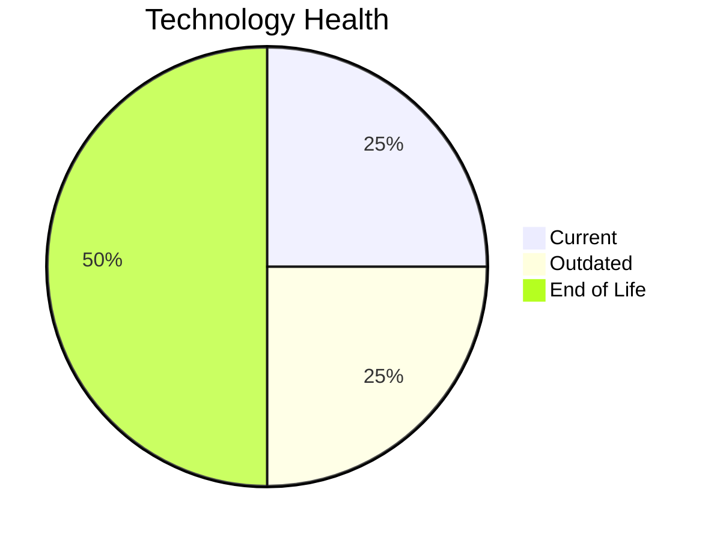

# Application Report: CRMApp-002

**ID:** app002
**Generated:** 2026-05-14

## Overview

| Attribute | Value |
|-----------|-------|
| Business Unit | Marketing |
| Business Criticality | Medium |
| Solution Type | 3rd party software |
| Deployment Type | AWS |
| Users | 1200 |
| Servers | 2 |
| External Interfaces | 8 |
| Containerized | No |
| CI/CD Present | Yes |
| Architecture | unknown |

## Technology Stack

| Component | Technology | Version | Status |
|-----------|-----------|---------|--------|
| Os | RHEL | 7 | 🔴 EOL |
| Language | Java | 11 | 🟡 OUTDATED |
| Database | Amazon RDS MySQL | managed | 🟢 CURRENT_VERSION |
| App Server | WebSphere | 7.0 | 🔴 EOL |

## Complexity Assessment

**Score:** 6/10 — **MEDIUM**
**Confidence:** 7

Score 6/10 (MEDIUM): EOL components=2, Outdated=1, Interfaces=8, Servers=2, Criticality=Medium, Architecture=unknown.

| Factor | Value |
|--------|-------|
| Servers | 2 |
| Environments | 2 |
| Interfaces | 8 |
| EOL Technologies | 2 |
| Outdated Technologies | 1 |
| Business Criticality | Medium |

## Modernization Scenarios

### Applicable Scenarios

#### ✅ Operating System Update

- **Priority:** High
- **Effort:** Low
- **Effects:** security
- **One-Time Cost:** $1,157
- **Annual Savings:** $500/year
- **Reasoning:** Operating system RHEL 7 is EOL. Update to a current supported OS version is recommended.

#### ✅ Applications Server replacement

- **Priority:** Medium
- **Effort:** Medium
- **Effects:** agility, cost
- **One-Time Cost:** $11,565
- **Annual Savings:** $10,800/year
- **Reasoning:** Application server Websphere 7.0 is EOL. Replacement with a modern server is recommended.

#### ✅ Update outdated components

- **Priority:** High
- **Effort:** High
- **Effects:** security, agility, cost
- **Reasoning:** Application has EOL or very legacy components. Update of outdated programming language and framework components is required.

### Other Scenarios

| Scenario | Status | Reason |
|----------|--------|--------|
| Switch to standard Linux Operating System | ✔️ FULFILLED | Application already runs on a standard Linux distribution: RHEL 7. |
| Switch to ARM-based CPU | ❌ NOT_APPLICABLE | Application is 3rd party software. 3rd party/SaaS applications cannot have their infrastructure arch... |
| Application Migration to Cloud Infrastructure (Lift & Shift) | ✔️ FULFILLED | Application is already deployed on cloud infrastructure (AWS). |
| Application Containerization | 🚫 BLOCKED | Application is 3rd party software. Containerization depends on vendor support. |
| Application Refactoring and De-coupling | ❓ LACK_OF_DATA | Application architecture is unknown ('unknown'). Cannot determine coupling level. |
| Upgrade Legacy Databases | ✔️ FULFILLED | Database Amazon RDS MySQL is on a current, supported version. |
| Switch DB Engine to open-source database solution | ✔️ FULFILLED | Database Amazon RDS MySQL is already an open-source/license-free solution. |