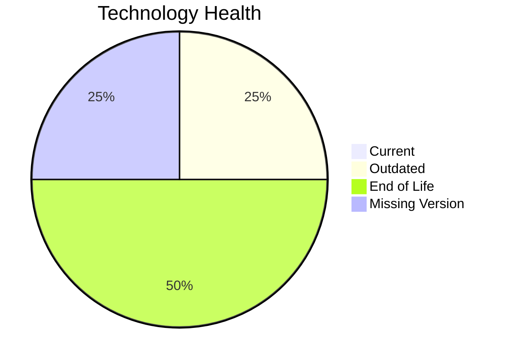

# Application Report: CRMApp-002

**ID:** app002
**Generated:** 2026-05-19

## Overview

| Attribute | Value |
|-----------|-------|
| Owner | unknown |
| Environment | AWS |
| Business Criticality | Medium |
| Users | 1200 |
| Servers | 2 |

## Technology Stack

| Component | Technology | Version | Status |
|-----------|-----------|---------|--------|
| Operating System | RHEL 7 | 7 | 🔴 EOL |
| Database | Amazon RDS MySQL | None | ⚪ NO_KNOWLEDGE |
| Language | Java 11 | 11 | 🟡 OUTDATED |
| Framework | N/A | N/A | ⚪ N/A |
| App Server | Websphere 7.0 | 7.0 | 🔴 EOL |

## Complexity Assessment

**Score:** 7/10 — **HIGH**
**Confidence:** 8

| Factor | Score | Notes |
|--------|-------|-------|
| Technology Age | n/a | Medium-critical app with complexity driven by technology age, integrations, and architecture characteristics. |
| Integration | n/a | Interfaces: 8 |
| Infrastructure | n/a | Environments: 2 |
| Business Criticality | n/a | Medium |
| Architecture | n/a | Containerized: No; CI/CD: Yes |
| Data | n/a | Databases: 1 |

## Scenario Applicability

### Applicable Scenarios

#### ✅ Operating System Update

- **Priority:** High
- **Effort:** Low
- **Effects:** security
- **Cost:** €1,330 (one-time)
- **Savings:** €500/year
- **Reasoning:** RHEL 7 is classified as EOL, which triggers an operating system update scenario.

### Not Applicable / Other

| Scenario | Status | Reason |
|----------|--------|--------|
| Switch to standard Linux Operating System | ✔️ FULFILLED | RHEL 7 is already a standard Linux distribution. |
| Switch to ARM-based CPU | 🚫 BLOCKED | Third-party software stack may depend on vendor-certified x86 builds. |
| Applications Server replacement | 🚫 BLOCKED | Application server appears to be part of a third-party stack, so direct replacement is constrained by vendor support. |
| Application Migration to Cloud Infrastructure (Lift & Shift) | ✔️ FULFILLED | Application is already hosted on AWS. |
| Application Containerization | 🚫 BLOCKED | Third-party packaged software may not support customer-led containerization. |
| Application Refactoring and De-coupling | 🚫 BLOCKED | Refactoring a third-party application is typically constrained by vendor ownership. |
| Upgrade Legacy Databases | ❓ LACK_OF_DATA | Database version support could not be confirmed. |
| Switch DB Engine to open-source database solution | ✔️ FULFILLED | Amazon RDS MySQL already aligns with an open-source database family. |
| Update outdated components | 🚫 BLOCKED | Outdated components exist, but remediation likely depends on the third-party vendor roadmap. |

## Financial Summary

| Metric | Value |
|--------|-------|
| Total One-Time Cost | €1,330 |
| Total Yearly Savings | €500 |
| Break-Even | 2.7 years |
