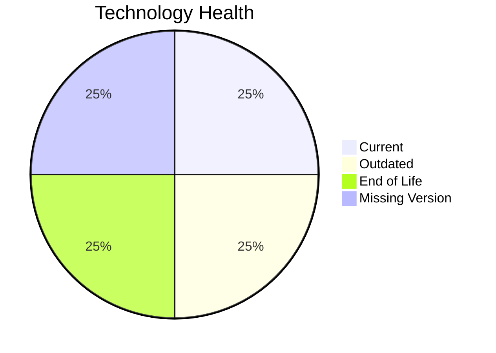

# Application Report: CRMApp-002

**ID:** app002
**Generated:** 2026-04-24

## Overview

| Attribute | Value |
|-----------|-------|
| Owner | Marketing |
| Business Unit | Marketing |
| Deployment Type | AWS |
| Business Criticality | Medium |
| Users | 1200 |
| Servers | 2 |
| Architecture | unknown |
| Solution Type | 3rd party software |
| CI/CD | Yes |
| Containerized | No |

## Technology Stack

| Component | Technology | Version | Status |
|-----------|-----------|---------|--------|
| Operating System | RHEL 7 | RHEL 7 | 🔴 EOL |
| Language | Java 11 | Java 11 | 🟡 OUTDATED |
| Database | Amazon RDS MySQL | Amazon RDS MySQL | 🟢 CURRENT_VERSION |
| App Server | Websphere 7.0 | Websphere 7.0 | ⚪ NO_KNOWLEDGE |

## Complexity Assessment

**Score:** 5/10 — **MEDIUM**
**Confidence:** 7

**Reasoning:** Tech age score 7/10 (1 EOL, 1 outdated components). Integration score 7/10 (8 external interfaces). Infrastructure score 3/10 (2 servers, 2 environments). Business criticality score 5/10 (criticality: Medium). Architecture score 4/10 (architecture: unknown, containerized: No, CI/CD: Yes). Data score 4/10 (500GB storage).

### Contributing Factors

| Factor | Value |
|--------|-------|
| Servers | 2 |
| Environments | 2 |
| External Interfaces | 8 |
| EOL Technologies | 1 |
| Outdated Technologies | 1 |
| CI/CD | Yes |
| Containerized | No |

## Modernization Scenarios

### Applicable Scenarios

#### ✅ Operating System Update

- **Priority:** High
- **Effort:** Low
- **Effects:** security
- **Cost:** €1,006 (one-time)
- **Savings:** €500/year
- **Reasoning:** Operating system 'RHEL 7' is EOL. OS update is recommended.

### Not Applicable / Other

| Scenario | Status | Reason |
|----------|--------|--------|
| Switch to standard Linux Operating System | FULFILLED | Application already runs on a standard Linux distribution: 'RHEL 7'.... |
| Switch to ARM-based CPU | NOT_APPLICABLE | Exclusion: SaaS or 3rd party application; ARM migration not applicable.... |
| Applications Server replacement | LACK_OF_DATA | Lifecycle data for application server 'Websphere 7.0' is not available.... |
| Application Migration to Cloud Infrastructure (Lift & Shift) | FULFILLED | Application is already deployed on cloud: 'AWS'.... |
| Application Containerization | NOT_APPLICABLE | Exclusion: 3rd party software - runtime packaging cannot be modified by the cust... |
| Application Refactoring and De-coupling | NOT_APPLICABLE | Exclusion: SAP/SaaS/3rd party application - source code not under customer contr... |
| Upgrade Legacy Databases | FULFILLED | Database 'Amazon RDS MySQL' is on a currently supported version.... |
| Switch DB Engine to open-source database solution | NOT_APPLICABLE | Exclusion: 3rd party application - database migration not under customer control... |
| Update outdated components | NOT_APPLICABLE | Exclusion: 3rd party software - component versions are vendor-managed.... |

## Financial Summary

| Metric | Value |
|--------|-------|
| Total One-Time Cost | €1,006 |
| Total Yearly Savings | €500 |
| Break-Even | 2.0 years |
