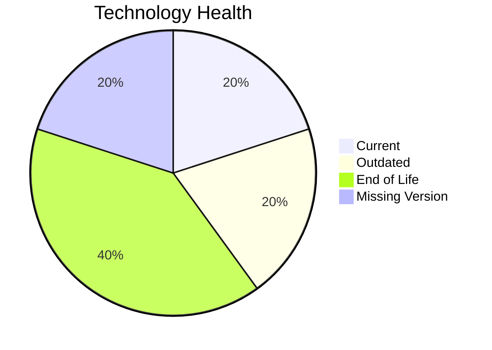

# Application Report: CRMApp-002

**ID:** app002
**Generated:** 2026-05-14

## Overview

| Attribute | Value |
|-----------|-------|
| Owner | Marketing |
| Environment | AWS |
| Business Criticality | Medium |
| Users | 1200 |
| Servers | sv05, sv07 |

## Technology Stack

| Component | Technology | Status |
|-----------|-----------|--------|
| Operating System | RHEL 7 | 🔴 |
| Database | Amazon RDS MySQL | 🟡 |
| Language | Java 11 | 🟡 |

## Complexity Assessment

**Score:** 6/10 — **MEDIUM**

## Modernization Scenarios

### ✅ Os Update Security Patch
- **Reasoning:** EOL operating system/server components require security remediation.

### ✅ Switch To Arm Cpu
- **Reasoning:** Cloud-hosted workload with manageable complexity is a candidate for ARM.

### ✅ Application Server Replacement
- **Reasoning:** Legacy application server version should be replaced.

### ✅ App Containerization
- **Reasoning:** Application is not containerized and can benefit from platform standardization.

### ✅ App Refactor Decoupling
- **Reasoning:** High coupling and/or monolithic architecture indicates refactor opportunity.

## Financial Summary

| Metric | Value |
|--------|-------|
| Total One-Time Cost | €446422 |
| Total Yearly Savings | €266200 |
| Break-Even | 1.7 years |
