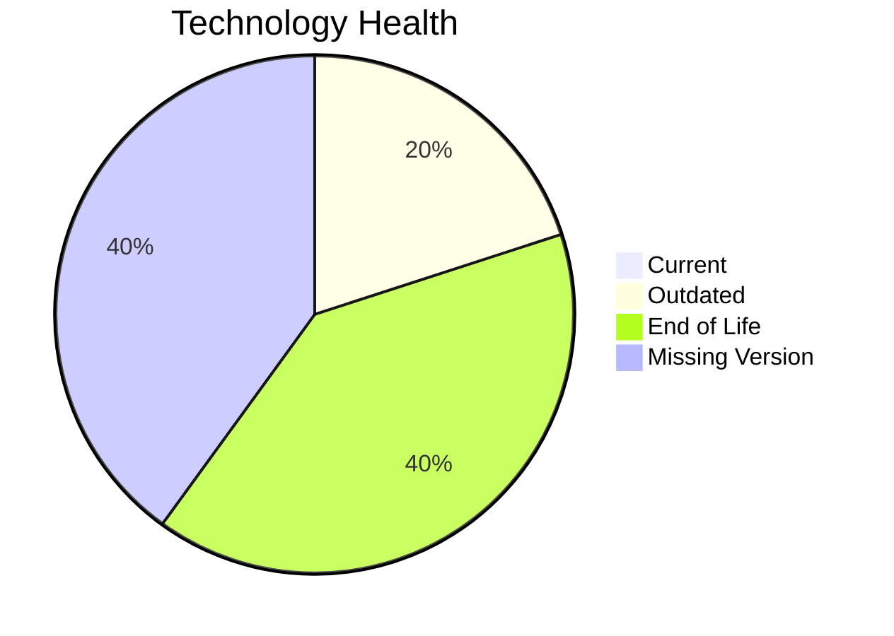

# Application Report: CRMApp-002

**ID:** app002  
**Generated:** 2026-05-14

## Overview

| Attribute | Value |
|-----------|-------|
| Owner | unknown |
| Environment | AWS |
| Business Criticality | Medium |
| Users | 1200 |
| Servers | sv05, sv07 |

## Technology Stack

| Component | Technology | Version | Status |
|-----------|-----------|---------|--------|
| os | RHEL 7 | 7 | 🔴 EOL |
| database | Amazon RDS MySQL | unknown | ⚪ NO_KNOWLEDGE |
| language | Java 11 | 11 | 🟡 OUTDATED |
| framework | Framework | unknown | ⚪ NO_KNOWLEDGE |
| app_server | Websphere 7.0 | 7.0 | 🔴 EOL |

## Complexity Assessment

**Score:** 6/10 — **MEDIUM**  
**Confidence:** 8

**Reasoning:** Tech age 9/10 (2 EOL, 1 outdated components), integrations 8 interfaces and 0 dependencies, infrastructure 2 servers/2 environments, criticality Medium, architecture score 4/10, data score 5/10.

## Modernization Scenarios

### Applicable Scenarios

#### ✅ Operating System Update
- **Cost:** €1157 (one-time)
- **Savings:** €500/year
- **Reasoning:** RHEL 7 requires upgrade/security patching.
#### ✅ Switch to ARM-based CPU
- **Cost:** €5783 (one-time)
- **Savings:** €1000/year
- **Reasoning:** Cloud-hosted workload can be evaluated for ARM-based instances.
#### ✅ Applications Server replacement
- **Cost:** €11565 (one-time)
- **Savings:** €10800/year
- **Reasoning:** Application server Websphere 7.0 is outdated/EOL.
#### ✅ Application Containerization
- **Cost:** €115653 (one-time)
- **Savings:** €90000/year
- **Reasoning:** Containerization could improve portability and operations.
#### ✅ Application Refactoring and De-coupling
- **Cost:** €289133 (one-time)
- **Savings:** €135000/year
- **Reasoning:** Monolithic/tightly integrated footprint suggests refactoring benefits.

### Not Applicable / Other

| Scenario | Status | Reason |
|----------|--------|--------|
| Switch to standard Linux Operating System | FULFILLED | Application already runs on a standard Linux platform. |
| Application Migration to Cloud Infrastructure (Lift & Shift) | FULFILLED | Application is already deployed in cloud. |
| Upgrade Legacy Databases | LACK_OF_DATA | Database lifecycle could not be determined. |
| Switch DB Engine to open-source database solution | FULFILLED | Application already uses open-source database engine. |
| Update outdated components | APPLICABLE | Outdated or EOL components identified in technology assessment. |

## Financial Summary

| Metric | Value |
|--------|-------|
| Total One-Time Cost | €423291 |
| Total Yearly Savings | €237300 |
| Break-Even | 1.8 years |
