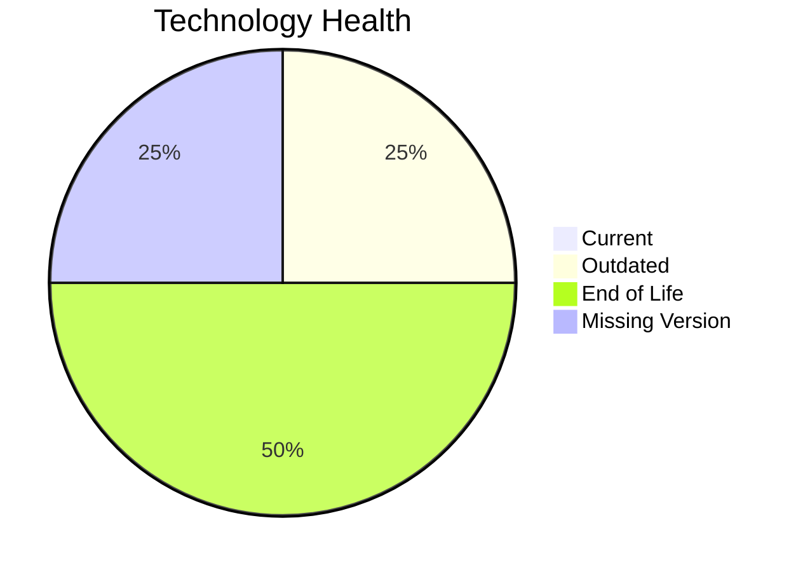

# Application Report: CRMApp-002

**ID:** app002  
**Generated:** 2026-05-17

## Overview

| Attribute | Value |
|-----------|-------|
| Owner | N/A |
| Environment | AWS |
| Business Criticality | Medium |
| Users | 1200 |
| Servers | 2 |

## Technology Stack

| Component | Technology | Version | Status |
|-----------|-----------|---------|--------|
| Operating System | RHEL | 7 | 🔴 EOL |
| Database | MySQL | N/A | ⚪ NO_KNOWLEDGE |
| Language | Java | 11 | 🟡 OUTDATED |
| Framework | N/A | N/A | ⚪ NO_KNOWLEDGE |
| App Server | WebSphere | 7.0 | 🔴 EOL |

## Complexity Assessment

**Score:** 7/10 — **HIGH**  
**Confidence:** 7

| Factor | Score | Notes |
|--------|-------|-------|
| Technology Age | 9/10 | 2 components are EOL. |
| Integration | 8/10 | High integration surface with 8 external interfaces and 15 APIs. |
| Infrastructure | 5/10 | Moderate infrastructure footprint with 2 servers and 2 environments. |
| Business Criticality | 5/10 | Business criticality is Medium. |
| Architecture | 7/10 | not containerized, CI/CD exists, legacy application server, vendor-controlled architecture. |
| Data | 6/10 | 1 database engine(s), 500 GB storage, database version not fully known. |

## Modernization Scenarios

### Applicable Scenarios

#### ✅ Operating System Update

- **Priority:** High
- **Effort:** Low
- **Effects:** security
- **Cost:** €1330 (one-time)
- **Savings:** €500/year
- **Reasoning:** RHEL 7 is assessed as EOL, which triggers an OS update scenario.

### Not Applicable / Other

| Scenario | Status | Reason |
|----------|--------|--------|
| Switch to standard Linux Operating System | FULFILLED | RHEL 7 already belongs to a standard Linux family. |
| Switch to ARM-based CPU | LACK_OF_DATA | CPU architecture is not documented in the workbook, so ARM suitability cannot be assessed confidently. |
| Applications Server replacement | BLOCKED | The application is third-party software, so replacing the application server is likely constrained by vendor certification. |
| Application Migration to Cloud Infrastructure (Lift & Shift) | FULFILLED | Deployment target already points to AWS/public cloud only. |
| Application Containerization | BLOCKED | Third-party packaging is likely vendor-controlled, so customer-led containerization is blocked. |
| Application Refactoring and De-coupling | BLOCKED | Application is third-party software and its internal architecture is not under customer control. |
| Upgrade Legacy Databases | LACK_OF_DATA | Database engine/version details are insufficient to determine upgrade need. |
| Switch DB Engine to open-source database solution | FULFILLED | Amazon RDS MySQL already uses an open-source-compatible engine family. |
| Update outdated components | BLOCKED | Application is third-party software and component upgrades are likely vendor-managed. |

## Financial Summary

| Metric | Value |
|--------|-------|
| Total One-Time Cost | €1330 |
| Total Yearly Savings | €500 |
| Break-Even | 2.7 years |
