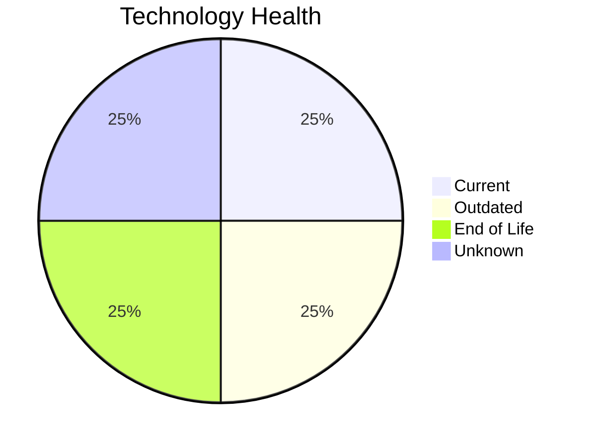

# Application Report: CRMApp-002

**ID:** app002  
**Generated:** 2026-05-06

## Overview

| Attribute | Value |
|-----------|-------|
| Business Unit | Marketing |
| Deployment | AWS |
| Business Criticality | Medium |
| Users | 1200 |
| Servers | 2 |
| Architecture | unknown |
| Containerized | No |
| CI/CD | Yes |

## Technology Stack

| Component | Technology | Status |
|-----------|-----------|--------|
| Operating System | RHEL 7 | 🔴 EOL |
| Database | Amazon RDS MySQL | 🟢 CURRENT_VERSION |
| Language | Java 11 | 🟡 OUTDATED |
| App Server | Websphere 7.0 | ⚪ NO_KNOWLEDGE |

## Complexity Assessment

**Score:** 6/10 — **MEDIUM**  
**Confidence:** 8/10

> Complexity score 6/10 (MEDIUM). 1 EOL component(s), 1 outdated component(s), 8 external interfaces.

| Factor | Score |
|--------|-------|
| Technology Age & EOL | 8/10 |
| Integration Complexity | 7/10 |
| Infrastructure Scale | 4/10 |
| Business Criticality | 9/10 |
| Code & Architecture | 4/10 |
| Data Complexity | 4/10 |

## Modernization Scenarios

### Applicable Scenarios

#### ✅ Operating System Update

- **Priority:** High
- **Effort:** Low
- **Effects:** security
- **Cost:** €1,157 (one-time)
- **Savings:** €500/year
- **Reasoning:** OS (RHEL 7) is EOL; update to a current, supported version.

#### ✅ Application Containerization

- **Priority:** High
- **Effort:** High
- **Effects:** agility, cost, sustainability
- **Cost:** €115,653 (one-time)
- **Savings:** €90,000/year
- **Reasoning:** Application is not containerized; containerization could improve portability and deployment efficiency.

#### ✅ Update outdated components

- **Priority:** High
- **Effort:** High
- **Effects:** security, agility, cost
- **Cost:** N/A (one-time)
- **Savings:** N/A
- **Reasoning:** Components need updating. EOL: RHEL 7; Outdated: Java 11.

### Other Scenarios

| Scenario | Status | Reason |
|----------|--------|--------|
| Switch to standard Linux Operating System | FULFILLED | Application runs on standard Linux (RHEL 7). |
| Switch to ARM-based CPU | LACK_OF_DATA | CPU architecture not documented in application data. |
| Applications Server replacement | LACK_OF_DATA | Application server lifecycle status unknown. |
| Application Migration to Cloud Infrastructure (Lift & Shift) | FULFILLED | Application is already deployed on cloud (AWS). |
| Application Refactoring and De-coupling | LACK_OF_DATA | Architecture not clearly identified. |
| Upgrade Legacy Databases | FULFILLED | Database (Amazon RDS MySQL) is on a current, supported version. |
| Switch DB Engine to open-source database solution | FULFILLED | Database (Amazon RDS MySQL) is already open-source or compatible. |

## Financial Summary

| Metric | Value |
|--------|-------|
| Total One-Time Investment | €116,810 |
| Total Annual Savings | €90,500 |
| Break-Even | 1.3 years |
