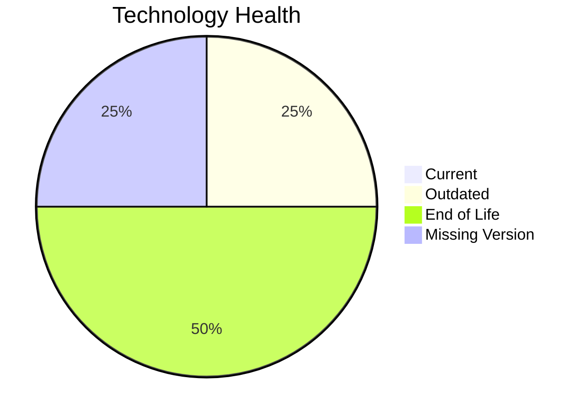

# Application Report: CRMApp-002

**ID:** app002  
**Generated:** 2026-05-13

## Overview
| Attribute | Value |
|---|---|
| Owner | Marketing |
| Environment | AWS |
| Business Criticality | Medium |
| Users | 1200 |
| Servers | 2 |

## Technology Stack
| Component | Technology | Status |
|---|---|---|
| Operating System | RHEL 7 | 🔴 EOL |
| Language | Java 11 | 🟡 OUTDATED |
| Application Server | Websphere 7.0 | 🔴 EOL |
| Database | Amazon RDS MySQL | ⚪ NO_KNOWLEDGE |

## Complexity Assessment
**Score:** 7/10 — **HIGH**  
**Confidence:** Medium

## Modernization Scenarios
| Applicable Scenario | Priority | Cost | Savings/Year |
|---|---|---:|---:|
| Operating System Update | High | €1330 | €500 |

## Financial Summary
| Metric | Value |
|---|---:|
| Total One-Time Cost | €1330 |
| Total Yearly Savings | €500 |
| Break-Even | 2.7 years |
