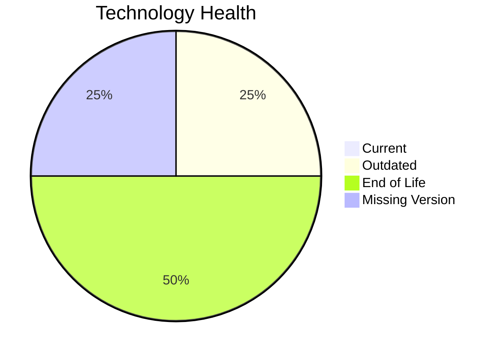

# Application Report: CRMApp-002

Modernization assessment for CRMApp-002 based solely on the Excel portfolio row and derived workflow outputs.

**ID:** app002  
**Generated:** 2026-05-07

## Overview

| Attribute | Value |
|-----------|-------|
| Owner | Marketing |
| Environment | AWS |
| Business Criticality | Medium |
| Users | 1200 |
| Servers | sv05, sv07 |

## Technology Stack

| Component | Technology | Version | Status |
|-----------|-----------|---------|--------|
| Operating System | RHEL | 7 | 🔴 |
| Database | Amazon RDS MySQL | unknown | ⚪ |
| Language | Java | 11 | 🟡 |
| Framework | N/A | N/A | ⚪ |
| App Server | IBM WebSphere | 7.0 | 🔴 |

## Complexity Assessment

**Score:** 7/10 — **HIGH**  
**Confidence:** 7

| Factor | Score | Notes |
|--------|-------|-------|
| Technology Age | 9/10 | 2 EOL, 1 outdated, 1 unknown lifecycle components. |
| Integration | 8/10 | 8 external interfaces and 15 API endpoints indicate the integration footprint. |
| Infrastructure | 5/10 | 2 listed server instances and 2 environments drive infrastructure coordination. |
| Business Criticality | 7/10 | Business criticality is Medium with approximately 1200 users. |
| Architecture | 8/10 | application is not containerized; third-party software limits internal modernization control; application stack contains EOL runtime components |
| Data | 5/10 | database storage is 500 GB; moderate database footprint |

## Modernization Scenarios

### Applicable Scenarios

#### ✅ Operating System Update

- **Priority:** High
- **Effort:** Low
- **Effects:** security
- **Cost:** €1330 (one-time)
- **Savings:** €500/year
- **Reasoning:** Operating system RHEL 7 is eol and matches the OS update trigger.

### Not Applicable / Other

| Scenario | Status | Reason |
|----------|--------|--------|
| Switch to standard Linux Operating System | PARTIALLY_FULFILLED | The application already runs on Linux, but the distribution/version is not current and still needs standardization or upgrade. |
| Switch to ARM-based CPU | LACK_OF_DATA | CPU architecture is not present in the Excel input, so the primary ARM migration trigger cannot be confirmed. |
| Applications Server replacement | BLOCKED | The application server is legacy, but the application is third-party software and likely tied to a vendor-managed stack. |
| Application Migration to Cloud Infrastructure (Lift & Shift) | FULFILLED | The application is already hosted on AWS, which fulfills the lift-and-shift cloud target. |
| Application Containerization | BLOCKED | The application is third-party software and container packaging is unlikely to be under customer control. |
| Application Refactoring and De-coupling | BLOCKED | The application is third-party software, so internal refactoring is not under customer control. |
| Upgrade Legacy Databases | LACK_OF_DATA | Database technology is known but its version support status is not. |
| Switch DB Engine to open-source database solution | FULFILLED | Database engine Amazon RDS MySQL is already open-source aligned. |
| Update outdated components | BLOCKED | The application is third-party software, so runtime component upgrades are likely vendor-managed. |

## Financial Summary

| Metric | Value |
|--------|-------|
| Total One-Time Cost | €1330 |
| Total Yearly Savings | €500 |
| Break-Even | 2.7 years |
