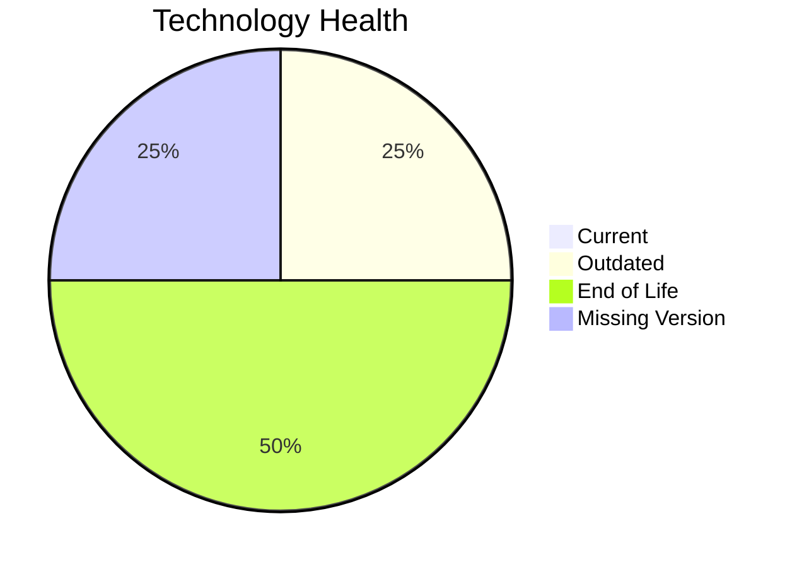

# Application Report: CRMApp-002

**ID:** app002
**Generated:** 2026-05-07

## Overview

| Attribute | Value |
|-----------|-------|
| Owner | N/A |
| Environment | AWS |
| Business Criticality | Medium |
| Users | 1200 |
| Servers | 2 |

## Technology Stack

| Component | Technology | Version | Status |
|-----------|-----------|---------|--------|
| Operating System | RHEL | 7 | 🔴 EOL |
| Database | Amazon RDS MySQL | unknown | ⚪ NO_KNOWLEDGE |
| Language | Java | 11 | 🟡 OUTDATED |
| Framework | N/A | N/A | ⚪ NO_KNOWLEDGE |
| App Server | WebSphere | 7.0 | 🔴 EOL |

## Complexity Assessment

**Score:** 7/10 — **HIGH**
**Confidence:** 6

| Factor | Score | Notes |
|--------|-------|-------|
| Technology Age | 9/10 | 2 EOL components were found in the application stack. |
| Integration | 8/10 | The application exposes 8 interfaces, indicating heavy integration. |
| Infrastructure | 5/10 | 2 servers and 2 environments indicate moderate infrastructure complexity. |
| Business Criticality | 6/10 | Criticality is 'Medium' with 1200 users. |
| Architecture | 5/10 | Architecture detail is incomplete, so a neutral score was used. CI/CD lowers delivery risk. Third-party software reduces architectural control. |
| Data | 5/10 | Database footprint (500 GB) indicates moderate data migration effort. |

## Modernization Scenarios

### Applicable Scenarios

#### ✅ Operating System Update

- **Priority:** High
- **Effort:** Low
- **Effects:** security
- **Cost:** €1,330 (one-time)
- **Savings:** €500/year
- **Reasoning:** RHEL 7 reached end of maintenance support in June 2024.

#### ✅ Applications Server replacement

- **Priority:** Medium
- **Effort:** Medium
- **Effects:** agility, cost
- **Cost:** €13,300 (one-time)
- **Savings:** €9,600/year
- **Reasoning:** WebSphere 7 is long out of support.

### Not Applicable / Other

| Scenario | Status | Reason |
|----------|--------|--------|
| Switch to standard Linux Operating System | PARTIALLY_FULFILLED | Application runs on Linux already, but the current RHEL 7 release is EOL. |
| Switch to ARM-based CPU | LACK_OF_DATA | CPU architecture is not present in the workbook, so ARM suitability cannot be validated. |
| Application Migration to Cloud Infrastructure (Lift & Shift) | FULFILLED | Application is already hosted on AWS, which satisfies the public cloud hosting indicator. |
| Application Containerization | BLOCKED | The application is third-party software and container packaging cannot be assumed to be under customer control. |
| Application Refactoring and De-coupling | BLOCKED | The application is third-party software, so internal refactoring is not under customer control. |
| Upgrade Legacy Databases | LACK_OF_DATA | Managed MySQL is identified, but no engine version is available for lifecycle validation. |
| Switch DB Engine to open-source database solution | FULFILLED | The application already uses an open-source or open-source-compatible database engine. |
| Update outdated components | BLOCKED | The scenario excludes third-party applications because runtime components are vendor-managed. |

## Financial Summary

| Metric | Value |
|--------|-------|
| Total One-Time Cost | €14,630 |
| Total Yearly Savings | €10,100 |
| Break-Even | 1.4 years |
