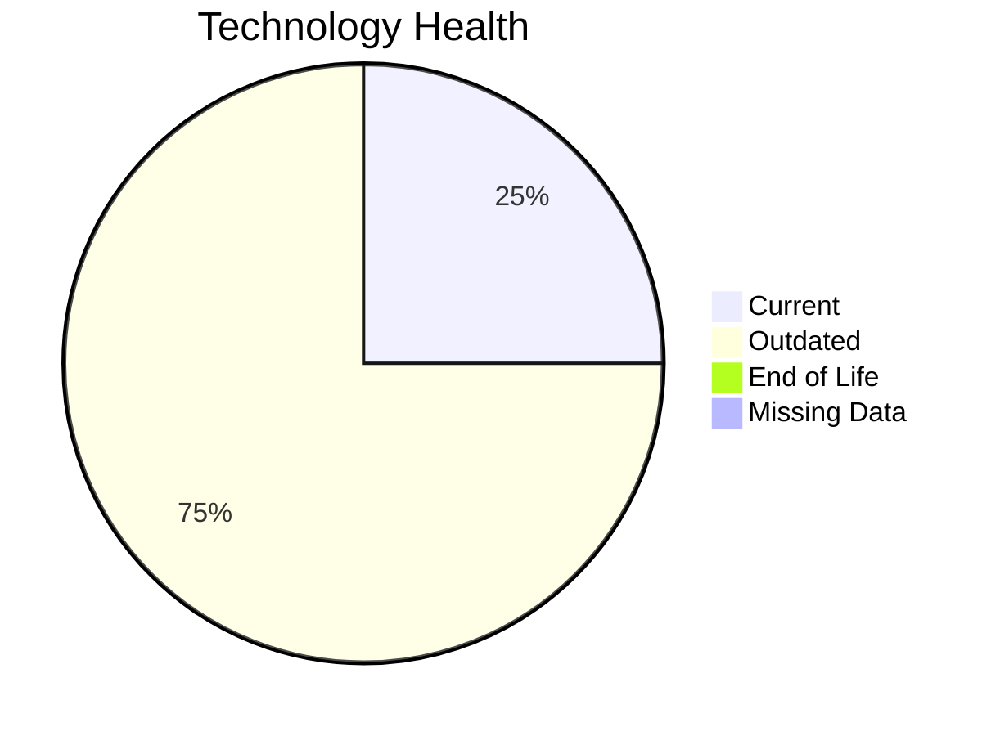

# Application Report: CRMApp-002

**ID:** app002  
**Generated:** 2026-05-07

## Overview

| Attribute | Value |
|-----------|-------|
| Business Unit | Marketing |
| Deployment Type | AWS |
| Business Criticality | Medium |
| Users | 1200 |
| Servers | 2 |
| Solution Type | 3rd party software |

**Description:** Customer relationship management system for tracking leads, opportunities, and customer interactions

## Technology Stack

| Component | Technology | Status |
|-----------|-----------|--------|
| Os | RHEL 7 | 🟡 OUTDATED |
| Database | Amazon RDS MySQL None | 🟡 OUTDATED |
| Language | Java 11 | 🟢 CURRENT_VERSION |
| App_Server | Websphere 7.0 | 🟡 OUTDATED |

## Complexity Assessment

**Score:** 5/10 — **MEDIUM**  
**Confidence:** 9/10

**Reasoning:** Technology age: 6/10 (0 EOL, 3 outdated components) | Integration: 8/10 (8 external interfaces) | Infrastructure: 4/10 (2 servers, 2 environments) | Criticality: 5/10 (medium) | Architecture: 4/10 (containerized: no, CI/CD: yes) | Data: 4/10 (500 GB storage)

### Contributing Factors

| Factor | Value |
|--------|-------|
| Servers | 2 |
| Databases | 1 |
| Environments | 2 |
| Interfaces | 8 |
| EOL Technologies | 0 |
| Outdated Technologies | 3 |
| Containerized | No |
| CI/CD Present | Yes |

## Modernization Scenarios

### Applicable Scenarios

#### ✅ Operating System Update

- **Priority:** High
- **Effort:** Low
- **Effects:** security
- **Cost:** $1,005.68 (one-time)
- **Savings:** $500.00/year
- **Reasoning:** Triggered by: Operating System Version is Outdated, Operating System Version is Unsupported

#### ✅ Applications Server replacement

- **Priority:** Medium
- **Effort:** Medium
- **Effects:** agility, cost
- **Cost:** $10,056.79 (one-time)
- **Savings:** $10,800.00/year
- **Reasoning:** Triggered by: Application Server lacks container support

#### ✅ Application Refactoring and De-coupling

- **Priority:** High
- **Effort:** High
- **Effects:** agility, cost, sustainability
- **Cost:** $251,419.65 (one-time)
- **Savings:** $135,000.00/year
- **Reasoning:** Triggered by: Architecture is Tightly Coupled

#### ✅ Upgrade Legacy Databases

- **Priority:** High
- **Effort:** Medium
- **Effects:** security, agility
- **Cost:** $10,056.79 (one-time)
- **Savings:** $10,000.00/year
- **Reasoning:** Triggered by: Database Support is End of Life / Outdated

#### ✅ Update outdated components

- **Priority:** High
- **Effort:** High
- **Effects:** security, agility, cost
- **Cost:** $0.00 (one-time)
- **Savings:** $0.00/year
- **Reasoning:** Triggered by: Used Application Server is legacy or outdated (e.g. Weblogic 10.x, Websphere 7.x, JBoss EAP 5.x, Tomcat 6.x, IIS 6.x)

### Other Scenarios

| Scenario | Status | Reason |
|----------|--------|--------|
| Switch to standard Linux Operating System | ✔️ FULFILLED | Fulfilled: Application already runs on a standard, widely supported Linux distri... |
| Switch to ARM-based CPU | ❌ NOT_APPLICABLE | No primary triggers matched for this application. |
| Application Migration to Cloud Infrastructure (Lift & Shift) | ✔️ FULFILLED | Fulfilled: Application is already hosted on a Public Cloud provider |
| Application Containerization | ❌ NOT_APPLICABLE | No primary triggers matched for this application. |
| Switch DB Engine to open-source database solution | ✔️ FULFILLED | Fulfilled: Database engine is already an open-source alternative with no commerc... |

## Financial Summary

| Metric | Value |
|--------|-------|
| Total One-Time Cost | $272,538.90 |
| Total Yearly Savings | $156,300.00 |
| Break-Even | 1.74 years |

---

*This report was automatically generated from application portfolio analysis.*
