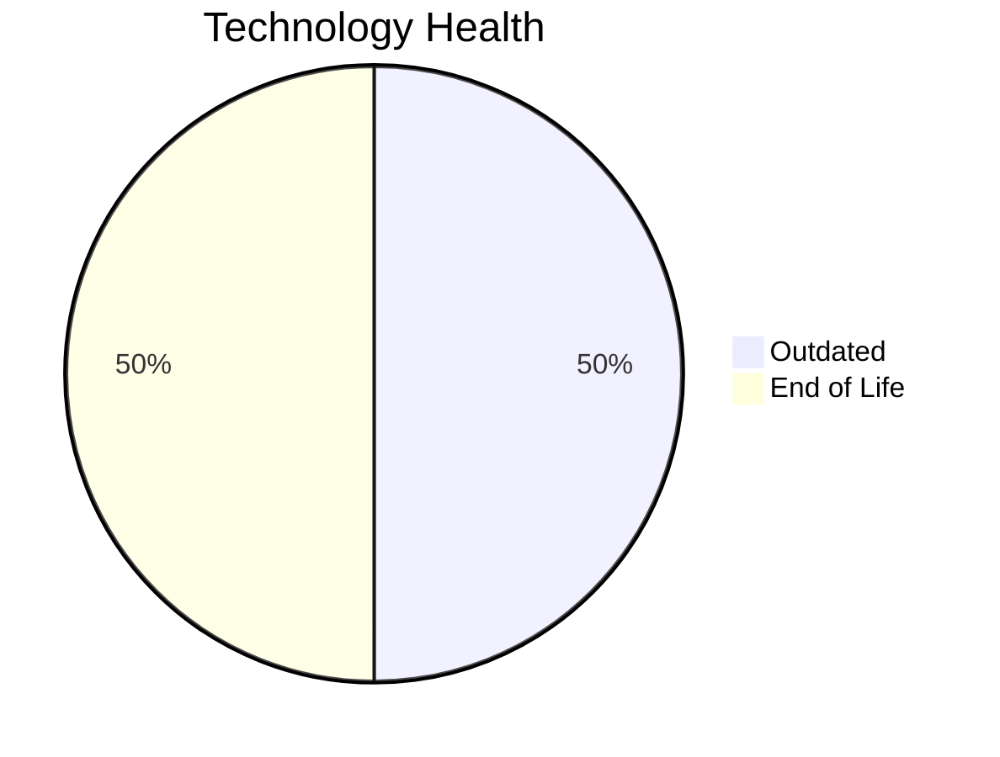

# Application Report: AnalyticsApp-003

**ID:** app003  
**Generated:** 2025-07-17

## Overview

| Attribute | Value |
|-----------|-------|
| Business Unit | IT |
| Deployment Type | AWS |
| Business Criticality | Low |
| Users | 480 |
| Servers | sv03 |
| Environments | 1 |
| Architecture | 3-Tier |
| Containerized | Yes |
| CI/CD | Yes |
| Solution Type | Open Source |

> Analytics platform for generating operational reports and business insights from logistics data

## Technology Stack

| Component | Technology | Version | Status |
|-----------|-----------|---------|--------|
| Os | RHEL | 7 | 🔴 EOL |
| Database | PostgreSQL | 13 | 🟡 OUTDATED |
| Language | Python | 3.9 | 🟡 OUTDATED |
| Application Server | Apache Tomcat | 6.x | 🔴 EOL |

## Complexity Assessment

**Score:** 4/10 — **MEDIUM**  
**Confidence:** 7

> Score 4/10 (MEDIUM). EOL components: 2, Outdated: 2. External interfaces: 3. Servers: 1. Criticality: Low. Architecture: 3-Tier. DB storage: 200.0GB.

| Factor | Value |
|--------|-------|
| Servers | 1 |
| Environments | 1 |
| External Interfaces | 3 |
| Business Criticality | Low |
| EOL Technologies | 2 |
| Outdated Technologies | 2 |

## Modernization Scenarios

### ✅ Applicable Scenarios

#### ✅ Operating System Update

- **Priority:** High
- **Effort:** Low
- **One-Time Cost:** €875
- **Yearly Savings:** €500
- **Reasoning:** OS RHEL 7 is EOL. RHEL 7 reached End of Maintenance Support on June 30, 2024. No security updates without ELS. OS update is required.

#### ✅ Application Server Replacement

- **Priority:** Medium
- **Effort:** Medium
- **One-Time Cost:** €8,745
- **Yearly Savings:** €10,800
- **Reasoning:** Application server Apache Tomcat 6.x is EOL. Apache Tomcat 6 reached End of Life on December 31, 2016. Replacement with a modern server is recommended.

#### ✅ Upgrade Legacy Databases

- **Priority:** High
- **Effort:** Medium
- **One-Time Cost:** €8,745
- **Yearly Savings:** €10,000
- **Reasoning:** Database PostgreSQL 13 is OUTDATED. PostgreSQL 13 EOL is November 2025. It is approaching end of life and upgrade is recommended. Upgrade is recommended.

#### ✅ Update Outdated Components

- **Priority:** High
- **Effort:** High
- **Reasoning:** Outdated/EOL application components detected: Python 3.9 (OUTDATED), Apache Tomcat 6.x (EOL). These should be updated to current supported versions.

### Other Scenarios

| Scenario | Status | Reason |
|----------|--------|--------|
| Switch to Standard Linux OS | ✔️ FULFILLED | Application already runs on a Linux-based OS (RHEL 7). However, OS version is EOL; upgrade (os_update_security_patch) is... |
| Switch to ARM-based CPU | ❓ LACK_OF_DATA | CPU architecture is not explicitly documented in the application record. ARM eligibility cannot be confirmed. |
| Application Migration to Cloud (Lift & Shift) | ✔️ FULFILLED | Application is already hosted on cloud (AWS). Lift & Shift is not needed. |
| Application Containerization | ✔️ FULFILLED | Application is already containerized. |
| Application Refactoring and De-coupling | 🔶 PARTIALLY_FULFILLED | Application uses 3-tier architecture with CI/CD and containerization. Some decoupling is in place, but microservices mig... |
| Switch DB Engine to Open-Source | ✔️ FULFILLED | Application already uses an open-source database engine (PostgreSQL 13). |

## Financial Summary

| Metric | Value |
|--------|-------|
| Total One-Time Cost | €18,365 |
| Total Yearly Savings | €21,300 |
| Break-Even | 0.9 years |