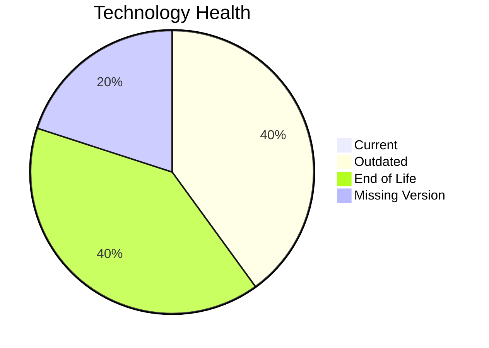

# Application Report: AnalyticsApp-003

**ID:** app003  
**Generated:** 2026-05-14

## Overview

| Attribute | Value |
|-----------|-------|
| Owner | unknown |
| Environment | AWS |
| Business Criticality | Low |
| Users | 480 |
| Servers | sv03 |

## Technology Stack

| Component | Technology | Version | Status |
|-----------|-----------|---------|--------|
| os | RHEL 7 | 7 | 🔴 EOL |
| database | PostgreSQL 13 | 13 | 🟡 OUTDATED |
| language | Python 3.9 | 3.9 | 🟡 OUTDATED |
| framework | Framework | unknown | ⚪ NO_KNOWLEDGE |
| app_server | Apache Tomcat 6.1 | 6.1 | 🔴 EOL |

## Complexity Assessment

**Score:** 5/10 — **MEDIUM**  
**Confidence:** 8

**Reasoning:** Tech age 10/10 (2 EOL, 2 outdated components), integrations 3 interfaces and 0 dependencies, infrastructure 1 servers/1 environments, criticality Low, architecture score 3/10, data score 3/10.

## Modernization Scenarios

### Applicable Scenarios

#### ✅ Operating System Update
- **Cost:** €1006 (one-time)
- **Savings:** €500/year
- **Reasoning:** RHEL 7 requires upgrade/security patching.
#### ✅ Switch to ARM-based CPU
- **Cost:** €5028 (one-time)
- **Savings:** €1000/year
- **Reasoning:** Cloud-hosted workload can be evaluated for ARM-based instances.
#### ✅ Applications Server replacement
- **Cost:** €10057 (one-time)
- **Savings:** €10800/year
- **Reasoning:** Application server Apache Tomcat 6.1 is outdated/EOL.
#### ✅ Upgrade Legacy Databases
- **Cost:** €10057 (one-time)
- **Savings:** €10000/year
- **Reasoning:** Database PostgreSQL 13 is legacy/outdated.

### Not Applicable / Other

| Scenario | Status | Reason |
|----------|--------|--------|
| Switch to standard Linux Operating System | FULFILLED | Application already runs on a standard Linux platform. |
| Application Migration to Cloud Infrastructure (Lift & Shift) | FULFILLED | Application is already deployed in cloud. |
| Application Containerization | FULFILLED | Application is already containerized. |
| Application Refactoring and De-coupling | PARTIALLY_FULFILLED | Architecture shows partial decoupling already. |
| Switch DB Engine to open-source database solution | FULFILLED | Application already uses open-source database engine. |
| Update outdated components | APPLICABLE | Outdated or EOL components identified in technology assessment. |

## Financial Summary

| Metric | Value |
|--------|-------|
| Total One-Time Cost | €26148 |
| Total Yearly Savings | €22300 |
| Break-Even | 1.2 years |
